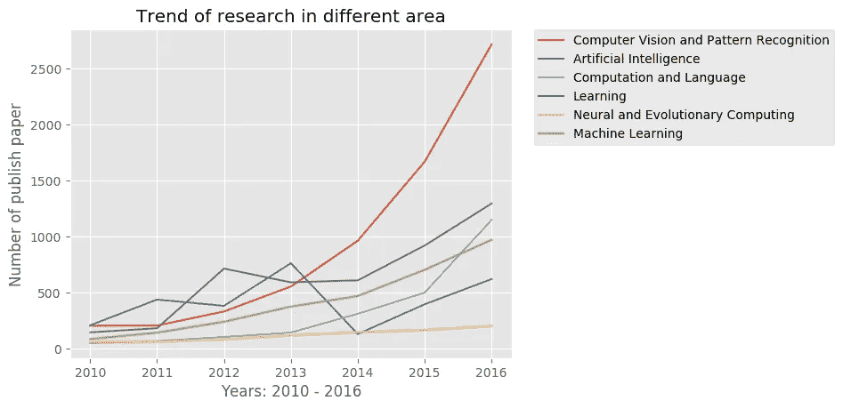
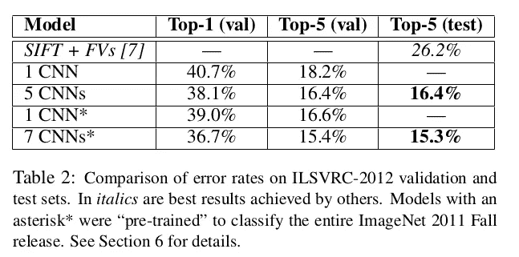

# 开始阅读深度学习研究论文:为什么和如何

> 原文：<https://towardsdatascience.com/getting-started-with-reading-deep-learning-research-papers-the-why-and-the-how-dfd1ac15dbc0?source=collection_archive---------3----------------------->

在你读完那本书或完成那门令人惊叹的关于深度学习的在线课程后，你是如何继续学习的？你如何变得“自给自足”，这样你就不必依赖别人来分解该领域的最新突破？

你阅读研究论文。

Photo by [Emma Frances Logan](https://unsplash.com/photos/PVIbUkN_wCQ?utm_source=unsplash&utm_medium=referral&utm_content=creditCopyText) on [Unsplash](https://unsplash.com/search/photos/start?utm_source=unsplash&utm_medium=referral&utm_content=creditCopyText)

***开始前的一个小提示****——我不是深度学习方面的专家。我最近才开始阅读研究论文。在这篇文章中，我将写下我开始时发现的所有有用的东西。*

# 为什么

[在 Quora](https://www.quora.com/I-want-to-pursue-machine-learning-as-a-career-but-not-sure-if-I-am-qualified-How-can-I-test-myself/answer/Andrew-Ng) 上的一个问题的回答中，问到如何测试一个人是否有资格从事机器学习的职业，吴恩达(Google Brain 创始人，百度 AI 集团前负责人)表示，任何人都有资格从事机器学习的职业。他说，在你完成了一些与 ML 相关的课程之后，“为了更进一步，阅读研究论文。更好的是，尝试在研究论文中复制这些结果。”

[Dario amo dei(open AI 的研究员)说](https://80000hours.org/podcast/episodes/the-world-needs-ai-researchers-heres-how-to-become-one/#transcript)“为了测试你是否适合在 AI safety 或 ML 中工作，只需尝试非常快速地实现许多模型。从最近的一篇论文中找到一个 ML 模型，实现它，尝试让它快速工作。”

这表明阅读研究论文对加深一个人对该领域的理解至关重要。

每个月都有数百篇论文发表，任何认真研究这一领域的人都不能仅仅依靠导师式的文章或课程，在这些文章或课程中，其他人会为他/她分解最新的研究。当你阅读这篇文章时，新的、突破性的研究正在进行。该领域的研究步伐从未如此之快。你能希望跟上这种步伐的唯一方法是养成一种习惯，在研究论文发布时阅读它们。

在这篇文章中，我将尝试给你一些可行的建议，告诉你如何开始自己阅读论文。然后，最后，我会试着分解一份实际的文件，这样你就可以开始了。

# 怎么做

首先，阅读一篇科研论文是困难的。事实上—
[*“没有什么比阅读科学期刊文章更让你感到愚蠢的了。”*](http://www.sciencemag.org/careers/2016/01/how-read-scientific-paper)

我只是想把它放在第一位，这样如果你觉得你不能真正理解一篇论文的内容，你就不会气馁。你不太可能在前几遍就理解它。所以，勇敢一点，再试一次！

现在，让我们来谈谈一些有价值的资源，它们将在你的阅读之旅中对你有所帮助..

## arXiv.org

把它想象成互联网上的一个地方，研究人员在他们的论文真正发表在那些著名的科学杂志或会议(如果有的话)之前，在那里发表它们。

他们为什么要这么做？

嗯，事实证明做研究和实际写论文并不是它的结束。).从提交论文到在一些科学杂志上发表是一个相当长的过程。在一篇论文被提交到这些期刊之后，会有一个相当缓慢的同行评审过程，有时甚至会持续数年！)现在，对于机器学习这样一个快速发展的领域来说，这确实是不可取的。

这就是为什么， [arXiv](https://arxiv.org/) 。

研究人员将他们的论文发布在 arXiv 这样的预印库上，以便[快速传播](https://academia.stackexchange.com/a/75326)他们的研究并获得快速反馈。

## Arxiv 理智保护者

好吧，所以允许研究人员容易地预印他们的研究论文是好的。但是读这些报纸的人呢？如果你去 arXiv 网站，很容易感到害怕和渺小和失落。绝对不是新人的地方(*只是我的看法，欢迎你来试试*虽然☺ *)。*

进入， [Arxiv 理智保护者。](http://www.arxiv-sanity.com/)

Built by Andrej Karpathy, director of AI at Tesla and a personal favourite AI guy of mine

Arxiv Sanity 对 Arxiv 的作用，就像 Twitter 的 newsfeed 对 Twitter 的作用一样*(显然，除了它是完全开源和无广告的)*。正如 newsfeed 可以让你从 Twitter 的汪洋大海中看到最有趣的推文，个性化到你自己的口味，类似地，Arxiv Sanity 为你带来了发表在 Arxiv 上的关于 ML 的论文，这可能是你最感兴趣的。它可以让你根据流行趋势，根据你过去的喜好和你关注的人的喜好对报纸进行分类。(*只是那些我们在社交媒体上已经习以为常的个性化推荐功能。)*

Check out this short introductory video of the website to know more about it

## 机器学习 Reddit 上的 WAYR 线程

WAYR 是你在读什么的简称。这是[子编辑机器 learning](https://www.reddit.com/r/MachineLearning/)g 上的一个[线程](https://www.reddit.com/r/MachineLearning/comments/807ex4/d_machine_learning_wayr_what_are_you_reading_week/)，人们在这里发布他们本周阅读的 ML 论文，并讨论他们从中发现的有趣内容。

我说过，arXiv 上每周发表的机器学习领域的研究论文数量极其庞大。这意味着一个人几乎不可能每周读完所有的书，并做一些常规的事情，如上大学、去工作或与他人交流。此外，并不是所有的报纸都值得一读。

因此，你需要把精力放在阅读最有前途的论文上，我上面提到的思路就是一种方法。

## 时事通讯，时事通讯，时事通讯！

时事通讯是我个人了解人工智能领域最新进展的最佳来源。你只需订阅它们，每周一免费将它们发送到你的收件箱。就这样，你可以了解到本周与 AI 相关的最有趣的新闻、文章**和研究论文**。

以下是我订阅的内容:

*   杰克·克拉克这是我最喜欢的，因为除了提供我上面提到的所有信息外，它还有一个叫做“科技故事”的部分。本部分包含一个基于上周事件的新的人工智能相关的科幻短篇故事！
    ..坦白说:即使在我对人工智能的新事物不感兴趣的那几周，我也会浏览一下这份时事通讯，仅仅是因为科技故事)
*   [***Sam DeBrule***](https://machinelearnings.co/)他还经营着一家同名的媒体刊物。它包含了一些真正有趣的文章。一定要检查他们了。
*   [***Nathan . ai by Nathan bena ich***](https://www.getrevue.co/profile/nathanbenaich)虽然以上两篇简讯都是周刊，这是季刊。因此，你每三个月就会收到一封长长的电子邮件，总结了过去三个月该领域最有趣的进展。
*   丹尼·布里兹的《AI 中的狂野一周》我很喜欢这本书，因为它干净、简洁，但似乎在过去的两个月里它变得不活跃了。无论如何，我在这里提一下，以防丹尼又开始发那些邮件。

## 推特上的“AI 人”

另一个好方法是关注 Twitter 上著名的研究人员和开发人员的账户，这样你就可以跟上这个领域最好的和最新的信息。这是我关注的人的名单:

*   迈克尔·尼尔森
*   安德烈·卡帕西
*   弗朗索瓦·乔莱
*   扬·勒村
*   克里斯·奥拉赫
*   杰克·克拉克
*   伊恩·古德费勒
*   杰夫·迪恩
*   我知道这不是“人”，但是是的..)

## “那很好，但是我该怎么开始呢？?"

是的，这是更紧迫的问题。

好的，首先要确保你理解机器学习的基础知识，比如回归和其他类似的算法，深度学习的基础知识——普通的神经网络，反向传播，正则化，以及比康涅茨，RNN 和 LSTM 的工作原理多一点的基础知识。我真的不认为阅读研究论文是明确你对这些主题的基础知识的最佳方式。为此，您可以参考大量其他资源。

一旦你做到了这一点，你应该开始阅读一篇最初介绍上述观点的论文。这样，你就可以专注于习惯一篇研究论文的样子。你不必太担心如何理解你的第一篇研究论文，因为你已经非常熟悉这个想法了。

***我推荐你从***[***Alex net 论文***](https://papers.nips.cc/paper/4824-imagenet-classification-with-deep-convolutional-neural-networks) ***入手。***

**为什么要这篇论文？**

请看这张图表:

看看`Computer Vision and Patter Recognition`曲线是如何在 2012 年直线上升的？这很大程度上是因为这篇论文。

**T44！！！**

就是这篇论文重新点燃了所有人对深度学习的兴趣。

由 *Alex Krizhevsky、Ilya Sutskever、Geoffrey Hinton、*和撰写，标题为**ImageNet class ification with Deep convolution Networks，**这篇论文被认为是该领域最有影响力的论文之一。它描述了作者如何使用 CNN *(名为 AlexNet)* 赢得 2012 年 ImageNet 大规模视觉识别挑战赛(ILSVRC)。

对于那些不知道的人来说，使计算机能够看到和识别物体(又称计算机视觉)是计算机科学的最早目标之一。ILSVRC 就像这种“视觉计算机”的奥运会，参与者(计算机算法)试图正确识别属于 1000 个类别之一的图像。而且，在 2012 年，AlexNet 能够以巨大的优势赢得这项挑战: ****它取得了 15.3%的前五名错误率，而第二名的错误率为 26.2%。****

**

*不用说，整个计算机视觉社区都肃然起敬，该领域的研究以前所未有的速度发展。人们开始意识到深度神经网络的力量，那么，在这里你试图理解你如何才能得到一块馅饼！*

*也就是说，如果您通过一些课程或教程对 CNN 有了基本的了解，那么掌握本文的内容将会相当容易。所以，给你更多的力量！*

*一旦你完成了这篇论文，你可能会查阅其他与 CNN 相关的开创性论文，或者转向你感兴趣的其他架构(RNNs、LSTMs、GANs)。*

*Github 上也有很多仓库，里面收藏了深度学习方面的重要研究论文([这里有一个很酷的](https://github.com/floodsung/Deep-Learning-Papers-Reading-Roadmap))。当你开始的时候，一定要检查它们。他们会帮助你建立自己的阅读清单。*

## *如果我不提及这另一个来源，那将是非常不负责任的*

*   *[***Distill . pub***](https://distill.pub/about/)***:*** *关于这一点，我只有一句话要说——
    *如果所有的研究论文都发表在 distilt 期刊上，那么很可能，我就不会写这篇文章了，你也不需要阅读一篇文章来指导你阅读研究论文，互联网上也将需要更少(如果有的话)的课程和教程来试图用可理解的术语解释那些开创性的研究观点。* 我会让迈克尔·尼尔森给你一个更恰当的《蒸馏日志》背后的动机:**

** [## 蒸馏:机器学习研究的交互式可视化期刊

### 《蒸馏》杂志今天发行。简而言之，Distill 是一个用于机器学习的交互式可视化杂志…

blog.ycombinator.com](https://blog.ycombinator.com/distill-an-interactive-visual-journal-for-machine-learning-research/) 

因此，请务必查看中的[篇文章。这真的是下一代的东西！](https://distill.pub/)** 

**感谢您从头到尾的阅读！我希望这篇文章能帮助你跟上最新的 ML 研究。记住，阅读科学论文是困难的。所以，没有必要气馁。如果你不理解，就再读一遍。**

*****编辑*:发表这篇文章帮助我与世界各地令人惊叹的专业人士建立了数百种联系。****

**你想像我一样写作吗？**

**我开设了一门写作课程，教你如何在互联网上开始写作之旅。这就叫——[**清晰写作，清晰思考**](https://www.nityesh.com/introducing-clear-writing-clear-thinking/) **而我** [**免费赠送**](https://www.nityesh.com/introducing-clear-writing-clear-thinking/) **！****

****

**[Clear Writing, Clear Thinking](https://www.nityesh.com/introducing-clear-writing-clear-thinking/) — a free 5-week email course that’ll teach you how to write well**

**你可以在 Twitter 上关注我，或者在 LinkedIn 上联系我，我不会给你发垃圾信息。；-)**