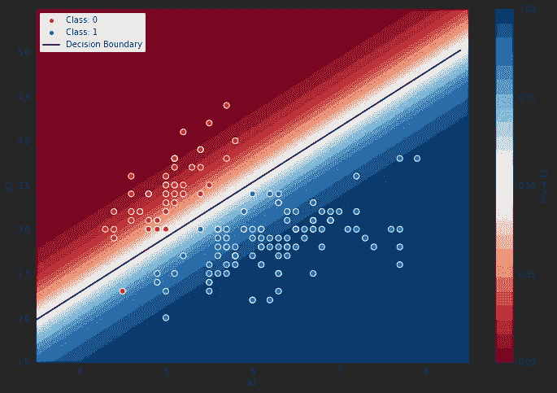

# 了解黑盒模型:

> 原文：<https://towardsdatascience.com/getting-to-know-a-black-box-model-374e180589ce?source=collection_archive---------4----------------------->

## 基于雅可比的对抗性攻击和基于雅可比的数据增强的二维示例


Mirror Lake and Lone Eagle Peak in Colorado 7/2018

随着对人工智能的大肆宣传，围绕对立例子的讨论也越来越多。一个对抗性的例子，也称为攻击，是一个被机器学习模型错误分类的输入。这些输入通常是高维输入，例如[照片](https://blog.openai.com/adversarial-example-research/)、[音频样本](https://nicholas.carlini.com/code/audio_adversarial_examples/)、[文本串](https://arxiv.org/abs/1712.06751)，甚至是[软件代码](https://arxiv.org/abs/1702.05983)。

有几个精彩的博客从理论上和初级水平[介绍了对抗性](https://ml.berkeley.edu/blog/2018/01/10/adversarial-examples/)[攻击](https://blog.ycombinator.com/how-adversarial-attacks-work/)和[防御](/the-modeler-strikes-back-defense-strategies-against-adversarial-attacks-9aae07b93d00) [。理解对立例子的关键之一是首先理解:](/know-your-adversary-understanding-adversarial-examples-part-1-2-63af4c2f5830)

1.  机器学习模型如何决策
2.  “数据流形”和高维空间
3.  敌对的噪音或干扰

由于这些概念很难在高维空间中可视化，我们将通过一个简单的二维示例来演示对抗性攻击中使用的一些核心技术。这将有助于我们在更高的维度上更好地理解这些概念。

我们将构建一个逻辑回归分类器，它将充当我们打算攻击或欺骗的模型，或者我们的“受害者”模型。然后，我们将通过如何使用基于梯度的方法来攻击我们的受害者和我们的受害者的黑盒版本。([所有用来产生这篇文章的代码可以在这里看到](https://github.com/adrian-botta/understanding_adversarial_examples/blob/master/adversarial_examples_logistic_regression.ipynb))

## 建立受害者模型

让我们借用[马丁·佩拉罗洛](https://medium.com/u/2d1b498ccdb5?source=post_page-----374e180589ce--------------------------------)的例子[从 iris 数据集](https://medium.com/@martinpella/logistic-regression-from-scratch-in-python-124c5636b8ac)的子集构建逻辑回归。为了简单起见，我们将把两个输入变量 X1 和 X2 以及类 0 和类 1 称为。


Subset of iris data set

我们在训练机器学习模型时的目标是确定这个二维空间中最好地分隔两个类别的线。幸运的是，这是一个简单的任务，因为这两个类是明显分开的，没有太多的重叠。为此，我们将拟合一个逻辑回归，该回归将创建属于类别 1 的数据点的概率分布。使用 sigmoid 函数(表示为 g)和一些参数θ，我们将使这个概率分布符合我们的数据。


Sigmoid function with parameters θ

通过改变矩阵θ中的参数，我们可以调整函数 g 以最佳地拟合我们的数据 x。

```
def sigmoid(X, theta):
    return 1 / (1 + np.exp(-np.dot(X, theta[0])))
```

我们将使用二元交叉熵损失作为损失函数来确定模型的预测有多接近真实情况。


Binary Cross-entropy Loss

```
def loss(X, theta, y):
    h = sigmoid(X, theta)
    return (-y * np.log(h) - (1 - y) * np.log(1 - h)).mean()
```

损失函数对(w.r.t.) θ的偏导数告诉我们需要改变θ值的方向，以改变损失。在这种情况下，我们想尽量减少损失。


Partial derivative of the loss function w.r.t. θ

```
h = sigmoid(X, theta)
gradient_wrt_theta = np.dot(X.T, (h - y)) / y.shape[0]
```

一旦我们通过对θ进行定向更新来最小化损失函数，我们的受害者模型就被训练好了！



Victim model’s probability distribution for class 1

上图显示了该空间中属于类别 1 的任意点的模型概率分布，与类别 0 相反(1- P(y=1))。它还以我们的模型的概率阈值为 0.5 的决策边界为特征，如果一个点在线上，则它属于类别 1 的概率将低于 50%。由于模型“决定”在这个阈值，它将分配 0 作为它的标签预测。

## 攻击受害者模型

基于雅可比或梯度的攻击的目标，在 Goodfellow 等人的[解释和利用对抗的例子](https://arxiv.org/abs/1412.6572)中有描述。艾尔。就是在受害者模型的决策边界上移动一个点。在我们的例子中，我们将把一个通常分类为 0 类的点“推”过受害者模型的决策边界，分类为 1 类。当使用高维数据时，对原始点的这种改变也被称为扰动，因为我们对输入进行了非常小的改变。


‘Pushing’ a data point over the victim model’s decision boundary

您可能还记得，在训练逻辑回归时，我们使用了损失函数和损失函数 w.r.t. θ的导数来确定θ需要如何变化才能使损失最小化。作为攻击者，在完全了解受害者模型如何工作的情况下，我们可以通过改变函数的其他输入来确定如何改变损失。


Partial derivative of the loss function w.r.t. X

损失函数 w.r.t. X 的导数准确地告诉我们需要在哪个方向改变 X 的值来改变受害者模型的损失。

```
h = sigmoid(X, theta)
gradient_wrt_X = np.dot(np.expand_dims((h-y),1),theta)/y.shape[0]
```

既然要攻击模型，就要最大化它的损失。改变 X 的值实质上是在二维空间中移动 X。方向只是对抗性干扰中的一个组成部分。我们还需要考虑在该方向上移动多大的步长(表示为ε)才能越过决策边界。

```
#Normalizing gradient vectors to make sure step size is consistent
#necessary for our 2-d example, but not called for in the papergradient_magnitudes = np.expand_dims(np.asarray(list(map(lambda x: np.linalg.norm(x), gradient_wrt_X))),1)
grads_norm = gradient_wrt_X/gradient_magnitudes#Creating the adversarial perturbation
epsilon = 0.5 #The step size be adjusted 
X_advs = X+grads_norm*epsilon
```

对手必须考虑使用哪些数据点或输入，以及成功推动一个点越过决策边界所需的最小ε。如果对手从非常远离 0 级空间的点开始，他们将需要更大和更明显的扰动来将其转换为敌对的例子。让我们转换一些最接近决策边界和来自类 0 的点。(注意:其他技术允许从随机噪声中创建对立的例子- [论文](https://arxiv.org/pdf/1801.01944.pdf) & [文章](https://www.nytimes.com/2018/05/10/technology/alexa-siri-hidden-command-audio-attacks.html))


‘Pushing’ several data points over the victim model’s decision boundary using epsilon = 0.5

我们已经成功地创造了一些对立的例子！

…嗯，你可能会想:

1.  “我们只是四处搬点东西。这些点只是现在的点不同而已……”
2.  “……我们之所以能够做到这一点，是因为我们对受害者模型了如指掌。如果我们不知道受害者模型是如何工作的呢？”

你是对的。我们会回到第一点，但是尼古拉斯·帕伯诺特等人的[针对机器学习的实用黑盒攻击](https://arxiv.org/abs/1602.02697)中的技术。艾尔。会帮助我们解决第二点。

# 攻击黑盒模型:

当我们了解一个模型的一切时，我们称它为“白盒”模型。相比之下，当我们对模型如何工作一无所知时，我们称之为“黑箱”。我们可以把黑盒模型想象成一个 API，我们通过发送输入和接收一些输出(标签、类号等)来 ping 它。理解黑盒攻击是至关重要的，因为它们证明隐藏在 API 后面的模型可能看起来是安全的，但实际上仍然容易受到攻击。

Papernot 的论文讨论了基于雅可比的数据集增强技术，该技术旨在训练另一个模型，称为替代模型，以共享与受害者模型非常相似的决策边界。一旦替代模型被训练成具有与受害者模型几乎相同的决策边界，被创建来将一个点移动到替代模型的决策边界上的对抗性扰动也将可能越过受害者模型的决策边界。他们通过探索受害者模型的决策空间周围的空间并确定受害者如何响应来实现这一点。

## 训练替代模型

这种技巧可以被描述为一个孩子在学习惹恼他们的父母。孩子一开始对什么会让他们的父母生气没有先入之见，但他们可以通过在一周内随机选择一组行为来测试他们的父母，并注意他们的父母对这些行为的反应。虽然父母可能会对其中的每一个表现出非二元反应，但让我们假设孩子的行为要么是坏的，要么是好的(两类)。在第一周之后，孩子已经了解了一些困扰他们父母的事情，并且有根据地猜测还有什么会困扰他们的父母。第二周，孩子记下成功的行动，并进一步采取不成功的行动。孩子每周重复这一过程，注意他们父母的反应，调整他们对什么会困扰父母的理解，直到他们确切知道什么会困扰他们，什么不会。

基于雅可比的数据集扩充的工作方式与获取初始数据的随机样本并用于训练非常差的替代模型的方式相同。对抗性示例是从数据集创建的(使用之前基于梯度的攻击)。这里，对立的例子是模型梯度方向上的一步，以确定黑盒模型是否会以与替代模型相同的方式对新数据点进行分类。


Substitute model’s decision boundary converges to that of the decision boundary

扩充的数据由黑盒模型标记，并用于训练更好的替代模型。就像孩子一样，替代模型对黑盒模型的决策边界在哪里有了更精确的理解。经过几次迭代后，替代模型与黑盒模型共享几乎完全相同的决策边界。

替代模型甚至不需要与黑盒模型是同一类型的 ML 模型。事实上，一个简单的多层感知器足以学习一个复杂的卷积神经网络足够接近的决策边界。最终，通过少量数据样本、几次数据扩充和标记迭代，可以成功攻击黑盒模型。

# **点积的诅咒:**

现在，回到第一点:你是对的，我在二维空间中移动点。虽然这是为了保持示例的简单性，但对抗性攻击利用了神经网络放大信号的特性。安德烈·卡帕西在[中解释了点积的效果，更多细节请点击](http://karpathy.github.io/2015/03/30/breaking-convnets/)。


The dot-product amplifies the signal from small adversarial perturbations

在我们的二维例子中，为了移动点穿过受害者模型的决策边界，我们需要以步长ε移动它。当神经网络的权重矩阵乘以正常输入时，每个权重和每个输入值的乘积被求和。然而，在对抗输入的情况下，对抗信号的附加求和放大了作为总输入维度的函数的信号。也就是说，为了实现跨越决策边界所需的步长，我们需要随着输入维度数量的增加，对每个 X 值进行较小的更改。输入维度越大，我们就越难注意到对抗性扰动——这种效应是为什么 MNIST 的对抗性例子比 ImageNet 的对抗性例子更明显的原因之一。

基于梯度的攻击已被证明是有效的技术，它们利用深度学习模型将高维输入处理成概率分布的方式。黑盒攻击表明，只要我们能够访问受害者模型的输入和输出，我们就可以创建一个足够好的模型副本用于攻击。然而，这些技术有弱点。要使用基于梯度的攻击，我们需要确切地知道输入是如何嵌入的(转换成机器可读的格式，如向量)。例如，图像通常表示为二维像素矩阵或三维矩阵，这是信息的一致表示。另一方面，可以使用一些秘密的预训练单词嵌入或学习嵌入来嵌入其他类型的非结构化数据，如文本。因为我们不能对一个单词求导，所以我们需要知道这个单词是如何表示的。训练替代模型需要一组可能可检测到的对黑盒模型的 pings。研究人员正在寻找越来越多的方法来保护他们的模型免受恶意攻击。无论如何，我们必须主动了解我们模型的弱点。