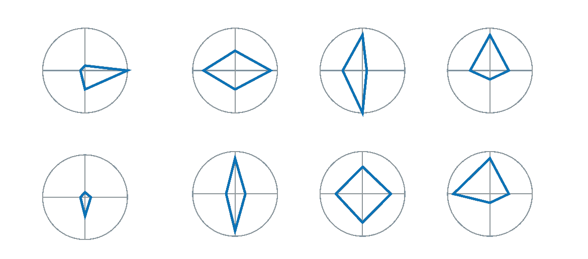

# 雷达上的幽灵——为什么雷达图容易被误读

> 原文：<https://towardsdatascience.com/ghosts-on-the-radar-why-radar-charts-are-easily-misread-dba00fc399ef?source=collection_archive---------9----------------------->

[Mali Akmanalp](https://medium.com/u/b2cc35a8fec6?source=post_page-----dba00fc399ef--------------------------------) 刚刚写了一篇[有趣的文章](/plotting-in-many-dimensions-382fbd7fe76e)，讲述他如何使用雷达图解决一个特殊的数据问题。虽然总体来说，我仍然认为雷达图很有问题——尽管看起来很性感——我想知道这些问题到底是什么。

我的疑虑与混合类别/数字数据无关，也与人脑难以旋转和比较坐标轴无关。相反，我的问题是，雷达图经常让虚假联系变得非常容易绘制，因为它们的形式暗示着某种数据编码在起作用，即使根本没有。

## 与更简单的图表相比

我可以通过与更简单的非放射状图表的比较来说明这个问题。假设你有一个跨越四个范畴的价值观:

这些简单图表的唯一缺点是，我们必须为条形选择一个任意的顺序，从左到右——观众*可能会*误认为这个顺序是有意义的。但那不太可能，所以我们照原样接受。

当我们用一条线将这些值连接起来时，情况就大不相同了:

我不认为我们大多数人会认为这是合法的。这条线强烈表明，这里有一个重要的顺序——即一个无形的 x 轴编码了另一个变量，在这个变量上，煤油比巧克力“更多”，洗发水处于中间位置。(我确信我们可以*找到*一个合理的基础来进行事后排序，但这与我们需要用这些数据讲述的故事没有任何关系。)

这种虚假的秩序暗示正是雷达图所要做的:

蓝色形状的突出和它在页面上的方向表明一些真实的东西正在被编码，而事实并非如此。这可能导致几种误读。

## 误读一:面积

通过在雷达图中绘制一个形状，我们还创建了一个区域。读者会怀疑它的重要性。但是区域的大小很大程度上取决于我们选择的排序。以下是用不同顺序绘制的完全相同的数据:

右边的数字显得更大，表明总价值更高。误读！

## 误读二:规律性

类似地，雷达的“尖峰”在视觉上非常突出，但可能完全取决于数据顺序。这里同样是两种排序的相同数据:

左边的图表可能看起来“不稳定”、“不稳定”或“不均衡”而正确的可能看起来只是有某些“优点和缺点”但是心理反应是我们产生的完全独立于真实数据的人工产物！这类似于 Tufte 所反对的在折线图中设置荒谬比例和起点的老把戏，让趋势看起来完全像设计师想要的那样极端。

## 误读三:方向性

我们不仅必须选择变量的相对顺序，还必须在页面上确定它们的方向(决定哪一个是“上”)。这可能暗示了比保证的更多的相似和对比。

当我们查看雷达图的网格时，有一点很突出，那就是它们具有相似的整体方向:有些上下运行，有些左右运行，有些两者都没有。

这使得“垂直”项似乎在一个类别中，与“水平”项截然不同。但是如果我们把变量重新排序，一个完全不同的分组就会出现。如果我们有一个合理的故事要讲，通过强调一些可变分组而不是其他分组，那么*可能是好的。但是如果这只是一个任意的选择，我们又一次误导了读者。*

## 合法使用

就像饱受诟病的饼图一样，雷达图肯定有其用途:这就是我们讨论的额外编码——面积、规律性、方向——实际上是我们想要使用的编码。在我的书里有两个条件:

1.  可变类别可以是强有序的(至少以一种方式)。
2.  排序是*循环*:最后一项与第一项相关。

第二项是雷达图比折线图更有意义的关键:那么，它的圆形就是一个优势。例子包括:

*   真实空间中的方向性:平均风速
*   色调(色轮)频率
*   周期时间:每月销售额

我仍然不*一般*主张雷达图，即使你满足这些条件。是否使用雷达图将取决于你需要展示什么，展示给谁，以及你有什么样的数据。寻找大幅下跌或上涨似乎是合理的。但是，如果您需要读取特定的值，折线图可能会更好。我还对展示一大块雷达图，并要求读者在它们很小的时候发现形状的差异感到犹豫:形状的确切含义通常不明显。但是如果数据是正确的，雷达可以工作。

对我来说，最重要的是:当你有无序变量要显示时，关掉你的雷达，去寻找其他工具。

*Jasper McChesney 是一名高级数据分析师，拥有自然科学和数据可视化方面的背景。他曾在非营利组织、人力资源和高等教育部门工作过。目前在麻省大学教授 R 课程，Udemy* *上* [*。*](https://www.udemy.com/course/so-you-need-to-learn-r/?referralCode=ABFCCAD1953B9E7FECCA)