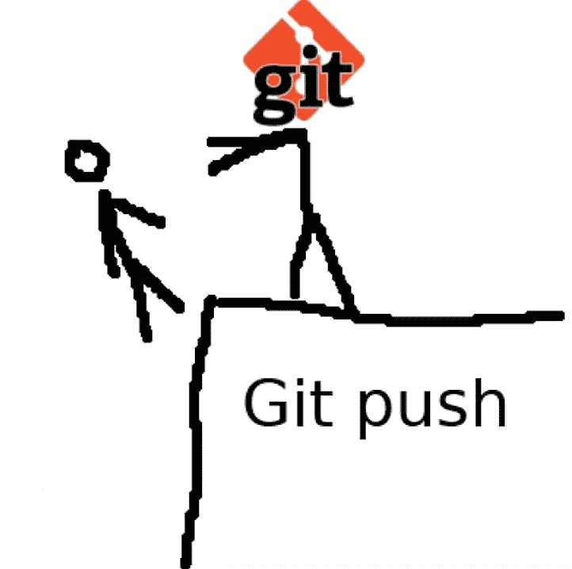
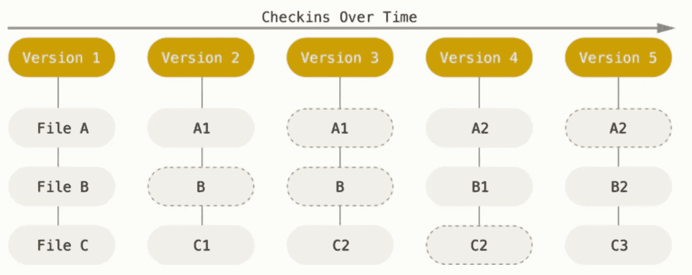
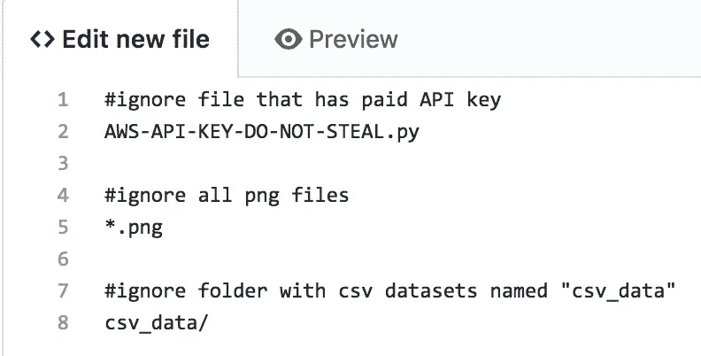
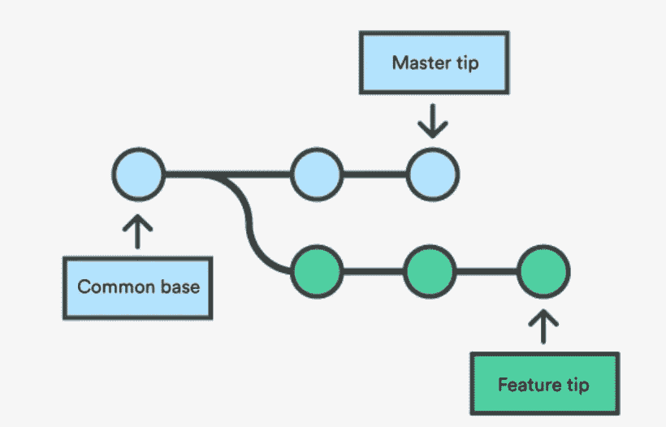
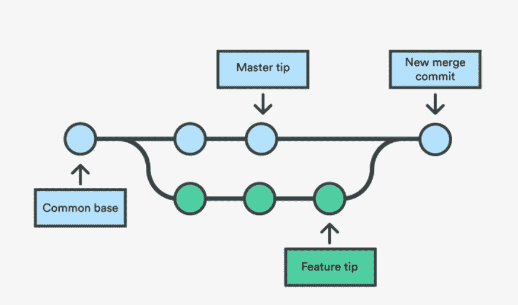
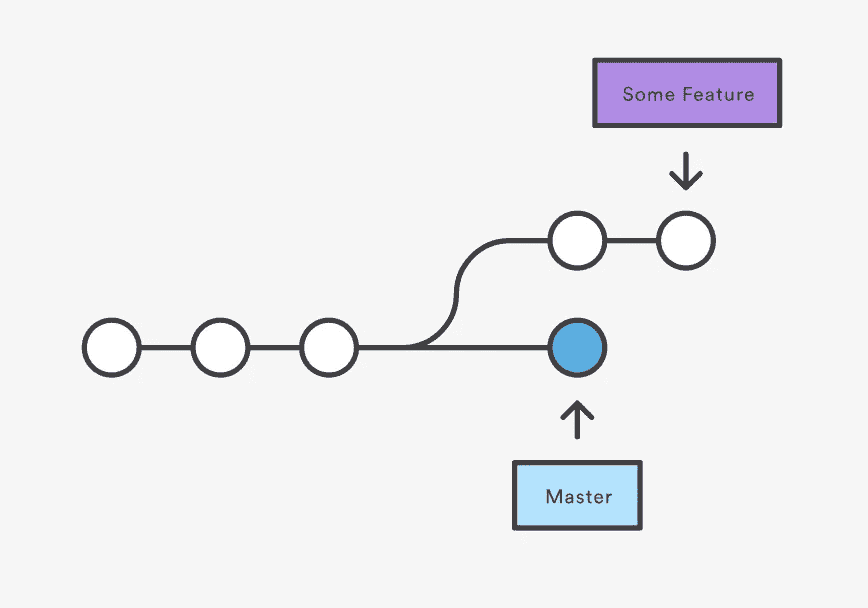
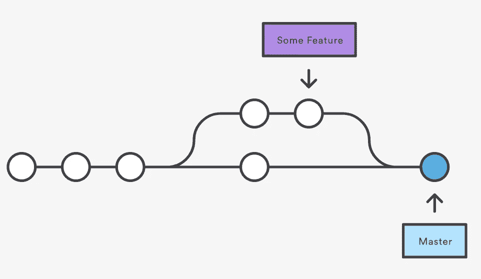
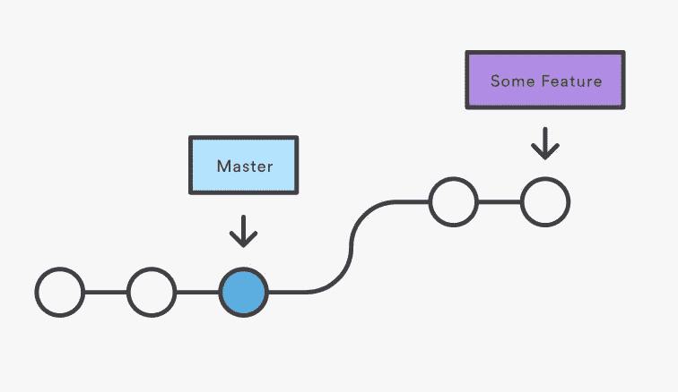
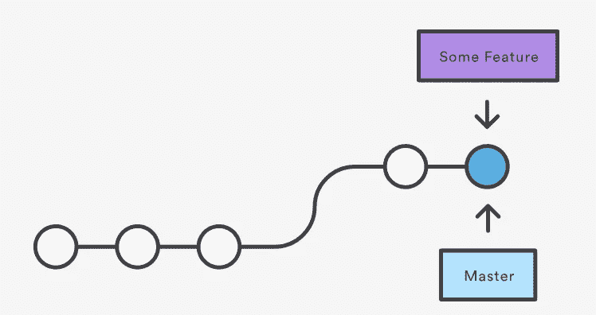

# GitHub 假人用底漆

> 原文：<https://towardsdatascience.com/github-primer-for-dummies-e8d307e52b6d?source=collection_archive---------12----------------------->

## 使用 GitHub 托管复杂代码的简单指南

Me vs. GitHub — Source: [http://devhumor.com/media/git-push](http://devhumor.com/media/git-push)

## 介绍

GitHub 是全球程序员的重要工具，允许用户托管和共享代码，管理项目，以及与近 3000 万开发人员一起构建软件。GitHub 通过跟踪修订和修改使代码协作变得更加容易，允许任何人对存储库做出贡献。作为一个最近才开始编程的人，GitHub 已经无数次成为真正的救星，帮助我学习新的技能、技术和库。然而，有时 GitHub 上的一个简单任务，如创建一个新的存储库或推动新的变化，比训练一个多层神经网络更令人生畏。所以，我决定创建一个指南来帮助用户(阅读:我自己)充分利用 GitHub 的力量。

## 创建存储库

GitHub 存储库通常被称为“repo”，是 GitHub 上的一个虚拟位置，用户可以在这里存储项目的代码、数据集和相关文件。点击主页上的`new repository`按钮，您将进入一个页面，在这里您可以创建一个 repo 并添加项目的名称和简要描述。有一个选项可以将您的存储库设为公共或私有，但是私有特性只对付费用户/公司可用。您还可以使用自述文件初始化存储库，该文件提供了项目的概述和描述。强烈建议将自述文件添加到您的存储库中，因为它通常是某人在查看您的存储库时看到的第一件东西，并且允许您编写有关您的项目的故事，并向查看者显示您认为最重要的内容。一份强有力的自述文件应该清楚地描述项目及其目标，展示项目的结果和成果，并展示其他人如何复制该过程。

Creating a repository on GitHub

不幸的是，点击`create repository`只是这个过程的第一步(剧透:它实际上并没有创建你的回购)。下一步涉及到使用您的终端来初始化您的 Git 并推送您的第一次提交。Git 和 GitHub 不是一回事，虽然它们是有联系的。Git 是一个帮助管理源代码历史和编辑的修订控制系统，而 GitHub 是一个托管 Git 库的网站。通俗地说，Git 会在每次提交时为您的项目拍照，并存储一个对该状态的引用。要为您的项目初始化 Git，请使用终端输入您计算机上存储 Git 的目录，并在命令行中输入`git init`。键入`git add FILENAME`上传你的第一个文件。下一步是做你的第一次提交，或者修改。在命令行中输入`git commit -m "your comment here"`。注释应该提供简短的细节，说明做了什么修改，这样你可以更容易地跟踪你的修改。提交会将更改添加到本地存储库中，但不会将编辑内容推送到远程服务器。下一步是在命令行中输入`git remote add origin [https://project_repo_link.git](https://project_repo_link.git)`，在 GitHub 上创建一个远程服务器来托管你的工作。最后，输入`git push -u origin master`将修改推送到远程服务器并保存您的工作。

Git data stored as snapshots of the project over time — Source: [https://git-scm.com/book/en/v2/Getting-Started-Git-Basics](https://git-scm.com/book/en/v2/Getting-Started-Git-Basics)

## 将文件添加到存储库

向 GitHub repo 添加更改的过程类似于初始化过程。您可以选择一次性添加项目目录中的所有文件，或者在进行编辑时单独添加每个文件。由于通过反复试验发现的众多原因，我强烈建议单独推送每个文件。首先，它将保持您的存储库整洁有序，这在 LinkedIn、简历或工作申请上提供您的 GitHub 个人资料/回购的链接时非常有用。其次，这将允许您单独跟踪每个文件的更改，而不是提交一个模糊的提交描述。第三，它将防止您意外地将不打算添加到您的回购文件中。这可能是包含个人信息(如 API 密钥)的文件，如果发布到公共域，这些文件可能是有害的。它还会阻止您上传超过 100mb 的数据集，这是免费帐户的大小限制。一旦文件被添加到存储库中，即使它尚未被推送或提交，也很难移除。凭经验来说，我曾经在许多场合下，在不小心上传了一个我不想要的文件之后，不得不删除一个存储库，所以我强调仔细选择上传哪些文件的重要性。

Vim interface

要添加一个新文件，通过终端进入你的项目目录，并在命令行输入`git add FILENAME`。要进行提交，有两种选择:您可以遵循与创建 repo 相同的过程并键入`git commit -m "commit description”`，或者使用 Vim，一个基于 unix 的文本编辑器来处理更改。Vim 是一个反直觉的文本编辑器，它只响应键盘(没有鼠标)，但提供了多个可以重新配置的键盘快捷键，以及创建新的个性化快捷键的选项。要进入 Vim 文本编辑器，在命令行中键入`git commit`,然后按 enter 键。这会将您带到 Vim 编辑器；要继续编写您的提交，键入`i`进入 `--INSERT--`模式，然后键入您的提交消息。完成后，按`esc`退出 `--INSERT--`模式，然后保存并退出 Vim，输入`:wq`编写并退出文本编辑器。从那里，你需要做的就是在命令行中输入`git push`来把你的修改推送到 GitHub。

## Git 忽略

要在推送到 repo 时忽略某些文件，您可以创建一个`.gitignore`文件，指定有意忽略未跟踪的文件。要创建该文件，请在您的存储库主页上单击`new file`按钮，并将该文件命名为`.gitignore`，或者使用提供的示例模板之一。有多种方法可以指定要忽略的文件或文件夹。第一种方法是简单地在`.gitignore`文件中写入文件名。例如，如果您有一个名为`AWS-API-KEY-DO-NOT-STEAL.py`的文件，您可以在`.gitignore`文件中写入该文件的名称和扩展名。

Creating a .gitignore file on GitHub

要忽略带有特定扩展名的所有文件名，比如说。txt 文件，在`.gitignore`文件中键入`*.txt`。最后，您可以通过在文件中键入`folder_name/`来忽略整个文件夹。一旦你添加了所有你想忽略的文件到`.gitignore`文件，保存它并把它放到你的项目的根文件夹中。现在，如果您尝试将这些文件添加并推送到存储库中，它们将被忽略，不会包含在存储库中。然而，如果文件在添加到`.gitignore`文件之前已经被添加到存储库中，那么它们在 Git 存储库中仍然是可见的。

## 叉子和树枝

如果你以前用过 GitHub，或者熟悉 GitHub 的行话，你可能已经见过 Fork、Branch 和 Merge 这三个术语。fork 本质上是一个克隆或存储库。派生其他人的存储库将在您的配置文件下创建一个完全独立于原始存储库的新副本。这在原始存储库被删除的情况下很有用——您的 fork 将与存储库及其所有内容一起保留。要派生存储库，只需访问 repo 页面并单击页面右上角的`Fork`按钮。要用更新的存储库覆盖当前的分叉，用户可以在分叉修订的 repo 之前使用分叉目录中的`git stash`命令。

分支提供了从存储库的主代码行中分离出来的另一种方式。对存储库进行分支会向保留原始存储库一部分的存储库添加另一个级别。分支对于长期项目或具有多个协作者的项目非常有用，这些协作者具有处于不同阶段的工作流的多个阶段。例如，如果你正在开发一个应用程序，你可能已经准备好了滑板和一个关键功能，但是还在开发另外两个功能，还没有准备好发布。您可以创建一个额外的分支，在主分支中只留下成品，而两个正在进行的特性可以在一个单独的分支中保持未部署状态。在与团队合作时，分支也很有用——每个成员都可以在不同的分支上工作，因此当他们推动更改时，不会覆盖其他团队成员正在工作的文件。这提供了一种简单的方法来保持每个人的工作是独立的，直到它准备好被合并和部署。

Microsoft rolls out automated GitHub support chatbot

只要本地保存了存储库的克隆版本，就可以从您的终端本地创建分支。要查看 repo 中的所有分支，请在项目目录中的命令行中键入`git branch`。如果没有创建分支，输出应该是`*master`，星号表示该分支当前是活动的。要创建一个新的分支，输入`git branch <new_branch_name>`，然后输入`git checkout <new_branch_name>`切换到新的分支，这样您就可以从它开始工作了。`git checkout`命令允许用户在存储库的不同分支之间导航。将变更提交到分支的过程与提交到主分支的过程相同，只是要确保知道您正在哪个分支中工作。

Merging two branches — Source: Atlassian GitHub Docs

要将多个分支合并成一个统一的历史，您可以使用`git merge <branch_name>`命令。一种类型的合并被称为**三路合并**，它包括将两个分叉的分支合并为一个。三向合并的名称来源于生成合并所需的提交次数——两个分支顶端和它们共同的祖先节点。调用 merge 命令将通过找到公共基础提交，然后创建将两个提交历史合并为一个的新的合并提交，来将当前分支与指定分支合并。如果每个分支中有一部分数据被更改，git 合并将会失败，需要用户干预。

3-way Merge — Source: Atlassian GitHub Docs

另一种类型的合并是**快速前进合并**，在目标分支和当前分支之间有线性路径的情况下使用。在这种情况下，merge 将当前分支顶端向前移动，直到它到达目标分支顶端，有效地将两个历史合并为一个。一般来说，开发人员更喜欢使用快速合并来修复 bug 或添加小的功能，从而节省了三路合并来集成运行时间更长的功能。

Fast Forward Merge — Source: Atlassian GitHub Docs

## 提示和技巧

这些都是成功使用 GitHub 的基本要素；然而，我想分享一些我认为有用的提示。：

*   **固定存储库:**一个免费帐户最多可以固定六个存储库，这些存储库将始终显示在用户资料的顶部。这是一个展示你所做的最重要的项目的好方法，而不需要有人去筛选杂乱的旧提交。
*   **添加协作者:**当与一组人一起工作时，最好让每个用户都成为存储库的协作者，这样他们就可以从他们的工作中获得荣誉。要添加一个协作者，单击存储库主页上的`settings`选项卡，并从左侧菜单中选择`collaborator`。在那里，输入其他用户的 GitHub 名称或电子邮件来添加他们。
*   **推送后从历史中删除敏感数据:** `git filter-branch — force — index-filter ‘git rm — cached — ignore-unmatch <path-to-your-file>’ — prune-empty — tag-name-filter cat — — all && git push origin — force — all`
*   **显示所有保存的仓库列表:**
*   **查看作者和最后编辑时间，这样你就可以责怪他们搞砸了:** `git blame <file-name>`
*   **缩短 GitHub 分享网址:**[https://git.io/](https://git.io/)
*   【https://pages.github.com/】GitHub Pages:你可以通过几个简单的终端命令[很容易地把你的回购变成 GitHub 托管的网站](https://pages.github.com/)

## 额外资源

 [## 学习如何 Git:使用 GitIgnore 忽略文件和文件夹

### 有时，我们的项目不仅仅包含我们创建的代码。有一些文件是由我们的 IDE 生成的…

medium.com](https://medium.com/@haydar_ai/learning-how-to-git-ignoring-files-and-folders-using-gitignore-177556afdbe3)  [## Git - Git 基础知识

### Git 中的所有内容在存储之前都要进行校验和检查，然后通过该校验和进行引用。这意味着它是…

git-scm.com](https://git-scm.com/book/en/v2/Getting-Started-Git-Basics)  [## Git - gitignore 文档

### 底层的 Git 管道工具，比如 git ls-files 和 git read-tree，读取 gitignore 指定的模式…

git-scm.com](https://git-scm.com/docs/gitignore)  [## Git 分支|亚特兰大 Git 教程

### Git 分支简介。用 git branch 创建，列出，重命名，删除分支。git checkout:选择哪一行…

www.atlassian.com](https://www.atlassian.com/git/tutorials/using-branches)  [## 分支或分叉您的存储库- Atlassian 文档

### 随着 DVCS 主机的发展，术语 fork 也在发展。Bitbucket 软件增加了对 forks 的管理；派生存储库…

confluence.atlassian.com](https://confluence.atlassian.com/bitbucket/branch-or-fork-your-repository-221450630.html)  [## 了解 GitHub 流程

### 当你在做一个项目时，在任何给定的时间，你都会有一堆不同的功能或想法在进行中…

guides.github.com](https://guides.github.com/introduction/flow/)  [## git-提示/技巧

### 最常用的 git 技巧和窍门。在 GitHub 上创建一个帐户，为 git-tips/tips 开发做贡献。

github.com](https://github.com/git-tips/tips)  [## 哦，妈的，饭桶！

### Git 很难:搞砸很容易，弄清楚如何修复你的错误他妈的是不可能的。Git 文档…

ohshitgit.com](http://ohshitgit.com/)