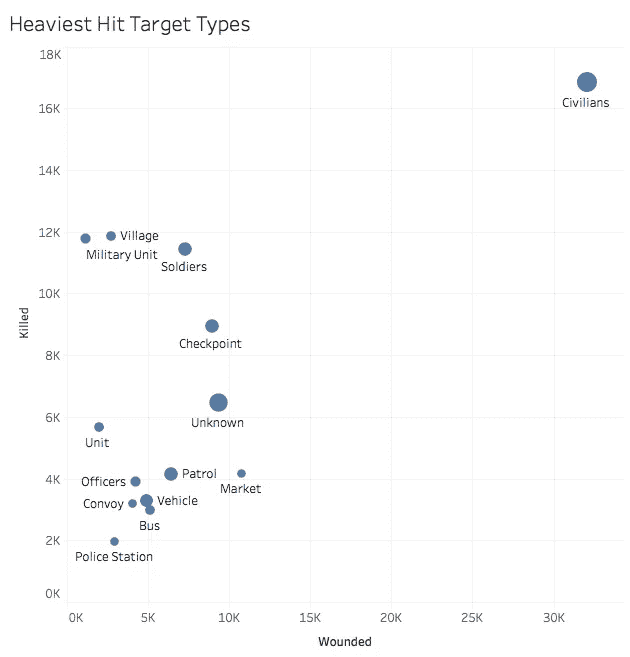

# 全球恐怖和 EDA 可视化兔子洞

> 原文：<https://towardsdatascience.com/global-terror-and-the-eda-visualization-rabbit-hole-a953c998b7e9?source=collection_archive---------5----------------------->

数据科学家面临的最大挑战之一是知道何时继续前进。它可能会进行更多的探索性数据分析(EDA)，它可能会调整您的模型参数以获得更好的分数，或者只是试图让您的笔记本看起来尽可能专业。无论主题是什么，都很容易忘记时间，陷入分析的兔子洞，但随着最后期限的临近，你必须面对现实，你必须跳出整体，确保项目的其他部分不会被忽略，因为如果你的项目只有一部分看起来很棒，而其他部分充其量看起来很平庸，那么你的客户会想“为什么他/她的其他分析和演示不如[插入兔子洞项目]。”从而降低你所做工作的价值和评价。

我最近经历了一个最好的例子，当我在 ed a 可视化中迷失时，我从一开始就提供了一个全球恐怖主义数据库。全球恐怖主义数据库(GTD)是一个关于 1970 年至 2016 年世界各地恐怖袭击的数据库，包含超过 150，000 条观察数据。国家联盟的研究人员维护着恐怖主义研究和应对恐怖主义数据库，总部设在马里兰大学。

我之前在大学学习过全球和世界历史，显然对这个主题有着浓厚的兴趣，因此很容易被诱惑去钻研 EDA。随着项目的完成，我现在可以给你我的可视化的全部范围，以及它们所呈现和不呈现的所有信息。这个项目的主要目的之一是深入研究围绕时间和它们所展示的东西生成可视化。它专注于 1970 年至 2016 年间的全球爆炸事件，其原因你将在下面看到为什么它是焦点的明确选择。

当最初查看数据时，你想回答的一个非常直接的问题是，在我们的数据集时间线内发生了多少事件，在这种情况下是恐怖袭击。第二，如果你关注一个地区，在我们的例子中是爆炸事件，你想看到事件数量随时间的变化，看看这两种趋势之间是否有任何明显的差异。

我们可以看到，从 1970 年到大约 1993 年，恐怖袭击开始缓慢增加，尽管发生了 2001 年 9 月 11 日这样的事件，但直到 2003 年，我们看到全球恐怖事件呈下降趋势。我们还可以在第二张图中看到，爆炸案的数量大致遵循相同的趋势，但在 90 年代初，爆炸案的数量急剧下降。

Global Terrorist Attack Incidents 1970–2016

Global Bombing Numbers 1970–2016

在这里，我们可以清楚地看到全球不同地区的总体攻击趋势是如何变化的。在 20 世纪 70 年代，我们可以看到大多数恐怖袭击发生在西欧，其次是 20 世纪 80 年代的拉丁美洲和南美洲，但在 20 世纪 90 年代中期至 2003 年期间，袭击次数总体下降。我们也可以看到，我们经历了同样的人数激增，并看到中东和北非以及南亚是受恐怖袭击最严重的地区。然而，同样重要的是要注意到，尽管总体趋势有所增加，但似乎无论在哪个地区，恐怖袭击的发生率都有所上升。

Terrorist Attacks by Region 1970–2016

在这里我们可以看到，在过去的 47 年里，恐怖分子最喜欢的袭击方式是爆炸，是武装袭击的两倍多。然而，应该指出的是，如果这两个事件单独或一起发生时有区别，我无法找到这样的数据澄清，所以这些数字可能是扭曲的，因为像孟买酒店和巴塔克兰袭击事件都涉及炸弹和武装袭击。有趣的是，尽管劫机在上世纪七八十年代盛行，但它却排在了最后。

Type of Terror Attacks

下面，我们看到一个 tableau 生成的图表，显示了“受打击最严重”的目标类型，按受伤人数和死亡人数排列，圆圈的大小表示发生的次数。我们可以看到，绝大多数情况下，最常见的目标是平民，因此他们在恐怖分子手中遭受的痛苦也最大。然而，这个图表可能会产生误导，因为像 9/11、1993 年 WTC 爆炸案和 Bishopsgate 这样的单一事件可能会扭曲这个数字，因为这三个事件要么记录了大量的死亡人数，要么记录了大量的受伤人数，或者两者都记录了。还应该注意的是，这是您应该更好地组织数据的一个主要示例，因为图中有几个点可以合并。例如平民可以包括村庄、市场、车辆、公共汽车，当然还有平民，而单个军事类别可以包括军事单位、士兵、检查站、巡逻队、车队、军官、单位和警察局。

由于恐怖行动通常是对目标政府或国家采取的行动的反应，我接下来想看看历史上相处不好的国家(说得好听点)之间的事件数量趋势是否有任何相似之处。

第一个比较是英国和爱尔兰，从下面的图表中我们可以看到，英国在所有的暴力事件中首当其冲。与这两个国家之间的冲突主要相关的高峰是 1970 年至 20 世纪 90 年代末，这包括了被称为“[动乱](https://en.wikipedia.org/wiki/The_Troubles)的整个时期，在此期间有 3500 多人死亡，47500 多人受伤。这里需要注意的是，虽然很大一部分攻击似乎发生在英国，但大多数事件并没有发生在英国本土，而是发生在北爱尔兰，所以如果你要显示整个爱尔兰(爱尔兰和北爱尔兰)与英国的对比，我想数字会有所不同。

UK vs Ireland Incidents

接下来，我们看到两个国家自脱离英国独立以来经历了动荡的历史。然而，我们可以看到，除了 20 世纪 90 年代中期的一次激增之外，恐怖事件的数量每年都保持在 500 起以下，而且大多数发生在印度。然而，随着 2008 年孟买恐怖袭击，这一切开始改变。从那时起，巴基斯坦已经压倒性地比印度发生了更多的恐怖事件，但是在过去的一两年里，这个数字似乎已经开始急剧下降。然而，自 2008 年袭击以来，印度的数字急剧上升，自那以后，似乎是一个缓慢，但稳定的攻击增加。事实上，如果你放大图表的最末端，你可以看到印度在事故数量上超过了巴基斯坦。

India vs Pakistan

在过去的 46 年里，我们见过的另外两个锁头国家当然是美国和俄罗斯。而他们之间的战争要么是代理方式，要么是冷战(即制裁、间谍等。)它从未发展成一场可能会席卷全球的全面战争。然而，我们在这里可以看到，虽然美国经历了一些高调的恐怖袭击，如地下天气组织、蒂莫西·麦克维、尤那邦摩、基地组织、ISIS 和萨纳耶夫兄弟，但它经历的袭击次数远远少于俄罗斯。这在很大程度上是因为美国不像俄罗斯和前苏联的某些地区那样动荡，如达吉斯坦、车臣、乌克兰/俄罗斯边境以及俄罗斯与格鲁吉亚的冲突。这两个国家都遭受了损失，但是很明显，由于俄罗斯的国土面积和它与邻国之间的暴力冲突，它在恐怖分子手中遭受的损失最大。

United States vs Russian Federation/USSR

更令人高兴的是，也是我关注的这个个人项目的一大部分，自 1994 年以来，随着该国首次自由选举任命纳尔逊·曼德拉为总统，并非正式地结束了种族隔离，南非的局势有了显著改善。然而，随着曼德拉从监狱中被释放，种族隔离制度在 1991 年正式结束，选举直到三年后才举行。事实上，我们可以从下图中看到，1991 年至 1994 年是南非最暴力的时期之一，因为阿非利卡民族主义者采取了更暴力的手段来阻止 1994 年的选举，但没有成功，这当然会激起南非黑人的反击行动。幸运的是，我们可以看到，这些年来，我们有数据显示，在选举之后，事故数量大幅下降。可悲的是，这些数据似乎在 2000 年后开始消失，对于任何了解南非历史和政治的人来说，包括姆贝基总统和祖马总统，他们对国家的状况都不太透明。

虽然自 1994 年以来，这些数字确实出现了显著下降，但该图向我们展示了个人在处理所有数据时必须尽最大努力获得和/或管理的两件事。也就是获得尽可能多的关于数据的知识，以获得一些背景知识，并能够从数据中理解或推断出你必须为我们不知道的数据生成可能的数字。