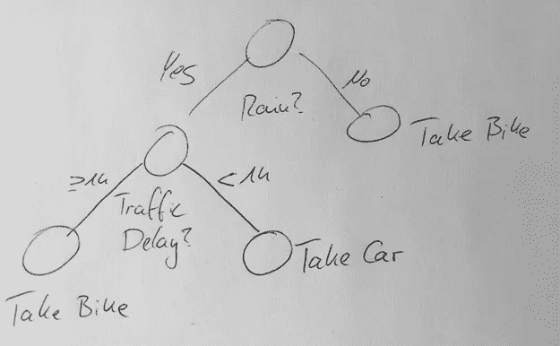
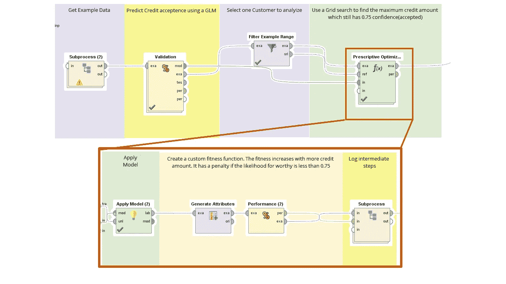
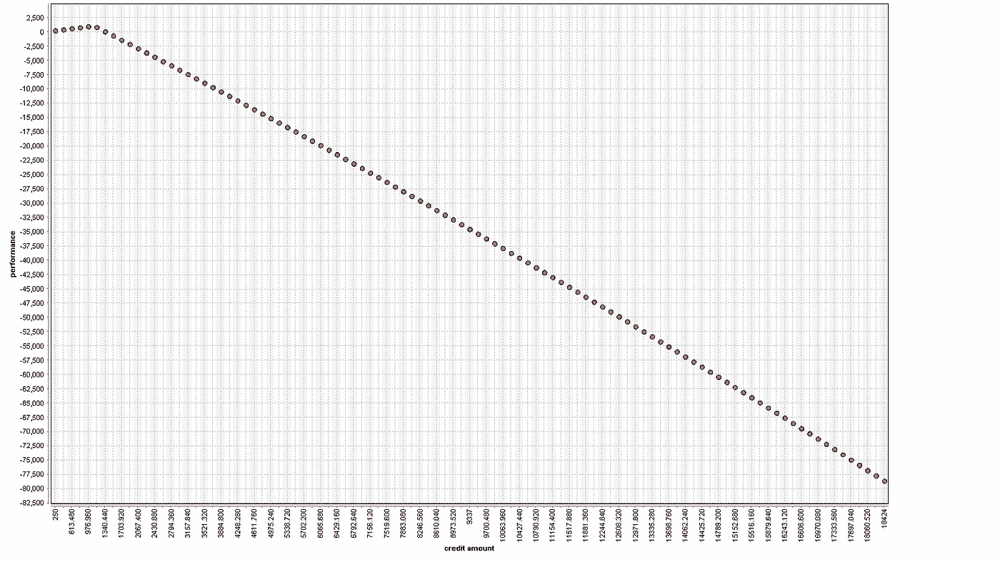

# 走向规范——数据科学的真正超级力量

> 原文：<https://towardsdatascience.com/going-prescriptive-the-real-super-power-of-data-science-66ebb79fb89c?source=collection_archive---------13----------------------->


[Superhero Girl Speed](https://pixabay.com/en/superhero-girl-speed-runner-534120/) by alan9187— CC0

在其核心，数据科学依赖于机器学习的方法。但是数据科学也不仅仅是预测谁会购买，谁会点击或者什么会坏掉。数据科学使用 ML 方法，并将其与其他方法相结合。在本文中，我们将讨论规范分析，这是一种将机器学习与优化相结合的技术。

# 说明性分析——做什么，不做什么

关于如何解释，我最喜欢的例子来自 Ingo Mierswa。假设你有一个预测明天会下雨的机器学习模型。不错——但这对你来说意味着什么呢？你开车去上班还是骑自行车去？在这种情况下，你不可能是唯一一个喜欢开车的人。结果可能是，你被堵在路上一个小时。尽管下雨，还是骑自行车会不会更好？



Depending on your forecasts for weather and traffic you might either take the car or the bike

对此的解决方案是定义一个定制的适应度函数。在给定天气预报、预期交通和个人偏好的情况下，你可以最大化这种适应性。这是说明性分析！这个想法不仅仅是预测将会发生什么，也是建议做什么。

在这个简单的例子中，我们有一个非常小的可操作选项的超空间:要不要骑自行车。这使得我们的优化很容易:评估两者并取其精华。在即将到来的现实世界的例子中，你可以看到这个超空间可能是巨大的，优化问题相当棘手。

# **预测定价**

您可能会尝试使用直接预测模型进行价格计算。假设您有一个带有正确价格的数据集。你可以把这当作一个回归问题，用你最喜欢的 ML 方法来解决。由此产生的模型可以直接用于生产，以预测价格。

这里的大问题是有一个标签的奇迹。你从哪里得到的价格？在实践中，您使用人为生成的价格。你怎么知道这些是好的？实际上，这些标签的质量限制了建模的最高质量。当然，您可以通过使用 A/B 测试来引导自己摆脱这个问题。你有时会提供比人为价格更低或更高的价格来衡量成功。但是这是昂贵的并且不总是可行的。

# 指令性定价

解决这一问题的另一种方法是指令性定价。与 rain 示例类似，我们需要定义一个适应度函数来反映业务案例。在零售的例子中，你可以从需求价格关系开始。一个简单的健身功能看起来像这样:

```
fitness = gain = (Price — Cost)*demand
```

其中需求是机器学习模型的结果，该模型取决于日期、价格甚至其他因素。

如果你与保险公司合作，你的健康状况将会是这样的:

```
fitness = profitability = f(Premium,DefaultRisk,..)
```

在本例中，我们希望优化保费，以获得最大收益。其他因素也是从依赖于客户属性的机器学习模型中得出的。

# 在 RapidMiner 中实现

让我们看看如何实现这样一个系统。我受雇于 RapidMiner，因此我的首选工具当然是 [RapidMiner](https://www.rapidminer.com) 。当然，如果你愿意，你可以用 Python 或者 R 来构建类似的东西。

在我们的实现中，我们希望对客户是否会接受给定的报价进行评分。结果是取决于价格和其他元数据的接受置信度。这里需要注意的是，置信度不等于概率，即使在[0，1]中归一化。

在规定部分，我们将使用这个模型来定义我们的价格。我们会以这样的方式改变价格，每个客户有 0.75 的信心接受我们的报价。0.75 可能源自样本约束。例如，我们希望每个月至少有 1000 个被接受的报价。我们由此得出的适应度函数是:

```
fitness = price-if([confidence(accept)]<0.75,(0.75-[confidence(accept)])*1e6,0)
```

这意味着每当我们的信心下降到阈值以下时，我们就增加一个惩罚因子。



Example Implementation in RapidMiner. This trains a model and optimized the price for acceptance of offer. The fitness function is defined within Prescriptive Optimization

上面描述的示例过程首先是导出一个模型来预测。接下来，我们进入优化。优化采用我们想要优化的输入示例、设置默认边界的参考集和模型。在优化循环中，我们计算上面的适应度。由于优化是单变量的，我们可以使用网格。我们可以使用 CMA-ES、BYOBA 或进化优化。结果是这样的健身



Performance evaluation for one customer. The fitness gets better for higher prices until it hit the spot where confidence(accepted) < 0.75.

我们可以看到，适应度随着价格的增加而上升，然后下降，因为置信度低于 0.75。衍生价格为:976 欧元。

这里描述的过程可以在[我的 github 档案](https://github.com/MartinSchmitzDo/RapidMinerBlogMaterials/tree/master/PrescriptiveAnalytics)中找到。