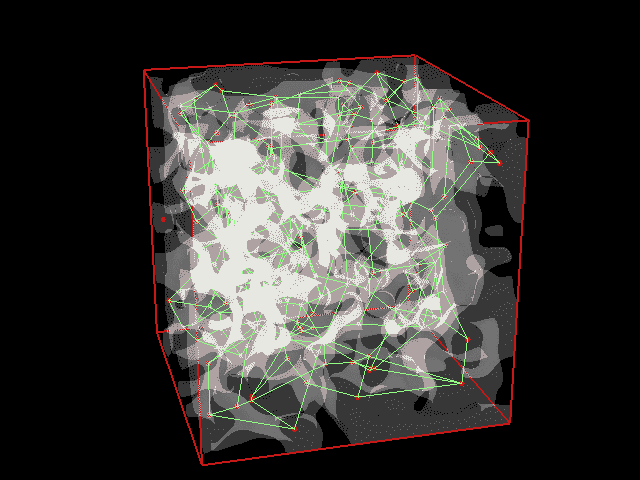
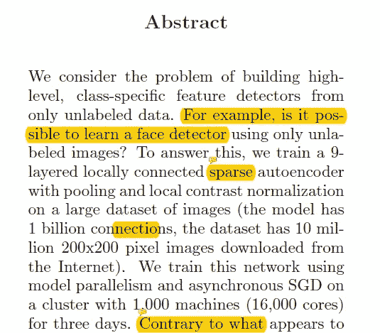
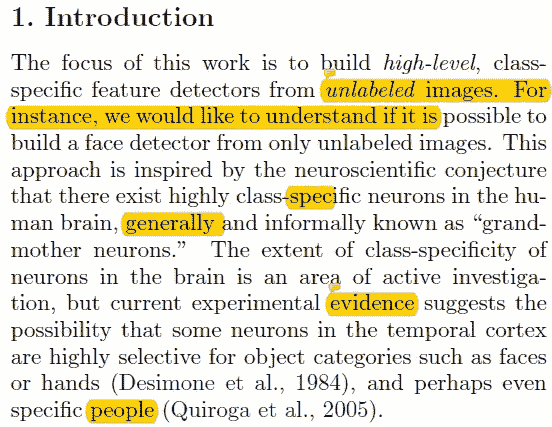
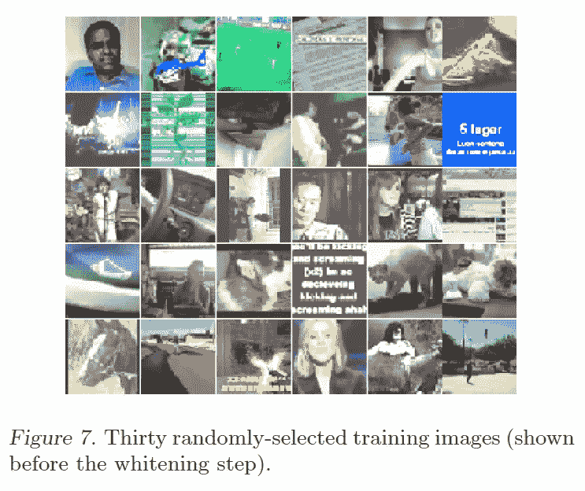
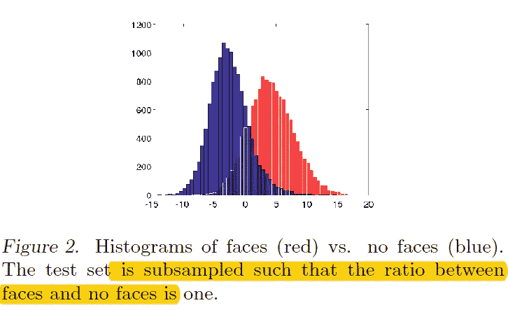
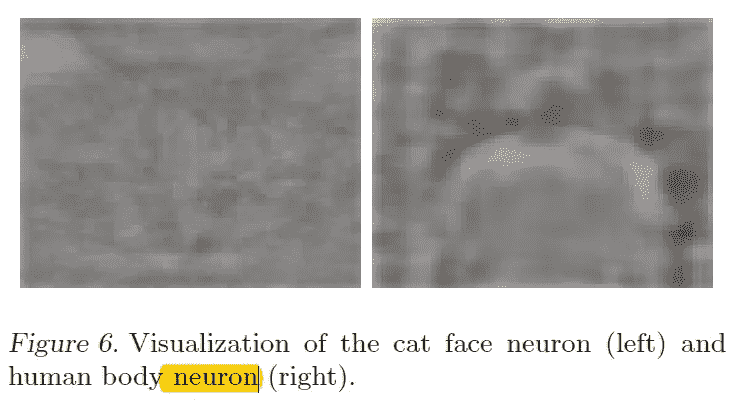
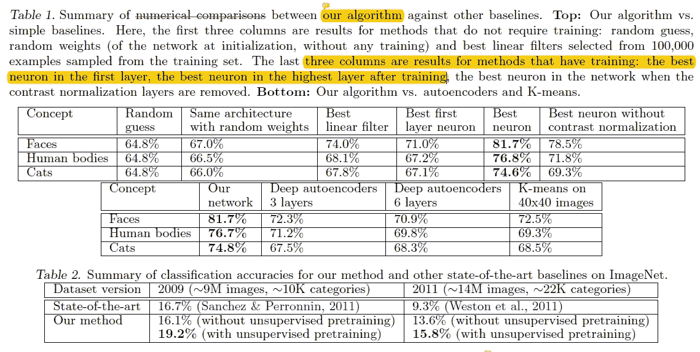
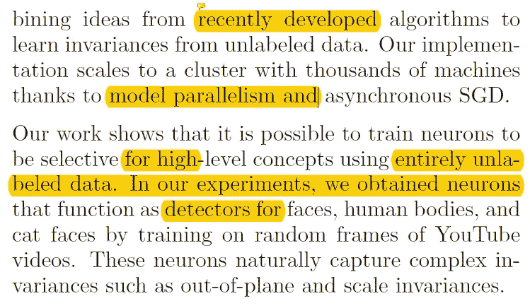

# [谷歌/ICML/论文摘要]使用大规模无监督学习构建高级特征

> 原文：<https://towardsdatascience.com/google-icml-paper-summary-building-high-level-features-using-large-scale-unsupervised-fa1ae8fb8678?source=collection_archive---------16----------------------->

GIF from this [website](https://giphy.com/gifs/features-7BldZFcv2pof6)

我们如何构建更高级的特征检测器？我们能通过无监督学习做到吗？

> **请注意，这篇帖子是给未来的自己看的，回顾这篇论文上的材料，而不是从头再看一遍。**

Paper from this [website](https://arxiv.org/pdf/1112.6209.pdf)

**摘要**

这篇论文的作者感兴趣的是从未标记的数据中制作类特定特征检测器。(例如，从未标记的人脸图像中制作人脸检测器。)为了实现这一点，作者在大数据集上训练了 9 层稀疏自动编码器。与普遍的看法相反，有可能在没有任何标签数据的情况下建立一个人脸检测器，而且在 ImageNet 数据上的表现优于现有技术水平。(2012 年)。

**简介**

本文的目的是仅从未标记的图像中构建类别特定的特征检测器，这是由神经科学的猜想所激发的，即在人脑中存在高度类别特定的神经元，通常和非正式地称为“祖母神经元”。在传统的计算机视觉中，大多数研究人员使用标记数据来获取这些过滤器，然而获取大量数据可能是困难的。这个实验的成功将提供两件事情，一个是从未标记的数据中学习高级特征的方法，另一个是是否可以从未标记的数据中学习大母神经元的可能性。这些方法中的大多数，例如稀疏自动编码器，仅学习低级特征，例如边缘或斑点。作者假设，深度学习之所以需要这么长时间，是因为缺乏高级特征，例如，图像的大小被调整得更小，这些减少破坏了高级特征的学习。作者没有缩小图像，也使用了大量的计算能力。在所有这些之后，它显示了从未标记的数据中学习更高水平的特征是肯定可能的。最后，使用学习过的过滤器，他们能够在 ImageNet 数据集上超越最先进的性能。(2012 年)。

**训练集构造/算法**

如上所述，从 1000 万个 YouTube 视频中随机选择了补丁，使用 OpenCV 人脸检测器，他们能够得出结论，在 100，000 个采样的补丁中，人脸不到 3%。并且所使用的算法受到不同类型的无监督学习算法的成功的启发。(RBM、稀疏自动编码器等)。作者的目的是学习更高层次的特征，而不仅仅是低层次的。

如上所述，作者使用的架构可以被认为是深度稀疏自动编码器，有一些扭曲，它们是局部感受域，池化和局部对比度归一化。(他们使用 L2 池)。堆叠一系列统一模块的方式，在选择性和耐受性层之间切换，被认为是大脑采用的架构。需要注意的一个重要事实是，尽管网络使用局部感受野，但它们不是卷积的(参数不在图像的不同位置共享。)，这在生物学上更说得通。

*学习和优化*

在学习期间，第二子层被固定为统一的权重，并且编码器和解码器中的所有其他权重通过上面看到的成本函数来训练。优化问题也称为重构拓扑独立分量分析，基本上第一项确保表示编码了关于数据的重要信息，第二项鼓励汇集要素以将相似的要素组合在一起以实现方差。本文作者实现了异步随机梯度下降，并使用 1000 台机器对网络进行了三天的训练。

**人脸实验**

测试图像由来自 Wild 数据集和 ImageNet 数据集的标记人脸的 37，000 幅图像组成。训练后，作者使用测试集来测量每个神经元识别人脸的性能。令人惊讶的是，最好的神经元能够以 81.7%的准确率识别人脸。并且在没有局部对比度标准化层的情况下，准确度已经下降到 78.5%。

当他们创建激活值的直方图时，他们能够上图，很明显，即使没有标记数据，也有可能训练人脸检测器。

当作者通过使用两种技术可视化神经元的最佳刺激时。(可视化测试集中最具响应性的刺激，并进行数值优化以找到最佳刺激)。他们能够证实神经元确实在寻找一张脸。并且通过额外的实验，表明学习的权重对于不同的方差是鲁棒的，例如平面外旋转和缩放。

**猫和人体探测器**

作者还想知道该网络是否能够学习高级功能，如猫和人体。如上所述，网络中的一些神经元能够检测到形状像猫或人体的高级特征。在他们自己的数据集上进行测试，在猫和人体上分别达到了 74.8%和 76.7%。

**使用 ImageNet 进行物体识别**

在经过训练的权重之上添加一对一对所有逻辑分类器之后，他们重新训练网络，(这种方法也称为无监督预训练。)在 ImageNet 数据集上。他们能够超越最先进的基线(2012 年)。在包含 22K 个类别的 ImageNet 上，它比其他最高的结果取得了 70%的相对改善。所有的性能都可以在上表中看到。

**结论**

总之，使用大量的数据以及巨大的计算能力，可以仅使用未标记的数据来学习高级特征，如人脸和人体。此外，该方法在 ImageNet 数据集上的表现优于 2012 年的最先进水平。

**最后的话**

这是一个非常酷的实验，然而所需的数据量太大了(以及计算能力)，也许这就是它没有起飞的原因。

如果发现任何错误，请发电子邮件到 jae.duk.seo@gmail.com 给我，如果你希望看到我所有写作的列表，请[在这里查看我的网站](https://jaedukseo.me/)。

同时，在我的 twitter [这里](https://twitter.com/JaeDukSeo)关注我，并访问[我的网站](https://jaedukseo.me/)，或我的 [Youtube 频道](https://www.youtube.com/c/JaeDukSeo)了解更多内容。我也实现了[广残网，请点击这里查看博文 pos](https://medium.com/@SeoJaeDuk/wide-residual-networks-with-interactive-code-5e190f8f25ec) t。

**参考**

1.  Le，q .、Ranzato，m .、Monga，r .、Devin，m .、Chen，k .、和 Corrado，g .等人(2011 年)。使用大规模无监督学习构建高级特征。Arxiv.org。检索于 2018 年 8 月 15 日，来自[https://arxiv.org/abs/1112.6209](https://arxiv.org/abs/1112.6209)