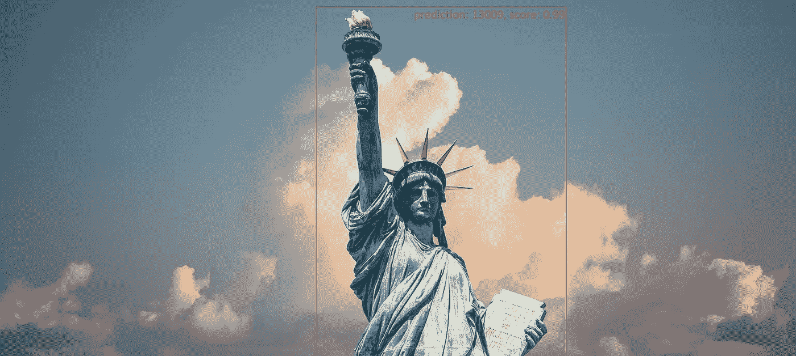
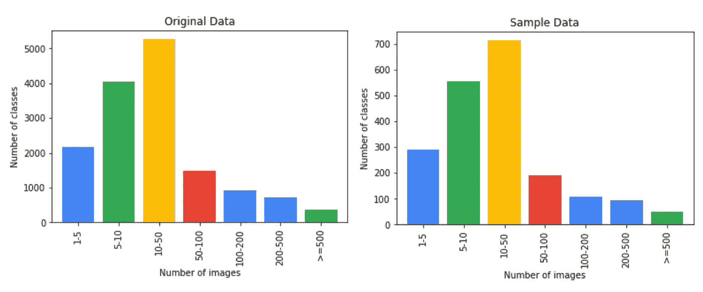
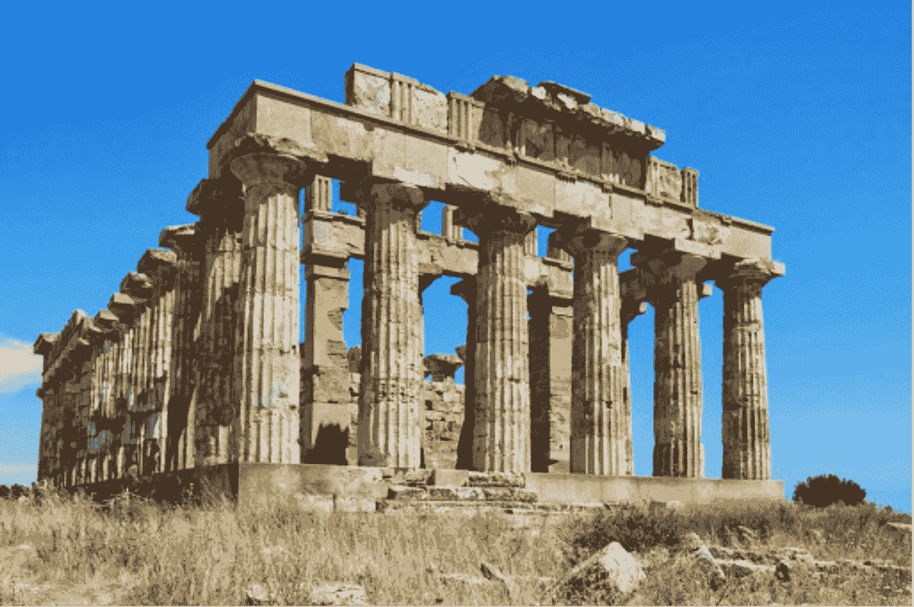
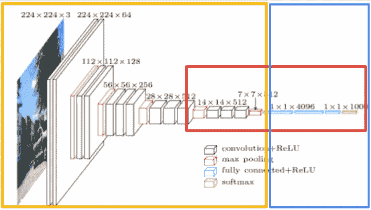
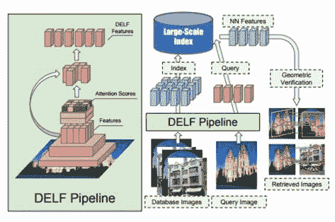
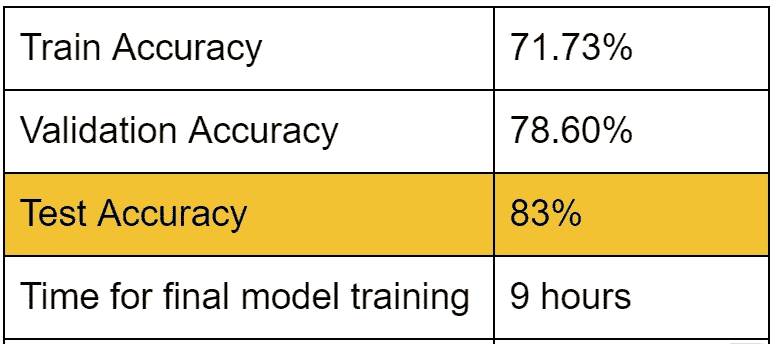
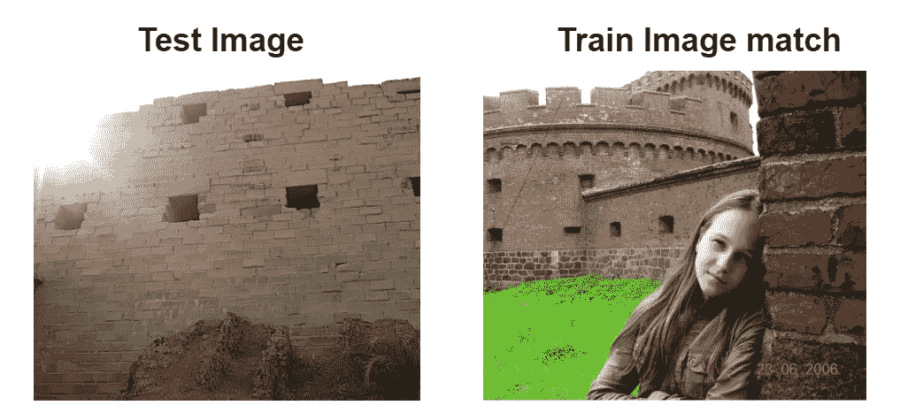

# 使用迁移学习的 Google 地标识别

> 原文：<https://towardsdatascience.com/google-landmark-recognition-using-transfer-learning-dde35cc760e1?source=collection_archive---------8----------------------->

Picture by Kevin Widholm

## 我法师分类用 15k 职业！

*项目由凯瑟琳·麦克纳布、阿努拉格·莫希勒、* [*阿瓦尼·夏尔马*](https://medium.com/@sharmaavani10) *、埃文·大卫、阿尼莎·加尔格*

> D 处理大量的类，而在许多类中只有很少的图像，这使得这项任务非常具有挑战性！

问题来自一个著名的 Kaggle 比赛，谷歌地标识别挑战赛。训练集包含**超过 120 万张图像**，分布在 **14，951 类**地标**、**中，每类图像从一张到数千张不等。随着深度学习的发展，这种极端分类的问题在今天的数据科学社区中非常普遍。关于这个数据集需要注意的一件重要事情是，给定的测试集包括许多根本不是地标的图像，我们称之为“垃圾”图像。

这种数据集的巨大学习潜力促使我们的团队将其作为高级预测建模的课程项目。这篇博客将详细介绍我们在谷歌地标识别挑战中的尝试。我们将讨论所使用的平台、我们解决问题的方法、数据处理、尝试过的模型、我们的结果以及我们在此过程中面临的一些挑战。

按照此 [**github repo**](https://github.com/anishagg/Landmark_recognition) 获取代码。

# 方法概述

首先，我们首先在本地系统上处理 100 个类的数据样本，以设置整个过程。

> 这次试运行的一个教训是，使用较小分辨率的图像，模型训练的速度提高了 6 倍。

不同分辨率图像的下载时间大致相同(主要时间花在打开 url 链接上)。出于时间的考虑，我们决定在我们的项目中使用分辨率为 96x96 的图像，而不是全分辨率。最终的结果产生于 2000 个具有调整图像大小的类的数据样本。

接下来，我们需要选择一个平台，在一个巨大的数据集上运行如此密集的代码。一般选项有亚马逊网络服务(AWS)、谷歌云平台(GCP)或任何其他大数据处理平台。我们选择使用 GCP，因为帐户启动时有 300 美元的免费信贷。[这个](http://cs231n.github.io/gce-tutorial/)博客是一个很好的资源，可以一步一步的指导你在 GCP 创建图像识别的虚拟实例，特别是 CNN。我们最终使用了 1 个 GPU——NVIDIA Tesla K80，8 个 CPU，50GB RAM 和 500 GB 磁盘空间。

为了图像分类的目的，我们需要从一般的数据预处理开始，然后才能从 Keras 实现 CNN。我们需要在训练集和验证集中对图像进行分类标记，因此我们建立了相应的数据集。

在数据预处理之后，我们的方法包括对数据使用 VGG16 预训练模型以及 DeLF 来处理困难的测试图像。DELF 匹配图像中的局部特征，我们将在后半部分详细讨论这一点。最后，我们使用来自训练数据的样本测试集来检索准确度分数，并且我们的模型能够达到高达 83%的准确度(鼓掌！/喘息声！) .

# I .获取图像数据

数据以 CSV 的形式出现，带有图像 URL 和地标 id。我们的 2000 个类样本包含从“1000”到“2999”的类标签(地标 id)。本项目的数据预处理大致分为以下几个步骤:

**a)Train-validation-holdout data**:由于 test 文件夹中的文件大部分是垃圾文件，不包含任何地标，我们不得不从 training.csv 创建自己的 holdout set 来测试我们的最终模型。我们从每个类中抽取 1%的图像来制作维持数据集。接下来是对剩余 99%数据的训练验证分割。来自每个类别的 20%的图像被标记为验证集，剩余的 80%用于训练。在这一步的最后，这就是数据分布

> 测试集有 1183 行。验证数据有 31，651 行，训练数据有 130，551 行。

**b)获取图像文件:**准备好图像 URL 和唯一 id 后，下一步是将图像下载到适当的文件夹中。创建了三个单独的文件夹，每个文件夹对应一个训练集、验证集和维持集。调整大小后的图像(96x96)被下载到各自的文件夹(在 GCP)中，大约花了 9 个小时才完成。

**c)制作目录结构**:训练和验证数据必须采用特定的目录格式，这样我们才能使用 Keras 功能。我们将数据转换成这种结构，其中每个类都是 Train/Validation 文件夹中的一个子文件夹。该子文件夹包含属于该类别的所有图像文件。

# 二。数据预处理

## 数据清理

某些 URL 链接已断开，下载的文件已损坏。在将文件移动到特定目录之前，使用文件大小大于 1000 字节的过滤器删除了所有此类文件。接下来，我们发现一些类在验证文件夹中丢失了。这是因为 80-20 的比例。所有具有 4 个或更少图像的类对验证集没有任何贡献(因为 4 的 20%小于 1)。验证数据中缺少文件夹导致模型训练出现问题。创建空白文件夹就是为了解决这个问题。

## 图像增强

我们的数据中的图像是在不同的角度、水平位移、变焦等情况下拍摄的。预计在测试数据中也会发现类似的变化。为了说明这些变化，我们对高度和宽度偏移、缩放、亮度、旋转和剪切进行了非零值的图像增强。我们没有将增强图像存储在我们的系统中，而是将它们直接用作模型的输入。通过目测图像来选择要使用的参数类型，并根据模型训练获得的精度来确定这些参数的具体值。

# 三。模特培训

在 Keras 库中可以找到不同的 CNN 架构，例如 VGG16、VGG19、Inception 等。虽然 VGG19 和 Inception 是更重的架构(需要训练的参数数量)，但在我们拥有的时间范围内，训练 VGG16 是可行的。

An image classified as **triumphal_arch** using ImageNet

从简单开始，我们使用在 Google ImageNet 数据集上预先训练的 VGG16 来预测地标。我们观察到 ImageNet 权重能够成功地从我们的图像中捕获一般特征。这使得 VGG16(带有 ImageNet 权重)成为我们在[迁移学习](http://ruder.io/transfer-learning/)过程中的首选模型。

我们的方法是使用 VGG16 的瓶颈层作为特征提取器，并训练顶部 3 层使用更具体的特征对地标进行分类。在阅读了一些关于迁移学习的最佳实践的博客之后，我们加入了一个额外的步骤，在对整个网络进行训练之前，初始化前三层的权重。

所以我们最后的过程看起来像这样:

1.  在 VGG16 的瓶颈层上使用 ImageNet 权重将图像(96x96)转换为矢量。
2.  初始化最上面三层的权重。为此，训练了仅具有三个密集层(2 个 ReLU 激活，1 个 softmax)的模型。输入是上一步获得的图像向量。这样得到的重量被保存起来以备后用。
3.  现在，整个 VGG16 模型已经编译完成——上一步中的前三个初始化层被添加到 VGG16 底层之上。我们选择只冻结底部的 16 层，而不是 19 层，这样网络可以更好地学习 ImageNet 图像之外的图像。这给了我们一个很好的准确性跳跃。

Step 1: Yellow, Step 2: Blue, Step 3: Red

我们探索的编译模型中的可变性是——要训练的层数、优化器的类型、所选优化器的超参数、图像增强的参数、批量大小和时期数。这些细节将在下面讨论。损失函数被固定为“分类交叉熵”。

## **IIIa。要训练的层数**

我们只采用 VGG16 架构直到最后一个卷积层，并在顶部添加全连接层作为顺序层。这很重要，因为从 VGG16 中选择完全连接的层迫使我们对模型使用固定的输入大小(224 X 224，原始的 ImageNet 格式)。通过只保留卷积模块，我们的模型可以适应任意的输入大小。在我们的例子中，它是 96 X 96(图像高度 X 图像宽度)

借助新编译的 VGG16 架构，我们在对数据进行训练的同时，改变了冻结权重的层数。在中间运行中，我们还试验了添加的脱落层来测试我们模型的结果。对于验证和训练数据集来说，精度会随着丢失层而下降，因此被移除。

> 仅使用三个密集层(2 个 ReLU 激活，1 个 softmax)和冻结在底部 16 层的来自 ImageNet 的权重，就可以实现最佳精度。

## IIIb。优化者

我们使用了各种优化工具，包括 momentum SGD、Adam 和 Adagrad。超参数首先以标准范围给出，然后朝着提高精度的方向变化。没有一个特定的学习率对所有优化者都有效。我们观察到，训练时间随着数据量的增加而线性增长，同样的学习速度也适用于更大的数据。我们调整的超参数是这些优化器的学习速率、动量和衰减。在用一些自适应学习率梯度下降算法进行试验后，我们观察到 Adam 对我们的问题是最好的。[本文](https://medium.freecodecamp.org/how-to-pick-the-best-learning-rate-for-your-machine-learning-project-9c28865039a8)对超参数调优过程有很大帮助。

## IIIc。图像增强

在观察了每个参数对图像的影响后，我们观察了每个参数对模型结果的累积影响。这些范围证实了我们目测照片的观察结果，这些照片有时是参观纪念碑的人拍摄的自拍照，例如 15-30°的角度会产生良好的精确度。

## IIId。批量

有两个批量大小的实例要使用。

一个是在将图像转换为特征向量(使用 VGG16 瓶颈层)时应用图像增强，其中图像是成批拍摄的。这意味着训练和验证图像的数量应该是该批量大小的倍数。我们的最终模型的批量为 240。

其次是在模特培训期间。增加批量大小是增加训练时间和增加模型准确性之间的折衷。批量大小为 1 将基本上进行随机梯度下降，一次进行一次观察。对于如此庞大的数据集，在决定批量大小时，必须牢记我们系统的内存限制。我们能够以合理的准确度和运行时间达到 240 的批量。

## IIIe。时代数

一旦上述超参数的特定设置达到了良好的精度水平，我们就将时期从 15 增加到 24 或 30，这将产生更好的模型结果。在 GCP 上使用单个 Nvidia Tesla K80 GPU 和 8 个 CPU(批量大小为 240)时，每个历元大约需要 15 分钟，因此历元的增量是选择性的。

## 最终模型

我们用 VGG16 架构训练的模型在验证集上可以给我们 78.60%的准确度，在转移到其他模型如 Inception 和 Resnet 之前，我们竭尽全力提高准确度，查看不同参数的影响。对于我们的最终模型，在 30 个历元之后，精度饱和到接近的值范围。最终模型的参数如下所示:

现在模型已经训练好了，我们得到了 78.6%的验证准确率，接下来呢？？让我们继续对测试图像进行预测。但是…

> 测试数据主要由不相关的图像组成，这些图像甚至不是地标

这是一个问题，因为深度神经网络很容易被欺骗，也就是说，即使是不相关的图像，也会被有把握地归类为一类。那么，我们如何判断神经网络的预测是否正确呢？

# 四。深度局部特征

为了解决这个问题，我们利用一种称为 DeLF 的局部特征描述符进行大规模图像检索。它从图像中提取局部特征并进行匹配。我们使用它将测试图像的局部特征与已知的地标图像进行匹配。

> DeLF 是 Google 最近开发的，详细内容可以在这篇[论文](https://arxiv.org/abs/1612.06321)中找到。

DeLF Pipeline

DeLF 架构是这样的，它选择具有最高分数的特征，然后查询图像通过，并且在经过**几何**验证之后，其特征与数据库图像的特征相匹配。特征的匹配是通过 Ransac(随机样本一致性)完成的，并且内联体的数量被用于做出决定。

内联体数量的这个阈值(进行‘标志’—‘无标志’分类)由我们决定，并且可以根据图像的分辨率直观地改变。分辨率越高，可用于匹配的局部特征的数量越多。然后通过 DELF 发送从深度网络获得的预测，并将测试图像与来自预测类的数据库图像进行比较。

有 3 种可能的匹配情况:

第一种情况具有最多的内联体，第二种情况具有较少的内联体，并且在没有界标的情况下，没有到只有几个内联体(同样，实际数量取决于我们决定处理的图像的分辨率)。

因此，设置适当的阈值，我们能够决定测试图像实际上是否是地标。

# 动词 （verb 的缩写）结果

Test set is the holdout set that was kept aside in the beginning

为了更好地理解模型行为，我们检查了一些错误分类的图像，并收集了一些有趣的观察结果。几个错误分类的测试图像看起来相似，并被合理地分类到错误的类别。

Images that confused our model

# 不及物动词结论

## 摘要

我们试图训练 CNN 在谷歌地标识别挑战中获得良好的准确性。为此，谷歌云平台被用来使用具有所需功能的机器。首先，训练图像数据集被分成训练、验证和测试图像，并且图像在下载之前被调整大小以使挑战更易处理。对于模型训练，VGG 16 神经网络与来自 ImageNet 的迁移学习一起使用。我们尝试了#层、优化器、超参数、图像增强、批量大小和#时期的变化，以提高验证准确性。最后，我们使用 DeLF 来处理主要由不相关图像组成的实际测试数据集。

## 后续步骤

对于这个项目，由于时间短和可用的计算机资源，我们面临许多限制。明确的下一步将是尝试更重的模型，如 Inception Net(它一直在我们配置的系统中抛出 OOM 错误)，增加批量大小，并在更大的样本(或整个数据集)上工作。我们还尝试将图像分辨率增加到 224x224，但这将一个时期的训练时间增加到 90 分钟。如果有更多的时间，我们肯定会探索图像分辨率对准确性的影响。

改进或发展我们当前工作的其他可能步骤包括:

*   为测试图像创建 DeLF 和 CNN 的管道，以确保只有有效的界标被馈送到 CNN 进行分类。
*   一旦更多的 CNN 像 Inception Net 和 ResNet 被训练，尝试这些模型的集合。

# 七。从过程中学习

回顾过去，我们的团队从整个过程中学到了很多东西。在这里，我们记下几个关键的要点，我们希望在开始项目之前就知道。

1.  利用预先构建的磁盘映像进行映像识别。试图通过安装所有依赖项来配置自己的系统是一场噩梦！
2.  [检查](https://stackoverflow.com/questions/38009682/how-to-tell-if-tensorflow-is-using-gpu-acceleration-from-inside-python-shell)tensor flow 是否确实在使用 GPU 加速，然后等待几个小时等待您的纪元运行。
3.  总是在较小的数据集上对整个过程进行试运行(从最开始到结束)。

*非常感谢我们的教授 Joydeep Ghosh 博士，他在这个旅程中给了我们很大的帮助*。如果您有任何意见或建议，请告诉我们。希望这个博客能帮助你设计你自己的图像分类项目！