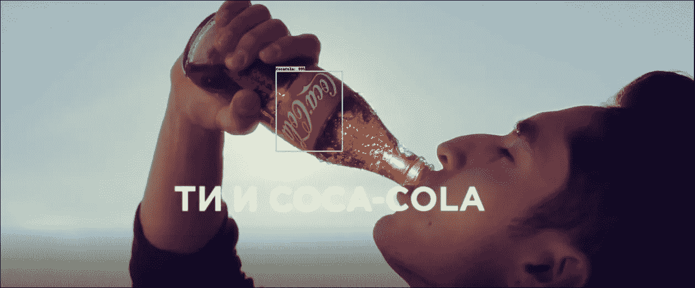
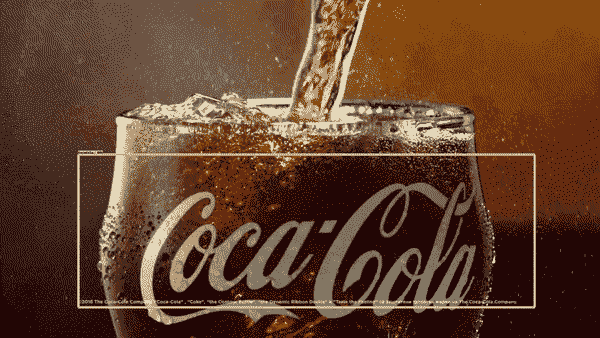

# 检测品牌标志的 Google 对象检测 API 第 2 部分

> 原文：<https://towardsdatascience.com/google-object-detection-api-to-detect-brand-logos-part-2-384055e4e109?source=collection_archive---------3----------------------->

我对 Logo 检测的痴迷从[第一部](https://medium.com/towards-data-science/google-object-detection-api-to-detect-brand-logos-fd9e113725d8)就开始了。所以这次我尝试用一个更大的数据集和一些其他模型来使用迁移学习进行训练。结果优于第一部分。我能够检测尺寸较小的徽标，并且通过对检测代码进行一些更改，我也能够提高检测速度。

# **新数据集— Flickr Belga 徽标**

在我之前的尝试中，我使用了更小的 flickr-27 徽标数据集——只有 27 个徽标类别的 810 幅训练图像。因此，面临的挑战是找到一个更好的数据集，用更多数量的图像进行训练。很难找到带有可用于对象的注释的图像数据集。

幸运的是，我偶然发现了 [flickrBelgaLogos 数据集](http://www-sop.inria.fr/members/Alexis.Joly/BelgaLogos/FlickrBelgaLogos.html)，它是 Belga 徽标数据集的扩展。Belga 徽标数据集包含 37 个徽标类别的 10k 幅图像。然而，在评估后，只有 2695 个被认为适合检测。flickrBelgaLogos 创建了一个新的合成数据集，方法是将 Belga 徽标中裁剪的徽标剪切并粘贴到从 Flickr 抓取的图像数据集中。

每个徽标类别的徽标分布可以从他们的网站上看到。我删除了一些图像样本数量较少的徽标类别。最后，我为总共 2406 张图片的 20 个标志类别创建了一个数据集。(我还复制了 flickr-27 数据集中的图片，以增加样本量)。

虽然这不是一个庞大的数据集，但显然比我之前的数据集有所改进。而且性能提高了许多倍。

# **训练不同的模型**

有了数据集和注释之后，很容易得到注释 XML。然而，有一些重要的观点

1-总是以类别名称开头，后跟下划线“_”。此外，XML 的命名应该与图像名称相同。

2-label _ map . Pb txt 文件中的类别名称应以 1 开头，而不是 0。否则，将跳过类别 0 进行培训。

3-同样在训练时，如果你得到一个错误，很可能你的注释文件不正确，注释文件中的对象位置超出了图像边界。

创建”后。记录“来自图像数据集的文件我使用转移学习训练了 3 个模型— **Faster_Rcnn_restnet101、SSD Inception V2 和 SSD Mobilenet** 。我的意图是获得更快和更好的检测。这些是我在上述模型上训练和测试时的一些观察结果

1-更快的 RCNN 在检测中是最好的，而在检测中稍慢。然而，它们并不太慢。我设法实现了**每秒 3.6 帧**的视频检测，而没有并行性。我用的是 **GeForce GTX 1060 6GB** 机。

2- SSD Inception 和 Mobilenet 的检测速度非常快，但检测精度非常低。也许它们可以在大量训练数据集上表现得更好，但更快的 RCNN 仍然是我检测的选择。

3-我对上述模型进行了大约 100，000 次迭代的训练。但是更多的迭代使得模型更容易检测到假阳性。我不知道原因，但这是我观察到的。**使用在更快的 RCNN restnet 上训练的. 99 阈值检测 obove 视频，迭代 110k】。**

# **检测更小的物体**

检测更小的物体是我从一开始就关心的问题，为了实现这一点，我尝试使用图像中更小的物体来训练模型。这在直觉上看起来是正确的，而我通过长时间训练模型实现了较小物体的检测。但是模型能探测到多小的物体是有限制的。

标注的较小对象上的训练模型可能会增加假阳性检测，而非常小的对象上的训练甚至可能不训练。

# **检测速度**

由于 [Priya Dwivedi](https://medium.com/@priya.dwivedi) 发布了“[https://medium . com/forward-data-science/is-Google-tensor flow-object-detection-API-the-easy-way-to-implementing-image-recognition-A8 BD 1 f 500 ea 0](https://medium.com/towards-data-science/is-google-tensorflow-object-detection-api-the-easiest-way-to-implement-image-recognition-a8bd1f500ea0)”，我能够轻松地对视频进行检测，因为 OpenCV for Videos 非常令人头痛，而 moviepy 则容易得多。

对于一个 30 秒的剪辑(更快的 RCNN restnet 模型)，我能够将时间提高到大约 3 分钟的检测时间，如上文提到的 1920x1080 视频剪辑的 3.6 FPS。在独立图像上，它在 0.28 秒内探测到物体。

