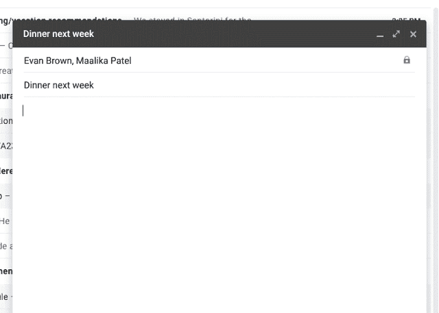

# 谷歌智能写作、机器偏见、种族主义人工智能——总结一个疯狂阅读博客的夜晚

> 原文：<https://towardsdatascience.com/google-smart-compose-machine-bias-racist-ai-summarising-one-night-of-binge-reading-from-blogs-19a033953013?source=collection_archive---------6----------------------->

[Pic Credit](https://www.forbesmiddleeast.com/en/artificial-intelligence-to-contribute-320-billion-to-the-middle-east-by-2030/)

在桑德尔·皮帅上台并开始他的谷歌 I/O 2018 主题演讲后，我开始记下正在宣布和演示的有趣的事情。有一些非常有趣的演示和公告，特别是对于那些对深度学习感兴趣的人。我对 Gmail 的 Smart Compose 和 Google Duplex 以及其他东西很好奇，这两个都是自然语言处理的用例。Google Duplex 得到了很多关注，这并不奇怪，因为 Google Assistant 与真人的对话听起来天衣无缝，也很像人。如果你对深度学习感兴趣，你肯定想知道至少一点关于这些是如何完成的，谷歌的研究博客是一个了解更多的好地方。以防你不知道，ai.googleblog.com 是谷歌新的研究博客！

我们都熟悉在手机上完成单词的建议。但是为什么要把这个功能限制在只有单词补全呢？智能撰写是 Gmail 的新功能，它可以在我们撰写电子邮件时提供建议，从而帮助我们完成句子。这也像许多最近的进步和功能，利用神经网络。在典型的单词完成任务中，提示性单词取决于标记/单词的前缀序列。根据前面的单词，建议接下来可能出现的语义最接近的单词。在智能撰写的情况下，除了前缀序列之外，电子邮件标题以及先前的电子邮件正文(如果在当前邮件是对先前邮件的回复的情况下存在)也被认为是输入，以提供句子完成的建议。

[Pic Credit](https://ai.googleblog.com/2018/05/smart-compose-using-neural-networks-to.html)

延迟、可伸缩性和隐私是三个已确定的挑战，要使该功能高效、可访问且安全，就必须解决这三个挑战。为了使句子完成建议有效，等待时间应该更短，这样用户就不会注意到任何延迟。考虑到有超过 10 亿人使用 Gmail，很难想象每封邮件的内容会有多么不同。该模型应该足够复杂和可伸缩，以容纳尽可能多的用户。当涉及任何类型的数据时，到处都可以听到对隐私的呼喊。只有少数事情比我们的电子邮件更需要隐私。因此，模型不应该以任何方式暴露用户的数据。

谷歌在 Smart Compose 上的博客引用了一些研究论文，这些论文有助于构建这一新 Gmail 功能背后的神经网络架构。还有一篇在博客中分享的论文 ***语义从语言语料库中自动导出必然包含人类偏见*** 。这是一篇非常有趣的论文，它引导我写了一系列博客。即使你不是人工智能研究人员，也不是机器学习专家，你也一定听说过这些领域的进步极大地改变了我们生活的许多方面。隐私和偏见是围绕从数据中学习的应用程序或程序的使用的两个大问题。虽然隐私问题已经被关注了很长一段时间，但偏见似乎也在蔓延。任何利用机器学习来解决问题的程序都需要数据作为输入。根据手头的问题或任务，这些输入数据可以是文本、图像、音频等。不管输入数据是什么类型/形式，它都是通过某种人类行为生成的。这意味着存在于人类行为和思想中的偏见和成见是学习模型中最重要的部分——输入。

当哈佛大学的拉坦娅·斯威尼在谷歌上搜索自己的名字时，令她惊讶的是，搜索结果中还有一条广告显示，“拉坦娅·斯威尼被捕了？”这让她对谷歌搜索结果进行了研究，从中她得出结论，与黑人联系更紧密的名字更有可能出现这样的搜索结果或广告。她在对 2000 多个真实姓名进行搜索后发现，与黑人相关的名字显示此类犯罪广告的可能性高达 25%。谷歌搜索在这里是种族歧视吗？这是来自谷歌的回应——“AdWords 不进行任何种族定性。我们也有一个“反”和暴力政策，声明我们将不允许宣传反对某个组织、个人或群体的广告。由个体广告客户决定他们希望选择哪些关键词来触发他们的广告。”

[Pic Credit](http://atlantablackstar.com/2016/06/10/teen-googles-three-black-teenagers-and-three-white-teenagers-to-startling-results/)

2016 年，一位互联网用户在 Twitter 上发帖，讲述了他使用谷歌图片搜索的经历之一。当他搜索“三个白人少年”时，他发现的结果是微笑、快乐的白人少年的图像。当用“三个黑人少年”进行类似的搜索时，结果大相径庭。虽然这些结果也有一些正常和普通的图像，但许多其他结果是被监禁的青少年的。这篇文章发布后很快就火了，这并不奇怪。这背后的原因是什么？图像搜索背后的算法是编程来做这个的吗？情况肯定不是这样。谷歌也解释了这种情况——“我们的图片搜索结果是整个网络内容的反映，包括各类图片出现的频率以及它们在网上的描述方式”。

问题似乎只出在可以访问大量数据的大型科技公司的应用程序/算法上吗？美国的许多法院使用一种软件给被告/被指控者一个风险分数。这个分数代表这个人犯罪的可能性。软件从哪里获得数据来执行分析并给出风险分数？据 ProPublica 的博客称，开发这种风险评估软件的 Northpointe 公司使用了 137 个问题的答案作为数据。这些答案要么直接通过询问被告获得，要么取自过去的犯罪记录。

[Pic Credit](https://www.documentcloud.org/documents/2702103-Sample-Risk-Assessment-COMPAS-CORE.html)

在这种情况下，数据可能不多，但这并不意味着该程序没有偏见。当 Brisha Borden 骑着一辆不属于她的自行车被逮捕时，风险评估程序给她打了高分，认为她将来可能会犯下更多的罪行。同一个节目给了弗农·彼得一个较低的分数，他过去曾因持械抢劫入狱 5 年。然而，在两年的时间里，得分高的布里沙没有犯任何罪行，而得分低的弗农却因为另一次抢劫而再次入狱。数据也是这个风险评估项目最关键的组成部分。

这些不仅仅是为了解释偏见问题而精心挑选的一些事件。几年前有一个事件，惠普的面部跟踪网络摄像头在白人身上工作正常，但却无法识别深色皮肤的人。谷歌照片将黑人归类为大猩猩。所有这些的根本原因是偏见是被使用的数据的很大一部分。当生成的数据存在偏差时，以及当收集的用于训练模型的数据不具有代表性时，都会发生这种情况。当手机或网站上的一些应用程序将他们或朋友归类为某种动物时，并非所有人都会一笑置之。没有一家研究基于数据的算法和应用的公司会希望它们表现出偏见。我们许多人都很清楚，用于这些目的的算法远非完美。然而，当人们经历这些偏见时，他们的反应会是自发的，就好像他们受到了同伴的影响一样。

[Pic Credit](https://www.vinavu.com/2017/11/03/predictive-analytics-will-lead-the-future/vernon-prater-and-brisha-borden/)

> 拉坦娅·斯威尼事件发生在 2013 年。同样，提到的其他事件发生在 2014 年和 2016 年的某个时候，而惠普的面部跟踪问题发生在 2009 年。鉴于我们正在谈论的事件发生在几年前，这些偏见的问题现在可能已经解决了，不是吗？不。谷歌通过阻止应用程序中的任何图片被归类为大猩猩、黑猩猩等，修复了照片应用程序的问题。听起来更像是一种变通办法，而不是解决办法？但是我们的问题是这些是偏见，而不是错误。它们不存在于代码中。它们存在于数据中，这使得这个问题很难解决。

学习模型并不完美。开发和建造这些设备的公司也没有假装它们是。谷歌毫不犹豫地承认，即使是其最先进的算法也容易受到数据偏差的影响。它不断努力使这些算法变得更好。苹果已经从以前的人脸识别软件面临的所有缺陷和问题中吸取了教训。它确保使用神经网络构建的人脸识别程序是根据适当的代表性数据进行训练的——这些数据包括年龄、性别、种族、族裔等所有多样性。领先的科技公司和许多其他公司正在朝着改进这些算法的方向迈进，这些算法肯定有很大的潜力，比如疾病的早期检测和诊断，帮助不同能力的人，教育，使计算机和技术更好地执行类似人类的任务等。

尽管这些进步在过去几年里发生得很快，但像算法偏差这样的问题仍然存在。由于学习模型在对其进行训练的数据中存在偏差时是无能为力的，因此开发不仅学习关联模式而且学习在偏差存在时隐式处理偏差的学习模型将是一个巨大的进步。我们人类是如此受思想驱动。然而，即使有偏见的想法，如果我们愿意，我们也有能力采取不带偏见的行动。学习模型能学会这样做吗？如果不完全是，至少在某种程度上是？

**致谢**:

Google 研究团队在 Google Smart Compose 上的博客— [**链接**](https://ai.googleblog.com/2018/05/smart-compose-using-neural-networks-to.html)
语义从包含类人偏见的语言语料库中自动导出研究论文— [**链接**](https://arxiv.org/abs/1608.07187)
ProPublica 在机器偏见上的博客— [**链接**](https://www.propublica.org/article/machine-bias-risk-assessments-in-criminal-sentencing)

***你觉得这个帖子有用吗？鼓掌是让我知道它做到了的一种方式。感谢阅读！！***

> 要连接: [LinkedIn](https://www.linkedin.com/in/avinash-kappa/) 、 [Twitter](http://twitter.com/avinashso13) 和我的[博客](https://theimgclist.github.io/)。