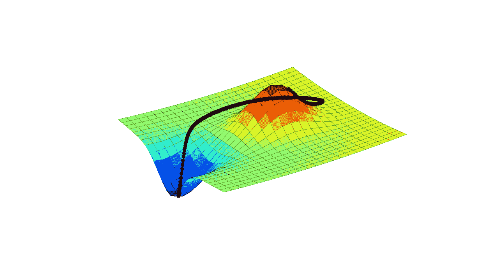
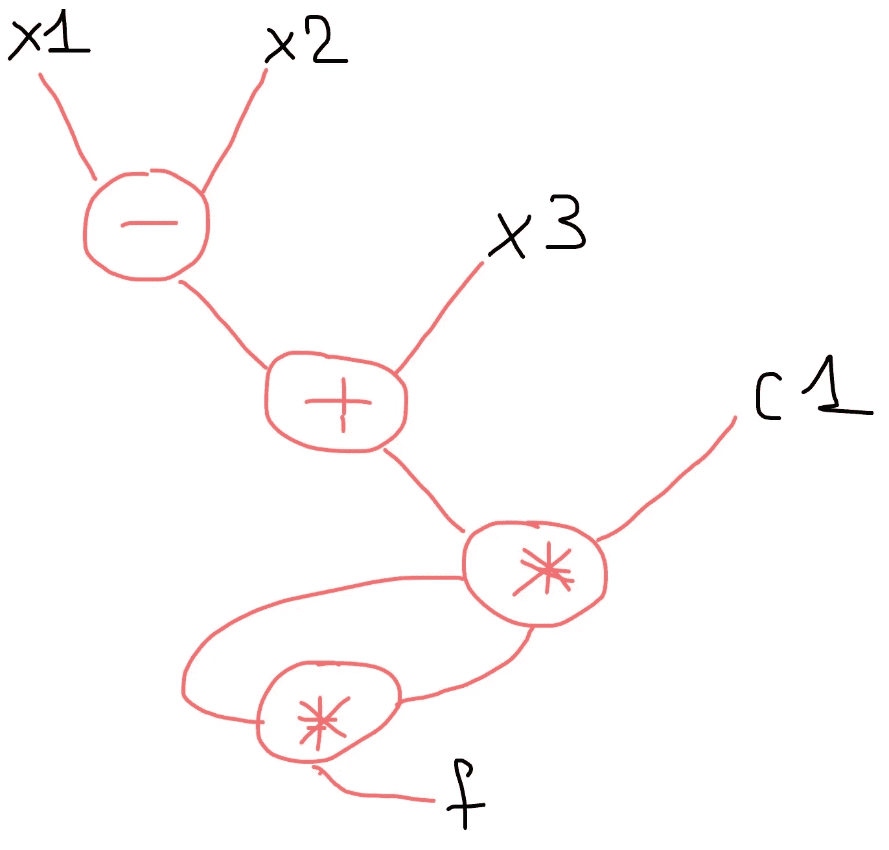

# 带自由单子的梯度下降

> 原文：<https://towardsdatascience.com/gradient-descend-with-free-monads-ebf9a23bece5?source=collection_archive---------5----------------------->

最近，我在 Scala 中玩自由单子，发现这可能是在函数式编程风格中进行梯度计算的完美方式。显然，从性能的角度来看，使用自由单子计算梯度并不是最好的主意，但它对于教育和实验目的非常有用。如果您有办法在 dispose 中计算任意表达式的梯度，那么开始构建简单的神经网络并不是什么大事。

> Free Monad 是构建任何一种表示计算的抽象语法树 (AST ),同时保持计算 AST 与它的解释方式分离的完美方式。

我的目标是演示如何使用自由单子构建一个简单的梯度计算引擎。首先，我们将为 AST 表示定义一个域模型。然后，可以定义一个表示计算的自由单子。最后，我们将能够使用不同的解释器分析和数值计算梯度，并比较结果(应该相等)。此外，我们将能够定义一个简单的梯度下降优化器，能够解决一个简单的方程定义的*计算*自由单子。这里是[回购](https://github.com/stormy-ua/grad4free)，代码在这里演示。

## **计算 AST 表示**

我们需要一种将计算表示为 AST 的方法。我们可以把它表示为一个图，其中边是进出由运算表示的顶点的张量。有两种边:变量和常数:

以及几种表示 AST 图顶点的操作:

定义了计算图的边(张量)和顶点(操作)之后，我们可以用一组预定义的基本操作来表示任意的计算。

> 我在这里使用术语*张量*。它只是一组不同形状的值的数学抽象。标量是一个 0 维张量。向量是一维张量。矩阵是二维张量。而任何具有更高维度的事物，都被简单地称为 n 维张量。在这个例子中，我使用的是 0 维张量，也就是标量。

此外，定义两个额外的类型也很方便:

## 计算自由单子

下一步是定义一个*计算*自由单子。我在这里使用的是 cats Scala 库:

我不会在这里深入探讨什么是自由单子。这里有牛逼的文章这里有。本质上，仅仅通过 Op[A]我们就可以*使用自由单子将它提升到单子上下文中。这样一来，我们就有办法把 Op[A]组合成一元式了。这种一元组合是这样构建的，它是栈安全的，可以从定义它的地方单独解释。这意味着，反过来，我们可以对同一个计算表达式应用多个解释器。*

现在可以使用 Scala for-comprehension 语法，根据计算自由单子定义计算:

上面的函数获取一个映射，其中键是变量或常量名称，值是变量/常量本身。该表达式接受三个变量(x1、x2 和 x3)和一个常数(c1)。

以下是计算的可视化表示:

((x1 -x2) + x3)*c1*((x1 -x2) + x3)*c1

**数值梯度解释器**

这里的数字梯度是在维基百科文章[中描述的意义上使用的。当我们有一个依赖于多个输入变量的计算表达式时，就可以计算每个输入变量的偏导数。计算这种偏导数的最简单的方法是简单地将初始的一组值输入到计算中并得到输出结果，然后输入相同的初始的一组值，但是对于我们正在计算导数的变量，该值增加了一些小的增量。计算出两个输出值后，我们可以将它们相减，然后除以上一步中使用的增量。根据定义，这是一个偏导数。](https://en.wikipedia.org/wiki/Numerical_differentiation)

我们可以立即尝试一个简单的表达式:

这看起来工作得很好，但是从性能的角度来看并不是很好。如果我们有大量的输入张量，那么我们必须对张量中的每个标量(项)进行两次解释。如果我们能够首先解析地计算导数，然后通过使用矢量化张量运算在一次运行中计算导数，那将会好得多(关于此[的更多细节在此](https://hackernoon.com/machine-learning-with-tensorflow-8873fdee2b68))。

**分析梯度解释器**

似乎我们可以将链规则应用于计算图，并在单个解释器运行中计算所有输入变量的偏导数(在神经网络应用中称为反向传播)。这是解释器正在做的事情:

正如你所看到的，它有更复杂的实现，但它能够在一次解释运行中计算所有的偏导数。让我们尝试一下，看看它是否与 6 个不同的数值解释器执行计算的结果相匹配:

> 如您所见，不仅结果与使用数值梯度解释器获得的结果相匹配，而且精度更高，并且是在单次解释器运行中计算的。

## 梯度下降优化器

在我们的 dispose 中有了梯度计算解释器，我们可以很容易地创建一个优化器，它使用梯度下降来最小化函数值。对于给定的成本函数，这在求解方程或训练机器学习模型时非常有用。

让我们立即对同一个表达式进行尝试，看看它是否有效:

如您所见，optimizer 找到了这样一组输入变量，因此表达式值几乎为零，这是非负定义表达式的最小可能值。

## 结论

我希望你也觉得玩偏导数和梯度下降很有趣，用自由单子以函数的方式表达。我曾经用 Python 实现过[同样的方法，但是实现起来更麻烦。](https://github.com/stormy-ua/DeepLearningToy)