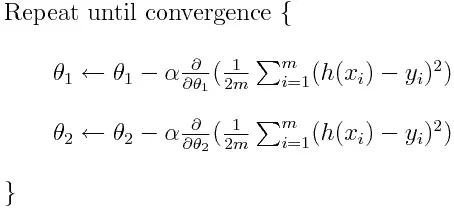
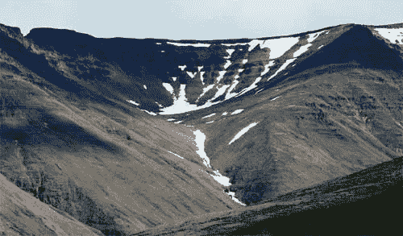
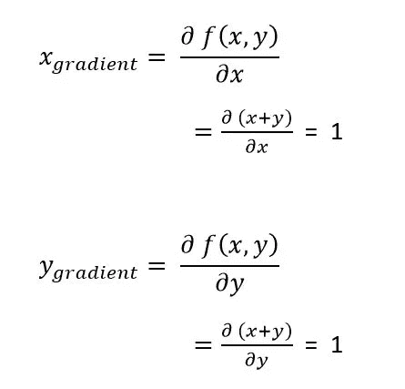
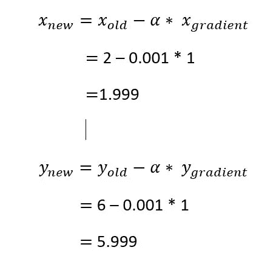

# 梯度下降——初学者指南

> 原文：<https://towardsdatascience.com/gradient-descent-a-beginners-guide-fa0b5d0a1db8?source=collection_archive---------6----------------------->

# **简介:**

最近，在我的课程中，我对整个科学领域的进步感到敬畏。在仅仅十年的时间里，我们已经彻底改变了我们看待机器能力的方式，我们构建软件的方式等等。十年前看似不可能的任务现在变得触手可及，不费吹灰之力。长话短说，我们让机器思考了！！听起来很酷，不是吗？
人工智能已经真正进入主流意识。这些天来，每个人在日常生活中都听到或读到过“机器学习”这两个神奇的词。但是我们中的任何人对人工智能到底是什么理解得有多清楚呢？虽然，让机器思考和学习的想法听起来很吸引人，而且势不可挡，对于像我这样有抱负的数据科学家来说，让我们的头脑转起来；很少有人理解或知道一些导致机器学习的基本概念。在这篇博客文章中，我只是简单地把我对最重要和最基本的技术之一的理解放在许多机器学习算法的核心——梯度下降。
任何机器学习算法最关键的部分之一就是优化。如何让自己的学习算法学得更快？梯度下降是机器学习中最有效的优化算法之一。我们很多人都非常熟悉什么是梯度下降，但当谈到理解它时，我们所有人都经历过看到可怕的数学方程和图形的过程，看起来像是

Source: Google

Source: Google

别担心，比看起来容易！

> 正如克里斯·派恩所说，“有时候你唯一能控制的就是视角。你无法控制自己的处境。但你可以选择如何看待它。”

现在，让我们换个角度来看上面的图，就像这样-

现在，为了理解梯度下降，让我们想象这条河从山顶开始的路径。梯度下降的工作正是河流的目标；到达山的最底部。现在，正如我们所知，地球上有一个重力，因此河流将继续向下流动，直到它到达山脚。在这里，我们会做一些假设，说这座山的形状将会是这样的，河流不会在任何地方停留，而是直接到达山脚。在机器学习中，这是我们渴望的理想情况，你可以说我们已经实现了我们的“全局最小值”(在这个类比中，这意味着我们已经到达了“山脚”)。).然而，在现实生活中，情况并非如此。从山的角度来看，河流在向下流动的过程中可能会遇到很多坑，水有可能被困在坑里而无法向下流动。在机器学习术语中，这被称为“局部最小值”，这对我们的任何学习算法都是有害的。梯度下降容易达到这样的局部最小值，并且不能收敛。然而，当山区地形以这样一种特殊的方式设计时，即碗形(在机器学习中，我们将这种函数称为凸函数)，那么我们保证会到达全局最小值(foothill)。现在，当谈到梯度下降时，有两个要点:初始值和学习率。为了给出一个大概的概念，我们知道，根据河流最初的源头，它会沿着不同的路径到达山麓丘陵。此外，根据河流的速度(学习速度)，你可能会以不同的方式到达山脚。这些值对于决定你是到达山脚(全局最小值)还是被困在坑里(局部最小值)很重要。

如上所述，地球引力是促使河水向下流动的主要原因之一。可悲的是，在编码/数学中，我们没有利用地球引力的杠杆作用！！因此，为了克服这一点，我们需要转向数学，需要知道两种方法来帮助我们走向山脚。我们通过计算 1)给出坡度方向的梯度和 2)计算我们的步长(即河流在特定方向上需要移动多少单位)
现在，让我们考虑梯度下降的公式:

从上面的公式来看，有两件事是我们可以自行设定的；α和ɵ.的当前位置这里我们唯一需要学习的是，如何计算梯度？为了计算一个函数对于一个点ɵ的梯度，我们必须对这个函数关于ɵ.求导一次让我们通过一个例子来理解如何做到这一点:

考虑一个函数:

f(x，y) = x + y

-我们设置 x = 2 和 y = 6 的初始值

-函数的输出是 8

-这里的问题是，如何调整输入值以减少输出？让我们从对上述函数的输入进行微分开始；x 和 y:

这些导数可以被认为是每个输入上的力，因为我们希望将输出拉得尽可能小；力告诉我们 x 和 y 想要如何改变来减少输出。

让我们看看更新规则在上面的计算中是如何工作的(假设α= 0.001)

这直觉上是有道理的！为了减少函数的输出，我们需要用一个大小为 1 的正力来调整输入 x 和 y。例如，将 x 的值从 2 更改为 1.999 将得到小于 8 的输出 7.99，同样，将 y 的值从 6 更改为 5.999 将得到小于 8 的输出 7.998！！梯度下降算法的下一个重要特征是它是一个迭代算法！意思是，我们重复上述步骤，直到收敛。

因此，如果我们重复上述过程 4000 次，我们将得到 x = -2 和 y = 2.0 的值，从而得出函数 f(x，y) = 0 的输出。所以我们得到了 x 和 y 的期望值，这使得我们的函数给出最小值 0。这是梯度下降算法背后的直觉——一种“最成功”的优化技术，是大多数机器学习算法的核心。我告诉过你，这比看起来容易，只是为了让事情变得简单，我们用了一个简单的低维例子。在现实中，我们将处理非线性、高维函数，在这些函数中不可能通过手动分析来解决任何问题。然而，这种方法在那里是完全一样的！
这有意义吗？是吗？没有吗？虽然这篇文章的目的是帮助初学者获得梯度下降背后的工作直觉，但它绝不是一个全面的概述。在那之前，保持冷静，不断创新！

最后，正如我的朋友[戈苏丁](https://www.linkedin.com/in/gosuddin-siddiqi/)所说的“吉特·k·阿恩吉！”(会赢)