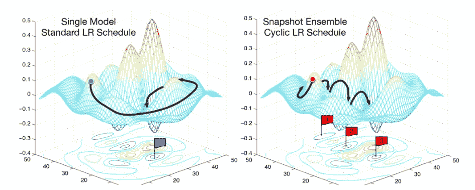

# 梯度下降和加密货币

> 原文：<https://towardsdatascience.com/gradient-descent-and-cryptocurrency-995693ddae6b?source=collection_archive---------7----------------------->

Photo by [Pierpaolo Lanfrancotti](https://unsplash.com/photos/hbJXneOzgIE?utm_source=unsplash&utm_medium=referral&utm_content=creditCopyText) on [Unsplash](https://unsplash.com/search/photos/terrain?utm_source=unsplash&utm_medium=referral&utm_content=creditCopyText)

我一直在想一个有趣的方式来谈谈我通过 fast.ai [课程](http://course.fast.ai/)学到的一些早期的东西。我几乎要用一篇快速的文章来重新开始随机梯度下降(SGD)的概念，但是我确实喜欢使用类比的文章。类比是看待一个概念的另一种方式，并进一步巩固它在你大脑中的位置。

因此，今天，我将为大家提供一个关于新加坡元的转折和对那些狂热分子来说加密货币美妙世界的一个方面之间的良好联系。

# 重启的随机梯度下降

在《走向数据科学》中有几篇关于 SGD 的很棒的文章，那些不熟悉它或需要快速回顾的人，我建议搜索并阅读这些文章。我发现这里有几个，这里有几个。

总体想法是改变你的神经网络中**权重**的值，以便达到局部**最小值**。这个最小值由一个函数定义，您的目标是**优化**。学习率是你向那个最小点移动的速度。如果你学得太快，你可能会错过最小值。如果学得太慢，解题的时间可能会太长。数据科学就是要权衡取舍。

在 fast.ai 课程中，我们很早就学习了带重启的 SGD。这种技术有助于模型在第一轮中找到最佳路径。您可以将“重启”方法视为一种在搜索空间中寻找比第一次绕行更好的路径的方法。这里有一张图片可以帮助你想象这一点。

**Fig. 1.** From [fast.ai](http://course.fast.ai/) Lesson 1

在左图中，模型正在经历一次 SGD 过程。在这一旅程中，模型找到了发挥其最大能力和约束的最佳解决方案。在右图中，重启功能通过多次运行 SGD 来利用它。如您所见，有更多的机会达到更好的局部最小值。

这种改进可能是模型中 99%和 99.5%准确性之间的差异！另外，该课程使这个功能非常容易使用，所以我建议检查一下。

现在来看看密码世界。

# 类比

你们中的一些人认为这是一个延伸的类比，但我真的很喜欢将想法融合在一起。因此，在我开车回家的路上，我一直在听这个关于一家名为 [Multicoin Capital](https://multicoin.capital/) 的公司的[播客](http://unchainedpodcast.co/multicoin-on-the-1-thing-crypto-teams-miss-in-their-quests-for-success)。他们投资于加密团队，他们有很多关于空间现状的有趣的事情要说。

提出的一个话题是他们在考察采用不同智能合同协议的公司时使用的框架。智能合约协议这几个词在这个讨论中无关紧要，所以不要太担心。他们强调了他们的论点，他们认为智能合同领域将有多个赢家，因为有几个维度可能存在**局部最大值**。他们认为，目前，世界上只有一个地方最大值是以太坊，肯定会发现更多。

为了进一步分析，想想上面的图片(或者向上滚动到它)。这一职能的地形非常崎岖不平——有很深的低谷，也有很高的顶点。在投资的情况下，目标是找到高峰(而不是当我们考虑 ML 时的局部低谷)。

因此，在他们的世界里，他们在这片奇异的土地上搜寻，试图找到那些利用不同特性和技术的公司，从而实现新的局部最优。这些投资者是“重新启动的新币”,试图通过该函数找到本地最大值(即最有机会获胜的公司)。

带重新启动的 SGD 是一种不同的方式来看待如何探索函数空间，以获得 ML 问题的最低错误。在投资领域，人们发现自己也在从事类似的事情——尽管他们寻求的是最高回报。正是通过这种反复试验，我们为自己(和我们有趣的算法)设定了最高的成功概率。

感谢阅读。