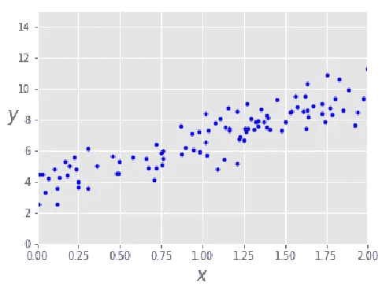
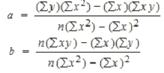
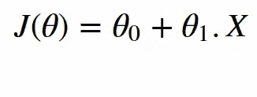
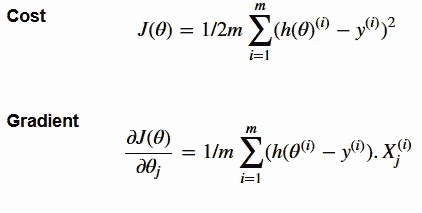
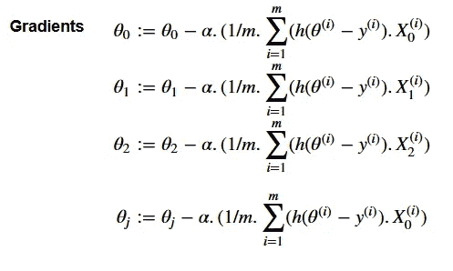
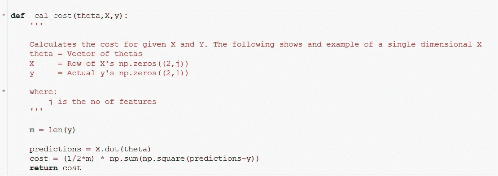
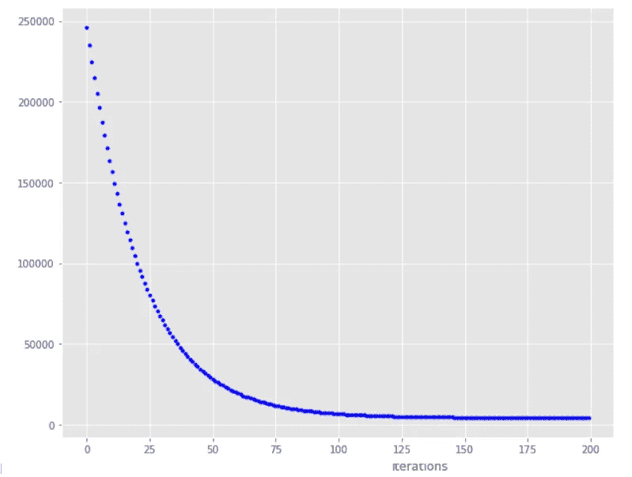
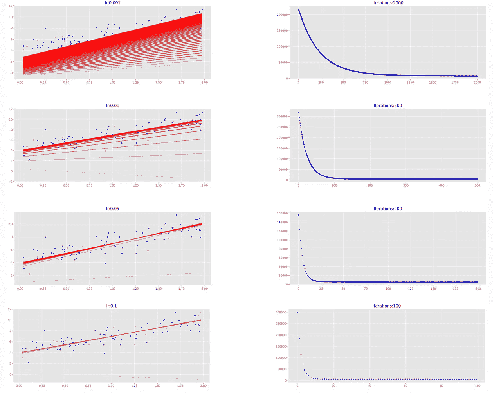
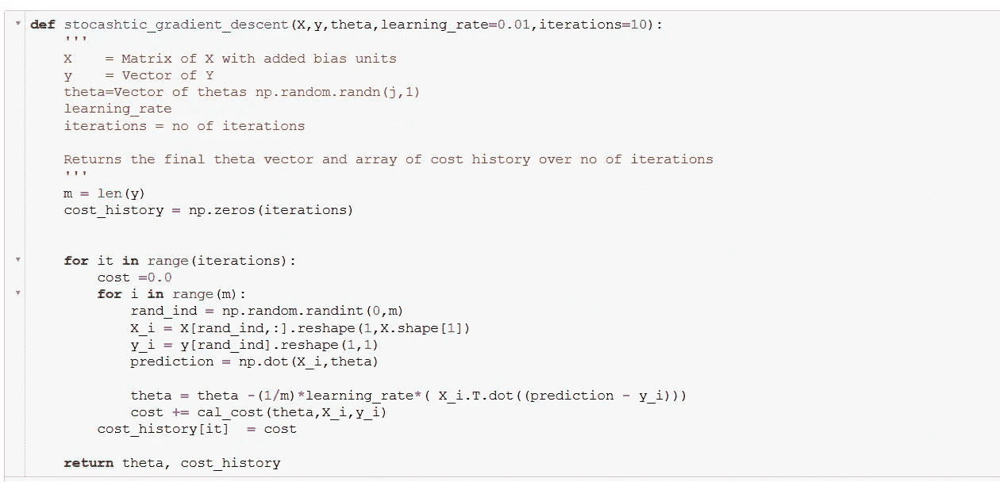

# Python 中的梯度下降

> 原文：<https://towardsdatascience.com/gradient-descent-in-python-a0d07285742f?source=collection_archive---------0----------------------->

当你冒险进入机器学习时，你学习的一个基本方面将是理解“梯度下降”。梯度下降是机器学习算法的支柱。在这篇文章中，我将尝试使用 python 代码来解释梯度下降的基本原理。一旦你掌握了梯度下降法，事情就开始变得更加清晰，并且很容易理解不同的算法。关于这个话题已经写了很多，所以它不会是一个突破性的话题。为了跟随并建立你自己的梯度下降，你需要一些基本的 python 包。要可视化的 numpy 和 matplotlib。

让我们从一些数据开始，更好的是让我们创造一些数据。我们将创建一个带有随机高斯噪声的线性数据。

> X = 2 * np.random.rand(100，1)
> y = 4+3 * X+NP . random . randn(100，1)

接下来让我们将数据可视化

很明显，Y 和 x 有很好的线性关系。这个数据非常简单，只有一个自变量 x。

你可能在大学学过，一条线可以表达为

Slope of line

然后你可以求解 b 和 m 的方程如下:

Analytical method

这就是所谓的解方程的解析方法。这没有错，但是记住机器学习是关于矩阵编程的。为了机器学习，我可以用一种不同的方式，用机器学习来表达一条直线的方程。我会称 y 为我的假设，表示为 J(θ)，称 b 为θ0，m 为θ1。我可以写出相同的等式:

Machine learning way

为了求解θ0 和θ1 的解析方法，我必须编写以下程序:

> theta _ best = NP . linalg . inv(X . t . dot(X))。点(X.T)。点(y)

请记住，我在 X 上增加了一个偏差单位，对于 X 上的每个向量都是 1，这是为了便于矩阵乘法求解θ。

你可以看到，如果 X 中的特征数量开始增加，那么 CPU/GPU 执行矩阵乘法的负载就会开始增加，如果特征数量非常大，比如有一百万个特征，那么你的计算机几乎不可能解决这个问题。这就是梯度下降的救援之处。

简单解释一下梯度下降，想象你在一座山上，被蒙上眼睛，你的任务是在没有帮助的情况下从山上下来到平地。你唯一的助手是一个能告诉你离海平面高度的小装置。你的方法是什么？你会开始向某个随机的方向下降，然后问这个小工具现在的高度是多少。如果这个小工具告诉你这个高度，并且它大于初始高度，那么你知道你开始的方向是错误的。你改变方向，重复这个过程。这样反复多次，最后你成功地下来了。

这是机器学习术语的类比:

> 向任何方向迈出的步伐=学习速度
> 
> 小工具告诉你身高=成本函数
> 
> 你脚步的方向=梯度

看起来很简单，但是从数学上来说，我们如何表示它呢？数学是这样的:

> 其中 m =观察次数

我举一个线性回归的例子。你从一个随机的θ向量开始，预测 h(θ)，然后使用上面代表均方误差(MSE)的等式推导出成本。请记住，你试图将成本降至最低，你需要知道你的下一步(或θ)。偏导数有助于找到下一次迭代的θ。

但是等等，现在我们需要计算θ0 和θ1，如何计算，如果我们有多个特征，那么我们会有多个θ。别担心，这里有一个计算θ的通用形式:

> 其中α=学习率

好了，我们都准备好写我们自己的梯度下降了，虽然一开始看起来很难，但相信我，用矩阵编程只是小菜一碟。

我们需要什么，一个计算成本的成本函数，一个计算新θ向量的梯度下降函数，就是这样，真的就是这样。

让我们从成本函数开始，代码如下:

Cost function

我会在这篇文章的最后分享我的 GitHub 要点，这样你就可以下载并运行代码，但是现在让我们理解一下成本函数。它需要θ，X 和 y，其中θ是一个向量，X 是行向量，y 是向量。你的数据通常是这样的 X 是一个行向量的矩阵，而 y 是一个向量。

记住，你不需要显式调用这个函数，我们的梯度下降方法会在内部调用它，所以让我们来看看梯度下降函数。

Gradient Descend function

它需要三个强制输入 X，y 和θ。你可以调整学习速度和迭代次数。正如我之前说过的，我们从 gradient_descent 函数调用 cal_cost。

让我们试着用梯度下降法来解决我们之前定义的问题。

我们需要找到θ0 和θ1，但是我们需要在梯度下降中传递一些θ向量。我们可以从高斯分布的θ的随机值开始，并且可以是 1000 次迭代和 0.01 的学习率。代码片段是不言自明的。

我们得到θ0 = 4.11 和θ1 = 2.899，分别非常接近于θ0 和θ1 的实际值 4 和 3。但是我们需要迭代 1000 次，用 0.01 的学习率吗？为了回答这个问题，我们需要看看成本是如何随着迭代而变化的，所以让我们针对迭代绘制 cost_history。

看这个图，很明显，在大约 180 次迭代之后，成本没有降低，这意味着我们只能使用 200 次迭代。如果我们放大图表，我们可以注意到这一点。

我们还可以注意到，成本最初下降得更快，然后下降得更慢。

你可以尝试不同的学习率和迭代组合。

如果能看到梯度下降在不同的学习速率和迭代次数下实际上是如何收敛到解的，那就太好了。如果我们能一次看到所有的东西，这将更有意义。

那么为什么要等呢让我们开始吧，让我们画出四种迭代和学习率组合的收敛和成本与迭代的图表

it_lr =[(2000，0.001)，(500，0.01)，(200，0.05)，(100，0.1)]

为了简洁起见，我没有在这里粘贴代码，而只是粘贴图表，请随时查看我的 GitHub 链接上的完整代码。

检查学习率小的情况下收敛到解需要多长时间，而学习率大的情况下收敛得更快。

需要注意的是，你的问题的实际学习速度将取决于数据，没有一个通用的公式来设置它。然而，有一些复杂的优化算法，它们以较大的学习率开始，然后随着我们接近解决方案而慢慢降低学习率，例如 Adam optimizer。

# 随机梯度下降

你可能听说过这个术语，可能想知道这是什么。理解这一点很简单，在我们的梯度下降算法中，我们对每个观测值逐个进行梯度计算，在随机梯度下降算法中，我们可以随机选择随机观测值。它被称为**随机**,因为样本是随机选择的(或混洗的),而不是作为一个单独的组(如在标准梯度下降中)或按照它们在训练集中出现的顺序。

# 小批量梯度下降

在实际操作中，我们使用一种叫做小批量梯度下降的方法。这种方法使用随机样本，但分批进行。这意味着我们不是为每个观察值计算梯度，而是为一组观察值计算梯度，这导致了更快的优化。一种简单的实现方法是混洗观察值，然后创建批次，然后使用批次进行梯度下降。

我们为线性回归实现了梯度下降，但是您也可以为逻辑回归或任何其他算法实现梯度下降。改变的是成本函数和计算梯度的方式。所以我们需要定义我们的成本函数和梯度计算。

这是对梯度下降的简化解释，但实际上你不需要写你自己的梯度下降。有许多复杂的算法可用。

这里是 GITHUB [要点](https://gist.github.com/sagarmainkar/41d135a04d7d3bc4098f0664fe20cf3c)的链接

如果你想看一个运行的例子，请查看谷歌实验室[这里](https://colab.research.google.com/gist/sagarmainkar/5cfa33898a303f895da5100472371d91/notebook.ipynb)

 [## 谷歌联合实验室

### 编辑描述

colab.research.google.com](https://colab.research.google.com/gist/sagarmainkar/5cfa33898a303f895da5100472371d91/notebook.ipynb)