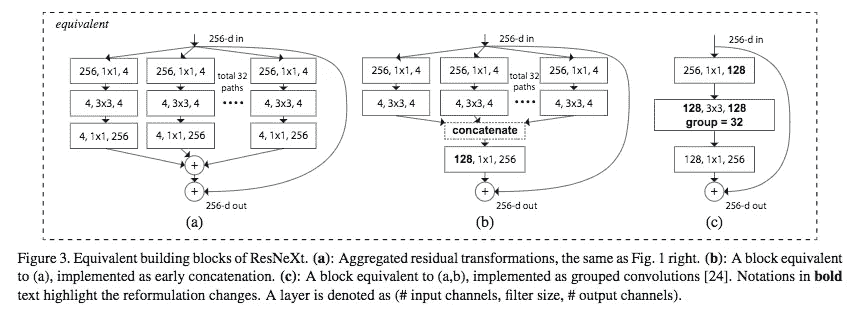

# 分组卷积—并行卷积

> 原文：<https://towardsdatascience.com/grouped-convolutions-convolutions-in-parallel-3b8cc847e851?source=collection_archive---------2----------------------->

通常，卷积滤波器被逐层应用于图像以获得最终的输出特征图。我们增加每层内核的数量来学习更多的中间特征，从而增加下一层的通道数量。但是为了了解更多的特征，我们也可以创建两个或更多的模型，并行地训练和反向传播。在同一幅图像上使用不同组卷积滤波器组的过程称为分组卷积。简而言之，创建一个具有一定数量层的深层网络，然后复制它，以便在一个图像上有不止一个卷积路径。这种分组卷积思想的第一次使用可以在 Alexnet 中看到，如下所示。

Grouped convolutions in ALexnet

Alexnet 中使用了分组卷积，以便深度神经网络可以在当时可用内存较小的功能较弱的 GPU 上进行训练。为了理解分组卷积的重要性，让我们想象一个没有分组卷积的世界，以及我们可能面临的问题:

*   我们构建每层多个内核的深度网络，从而在每层产生多个通道输出。基于我们的网络学习各种各样的低级和高级特征的希望，这将导致更宽的网络。
*   每个核滤波器对在前一层获得的所有特征图进行卷积，导致大量卷积，其中一些可能是冗余的。
*   训练更深层次的模型将是一场噩梦，因为在单个 GPU 上拟合这些模型并不容易。即使这是可能的，我们可能不得不使用较小的批量，这将使整体收敛困难。

我们可以开始看到分组卷积对于训练深度网络是多么重要。下图显示了如何理解 ResNext 体系结构中的分组卷积:

Grouped convolutions in ResNext

通过使用分组卷积，让我们逐一解决上述问题:

*   通过分组卷积，我们可以构建任意宽的网络。取一个过滤器组模块并复制它们。
*   现在，每个滤波器只对从其滤波器组中的核滤波器获得的一些特征图进行卷积，我们大大减少了获得输出特征图的计算量。当然，你可以说我们复制了过滤器组，导致了更多的计算。但是为了客观地看待问题，如果我们将所有的内核过滤器都放在分组卷积中，并且不使用分组卷积的概念，那么计算的数量将呈指数增长。
*   我们可以通过两种方式并行培训:
*   —数据并行性:我们将数据集分成块，然后在每个块上进行训练。直观上，每个块可以被理解为在小批量梯度下降中使用的小批量。块越小，我们可以从中挤出更多的数据并行性。然而，更小的组块也意味着我们在训练中更像随机而不是批量梯度下降。这将导致收敛速度变慢，有时收敛效果更差。
*   —模型并行性:在这里，我们尝试将模型并行化，以便我们可以接收尽可能多的数据。分组卷积实现了高效的模型并行，以至于 Alexnet 在只有 3GB RAM 的 GPU 上进行了训练。

Grouped convolutions’ performance nos

除了解决上述问题之外，分组卷积似乎可以更好地表示数据。本质上，不同过滤器组的内核过滤器之间的相关性通常很小，这意味着每个过滤器组正在学习数据的唯一表示。这在传统的神经网络中是不容易实现的，因为核通常是相互关联的。事实上，上图显示了增加组数对模型整体准确性的影响。最棒的是，所有的精度都来自降低的计算成本。

这篇文章的灵感来自雅尼·若安努的另一篇精彩文章，标题为[滤波器组(分组卷积)教程](https://blog.yani.io/filter-group-tutorial/)，提供了更详细的分析。