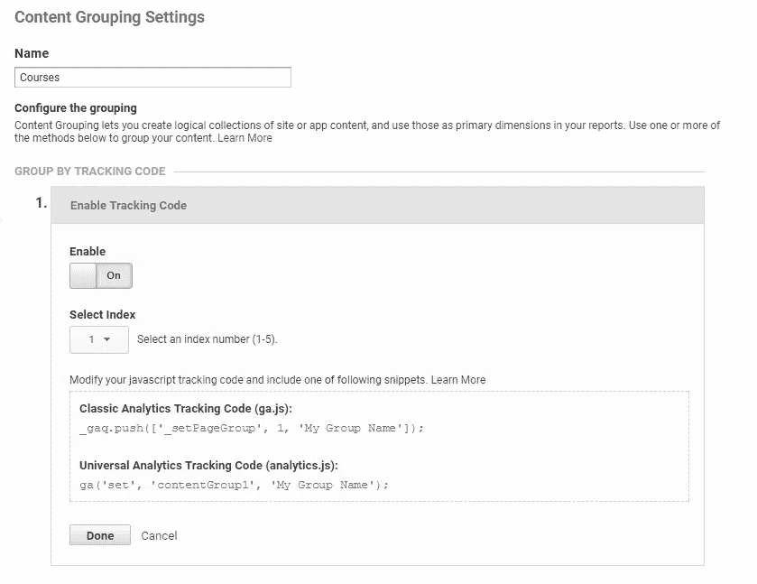
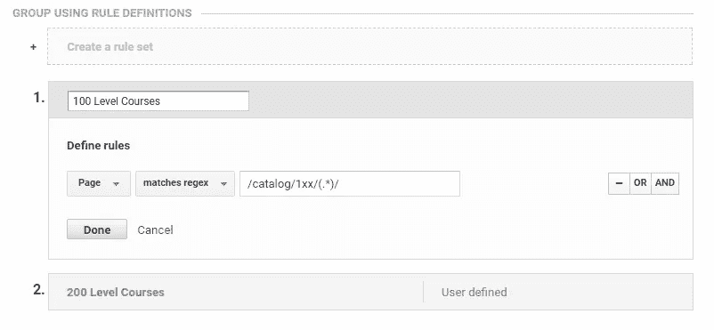
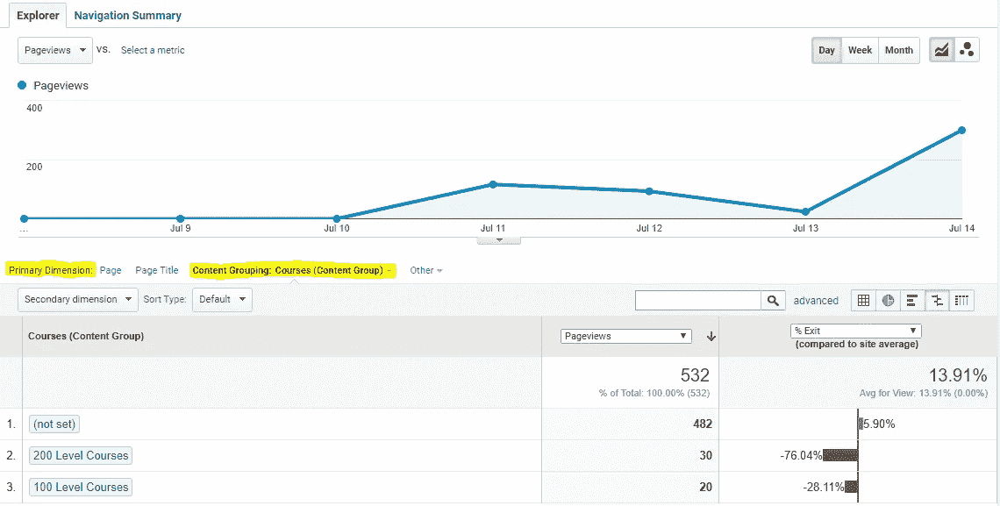

# 使用内容分组对内容进行分组

> 原文：<https://towardsdatascience.com/grouping-content-with-content-groupings-a8d01493b7a?source=collection_archive---------2----------------------->


本周，我有幸在纽约州布法罗市的 WPCampus 举办了一场关于谷歌分析的研讨会。我在会议期间演示的一个功能是使用内容分组，以便能够更好地理解作为比较单位的网站的各个部分。在与其他人交谈后，我认为有必要对这个特性和一些例子进行更深入的讨论。所以，给你！

你可能会问，什么是内容分组？这个设置非常自我描述——它是 Google Analytics 的*视图*管理中的一个功能，可以让你将网站某个部分的内容定义为属于某种类别。[谷歌的文档](https://support.google.com/analytics/answer/2853546?hl=en)使用了一个商店示例，展示了如何根据产品使用的方面命名法将产品集合分组在一起。


Initial Content Groupings Panel

我将演示的例子使用了来自我的演示站点的虚拟课程目录的课程部分级别。正如您在上面看到的，我设置了三个内容分组(其中两个我已经弃用)。类似于目标，一旦你进行了分组，你实际上就无法摆脱它。你只需要关掉它或者改变它的用途。同样值得注意的是，您最多只能有 5 个分组类别，所以如果您认为您可能会大量使用该功能，请花一些时间提前计划，以便以提供最大实用价值的方式创建顶级分组。



Making a new Content Grouping via tracking code

在 g 中创建一个*内容组就像点击*新内容分组*按钮并给它命名一样简单。这是第一步。这是您在分析报告中使用*内容分组*功能时将看到的名称。在那里，您将看到三种方法来确定将与该选择一起出现的组。第一种方法是启用跟踪代码。这意味着你告诉 Google，你将在你的站点上使用 JavaScript 代码动态地提供名称(或者你将在标签管理器中使用标签，见最后一节)。*

如果您使用跟踪代码方法，请记下适合您的分析实现的代码版本(此时最像通用分析)。您需要将它复制到页面上与您告诉 Google 的所属组相匹配的某个 JavaScript 中。所以在我的例子中，我的*内容分组*是名称*课程*，我将要使用的组名称将是 *100 级课程*和 *200 级课程*。在我的例子中，我不打算使用这种方法，但是如果我这样做了，大一学生的课程页面上的代码将看起来像这样:

```
ga('set', 'contentGroup1', '100 Level Courses');
```

创建组名的第二个选项是使用提取规则。这允许您使用 regex 来定义页面路径、页面标题或应用程序屏幕名称的一部分，以按照约定提供组名。根据我的例子给出的页面结构，看起来应该是这样的:


Using page path to determine the content group name.

这很好，也很有效，但是这意味着我的内容组名称会有点难看。在我的例子中，根据我的 URL，这些名字可能是 *1xx* 或 *2xx* 。可用，但不美观。页面标题提取可以提供更好的可读性，但是在我的例子中，页面标题不包括文本数据，这很好地满足了这个目的。值得一提的是，在这个和下一个选项中，如果与您的群组匹配的内容出现在网站的不同部分，您可以设置多个提取。这些规则将按照您列出它们的顺序应用，就像过滤器在视图上的应用一样。一旦有匹配的提取，它就停止检查。

最后一个选项是我最喜欢的，它提供了很大的灵活性，而不需要太多额外的努力。它基本上是提取选项的一个稍微高级的版本。这是*组使用的规则定义*。


My catalog rule definitions.

在这里，您可以看到我已经创建了两个组名，每个组名都基于我创建的目录的各个部分。显然，一个真正的内容分组可以有更多，但这只是一个演示案例。所以你有两个。*规则定义*基本上类似于自定义命名的*提取*，使用您提供的名称，而不是由提取产生的匹配。因此，如果我们看一个，我们会看到一个类似的匹配设置，如上例。



Rule to match all 100 level courses.

有了这些规则，Google Analytics 将开始跟踪与我的正则表达式匹配的页面，这样我就可以在我的内容报告中看到它们。这对于比较整体区域或不同类型的内容非常有用。因此，如果我想查看我的目录中不同类别的流量比较，我可以查看我的*行为>网站内容>所有页面*报告，并查看您的*主维度*的选项，您现在可以选择将*内容分组*更改为您选择的组，在我的情况下是*课程*。



Viewing a content report with content groupings enabled.

现在我可以看到，在我想象的目录中查看 200 门水平课程的用户的退出率大大高于 100 门水平课程(注意:我使用数据表正上方右侧的按钮将该报告切换到了*对比*视图)，并且远远高于其他所有课程。每当你在你的内容分组维度中看到*(未设置)*值时，这表示你的站点上的内容在*内容分组*下没有被分配任何组名。它基本上是给你一个基线，让你可以和你的团队进行比较。

考虑到这一点，你可以开始考虑将它应用到大学网站或其他地方的所有方法，将所有大区域的内容聚集在一起，在那里你有许多不同的部分，你想与他人进行比较。一些想法可能是(格式遵循内容组>组名结构):

*   学术部门>部门名称
*   学院>学院名称
*   新闻>新闻类别
*   运动>运动名称
*   学生生活>服务类型
*   事件>事件类别
*   位置>位置类型
*   专业>专业名称

这样做，如果你的物理系有 87%的退出率，你可以将它与通信系的 32%的退出率进行比较，并意识到可能是你网站的物理系出现了问题，导致人们离开。它消除了使用 Data Studio 或其他工具进行更复杂的计算或定制报告来确定这些块如何比较的需要。

我要提到的另一个技术要点是，您也可以使用 Google Tag Manager 来确定类别组名称。正如我在开始时提到的，您可以使用跟踪代码作为名称的传输机制。Simo Ahava 有一个关于如何使用标签管理器的教程。它有点旧(你现在会使用[谷歌分析设置变量](https://www.simoahava.com/analytics/google-analytics-settings-variable-in-gtm/)，但它仍然会给你一些基本的东西。


Content Groups in Google Tag Manager

他的例子使用多个标签来实现这个目的。在上面的截图中，我使用了单个 pageview 标签中的变量，它可以使用一个 [JavaScript 变量](https://support.google.com/tagmanager/answer/6106899?hl=en#web)或 [dataLayer 变量](https://www.optimizesmart.com/google-tag-manager-data-layer-explained-like-never/)来检查页面的路径，并确定它应该指向的内容组索引，以及它应该如何基于此获得名称。这减轻了您创建决定这一切的代码的责任，但这也使它成为最灵活的方法，并且比在站点模板使用的原始 JavaScript 文件中做同样的事情更容易维护。

这就是在谷歌分析中使用内容分组的优缺点。想一想你可能如何应用它们，或者在下面的评论中分享你当前的实现，让其他人看到。

*原载于 2017 年 7 月 15 日*[*fienen.com*](https://fienen.com/grouping-content-with-content-groupings/)*。*