# GSoC-2017:在 HSF 欧洲核子研究中心从事异常检测工作

> 原文：<https://towardsdatascience.com/gsoc-2017-working-on-anomaly-detection-at-cern-hsf-49766ba6a812?source=collection_archive---------4----------------------->

Error function a 200,000 points long Time-Series

今年是我第一次作为学生参加谷歌的代码之夏项目。我被 [CERN-HSF](http://hepsoftwarefoundation.org/) 组织接受，在 [ATLAS](http://atlas.cern/) 子组织下从事一个异常检测项目。这篇文章的目的是总结我在这个巨大的夏天所做的努力，包括成就和失败。

我要感谢我的导师 Mario、Alessandro 和 Tomas，他们来自 HSF 欧洲粒子物理研究所，在这段旅程中为我提供了指导。！

# **深度异常—** [**使命宣言**](https://summerofcode.withgoogle.com/projects/#4916590398144512)

ATLAS Open Analytics 是一个平台，用于收集多个参与异构计算中心之间各种计算操作生成的数据。

我与欧洲粒子物理研究所-HSF 的项目都是关于使用机器学习来识别这个时间序列数据中的异常。

其想法是设计、构建和部署一个框架，该框架能够对这种实时 ATLAS 分布式计算数据中的异常行为进行监控、分类和聚类，然后根据这些信息自主采取行动。

**目标**

建立一个自动管道来触发异常，然后分析它们以预测其根本原因以及一些潜在的解决方案。

这个想法是让系统从历史和实时数据中学习，并对这种异常事件做出准确的预测。

# 数据探索

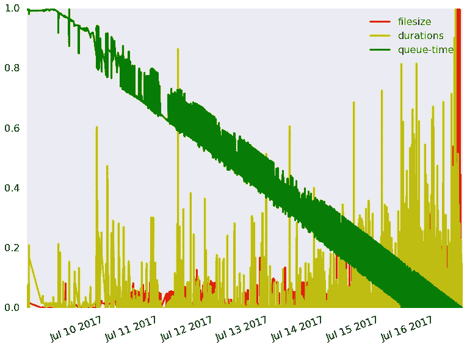

Recurring Trends for “transfer-done” events within a single day’s index

大多数 ADC 数据存储在两个不同的 [ElasticSearch](https://www.elastic.co/products/elasticsearch) 实例中。对于像我这样不熟悉这个非常棒的工具的人来说，ElasticSearch 是一个分布式的 RESTful 搜索和分析引擎。ElasticSearch 最棒的地方在于它非常快，几乎是实时的。它允许你以一种非常方便的方式存储、索引和分发你的数据。结合一些真正灵活和直观的可视化工具，如 Kibana，它变得非常有吸引力，特别是如果你有大量的数据。

我个人使用 python 的两个 elasticsearch 库来处理 elasticsearch 实例: [elasticsearch-py](https://elasticsearch-py.readthedocs.io/) 和 [elasticsearch-dsl](https://elasticsearch-py.readthedocs.io/) 。

在任何给定的时间点，CERN ES 主实例包含 31 个" **atlas-rucio-events-*** "索引，过去 31 天中的每一天都有一个索引。由于可获得的数据确实非常庞大且种类繁多，我的导师 Mario 建议我只从这些“ **atlas-rucio-events** ”指数中的“ **transfer-done** ”事件开始。

我首先查询“transfer-done”类型的事件，并将它们保存到本地数据帧中。**通常，每个索引包含 1，000，000–2，000，000 个此类事件，每个此类事件有 26 个子字段，包含有关特定传输的各种信息，如其来源、目的地、正在传输的文件大小等。**

这是我对数据的第一次观察，下面是我在探索和提取数据时绘制的一些重要图表

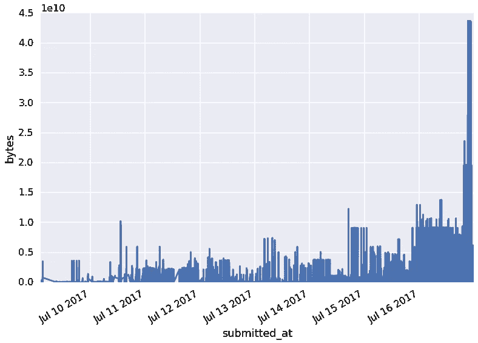

File sizes for transfers in bytes

Actual durations for the transfers to finish(not including the time spent in queue)

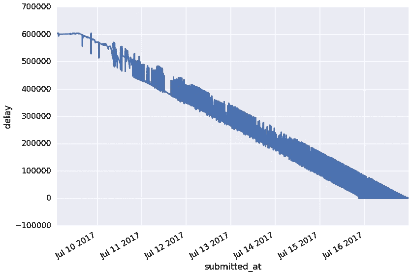

Time that a file spent in queue before it actually got transferred

有些文件排了整整一周的队是很常见的！！(1 周~=600000 秒)

除了这些连续变量，还有很多分类变量需要我去处理。下面是一些直方图，描述了它们在单个索引中的分布频率:

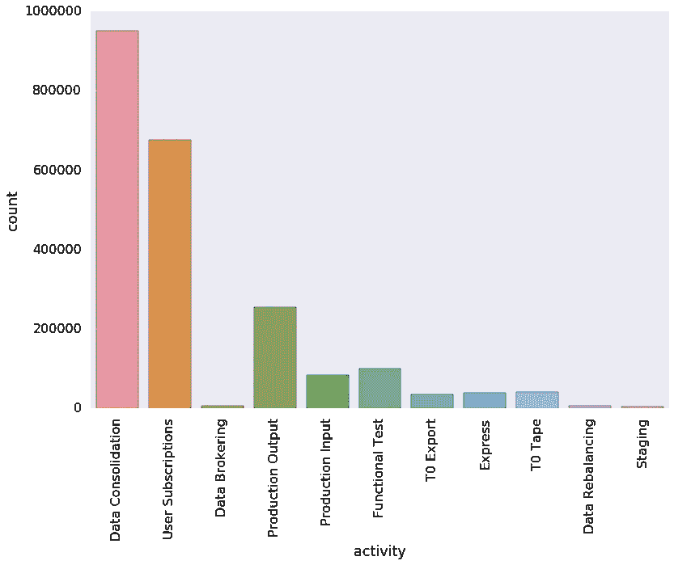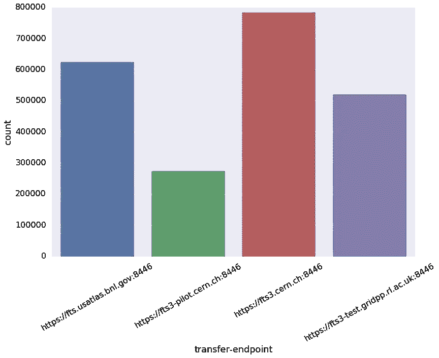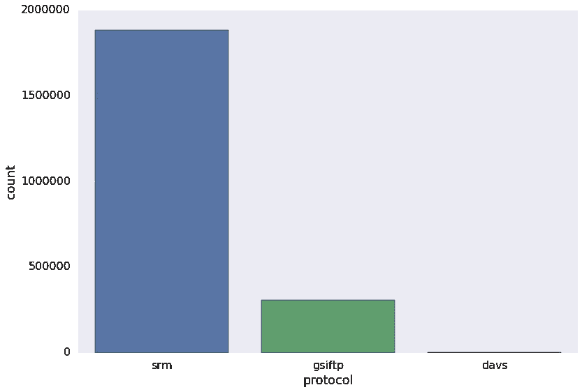

在不冒任何风险的情况下，我选择了所有可以有意义地解析为任何模型的输入的变量，这些变量可能对决定转移的持续时间有影响。我总共得出了 10 个变量，它们将作为我未来模型的训练数据。

# 用于异常检测的机器学习

在理解了数据中不同变量的实际含义后，我开始实际识别这些转移中的异常。直到现在，我都不知道“大海捞针”到底意味着什么。

作为我的社区结合期的一部分，我对特定于时间序列数据的 ML 算法做了相当多的研究。科学家在各种研究论文和文章中使用的大多数模型都采用了某种“监督学习方法”来解决这样的问题。但这里的情况略有不同。在这些巨大的转会事件数据框架中，没有标签将异常转会与正常转会分开。无人监管的方法可能是前进的方向，我在我最初的提案中也提到过这一点。

# ML 型号的选择:

## 神经网络

对我来说，我们正在做的一件事是，有数百万个数据点可供我训练机器学习模型！！我还被可靠地告知，发生异常的**百分比非常低，大约为 1 / 1000** 。有了这些知识，我开始在 Keras 中实现各种前馈架构，试图预测特定传输的传输持续时间，并取得不同的成功。

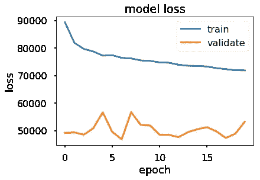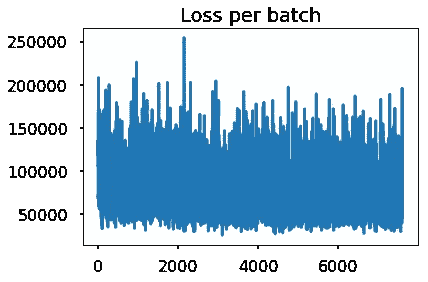

我尝试过的几乎所有前馈架构，更深、更广、不同/高级激活……都表现出了相似的性能。该模型学习了一段时间，然后稳定在一个不太好的水平上。我尝试了不同的缩放选项，看看是否有什么不同，但没有任何明显的改善。

# 递归神经网络-长短期记忆网络

在前馈网络上做了一些实验后，我终于到达了 RNNs。鉴于我的数据的时间序列性质，它们是我最理想的选择，我对它们持乐观态度。

我从简单的 LSTM 网络和一个 LSTM 开始，并开始训练他们在 10 个事件上的时间转移步骤。它们比以前的架构稍微好一点，但也好不了多少。经过与多个堆叠层、每层更多的 lstm/GRU 单元以及用数据训练网络(其中每个数据点都追溯到其历史)的争论，我最终得出了以下架构:

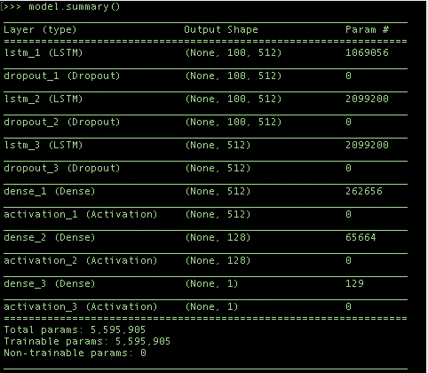

**该模型以 100 个事件的时间步长为输入，即，为了预测每个单次转移的持续时间，它考虑了该转移的详细信息+在该转移之前的 99 次转移的详细信息。这些传输中的每一个都有 9 个输入—文件大小、队列中的时间、源、目的地、活动、协议、传输端点、src 类型、dst 类型。**

对于 dim (100，9)的输入，网络输出单个值(输入中第 100 次传输的传输持续时间)。我们在数百万个这样的事件的数据集上训练这个网络，并且每个事件的迭代不超过 2 次。这样做是为了确保模型不会学习映射数据集中的任何异常事件。以下是对 200，000 次前所未见的传输进行评估后的网络性能图:

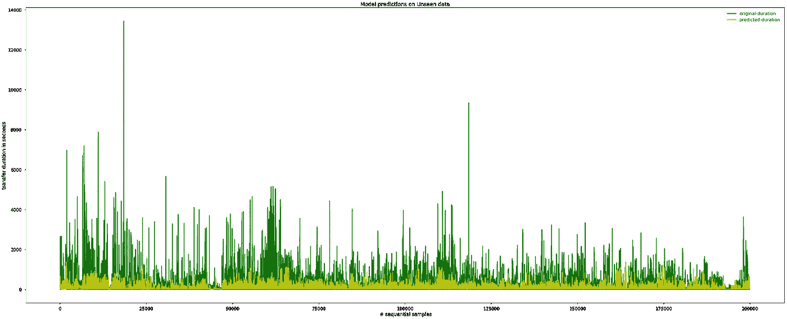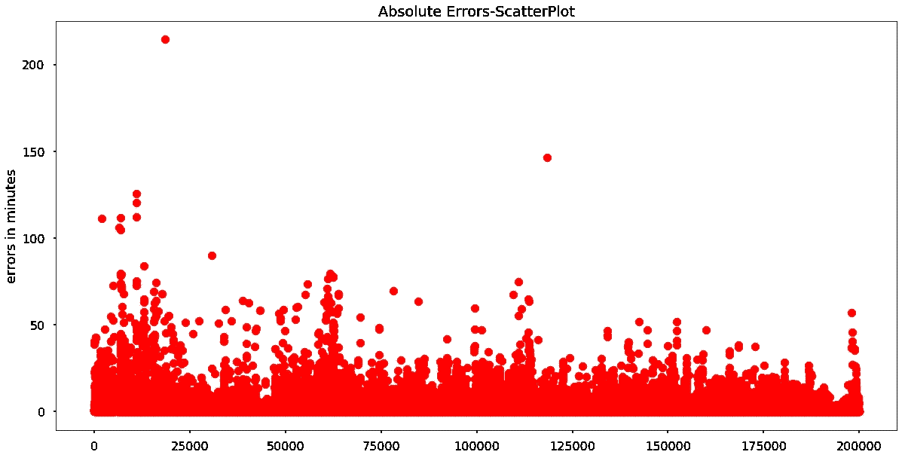

error distribution

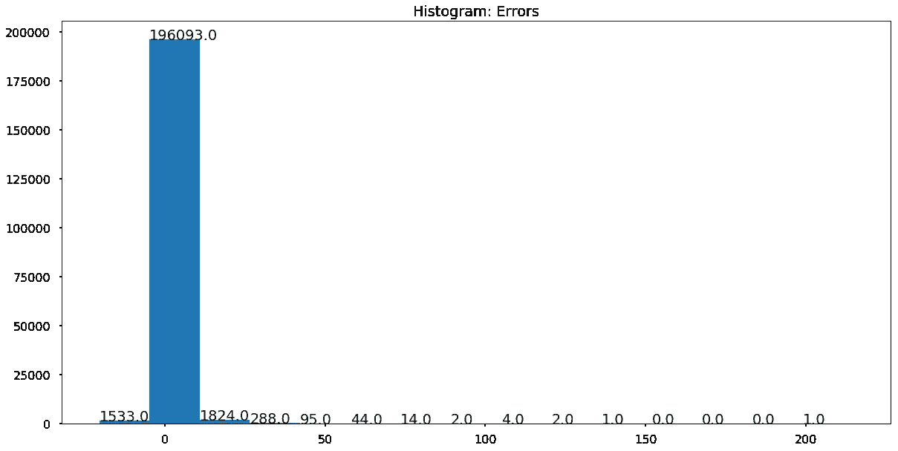

这是迄今为止我得到的性能最好的型号。

## 使用的阈值:

*   为了区分异常和正常事件，我使用了 600 秒的阈值。实际传输持续时间比预测时间长 600 秒以上的传输事件被标记为异常。

# 分析检测到的异常

在构建了检测异常的网络之后，下一步是验证它们并确定它们的根本原因。这被证明是相当具有挑战性的，因为检测到的异常数量仍然太大。正是在这个时候，我开始与托马斯合作。由于没有潜在的资源来实际验证检测到的异常，调查其原因更加困难。

correlation plot b/w predicted and actual durations

经过一段时间的探索、研究我的结果以及与托马斯的多次讨论，我们得出了以下结论:

*   我需要一个**更好的标签标准来标记异常事件**；比单个错误阈值更强大的东西。
*   发现的**异常数量需要降低到一个更易于管理的数量**。

# 使用“性能声纳”数据

这个项目的最终目的是修复导致系统中检测到的异常的问题。这只能通过**修复发生传输异常的特定源-目的地链路**来完成。

**欧洲核子研究中心有一个系统，它测量关于这种源-目的地对链路性能的一些核心统计数据。这些统计数据包括“吞吐量”、“延迟”和“数据包丢失率”等信息**。我相信这些数据可以作为一个更好的异常触发系统的基础，用于检测基于 LSTM 模型预测的异常。

比如说-

*   在具有异常高的分组丢失率的 src-dst 链路上传输的、与预测传输持续时间具有高偏差值的传输事件更有可能是异常。
*   类似地，吞吐量度量可用于对通过同一 src-dst 链路传输的异常进行分组。

这就是我的努力所达到的状态。写这篇文章的时候，我还在纠结性能声纳数据。道路是艰难的，但我相信我的工作已经成功地证明了检测和修复异常的系统肯定是可行的。

## 失败和缺点:

这个项目是我第一次体验专业编码。我从未参与过如此规模、如此复杂的项目。尽管我为自己取得的进步感到自豪，但直到现在，我发现自己还存在一些不足:

*   实现一个实时触发器——这样做的目的是同时提取实时索引的数据，对其进行预处理，在模型中运行，并检测其中的异常。由于我缺乏使用多任务脚本的经验，我无法成功实现它。
*   当前模型有时不能捕捉具有较大传输大小的一些非异常传输的高尖峰。

虽然我的正式工作期间，我想继续这个项目的工作，并看到它通过它的完成和部署！！

Git 仓库— [深度异常](https://github.com/vyomshm/DeepAnomaly)