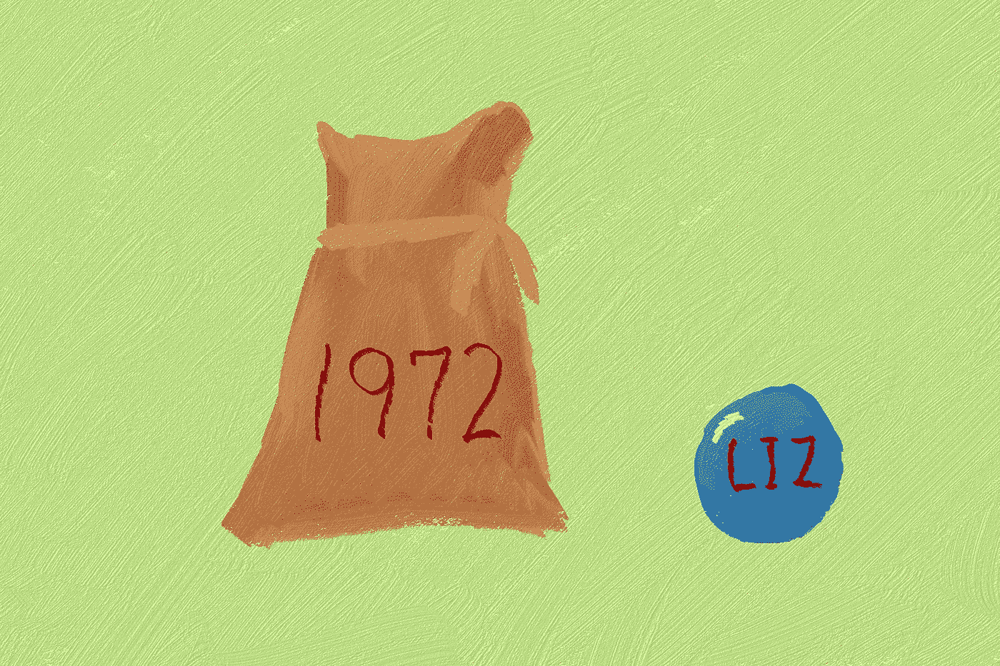

# 用 R 从婴儿的名字中猜出你出生的年份

> 原文：<https://towardsdatascience.com/guessing-the-year-you-were-born-from-baby-names-using-r-17c8cbb8d0a5?source=collection_archive---------12----------------------->

## 一个简单的问题展示了数据科学的痛苦

最近，推特上流传着一篇关于“希瑟”这个名字兴衰的文章在 20 世纪 70 年代和 80 年代，希瑟是一个非常受欢迎的婴儿名字，但这个名字很快就变得模糊不清了。 [JD Long](https://twitter.com/CMastication) ，一位在保险行业工作的著名数据科学家，发了一条关于此事的推文:

读了这条推文，以及数据科学家[珍妮·汤普森](https://twitter.com/jent103)的回应，让我想知道当时我认为是一个简单的问题:

> 哪一组四个婴儿名字最能代表你出生的年份？

在 JD 的例子中，他认为他出生年份的四个婴儿名字是 Chad、Clay、Jennifer 和 Lori。对于生于 80 年代中期的我来说，我猜我出生年份的四个名字是马修、迈克尔、劳拉和伊丽莎白。但是什么才是最好的名字呢？我们如何用数据来展示它呢？

这类问题正是数据科学家一直在处理的。当你读它的时候，它听起来像是一个你能很快回答的非常精确的问题。一旦你开始思考这个问题，它就变得很难理解。很快你就会意识到，你处理问题的方式会极大地改变答案，而且没有唯一正确的方法。最后，我尝试了三种不同的方法来解决这个问题，得到了一些有趣而独特的结果。

## 尝试 1:使用统计上最有可能来自该年的名字。

对我来说,“最能表明”这个词的意思是，如果你告诉某人这四个名字，他们就会知道你出生的确切年份。这个定义启发了我把它变成一个统计问题的第一种方法:如果从一年中随机抽取四个名字，那么这四个名字最有可能是从这一年中抽取的？

换句话说，假设我有一堆粗麻布袋子，每个袋子上都写着一年。在每个袋子里，我都有一些大理石，上面写着那一年出生的每个人的名字。如果我在袋子里选了四颗弹珠，然后递给你，我应该选哪四颗，让你猜猜是哪一年？



This is a super weird metaphor but like, aren’t most statistical and combinatorial framings?

从贝叶斯定理开始的一点点数学，原来我们想找到最大化的四个名字: *P(name|year)/P(name)* 。或者取我们关心的年份拉名字的概率，除以跨所有年份拉名字的概率(我假设年份的概率相等)。

让我们在 R 里做这个！谢天谢地，哈德利·威克姆利用政府数据制作了一个婴儿名字分析包。不幸的是，这只是使用了美国的数据，没有办法将结果推广到其他国家。首先，让我们加载我们需要的库:

```
library(babynames) # to get the baby name data
library(dplyr)
library(tidyr)
library(ggplot2)
```

babynames 包包含一个数据集`babynames`，其中有一行是每年、婴儿姓名和出生时分配的性别(错误地标记为“性别”)。它记录了这个名字出现的次数，以及那一年出生的婴儿中使用这个名字和性别的百分比。只包括一年中至少出现五次的姓名和性别对。

```
> babynames
# A tibble: 1,858,689 x 5
    year sex   name          n   prop
   <dbl> <chr> <chr>     <int>  <dbl>
 1  1880 F     Mary       7065 0.0724
 2  1880 F     Anna       2604 0.0267
 3  1880 F     Emma       2003 0.0205
 4  1880 F     Elizabeth  1939 0.0199
```

首先，让我们计算总概率，作为每个名字分数的分子。以下代码创建了一个数据框，其中为每个分配的性别和姓名对各占一行:

```
total_props <-
  babynames %>%
  complete(year,nesting(sex,name),fill=list(n=0,prop=0)) %>%
  group_by(sex,name) %>%
  summarize(total_prop = mean(prop)) %>%
  ungroup()
```

代码获取表`babynames`，用 0 填充缺失的行，然后获取每个名字和指定性别对的平均概率。

然后，我们计算一年中每个名字和指定性别的概率，并将其加入到前面的表中。我们计算这个比率，看看每年的前四名:

```
most_informative_ratio <-
  babynames %>%
  inner_join(total_props,by=c("sex","name")) %>%
  mutate(value = prop/total_prop) %>%
  group_by(year) %>%
  filter(row_number(desc(value)) <= 4) %>%
  ungroup() %>%
  arrange(year,desc(value))
```

我们来看结果！以下是 1980 年最具参考价值的名字:

```
> most_informative_ratio %>% filter(year == 1980)
# A tibble: 4 x 7
   year sex   name           n       prop   total_prop value
  <dbl> <chr> <chr>      <int>      <dbl>        <dbl> <dbl>
1  1980 F     Nykeba        26 0.0000146  0.000000107    136
2  1980 F     Sumeka        14 0.00000786 0.0000000578   136
3  1980 F     Renorda       11 0.00000618 0.0000000454   136
4  1980 F     Shanndolyn    11 0.00000618 0.0000000454   136
```

这些是什么鬼名字！？雷诺达？Shanndolyn？原来这四个名字*只在 1980 年*的数据中出现过。所以这些名字非常晦涩，很少使用。因此，如果我说表示 1980 年生日的四个名字是“Nykeba、Sumeka、Renorda 和 Shanndolyn”，那么是的，这些名字只在 1980 年使用，因此我表示年份。然而，这个问题隐含着这样一个假设:与我交谈的人以前听过这些名字*。*我对这个问题的统计公式没有考虑到一些从未说过但确实有必要的东西。因此，如果我们想考虑到与你交谈的人必须听说过这些名字，我们需要一种新的方法

## 尝试 2:用高于平均水平的名字来表示年份。

第一次尝试的问题是它没有考虑名字的受欢迎程度，只考虑了名字的信息力量。使用名字的平均受欢迎程度和一年内的受欢迎程度的想法似乎仍然有希望，那么如果我们把它改为两个数字之间的差异会怎么样呢？

这给出了公式二:在给定的一年中，哪一组四个名字的使用从它们的平均值增加最多？因此，如果多年平均下来，男性迈克尔斯的可能性是 1%，如果在某一年，男性迈克尔斯是儿童的 5%，那么我们会给出 4%的值？哪些名字的价值最高？

所以再次使用之前的总概率表，让我们计算一个新的最具信息量的表。现在的值是当年的概率和总概率之差。

```
most_informative_diff <-
  babynames %>%
  inner_join(total_props,by=c("sex","name")) %>%
  mutate(value = prop - total_prop) %>%
  group_by(year) %>%
  filter(row_number(desc(value)) <= 4) %>%
  ungroup() %>%
  arrange(year,desc(value))
```

让我们看看 1980 年的表格:

```
> most_informative_diff %>% filter(year == 1980)
# A tibble: 4 x 7
   year sex   name            n   prop total_prop  value
  <dbl> <chr> <chr>       <int>  <dbl>      <dbl>  <dbl>
1  1980 F     Jennifer    58381 0.0328    0.00609 0.0267
2  1980 M     Jason       48173 0.0260    0.00413 0.0218
3  1980 M     Michael     68673 0.0370    0.0178  0.0192
4  1980 M     Christopher 49088 0.0265    0.00785 0.0186
```

太好了！这些看起来像 1980 年的流行名字！如果你看看不同的年份，这些名字似乎与当时流行的名字一致。不幸的是，现在这些年往往会混在一起。让我们看看 1978-1982 这四个名字。在这里，我添加了姓名在年份中的排名，并创建了一个`name_gender`变量来制作表格。我使用 tidyr spread 函数，这样我们可以一次看到所有这些数据

```
most_informative_diff %>%
  group_by(year) %>%
  mutate(rank = paste0("rank_",row_number())) %>%
  ungroup() %>%
  mutate(name_gender = paste0(name,"-",sex)) %>%
  select(year,rank,name_gender) %>%
  spread(rank,name_gender) %>%
  filter(year >= 1978, year <= 1982)
```

结果是:

```
# A tibble: 5 x 5
   year rank_1     rank_2        rank_3        rank_4       
  <dbl> <chr>      <chr>         <chr>         <chr>        
1  1978 Jennifer-F Jason-M       Michael-M     Christopher-M
2  1979 Jennifer-F Jason-M       Christopher-M Michael-M    
3  1980 Jennifer-F Jason-M       Michael-M     Christopher-M
4  1981 Jennifer-F Jessica-F     Michael-M     Christopher-M
5  1982 Jennifer-F Christopher-M Jessica-F     Michael-M
```

如果你看一下，五年间名字的唯一区别是杰森在 1981 年被杰西卡取代。*这对我们用名字猜测年份的目标来说并不太好。*这是 1980 年以来这四个名字出现的概率图。您可以看到，虽然它们都在那段时间达到峰值，但也有相当数量的其他年份处于高位:

```
most_informative_diff %>%
  filter(year == 1980) %>%
  semi_join(babynames, ., by = c("name","sex")) %>%
  mutate(name_gender = paste0(name,"-",sex)) %>%
  ggplot(aes(x=year,y=prop,group=name_gender, color = name_gender))+
  geom_line(size=3) +
  theme_minimal(20)+
  labs(x="Birth year",y="Probability",color = "Name and assigned gender")
```


## 尝试 3:去他妈的，让我们做一个很酷的交互可视化来让人们惊叹。

虽然我可以多花十个小时来精确地找出这个问题的最佳统计框架，但我想尝试一些不同的东西。如果目标是从数据中传达一些意义，通常最好是制作一些有趣的东西，让人们对此进行更深入的思考。有时你只是有喜欢玩东西的业务主管。无论你的情况如何，交互式可视化都是很棒的。

我决定用 R 包 shiny 创建一个随机样本教室。这是一个很好的方法来看看如果你出生在某一年，你周围的人的名字会是什么样的。它传达了流行的名字，加上不流行的是什么样的。 [**自己试试吧！**](https://skyetetra.shinyapps.io/my-classroom/) 如果你想玩很短的代码，[在 GitHub](https://gist.github.com/jnolis/79bb88a0424322d8cd867ad5710c31dc) 上有。

[](https://skyetetra.shinyapps.io/my-classroom/)

The my-classroom tool showing a class from the year 2000\. You can tell the year by the three Jacobs and two Alex…es(?). Click the picture to try it for yourself!

这个小项目极大地提醒了我，简单的问题可能不容易用数据科学来解决。即使你在一个表格中拥有了你可能需要的所有数据，想出一个将问题转化为分析的方法也可能是一个阻碍。虽然这是一个有趣的小项目，但同样的事情也可能发生在诸如“哪些客户拥有最高的保留率？”或者“本季度我们生产了多少产品？”在这种情况下，你能为自己和同事做的最好的事情就是，在花费大量时间进行交互式可视化之前，立即解决问题的框架，并获得认同。