# 机器学习工作流的 GUI 化:快速发现可行的流水线

> 原文：<https://towardsdatascience.com/gui-fying-the-machine-learning-workflow-towards-rapid-discovery-of-viable-pipelines-cab2552c909f?source=collection_archive---------3----------------------->


# 前言

软件开发的一个原则是尽可能自动化。这就是 DevOps 的思维模式，在这种模式下，致力于自动化有助于团队不断地推出特性，同时确保最佳实践得到尊重。当团队优先考虑自动化时，他们的开发人员关注的是为产品带来新特性所需的最少代码。这对现实世界的软件项目有 3 大好处:

*   代码库中少了人类**错误**；
*   **发展更快**；
*   更多**变异**。

虽然前两点是显而易见的，但最后一点却不太受重视。变化随着自动化而增加，因为当需要编写的代码更少时，尝试更容易。在产品发现的早期阶段，变化是一个关键因素。通过尝试更多的选项，我们减少了对前期假设的依赖，转而探索可能结果的空间。

传统软件(没有机器学习)选项很多。无论是添加按钮，创建登录屏幕，还是连接警报，传统软件都有大量选项可供选择。如果可以用计算机代码来表达，这是可以做到的。

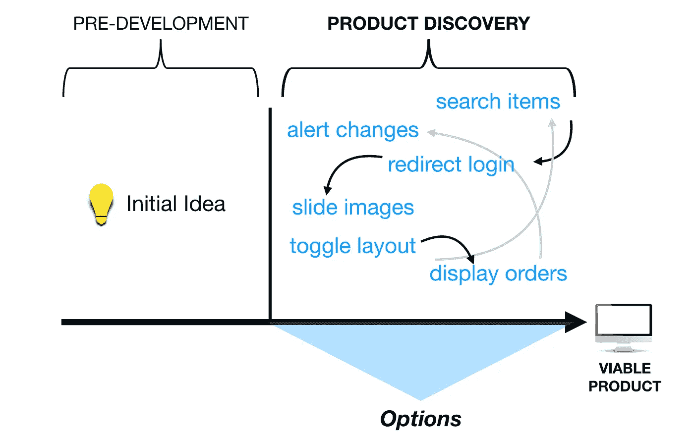

**Figure 1** With traditional software, product discovery operates under the assumption all features are options.

但是机器学习产品没有这样的保证。有了机器学习，产品特征不再是选项，而是可能性。只有当我们确认正确的数据存在时，我们才能称之为一种可能性。

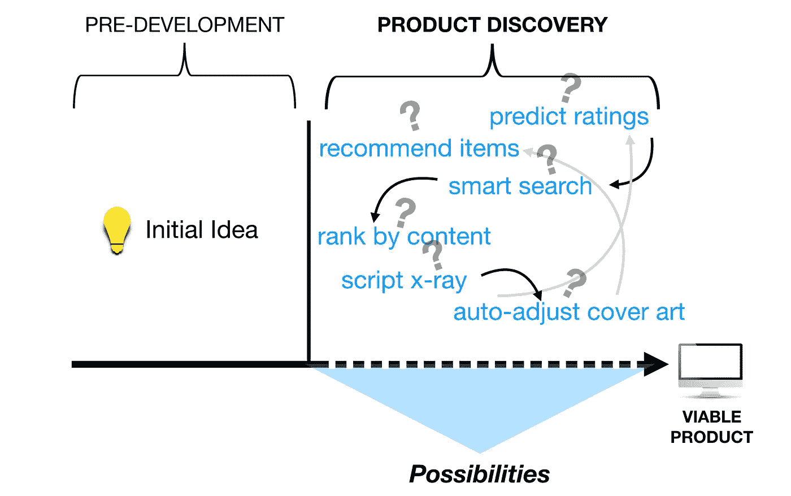

**Figure 2** Machine learning software cannot enter product discovery until it has been determined which product features are actual options.

这对产品发现有影响。产品发现假设选项是给定的；挑战在于发现这些选项中的哪一个会带来最好的产品。但是在机器学习中，我们不能开始这个过程，除非我们已经暴露了哪些选项是可用的，给定了数据。

> 有了机器学习，产品功能只有在数据允许的情况下才是可能的。

传统软件在“产品发现”期间开始发现过程*，而机器学习应用依赖于该过程*之前的发现*。这意味着自动化的变化方面，促进发现，必须在开发开始之前发生。换句话说，*自动化必须发生在机器学习工作流程*中。*

## 工作流与管道

数据科学家通过**机器学习工作流程**探索数据并验证模型，如下所示:


**Figure 3** The Machine Learning Workflow

这是一个反复的过程，包括收集可用数据、清理/准备这些数据、构建模型、验证预测和部署结果。这导致了需要*做出关于什么进入数据管道*的战略决策的那种发现。**数据管道**是上述“扁平”布局的工作流程，负责将上述工作流程迭代中发现的最佳部分投入生产:


**Figure 4** The Data Pipeline

尽管数据管道受益于传统软件中的自动化类型(测试、持续集成、构建、持续部署)，但机器学习工作流需要不同类型的自动化。

## 我们如何自动化机器学习工作流程？

这个问题看似显而易见的答案是，某个库尝试了许多不同的模型，并自动验证哪一个模型导致最高的准确性。这些库是存在的，比如[谷歌的 AutoML](https://cloud.google.com/automl/) ， [auto-sklearn](https://automl.github.io/auto-sklearn/stable/) ， [tpot](https://github.com/EpistasisLab/tpot) ， [MLBox](https://github.com/AxeldeRomblay/MLBox) ，还有很多[其他](https://github.com/topics/automated-machine-learning)。虽然这些努力有助于减少找到像样的模型所花的时间，但他们认为有产品价值的模型可以通过最少的人工干预来获得。这大大简化了将原始数据转化为真正可行的机器学习产品的过程。

机器学习实践者转动多个旋钮(超参数)来帮助推动学习算法走向更好的结果。我们最好的数据科学家称这一过程为艺术的原因是，知道转动什么旋钮，以及转动多少，是无法编纂的。它包括经验、与领域专家的交谈，以及最重要的*试错*。

可能结果的空间来自数据属性、模型和参数的复杂交互。真正自动化的机器学习将不得不做比旋转旋钮更多的事情，直到达到一定的准确度。它必须改变数据量，尝试各种数据集，尝试多种数据准备，设计新功能，运行验证指标的 gammit，并在不同的环境中部署结果；更不用说将特定领域的知识融入到这些步骤中了。

这代表了一种“组合爆炸”数据，科学家在寻找建立可行的机器学习产品时必须控制这种数据。

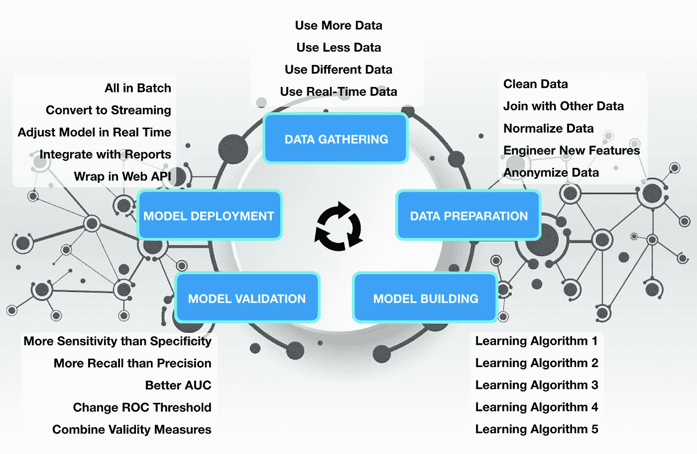

**Figure 5** The right mix of tasks to effectively convert raw data to product-worthy outputs exists in a space of near-infinite possibilities.

> 有效地将原始数据转换为有价值的产品的正确任务组合存在于一个几乎无限可能的空间中。

经验丰富的数据科学家的标志是他们能够通过缩小可能的组合来控制这种复杂性。通过探索和推理，数据科学家将统计技术与经验结合起来，开辟出一条从无数可能性到少数可行选项的道路。

要真正实现机器学习工作流程的自动化，我们需要的不仅仅是自动化的旋钮转动。我们需要能够执行各种常见的机器学习任务，同时仍然允许人类干预，以探索和推理数据告诉我们的东西。

我认为这种自动化只有通过机器学习工作流程的 GUI 化才有可能。GUI 化就是通过图形用户界面来展示功能。当从业者按下按钮执行普通任务时，这使他们能够快速尝试许多选项，导致发现可行管道所需的大量变化。

这为数据科学提供了一个更加*完整的*devo PS 理念。虽然我们的管道需要传统的测试和构建实践，但我们也需要工作流程阶段的自动化，因此产品发现可以从一组可行的机器学习选项开始。

将机器学习工作流程图形化似乎太具挑战性了。毕竟，每当我们在机器学习任务中指向一个新的数据集时，事情似乎都会发生变化。但是理解事情出错时的场景正是我们走向自动化的方式。我认为自动化是经验丰富的从业者的*责任*。作为最终的抽象，自动化确保我们的工作只关注挑战中的新事物。当我们能够快速探索可能性的空间时，我们就能提高数据密集型项目的投资回报率。

> 自动化是经验丰富的从业者的责任。

随着时间的推移，GUI 化会在机器学习工作流程的每个步骤中产生一组健壮的机器学习能力。最终，这种能力可以作为**服务**公开，其目的是使团队能够在构思的早期阶段快速评估组织/客户的数据状态。

随着团队继续从事项目，他们会增加这些服务，公开更多的机器学习功能，并在寻求构建机器学习产品时更快地发现存在的选项。


**Figure 6** Using a GUI-Service for machine learning. This enables rapid assessment of an organization’s data, laying the foundation for better product discovery.

值得注意的是，GUI 化并不意味着取代手工编码。当我们必须改进从数据中提取价值的过程时，没有什么可以替代深入研究代码。但是编码永远不应该是我们对数据集的第一次尝试。这样做是抽象的失败，自动化的失败，并不代表构建机器学习产品的精益方法。我们应该只在没有遇到问题的时候接触代码。

> 我们应该只在没有遇到问题的时候接触代码。

# 为机器学习构建 GUI 服务

机器学习工作流程的 GUI 化有两个部分。在**后端**上，我们需要将机器学习功能公开为 REST 服务，因此可以使用前端调用常见任务。在**前端**，我们需要轻松地可视化和管理我们选择运行的任务之间的数据流。

我将列出重要的要求，然后讨论每一点:

## 技术要求

*   公开*R 和 Python 的功能；*
*   允许在不重新启动服务的情况下更改代码；
*   允许适当的代码组织和版本控制；
*   间歇数据应可由 R 和 Python 访问；
*   利用本地 R 和 Python 可视化；
*   r 和 Python 应该是分开的服务；
*   自动跟踪和管理数据依赖关系；
*   请等到后端完成处理后，再在前端显示结果。

## **讨论**

**公开 R 和 Python 的功能**:我认为同时支持*R 和 Python 是很重要的。这是因为正如本文开头所讨论的，变化是关键。当我们从语言中抽象出来时，唯一重要的是*能力*，允许机器学习的全部广度和深度用于应对我们的挑战。*


**允许在不重启服务的情况下更改代码**:数据科学依赖于 REPL 式的环境，当我们更改代码时，这些环境会显示结果。如果我们的服务包含在 Docker 运行时中，我们将不得不重新构建/运行映像来显示新的变化。另一个选择是 Jupyter 笔记本，它支持 REPL 风格的编码，*和*可以使用 [Jupyter 内核网关](/learn-to-build-machine-learning-services-prototype-real-applications-and-deploy-your-work-to-aa97b2b09e0c)公开为 REST 服务。但是同样，如果不重启网关，代码更改是不会暴露的。

Node.js 中的 [*子进程*](https://medium.freecodecamp.org/node-js-child-processes-everything-you-need-to-know-e69498fe970a) 允许我们通过 Node.js 调用*R 和 Python 函数。当与 web 框架 [Express](https://expressjs.com) 结合时，就有可能创建一个 REST API，向前端公开 R 和 Python 功能。另外，这种类型的服务不需要重启就可以暴露子进程中的变化。*

**

***允许适当的代码组织和版本控制**:笔记本在*组织代码* 和进行适当的*版本控制*方面也有缺点。笔记本不是有组织的代码，笔记本之间的版本控制只是对我们工作的 JSON 表示进行版本控制。这对于现实世界的软件开发来说是不可估量的。我们的服务应该允许 R 和 Python 脚本作为适当的文件存在，可以像任何其他应用程序一样进行组织和版本控制。*

**

***R 和 Python 都应该能够访问间歇数据*:服务还应该允许 R 和 Python 在工作流的任何阶段访问间歇数据*。例如，用户应该能够用 R 准备数据，用 Python 构建模型，在各种语言之间无缝切换。JSON 是一个很好的选择。***

*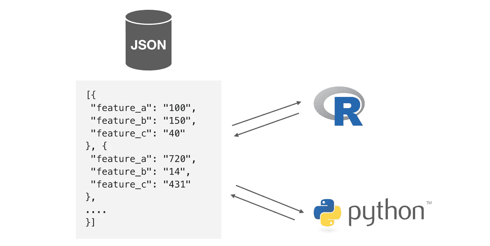*

*JSON 很容易被 R 和 Python 读写。JSON 也很容易存储**嵌套的**数据。这对于机器学习非常有用，因为我们经常在一次调用中保存多个数据集，例如将数据分成训练集和测试集:*

```
*[{
 "**X_train**": [{
      "feature_a": 100,
      "feature_b": 150,
      "feature_c": 40
 }],
 "**X_test**": [{
      "feature_a": 200,
      "feature_b": 250,
      "feature_c": 140
 }],
 "**y_train**": [{
      "feature_d": 170
 }],
 "**y_test**": [{
      "feature_d": 270
 }]
}]*
```

***利用原生 R 和 Python 可视化**:大多数前端应用程序选择交互式的、基于 JS 的可视化。虽然交互式图表有很多好处，但是它们缺少本地 R 和 Python 图表的多样性。例如，我们可以使用代码的 **1 行在 R 中创建以下影响图:***

*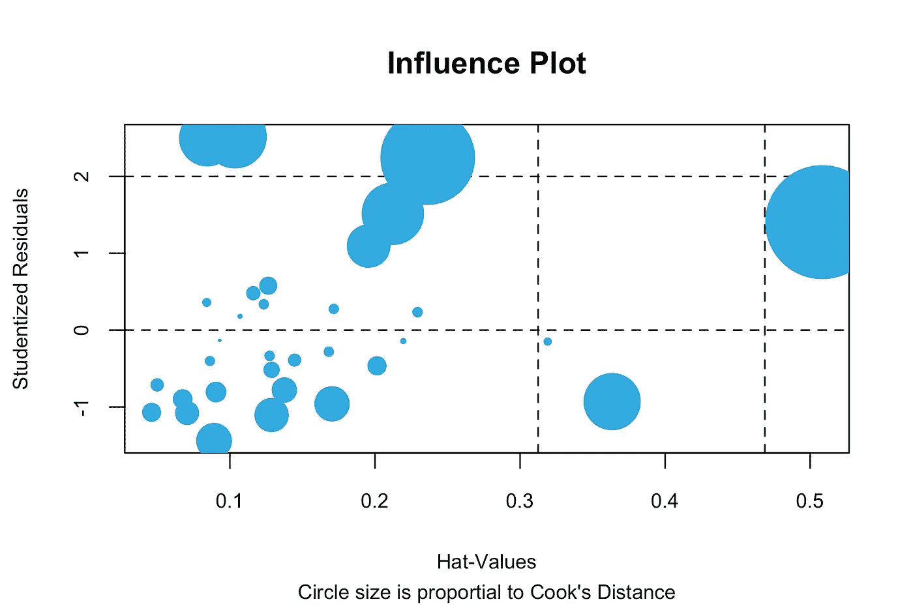*

*复制这个需要多少定制的 JavaScript？原生视觉是数据科学家探索和验证其工作的方式；我们不应该妨碍那件事。*

*R 和 Python 应该是独立的服务:GUI 服务应该使用微服务架构，以便 R 和 Python 保持独立。仅仅用调用 R 和 Python 的脚本来包装服务并不是一个好的设计选择。当然，这必须与立即暴露代码变更的需求相平衡，正如以上关于 Docker 运行时的观点。*

**

***自动跟踪和管理数据依赖关系**:执行的每个任务都将依赖于一些先前的数据集，无论是原始数据集还是转换后的数据集。GUI 需要自动跟踪和管理数据集之间的依赖关系，以保留工作流。这可以通过让前端管理跨节点的读写路径来实现，如下图所示:*

*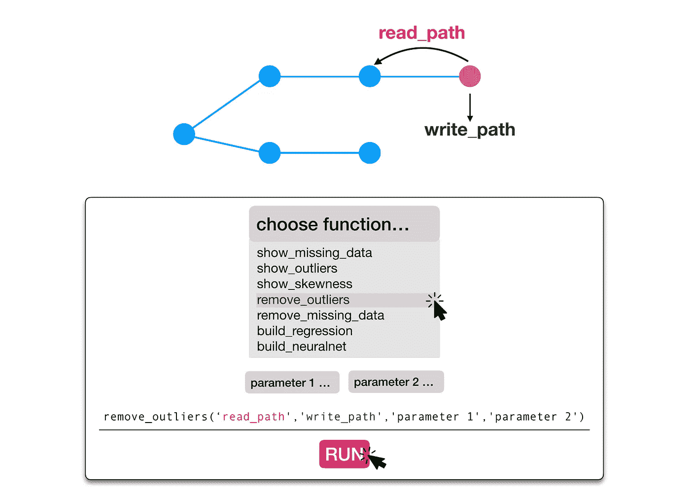*

*例如，在节点上运行选择的函数将启动以下步骤:*

**

***等待后端完成处理，然后在前端显示结果**:由于工作流将涉及运行计算密集型任务，前端必须等待后端处理完成，然后再尝试显示结果。只要我们调用 REST 端点，这就相当简单。比如 jQuery 的 **$中的 Promise 接口。ajax** 方法确保我们可以推迟执行额外的 JavaScript，直到请求完成。*

# *介绍机器流程*

*我创建了**机器流程**来展示本文中讨论的哲学。Machine Flow 包含上述技术要求，并允许数据科学家和数据团队将他们的工作流程 GUI 化。*

**

*机器流支持机器学习工作流的可视化执行和跟踪。用户动态创建依赖图，每个节点负责执行一个任务并显示结果。*

*机器流程提供**开发模式**和**服务模式**。*开发模式*用于主动向我们的服务添加新的 R 和/或 Python 代码。对 R 或 Python 的任何添加/更改都会被它们各自的 REST 端点立即公开，从而允许数据科学家快速构建他们的 GUI 服务。*

**服务模式*在数据科学家的 GUI 服务中已经添加了大量机器学习功能时使用。在这种情况下，不太需要在后端和前端之间来回移动。服务模式背后的想法是提供一个容器化的运行时，团队成员可以用来构建机器学习工作流，而不必编写代码。*

*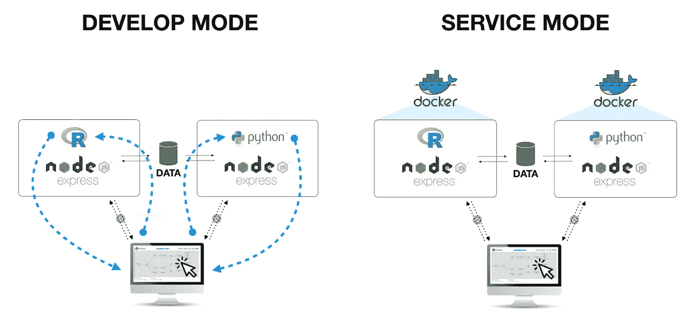*

# *开发模式*

*我们将从开发模式开始，因为这使我们启动并运行，并且是大多数数据科学家使用机器流的方式。*

## *克隆机器流程*

*您可以通过在 GitHub 上探索[项目来查看自述文件。下载机器流程最简单的方法是**打开终端**并运行下面的**命令**:](https://github.com/WorldofDataScience/machine_flow)*

```
*git clone https://github.com/WorldofDataScience/machine_flow.git*
```

*这将把机器流带入你的目录。键入 **ls** 查看内容:*

```
***machine_flow**
├── README.md
├── **app**
├── **data**
├── docker-compose.yml
├── **python_ml**
├── **r_ml***
```

*4 个子目录是最重要的:*

*   ***app** 包含前端*应用*；*
*   ***数据**保存*数据集*和*日志文件*；*
*   ***python_ml** 保存我们的 *python 脚本*；*
*   ***r_ml** 保存我们的 *R 脚本*。*

## *打开机器流程 GUI*

*首先，让我们运行机器流的前端。我们可以启动一个简单的 Python web 服务器，在终端中运行以下命令:*

```
*python3 -m http.server*
```

*我们现在在端口 8000 上提供 HTTP 服务。在浏览器中打开以下链接:*

*[http://localhost:8000/app/machine _ flow . html](http://localhost:8000/app/machine_flow.html)*

*您应该看到带有空白工作流程的机器流程应用程序。*

**

## *启动 R 和 Python 服务*

*我们的前端通过 REST 端点向后端发送函数来运行 R 和 Python 代码。因此，我们需要在后端启动我们的 R 和 Python 服务。*

*在“终端”中打开 2 个新标签。在第一个新选项卡中，**切换到 r_ml 目录**，运行以下命令启动 **R** 服务:*

```
*node connect.js*
```

*在另一个新选项卡中，**切换到 python_ml 目录下**和运行相同的命令来启动 **Python** 服务:*

```
*node connect.js*
```

*每个选项卡都应显示其各自准备好的服务:*

**> R 机器学习端口:9191**

**> Python 机器学习端口:8181**

## *添加数据*

*我们使用的任何数据集都必须添加到**数据文件夹**中。你可以随意添加；唯一真正的要求是**所有数据都是 JSON 格式**。*

*让我们添加来自 GitHub 的波士顿住房数据集:*

*[https://raw . githubusercontent . com/selva 86/datasets/master/Boston housing . CSV](https://raw.githubusercontent.com/selva86/datasets/master/BostonHousing.csv)*

*在“终端”中打开一个新标签页(确定您在 machine_flow 目录中)，并通过键入 R + enter 启动一个 R 会话。我们通过运行以下命令将数据以 JSON 格式添加到我们的数据文件夹中:*

```
*library(jsonlite)

df <- read.csv('https://url_to_boston_data.csv')
df_json <- toJSON(df)
write(df_json, file='data/boston.json')*
```

*我们可以在 Python 中使用相同的方法，通过启动 Python 会话并运行以下命令:*

```
*import pandas as pd
import jsondf = pd.read_csv('https://url_to_boston_data.csv')with open('data/boston.json', 'w') as f:
    f.write(df.to_json(orient='records'))*
```

*在任一种情况下，JSON 输出都有下面的**格式**，其中每个观察都包含在自己的对象中:*

```
*[{
  "feature_a" : "100",
  "feature_b" : "150",
  "feature_c" : "40"
 }, {
  "feature_a" : "720",
  "feature_b" : "14",
  "feature_c" : "431"
 },
....
}]*
```

## *添加后端功能*

*为了让我们的前端对我们的数据做任何有用的事情，我们必须向后端添加 R 和/或 Python 函数。在编写我们的第一个后端函数之前，我们需要回顾一些**需求**，以使后端函数与机器流程一起工作。*

*每个后端函数必须有前两个参数作为**读路径**和**写路径**。函数使用这些来读取正确的数据集并将结果写入正确的路径。这些路径是由机器流自动管理的*，所以我们只需要确保在我们的后端函数中使用它们。**

**

*Back-end function for *Machine Flow.**

*正如我们在上图中看到的，我们函数需要的任何额外参数都在 read_path 和 write_path 之后*。**

*我们还确保每个函数都以一个**return(‘done’)**语句结束。这告诉节点层 R/Python 已经执行完了它的函数。*

***添加我们的第一个后端函数***

**必须*提供的*第一个*后端函数是 **list_data** 函数。机器流程要求我们将这个函数命名为 list_data。所有其他功能都可以随意命名。*

*我们当然可以使用 R 或 Python 来编写 list_data 函数。我将如下使用 R:*

```
*list_data <- **function**(read_path, write_path) {
    res <- toJSON(list.files(read_path, pattern = **".json"**))
    write(res, file=write_path)
    return(**'**done**'**)
    }*
```

*这使用 R 的本机 *list.files* 函数来列出所提供路径中的所有文件。注意，我添加了 *read_path* 和 *write_path* 作为参数，并根据需要在我的函数中使用它们。*

*我们把这个函数放在哪里？*

*我们将后端函数添加到 Machine Flow 的 r_ml 和 python_ml 目录中的适当脚本中。*

```
***machine_flow**
**r_ml**
├── R_Scripts
    └── data_gathering.R
    └── data_preparation.R
    └── model_building.R
    └── model_validation.R*
```

*此时打开一个 **IDE** 比只打开终端更有意义，因为我们将管理多个脚本。我用 PyCharm 你可以用最适合你的。*

*因为我们用 R 编写了 list_data 函数，所以我们把它添加到了 R_Scripts 中。导航到 **r_ml** 目录内的 **R_Scripts** 并打开其内容。打开 utility_functions.R。您将看到已经添加了 list_data 函数的 Machine Flow，以及一些其他函数。因为它已经在那里，我们不需要添加它。*如果您使用 Python 列出文件，您可以将 list_data 函数添加到 python_ml 目录下的 utility_functions.py 中。**

## *添加端点*

*由于我们已经有了后端功能，我们可以打开机器流程 GUI，并在端点下添加此功能:*

**

*点击端点打开功能覆盖图。这是我们告诉机器流 GUI 我们的机器学习服务提供了哪些后端功能的地方。*

**

*我们需要**添加我们的 list_data 函数**。默认端点设置为端口 9191，这是我们的 R 服务的端口，所以我们不会更改它。我们将添加 list_data 作为函数名，选择 data 作为预期输出，然后单击 add:*

**

*Adding endpoint and function in Machine Flow*

*我们需要指定我们想要向机器流 GUI 公开的任何后端功能的预期输出。这确保了机器流知道在运行函数时要显示什么样的结果。*

*关闭功能覆盖图，并单击工作流程的第一个节点。按回车键添加一个新节点。第一层中的任何节点都是数据节点。这些节点在我们的工作流上开始了一个新的分支。*

*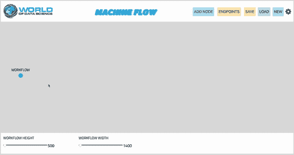*

*Choosing raw dataset in Machine Flow*

*单击“添加数据”会弹出打开模式，并显示一个下拉列表，列出我们添加到数据文件夹的任何数据集。我们可以看到我们添加的波士顿数据集，以及机器流附带的虹膜数据集。*

*从列表中选择 boston.json 以显示数据集。这就是我们如何将数据加载到 GUI 中来开始一个新的分支。如果我们想添加另一个数据集，我们可以单击根节点并按 enter 键，选择不同的数据集进行操作。*

## *添加任务*

*在第一层之后添加的任何节点都是任务节点。这就是我们如何通过添加和运行从起始数据节点分支的任务来构建我们的工作流。*

**

***点击 boston 节点上的**并点击 enter，然后点击 ADD TASK。我们添加到端点的任何功能都将出现在此下拉列表中。因为我们还没有添加任何函数(这里没有列出 list_data ),所以现在我们可以这样做了。*

*Machine Flow 附带了一些 R 和 Python 中的函数来运行本教程。我们可以想象这些是由我们编写或由我们的数据科学团队公开的端点。*

*机器流程附带的**功能**如下:*

*   *【T4 列表 _ 数据(9191)(数据)*
*   **show_outliers (9191)(图片)(* ***特征*** *)**
*   **show_distribution (9191)(图片)(****feature****)**
*   **show_missing (8181)(图片)**
*   **规格化 _ 数据(9191)(数据)**
*   **remove_features (9191)(数据)(****features****)**
*   **split_data (8181)(数据)(* ***目标 _ 特征，split _ percentage****)**
*   **运行 _ 线性 _ 回归(8181)(数据)**
*   **实际 _ vs _ 预测(8181)(图片)**
*   **show_mse (8181)(图片)**
*   **show_r_squared (8181)(图片)**

*第一个括号中显示了**端口**。**预期输出**显示在第二个括号中。如果需要，**参数**显示在第三个括号中。*

*让我们用这些来实验波士顿数据集。打开端点并添加每个函数及其预期输出。根据功能检查以确保端点上的端口号正确:*

*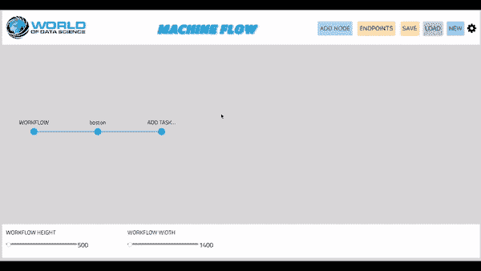*

*Adding endpoints in Machine Flow*

*其中一些功能也需要*参数*。我们可以通过单击相应功能的参数图标来添加这些参数:*

*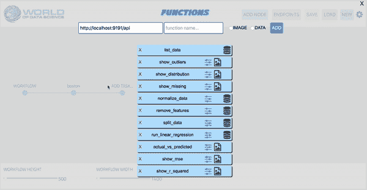*

*Adding parameters in Machine Flow*

*当我们稍后保存我们的工作流时，这些端点、函数和参数被保存，因此我们不需要重新添加它们。*

## *构建工作流*

*一切就绪，可以开始使用我们的波士顿数据集构建工作流了。点击添加任务并检查下拉列表。您现在应该可以看到我们添加的所有功能。让我们开始探索数据。从下拉菜单中选择 **show_outliers** :*

**

*Choosing a function in Machine Flow*

*当我们选择一个函数时，我们会看到任何预期的**特性**的输入字段，以及一个**函数调用**，它是被调用的后端函数。前两个参数是传递给我们后端函数的 **read_path** 和 **write_path** 。这些是由机器流程自动设置的，所以我们可以不去管它们。当我们输入参数时，它会被动态添加到函数调用中。*

*这个特定的函数接受一个 ALL 参数作为特性参数传递，这在想要发现异常值时非常有用。在输入框中输入 **ALL** 并点击 **RUN** :*

**

*Looking for outliers in Machine Flow*

*我们可以看到，一旦后端代码完成，就会返回结果。正如在上面的需求中所讨论的，所产生的视觉效果是原生的 R 视觉效果。我还在模态顶部添加了一个名字并关闭它。任何时候我点击这个节点，任务的结果就会显示出来。*

*机器流程使用了许多**检查**来确保不违反*数据相关性*:*

*   *除非父节点已经运行了任务，否则无法运行任务；*
*   *一旦创建了第一个层节点的子节点，就不能在其上更改数据集；*
*   *如果前一个节点是图像，机器流将搜索路径，直到找到最近的数据集。*

> ***注**:一个**分支**包含所有共享同一个第一层节点的节点。一条**路径**包含所有直接相互连接的节点。*

*让我们继续构建工作流。由于异常值对于特征 **crim** 、 **zn** 和 **b** 最为极端，我将从数据集中移除这些特征。让我们选择**移除 _ 特征**功能。我们可以在后端看到，该函数被编写为接受以逗号分隔的要素名称字符串，用于从数据集中移除要素:*

```
*remove_features <- **function**(read_path, write_path, features) {
    res <- read_json(read_path)
    rem_vec <- unlist(strsplit(features, **', '**))
    res <- res[,!(names(res) %in% rem_vec)]
    res_json <- toJSON(res)
    write(res_json, file=write_path)
    return(**'done'**)
    }*
```

*因此，我们知道如何为这个函数调用添加参数:*

*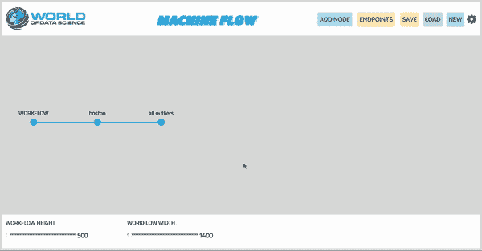*

*Removing features in Machine Flow.*

*我们可以理解为什么我们在添加端点时必须提供预期的输出。第一个示例生成了一个图像，而本示例显示了结果数据集。*

*我现在将**分割**数据，**训练**一个线性回归模型，并显示**预测值与实际值**的对比图:*

*Stepping through splitting, building and validating in Machine Flow.*

*我可以从这个分支中分离出多种类型的验证，因为它指向由模型训练的数据。由于这是回归，我将检查 **r 平方**值和**均方误差**:*

*Spinning off multiple validations in Machine Flow*

*机器流程的一个主要好处是能够快速尝试许多选项。例如，我开始了一个**新分支**，其中我**将数据**归一化，**仅删除**的b 特征，并选择 0.4 的**分割百分比**。然后，我像上次一样训练并验证了一个回归模型。*

*我还创建了一个新的节点**，它位于前一个分支**的中途，在数据被标准化并删除了 b 特征之后，我选择了一个不同的分割百分比 0.5。*

*最后，我在原始数据集之外创建了另一个节点，并探索了它的一些**分布**而不是离群值。*

*这是我的工作流程的样子:*

*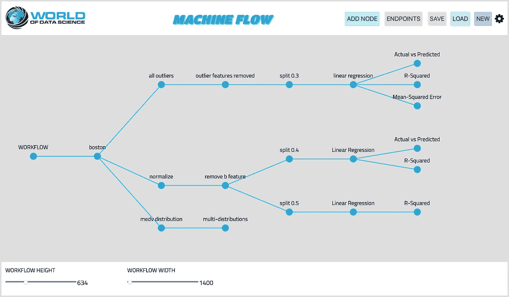*

*Building out workflow in Machine Flow*

*Bring 能够在任何分支的任何点添加新节点，这更符合数据科学工作的进展。*

## *突出显示路径*

*机器流程的另一个重要特征是能够突出显示通向最终结果的*路径*。当工作流变得庞大而复杂时，这很有用。例如，我可能想快速查看哪些步骤导致我的最佳 R 平方值为 0.688。我可以弹出包含该结果的节点，并单击**显示路径**图标:*

*Highlighting a path in Machine Flow*

## *保存工作流*

*机器流在浏览器中自动保存所有工作。这意味着您可以刷新甚至删除缓存，并且您的工作流仍然可用。当然，我们可能希望创建多个工作流，所以单击 SAVE 按钮将下载一个 JSON 文件，其中包含所有节点、端点、函数和参数，以及附加到每个节点的读写路径。*

*加载已保存的工作流就像点击 LOAD 并上传 JSON 文件一样简单。*

> ***注意**:您可以**与团队中的其他成员共享工作流文件**，只要他们的 GUI 可以访问相同的数据文件夹。*

# *预检方式*

*如上所述，服务模式是我们努力的目标；一个容器化的运行时，为一群数据科学家提供通用的机器学习任务。这是一种“内部产品化”,我们创建一个应用程序在我们的组织内部使用。*

*我们可以想象数据团队积极地向服务添加新任务。构建定制 GUI 服务的好处是服务对于组织来说是独一无二的。没有任何供应商工具能够捕捉到适合您组织的产品需求的细致入微的建模和验证。建立一个内部服务，能够快速评估新的数据集和可行的管道，为我们提供富有成效的产品发现。*

*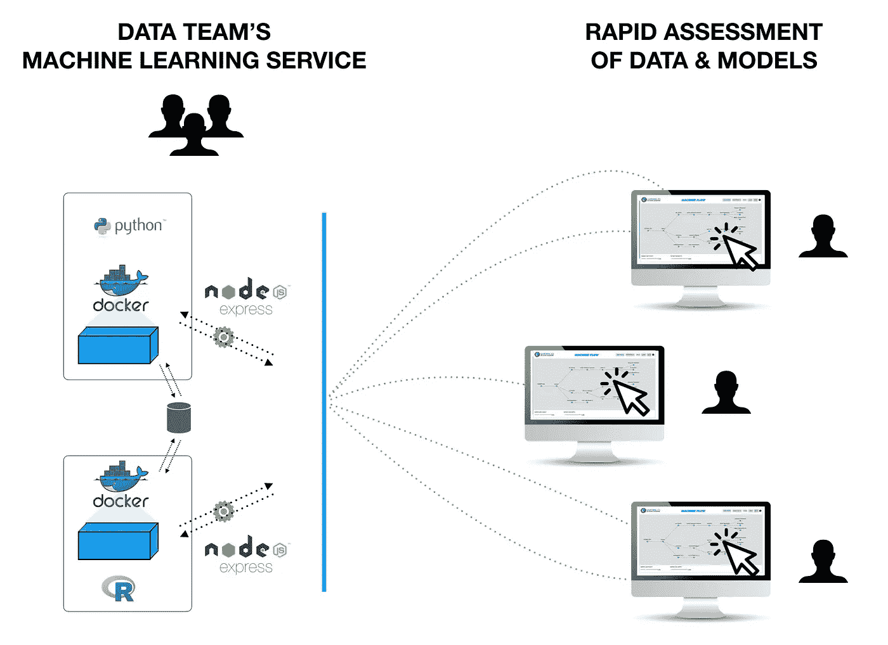*

*Service Mode in Machine Flow. Service mode is a containerized runtime of commonly-encountered machine learning tasks, allowing teams to rapidly assess new datasets and discover viable pipelines.*

## *访问容器外部的数据*

*机器流程使用 Docker **卷**来保存数据。正如 Docker [文档](https://docs.docker.com/storage/volumes/)，*中所述，卷是保存 Docker 容器*生成和使用的数据的首选机制。卷的一个伟大之处在于，它们允许数据在主机和 Docker 容器之间进行实时通信。这很重要，因为我们应该能够在不重启服务的情况下添加新数据集。*

*Machine Flow 使用 [Docker Compose](https://docs.docker.com/compose/) 在一次调用中启动 R 和 Python 服务。Docker Compose 是一个定义和运行多容器 Docker 应用程序的工具。*

*如果我们在机器流程中查看 **docker-compose.yml** ,我们可以看到卷安装在哪里。我们需要将 **volumes** 下的路径设置为我们机器的根目录:*

```
***version: '3'
services:
  r_ml:** *# builds R_ML Dockerfile* **build:** ./r_ml
    **ports:** - **"9191:9191"
    volumes:** - /path_to_directory/data:/app/data
  **python_ml:** *# builds Python_ML Dockerfile* **build:** ./python_ml
    **ports:** - **"8181:8181"
    volumes:** - /path_to_directory/data:/app/data*
```

*挂载卷所需的*完整路径*是我们在控制台中键入 **pwd** 时看到的路径(在 machine_flow 目录中)。*

*例如，在我的本地机器上，我在卷下的 **:/app/data** 前添加了以下行:*

```
***volumes:** -/Users/seanmcclure/PycharmProjects/machine_flow/data:/app/data*
```

*确保对 yml 文件的 **r_ml** 和 **python_ml** 部分都执行此操作。*

## *添加库*

*尽管开发模式可以根据需要通过简单地导入库来使用它们，但是容器化的服务必须将这些库放入 **Dockerfile** 中。*

***为 R 服务添加库:***

```
*FROM r-base

# install R packages
RUN R -e  "**install.packages(c('dplyr', 'tidyr')**, repos = 'http://cran.us.r-project.org', dependencies=TRUE)"

# install node
RUN apt-get update
RUN apt-get install -y nodejs
RUN apt-get install -y npm

ADD . /app

# install node dependencies
RUN cd /app; npm install

WORKDIR /app

EXPOSE 9191

CMD node connect.js*
```

*在这种情况下，我们只需在 RUN 命令中列出它们。以上，我正在安装 dyplr 和 tidyr。*

***为 Python 服务添加库:***

```
*FROM nikolaik/python-nodejs

# install Python modules
**RUN pip3 install -U numpy
RUN pip3 install -U scipy
RUN pip3 install -U scikit-learn**

ADD . /app

WORKDIR /app

EXPOSE 8181

CMD node connect.js*
```

*对于我们的 Python 服务，我们使用 pip3 install 安装库。注意用于绕过提示的-U 标志。*

*众所周知，库安装并不总是按计划进行。记住，机器流有 R 和 Python 的**日志文件**。要查看容器中的日志文件，只需“执行”容器。例如，进入 r_ml 容器我们可以运行:*

```
*sudo docker exec -i -t machine_flow_r_ml_1 /bin/bash*
```

*…并且查看 R 的 **r_log.log** 文件，Python 的 **py_log.log** ，数据目录内的:*

```
*vi data/r_log.log*
```

## *更改读取、写入和结果路径*

*在服务模式下，我们需要更改机器流程使用的路径。首先，点击顶部的齿轮图标:*

**

*并将**路径**更改为:*

*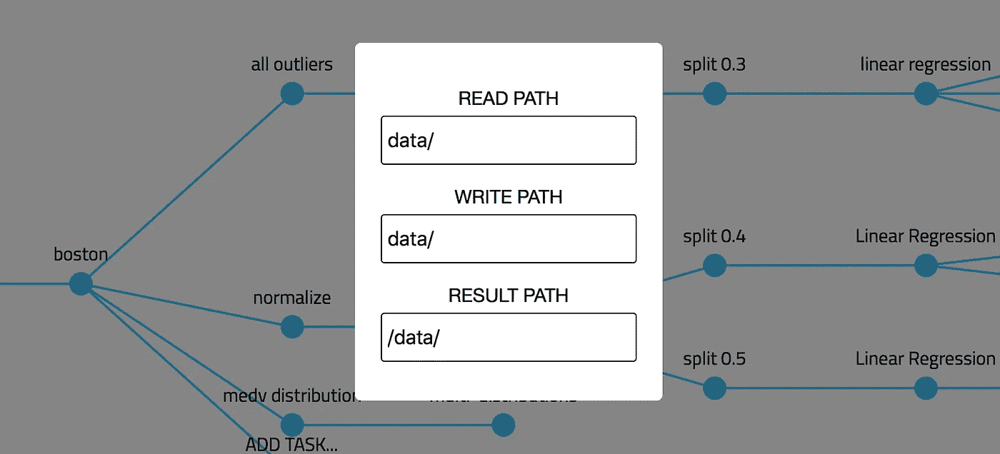*

*同样，打开*中的 **connect.js** 两个* **r_ml** 和 **python_ml** 目录，更改:*

```
*fs.appendFileSync(**"../data/r_log.log"**, data)*
```

*到*

```
*fs.appendFileSync(**"data/r_log.log"**, data)*
```

## *构建图像和运行服务*

*我们**通过运行以下命令，使用 **docker-compose** 构建**r _ ml 和 python_ml 映像:*

```
*docker-compose build*
```

*然后**运行**我们的容器，通过运行:*

```
*docker-compose up*
```

*您应该看到以下内容，以确认服务已经启动并正在运行:*

```
*Attaching to machine_flow_r_ml_1, machine_flow_python_ml_1r_ml_1       | R Machine Learning on port: 9191python_ml_1  | Python Machine Learning on port: 8181*
```

> ***注意**:如果你和开发模式在同一台机器上，在运行 docker-compose up 之前，一定要停止在端口 9191 和 8181 上运行的节点服务。*

# *摘要*

*无论你是想从机器流程开始，还是想建立自己的 GUI 服务，我认为数据科学朝着这个方向发展是很重要的。通过自动化产品发现之前的必要探索，将机器学习工作流程 GUI 化形成了一个完整的开发职责。机器学习没有选项，它有可能性。通过快速评估我们数据的就绪性，并揭示从原始数据到验证模型的可行路径，我们为自己在机器学习项目上取得更多成功做好了准备。*

*和往常一样，如果你遇到问题，请在评论区提问。*

*如果你喜欢这篇文章，你可能也会喜欢:*

*[](/learn-to-build-machine-learning-services-prototype-real-applications-and-deploy-your-work-to-aa97b2b09e0c) [## 学习建立机器学习服务，原型真实的应用程序，并部署您的工作…

### 在这篇文章中，我将向读者展示如何将他们的机器学习模型公开为 RESTful web 服务，原型真实…

towardsdatascience.com](/learn-to-build-machine-learning-services-prototype-real-applications-and-deploy-your-work-to-aa97b2b09e0c) [](/combining-d3-with-kedion-graduating-from-toy-visuals-to-real-applications-92bf7c3cc713) [## 用 D3.js 从玩具视觉过渡到真实应用

### 我们经常孤立地学习技术和方法，与数据科学的真正目标脱节；至…

towardsdatascience.com](/combining-d3-with-kedion-graduating-from-toy-visuals-to-real-applications-92bf7c3cc713) [](/step-by-step-guide-to-creating-r-and-python-libraries-e81bbea87911) [## 创建 R 和 Python 库的分步指南(在 JupyterLab 中)

### r 和 Python 是当今机器学习语言的支柱。r 提供了强大的统计数据和快速…

towardsdatascience.com](/step-by-step-guide-to-creating-r-and-python-libraries-e81bbea87911)*