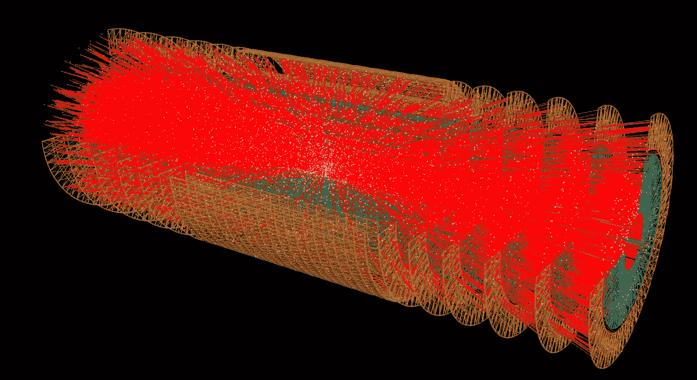
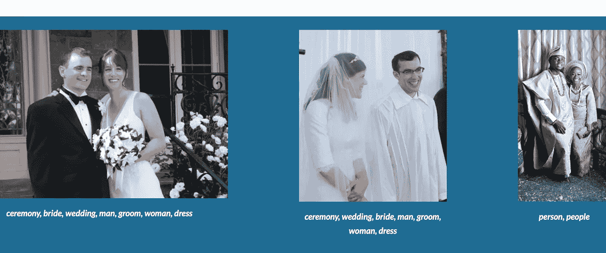

# NIPS 2018 竞赛赛道指南以及如何参与

> 原文：<https://towardsdatascience.com/guide-to-the-nips-2018-competition-track-and-how-you-can-participate-6e75f992ea3b?source=collection_archive---------25----------------------->

今年是国家实施计划的第二个年度“竞赛轨道”。在竞赛跑道上，有许多有趣的比赛项目可供参加。所有的活动都很容易参加，并跨越 ML 的许多领域。竞赛适用于广泛的行业，包括汽车、安全、医疗保健和物理。

[终身机器学习 AutoML](https://www.4paradigm.com/competition/nips2018)(截止日期 10 月 26 日)

这场比赛的重点是建立一种算法，可以在没有任何人工干预的情况下，自动为后续任务创建预测模型。竞赛分为两个阶段:反馈阶段和测试阶段。在反馈阶段，组织者提供了五个与最终测试数据集性质相似的数据集。在第二阶段，上传的模型代码将在五个测试集上进行盲评估。这种竞争具有挑战性，因为分布将随着时间的推移以及各种特征类型(即分类、时间、二元等)的变化而缓慢变化。所有必要的数据和说明都可以在官方网站上找到。

[对抗性视觉挑战](https://www.crowdai.org/challenges/adversarial-vision-challenge)(最终提交日期 11 月 1 日)

这项挑战的重点是制造鲁棒的视觉计算机视觉算法，对敌对的干扰有抵抗力。这对于保护计算机视觉模型免受恶意用户的攻击以及创建更加健壮的模型非常重要。首先，你可以转到 [GitLab 库](https://gitlab.crowdai.org/adversarial-vision-challenge/nips18-avc-model-template?_ga=2.205964564.64880023.1534801470-2120434307.1529537746)，然后按照指示进行操作。

[对话智能挑战 2(convai 2)](http://convai.io/)(9 月 30 日提交截止日期)

这是一个旨在开发非目标导向聊天机器人的竞赛。为了比赛，他们提供了一个有趣的新数据集，这个数据集是通过将众包工人配对在一起，给他们一个简单的角色并让他们聊天而制作的。评估将分三步完成:通过自动化评估指标(困惑、F1 和点击率)，对机械土耳其人的评估，以及志愿者与机器人聊天的“野生”评估。

你可以在这里找到基线模型[的源代码。首先，你需要创建一个私有的 Github 库，并与组织者共享。更多信息请访问官方网站。](https://github.com/facebookresearch/ParlAI/tree/master/projects/convai2)

[追踪机器学习挑战](https://sites.google.com/site/trackmlparticle/)

这是一个与物理学相关的挑战，涉及使用机器学习来检测粒子在碰撞后的路径。由于需要非常快速地对粒子碰撞数据进行分类，这项竞赛非常重要。目前，预计算法不会随着来自 LHC 的数据量的增加而扩展。比赛正在进行，包括几个不同的部分。第一阶段始于 5 月，将于 8 月结束，重点是重建粒子轨迹的准确性。第二阶段(NIPs 竞赛的焦点)关注模型在测试时的速度。

[关于项目动机的 PDF 幻灯片](https://indico.cern.ch/event/577003/contributions/2476446/attachments/1423512/2183608/tr170307_davidRousseau_CTDWIT2017_trackML.pptx.pdf)

[Kaggle 比赛](https://www.kaggle.com/c/trackml-particle-identification)(已完成)

(截止日期 11 月 26 日)

这项比赛的重点是训练一队 AI 智能体，在 Bomberman 的策略游戏的变种 Pommerman 的游戏中与另一队 AI 智能体的玩家进行比赛。这个竞赛是一个有趣的多智能体学习实验，在互补和对抗两个层面上。更多信息请参见 Github 或上面的官方网站链接。

[包容性图片](https://sites.google.com/view/inclusiveimages/)(截止日期 11 月 9 日)

NIPs 2018 赛道的又一场比赛。该竞赛旨在解决数据失真的问题。“具体来说，在这场比赛中，研究人员将在[开放图像](https://www.google.com/url?q=https%3A%2F%2Fgithub.com%2Fopenimages%2Fdataset&sa=D&sntz=1&usg=AFQjCNFnSnHGWc1Xqv_E4QI4AHTZb9Hw_w)[【2】](https://sites.google.com/view/inclusiveimages/references?authuser=0)上进行训练，这是一个大型、多标签、公开可用的图像分类数据集，已被发现表现出地理倾斜。”

[AI 驾驶奥林匹克](https://www.duckietown.org/research/AI-Driving-Olympics/)(截止日期 11 月 30 日)

这个你可能已经很熟悉了，因为它已经在 Reddit 和其他网站上流传，但如果你不熟悉，我会描述一下。“人工智能驾驶奥运会”于 10 月正式开始，将由两部分组成，第一部分于 12 月在 NIPS 举行，第二部分于 5 月在 ICRA 举行。比赛由三个独立的任务组成:车道跟踪，动态车辆的车道跟踪，以及动态障碍物的导航。你可以去他们的官方网站了解更多信息。

[人工智能假肢挑战赛](https://www.crowdai.org/challenges/nips-2018-ai-for-prosthetics-challenge)

最后但同样重要的是人工智能假肢挑战赛。这项挑战旨在使用 RL 来学习最佳策略，以帮助装有假肢的人跑步。这个挑战是 RL 在现实世界问题中的有趣应用。这是“学习跑步”在 NIPs 的第二年，有相当多的[文章让你开始](https://medium.com/mlreview/our-nips-2017-learning-to-run-approach-b80a295d3bb5)。最后，你可以在 [GitHub 库](https://github.com/stanfordnmbl/osim-rl)上找到所有的额外信息和更多挑战信息。

正如你所看到的，今年在 NIPs 有一系列真正有趣的挑战，跨越了许多行业和机器学习领域。希望你能找到一个你感兴趣的并参与竞争。祝你好运！