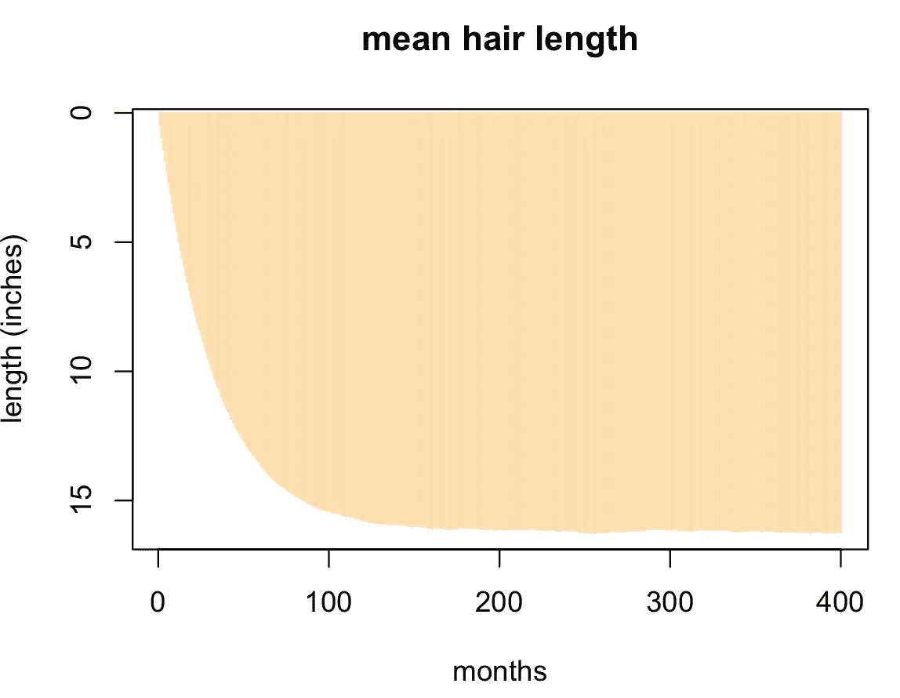

# 今天的头发，明天就没了

> 原文：<https://towardsdatascience.com/hair-today-gone-tomorrow-cfcaa7c31f3b?source=collection_archive---------7----------------------->

自从我上次剪头发以来已经有相当长的时间了。它现在已经过了我的肩膀，在过去的几年里它一直留在那里。

尽管它还在生长，但它不再长了，因为它也脱落了。它已经达到了一个动态平衡，头发生长的速度等于头发脱落的速度。

为了更好地理解这个过程，我查阅了一些关于头发生长的事实。头发以每月大约 0.5 英寸的速度生长。人的头上大约有 100，000 根头发，其中每天大约有 100 根脱落。这相当于每月 3%的头发脱落。头发还有其他细微差别，但我简化了模型，以假设生长是恒定的，所有头发都有相同的脱落机会。

我在 R 中模拟了这种动态，并绘制了一个图表来观察头发长度如何随时间变化。它开始没有头发(想象一个寸头)，收敛到大约 16 英寸的稳定状态长度。将 y 轴反转，使图本身看起来像悬挂的几缕头发。

假设 *T* 是一个随机变量，代表一缕头发脱落前的时间，或者一根头发的年龄。在统计学中，**风险率**是某个事件(如失败或死亡)发生的瞬时率，假设它尚未发生。

hazard rate

通过应用条件概率的定义，

而取极限为 dt → 0，危险率就是概率密度函数(pdf)与 1 的比值——累积密度函数(cdf)。危险率唯一地表征了一个分布，反之亦然。常数风险率是指数分布的独特性质。

这里的危险率是. 03/月，所以 *T* ~ *Exp* (率= . 03/月)。头发年龄呈指数分布，平均年龄为 1/.03 = 33 个月。由于长度随年龄线性增长，头发长度~ *Exp* (比率= . 06/英寸)，平均长度为 16.7 英寸。这与模拟中收敛的平均毛发长度一致。Q-Q 图将模拟的最后一个时间步长的头发长度与随机生成的指数进行比较，并确认它们具有相同的分布。

