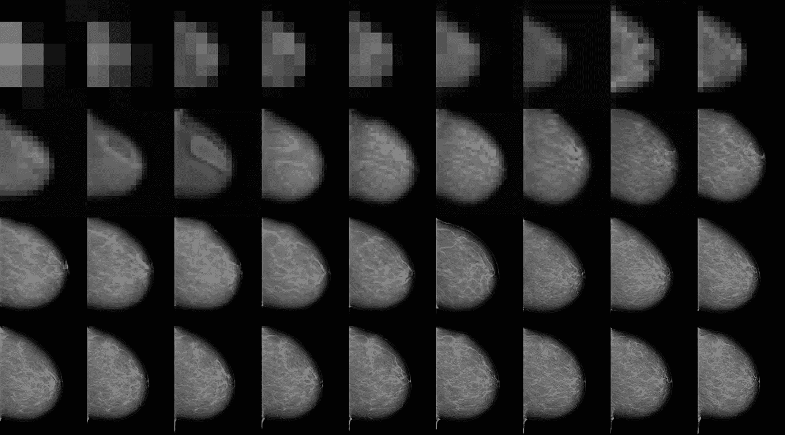
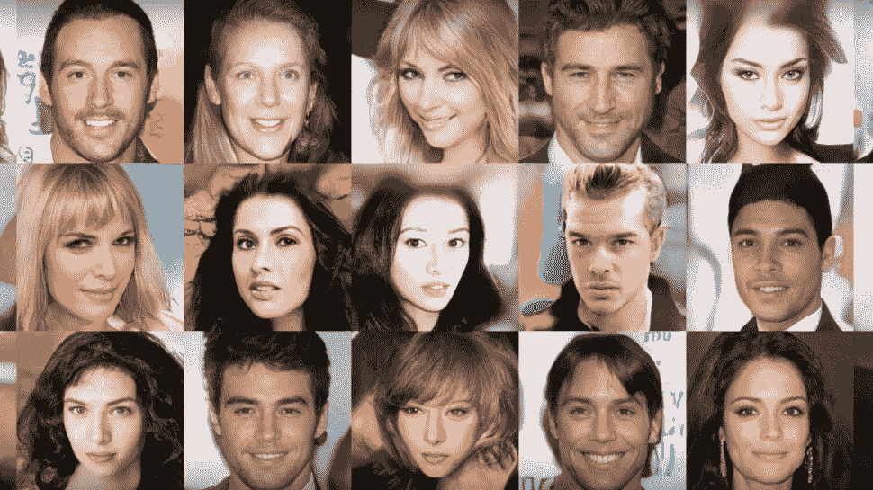
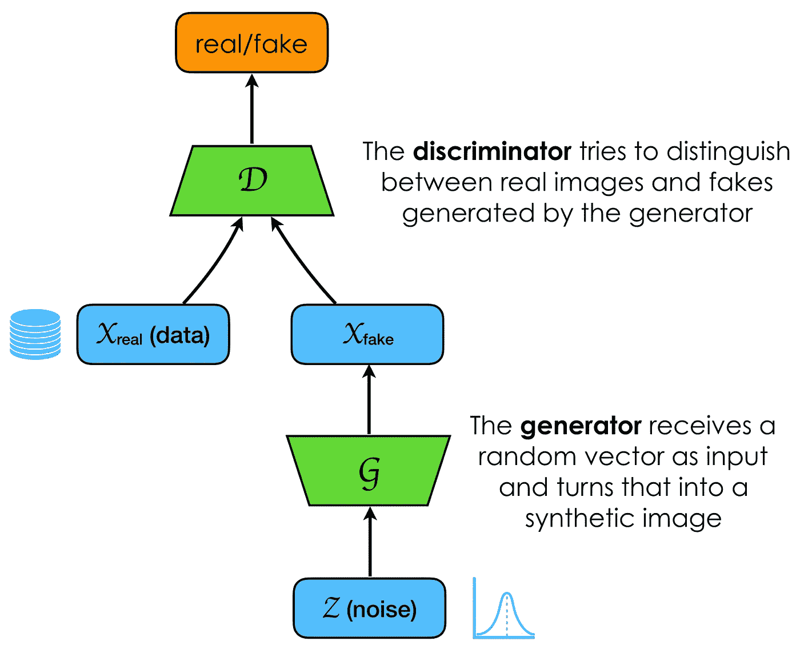
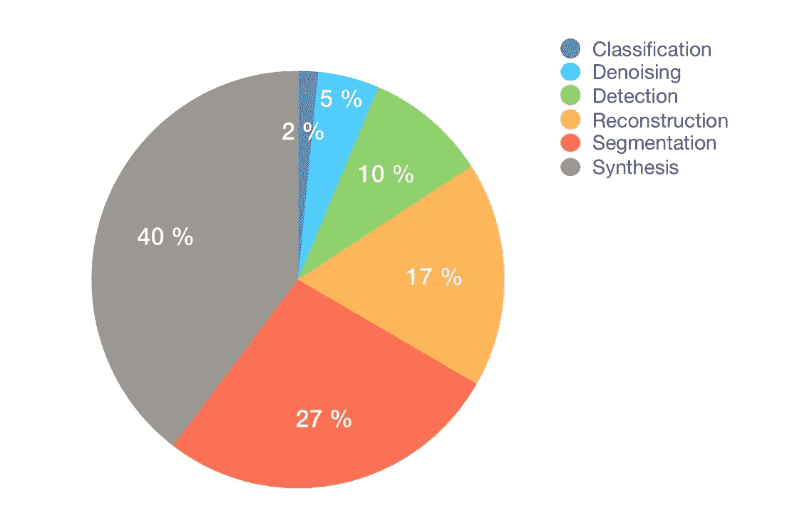

# 假观点！用于机器学习的合成医学图像

> 原文：<https://towardsdatascience.com/harnessing-infinitely-creative-machine-imagination-6801a9fb4ca9?source=collection_archive---------9----------------------->

Image taken from High-Resolution Mammogram Synthesis using Progressive Generative Adversarial Networks, Korkinof et al. (Kheiron Medical Technologies) [https://arxiv.org/abs/1807.03401](https://arxiv.org/abs/1807.03401)

没有数据，人工智能什么都不是。就像一个人被锁在一个白色无声的房间里努力理解外部世界一样，没有某种输入，人工智能是不可能实现的。即使是业内最优秀的机器学习工程师，也无法在没有任何数据的情况下做出一个函数式算法。

人类大脑不断受到数据的轰炸——视觉、听觉、触觉、嗅觉、情感等——并进化出高级过滤器来整理这些冲击，只允许有意义的输入通过。如果我们要实现真正的人工智能，那么关键在于数据，以及对数据的大量过滤和处理。然而，现在，当谈到医学应用的训练模型时，似乎没有足够高质量的数据可供研究人员使用。

当前用于训练放射学人工智能系统的框架在很大程度上依赖于监督和半监督学习，其中使用了包含专业标记图像的大型数据集。研究人员在获得好东西时面临三大障碍——医疗数据的数量、质量和伦理使用。除了这些障碍之外，攀登医学成像数据准备度(MIDaR)等级以将 D 级数据(医院内的实时未匿名临床数据)转换为 A 级数据(用于培训的去识别、标记、干净的数据)所需的时间和成本可能是几个月、工时和数千美元的事情。即使获得了 A 级数据，尽管尽了最大努力来创建完美的数据集，它也常常是有偏差和不平衡的。罕见的疾病将被低估，各种奇怪而奇妙的正常变异将比比皆是。

很少有公开的高质量医学成像数据集可用于研究，也没有全球标准化的数据集用于验证放射学人工智能模型的准确性。这个问题在成像部门最为明显，例如，与电子健康记录分析相反，在电子健康记录分析中，数据主要是表格和字母数字。这种类型的数据可以很容易地扩充，只需为日期生成随机数，或者使用更复杂的技术来生成虚假的患者资料。

在医学成像中，翻转、裁剪、缩放和倾斜图像等数据增强技术只能到此为止。毕竟，改变图像的方法只有这么多，即使这样，实际上也没有添加新数据。

不幸的是，你不能生成无限的合成医学图像来进行训练。还是可以？

# 制造逼真的赝品

全球各地的机器学习团队现在正把注意力转向创建合成医学成像数据，使用一种相对新的网络形式(由 [Goodfellow 等人](https://arxiv.org/abs/1406.2661)首次推出)。2014 年)称为生成性对抗网络(GAN)。这种趋势正在加速，关于医学图像生成的论文越来越多。

你可能已经在其他领域看到过 GANs。例如，他们以创造假名人的图像而闻名，也有像职业舞者一样跳舞的假[视频。](https://arxiv.org/pdf/1808.07371v1.pdf)

Examples of generated realistic high-resolution images of fake celebrities

# 那么什么是 gan，它们是如何工作的？

gan 由两个网络组成，一个是生成网络(G ),另一个是鉴别网络(D)。我喜欢把他们分别想象成学生和老师。它们相互对抗(因此有对抗性这个术语)，学生试图通过考试，老师给考试打分。测试恰好是学生是否能创造出逼真的合成图像。只有当学生给出正确答案时，老师才会奖励学生。重要的是，老师和学生都很少或根本不知道教学大纲。教师必须从真实图像中反复学习，并给学生“打分”，学生必须在多次反复中猜测答案可能是什么，这是更困难的任务！通过这种方式，学生以无人监督的方式学习——没有被明确地教授任何东西，只得到关于对错的反馈。

医学图像的生成器必须使用随机噪声向量输入来创建看起来足够真实的合成图像，以便鉴别器将它们识别为属于定义手边任务的分布式特征(或潜在)空间。将一组图像中的潜在空间概念化是很棘手的，因为它本质上是一个多维的抽象实体。事实上，为了缩小这一特征，空间研究人员通常将其限制在多维超球面上。

# 多维超球面

A multi-dimensional hypersphere with discrete points relating to the feature space within images

想象一个 3D 空间(x，y，z)中的球体和位于其表面上的离散点。每个点代表一个合成图像，随着生成器根据鉴别器的反馈进行训练，球体上的点逐渐编码越来越多的关于真实世界医学图像中发现的特征的信息。例如，球体上的某些方向可能具有语义含义，在乳房 x 线照相术的情况下，这可能涉及密度或实质模式。假设一个训练有素的生成器，每个点将代表在真实世界医学图像中发现的综合构建它们所必需的整套特征。在现实中，这个空间实际上不是三维的，而是多维的(超球)，然而它的维度比图像小得多(更紧凑)，图像可以由数百万像素组成。

鉴别器网络(D)将图像编码成它自己的高维表示，类似于但不一定与发生器(G)对齐。它吸收关于给定训练数据集的特征空间的内容和边界的知识，而生成器网络(G)试图生成新的合成点以适应相同的空间。如果生成的图像不符合特征空间边界，鉴别器将拒绝它们。通过多次迭代，生成器网络学习创建开始匹配的图像，并且这样做的准确性和完整性越来越高。结果是一个充满无限离散合成数据点的特征空间，所有数据点都符合原始数据集的特征/潜在空间。更重要的是，可能没有一个合成图像与任何原始训练集相同。它们只是在特征空间中共享相同的分布。

Saturating hyperspheric feature space with synthetic data points

简单！

如果这很难理解(我试了几次),想象一个更简单的任务——教孩子画胡萝卜。首先你给他们看一根胡萝卜，让他们画出来。他们很可能会画出一些模糊地类似于你给他们看的胡萝卜的东西。他们下意识地做的是“学习”成为胡萝卜的特征空间——顶部有绿叶的橙色尖状物。现在想象给孩子看十种不同的胡萝卜，然后让他们画一张新的胡萝卜图片。他们将能够抽象并画出一个全新的胡萝卜，一个不同于你给他们看的所有图片的胡萝卜，但仍然是一个完全可识别的胡萝卜。人类特别擅长这种富有想象力和创造性的任务。

这就是为什么 GANs 如此有趣——它们让我们离复制人类大脑的实际工作方式更近了一步。我们人类能够进行抽象和有趣的思考，我们不仅仅是通过鹦鹉学舌来学习。人类以一种无人监督的方式学习，当我们还是孩子的时候，我们通过实验和玩耍来了解我们的环境，接受不断的反馈。在某种程度上，我们通过在潜意识中创造合成现实和在头脑中测试场景来学习。甘人本质上也能做同样的事情。通过创造抽象概念，并确保它们符合某些预先定义的参数，可以有效地让机器产生幻觉，在幻觉中保持现实的界限。它是视觉表达、创造和抽象，可能是解锁真正人工智能机器视觉的巨大进步。

# 那么为什么甘有用呢？

对于合成医学成像数据，有几个提议的用例。我不会涵盖所有内容，但我强烈建议感兴趣的读者参考 Kazeminia 等人的这篇[优秀评论文章](https://arxiv.org/pdf/1809.06222.pdf)，以获得更完整的技术见解。图像合成仍然是研究最多的应用。例如，麻省总医院的团队发表了他们在生成[合成核磁共振脑扫描](https://www.zdnet.com/article/nvidia-researchers-generate-synthetic-brain-mri-images-for-ai-research/)方面的工作，其他人已经生成了[逼真的视网膜图像](https://arxiv.org/abs/1809.01410)。在图像去噪([提高低剂量 CT 分辨率](https://arxiv.org/abs/1802.05656))、从稀疏采集的数据进行图像重建([更快的 MR 序列](https://arxiv.org/abs/1803.01417))以及改进[分割](https://arxiv.org/abs/1810.00551)和[弹性配准算法](https://arxiv.org/abs/1805.02369)方面也有非常有趣的研究。

A pie chart. I hate pie charts. But this one does serve a purpose at least.

由于计算和处理能力的限制，创建非常高分辨率的图像存在技术障碍，目前大多数研究产生的图像介于 124 x 124 和 512 x 512 之间。这部分是因为 gan 是出了名的脆弱，当网络中的层变得过于拥挤时，经常会坍塌并产生垃圾。

在 Kheiron，我们最近[发表了我们关于使用所谓的渐进式 GAN(或 pGAN)生成高分辨率乳房 x 线照片的工作](https://arxiv.org/abs/1807.03401)。通过对来自我们数据库的大约 50 万张真实乳房照片训练鉴别器网络，我们绘制了构成乳房照片的整个特征空间，然后训练生成器在相同的特征空间内合成高分辨率合成图像。这是逐步完成的(见页首图片)，以非常低的分辨率启动鉴别器和发生器，并在每次迭代中逐渐将图像大小加倍。据我们所知，我们超过了迄今为止发布的合成 2D 医学图像的最高分辨率，成功创建了像素比为 1280 x 1024 的极其逼真的乳房 x 光照片。(随着分辨率加倍，特征空间变得几乎呈指数级复杂！).此外，我们已经能够同时生成每个乳房的两个标准视图(头尾和内侧斜)，这意味着我们可以创建任何形状、大小或密度的乳房的完整合成患者病例，而不仅仅是不相关的单个图像。此外，只要生成的图像保持在经过训练的特征空间内，我们就能够生成无限多的图像。下面的视频很好地展示了这些合成图像看起来有多真实，以及整个特征空间是如何通过的。

这是早期的工作，完整的结果还不知道。并非所有生成的图像看起来都绝对真实——肯定有一些奇怪的情况限制了有用性！我们将研究逼真的合成图像是否可以用于增强数据集，以便进行下游分类器训练。值得注意的是，尽管合成图像的数量是无限的，但它们并不代表原始数据集潜在空间边界之外的“新”数据，因此不能替代高质量真实世界数据的训练。然而，在对注释良好的真实数据进行微调之前，通过使用合成数据作为弱标记数据进行训练，可能会获得相当大的好处。鉴别器可用作超出正常特征空间分布的真实图像的检测器。还有工作要做，以评估这些模型是否可以帮助域转移，特别是对不同供应商硬件拍摄的乳房 x 光片的外观进行标准化。

因此，尽管还不完全是“免费的无限数据”,但通过让人工智能获得无限的创造力，我们肯定已经朝着实现这一目标迈出了一步。毕竟我们人类就是这么学习的。

如果你和我一样对人工智能在医疗保健中的未来感到兴奋，并想讨论这些想法，请联系我们。我在推特上 [@drhughharvey](http://twitter.com/drhughharvey)

*如果你喜欢这篇文章，点击推荐并分享它会很有帮助。*

*关于作者:*

*Harvey 博士是一名委员会认证的放射科医师和临床学者，在英国国民医疗服务体系和欧洲领先的癌症研究机构 ICR 接受过培训，并两次获得年度科学作家奖。他曾在 Babylon Health 工作，领导监管事务团队，现在是放射科顾问、皇家放射科医师学会信息学委员会成员、人工智能初创公司(包括 Algomedica 和 Smart Reporting)的顾问，并且是 Kheiron Medical 的临床总监，khe iron Medical 是第一家获得放射学深度学习应用 CE 标志的英国公司。*