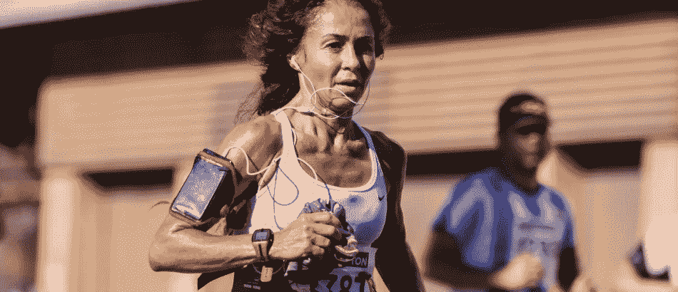
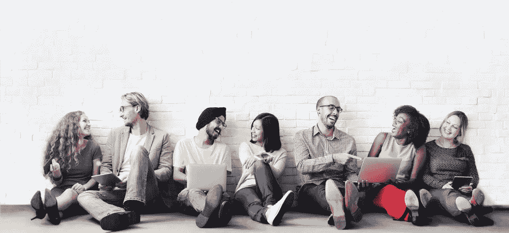

# 健康应用:从拯救生命到威胁生命

> 原文：<https://towardsdatascience.com/health-apps-from-lifesaving-to-life-threatening-859493e711c?source=collection_archive---------4----------------------->

电子健康在这里。如果你曾经通过电话咨询过你的医生，检查过你每天用可穿戴设备走了多少步，或者在候诊室使用过那些自己动手的体重、身高和血压检查器，那么你已经是革命的一部分了。

这是一场我们需要的革命。对卫生服务的需求超过了供给，随着人口继续膨胀，这种需求将面临进一步的压力。收集和连接地理疾病数据的技术有可能防止埃博拉和寨卡等流行病，并跟踪抗生素耐药性日益增长的威胁。应用程序和严肃游戏可以缓解精神健康危机。利用传感器和远程在线服务，可以更有效地照顾老龄化的世界人口。

# 当健康应用出错时

广义而言，电子医疗指的是由电子流程或通信促进的医疗保健中的任何事物。世界卫生组织强调，电子医疗的主要目标应该是利用技术减少不平等。当然，言下之意是，创造利润不应该是首要目标。还记得马丁,“美国最讨厌的人”,他将一种广泛使用的艾滋病和癌症药物的价格从每片 13.5 美元提高到 750 美元？或者在美国，救生 EpiPens 的价格在 7 年内上涨了 508%?

**新的危险是不受监管的应用**。有些做出相对无害的承诺，比如用你手机的光来治疗痤疮(提示:它不会)。但其他人声称，你可以通过将手机麦克风贴在胸前并将手指放在摄像头上来正确测量血压。在由约翰·霍普斯金大学医学院 [**批准的一项研究中进行测试时，该应用程序在 80%的真实病例中未能检测到高血压。更可怕的是，当匹兹堡大学检查 4 个皮肤癌检测应用程序的准确性时，即使是最可靠的算法也表明 30%合法诊断的黑色素瘤是“低风险”的。**](https://jamanetwork.com/journals/jamainternalmedicine/fullarticle/2492134)

虽然做出虚假营销声明的应用程序可能会被处以巨额罚款，但涵盖医疗过失或医疗事故的法规出现的时间却更长。苹果等公司的开发者指南也没有提供多少保护。苹果表示，“可能提供不准确数据或信息，或者可能用于诊断或治疗患者的医疗应用程序”可能会受到更严格的审查。但是仍然有很多可用的。

2013 年，美国食品和药物管理局出台了针对医疗器械或其附件的法规。今年 5 月，欧洲监管机构更进一步。欧盟“医疗设备法规”将记录和注册数据用于医疗目的的应用程序归类为医疗设备。这意味着，如果一个应用程序为你的饮食和总体健康状况提供建议，它仍然只是一个应用程序。但如果它使用相同的数据来管理威胁生命的疾病，如糖尿病，它就是一种医疗设备，因此受到严格的控制和风险评估。随着新规则的实施，我们现在可以期待非常高质量和相对便宜的应用程序将出现在**管理慢性病、改善医生和患者之间的沟通、提供早期诊断以及为临床研究收集可靠数据**。

一些应用程序仍在寻找漏洞以进入健康应用程序市场。最常见的是在小字上加上“娱乐目的”。因此，目前来说，消费者应该研究他们下载的应用程序，检查它们是否得到监管机构的批准，并记住移动设备或应用程序不应被用来替代认证医生的测试。尽管 iPhone 很贵，但你的设备不太可能配备进行皮肤癌活检所需的设备。

# 当健康应用可以改变生活

## 心理健康

精神健康服务通常资金不足，而且经常受到指责，因此需要改革。提供安全访问匿名电子咨询或与医疗保健专业人员视频聊天的应用程序被证明是非常有益的。

“大白墙”是一项匿名数字服务，由训练有素的“墙向导”提供服务。它全天候支持经历常见心理健康问题(如抑郁和焦虑)的人。成员们可以用图像、图画和文字来发表文章——和其他人、工作人员交流。在一些地区，有机会通过网络摄像头、音频或即时消息与经验丰富的顾问进行一对一的现场治疗。**对于近一半的用户来说，大白墙是他们第一次分享问题，也是他们获得心理健康支持的第一步。67%的会员表示使用该服务后幸福感有所提高**。

## 支持自我保健

可穿戴设备是一种越来越受欢迎的跟踪锻炼和心率的工具。任何可以收集精确数据的类似远程患者监护工具，如起搏器和血糖监测仪，也将有助于临床医生根据您的需求提供更具体的治疗。

2016 年 11 月， **Eli5 因我们的创新理念'** [**【马蒂**](https://www.eli5.io/creating-ehealth-products-that-actually-work) **'** '获得 IBM 和凯捷颁发的 Bluemix 大奖；基于人工智能(AI)的治疗应用。马蒂担任人工智能治疗师，通过使用音乐和过去的照片来帮助痴呆症患者恢复记忆。痴呆症患者与马蒂互动，可以根据之前的对话、他们的情绪和讨论的主题来观看图片和听音乐。该工具将 IBM 的 Watson 用于语音和对话元素。

菲律宾医科学生乔尔·亚历杭德罗(Joel Alejandro)最近开发了一款名为“Sali”的心肺复苏应用。在一个贫困公民缺乏基本医疗保健服务、紧急情况下难以到达农村地区和繁忙城市的国家，具备实施 CPR 能力的人口将拯救生命。该应用程序是执行 CPR 的指南，也是连接用户和其他救生员的网络，以获得额外的支持。

信用:大白墙

# 我应该担心分享我的医疗数据吗？

为了让电子医疗发挥作用，你必须从数据开始。没有患者的医疗信息，就没有证据来构建电子健康产品。

电子健康产品中的人工智能可以为你理解原始数据，并从中学习，以便在未来更好地帮助你。想想活动追踪器 Fitbit 的 2320 万活跃用户。如果没有一个简单的界面，用平均值、图表和图形来交流他们的健身结果，而不是小时、天、月的数字和小数点，人们就会完全放弃这个产品。

像 Pacmed 这样的软件展示了共享数据的普遍好处。Pacmed 是一个结合了大数据、机器学习和医疗专业知识的决策支持工具。基于对匿名常规护理数据的分析，**医生可以快速检查不同治疗方案的预期效果，并确定哪种方案最适合患者**。上周，该公司的所有者赢得了 Vintura 医疗保健影响力奖，为产品开发获得了更多资金。

# 医疗数据将如何得到保护

许多人对数据共享感到不安，解决之道也在于技术。首先，对于一般研究和分析(例如，监测 1000 名接受新肺癌治疗的患者)，将使用数据匿名。这包括加密信息或删除所有个人身份信息。

第二部分是分享个人健康信息，为了您自己的健康，这些信息需要归属于您。一个想法是实施区块链技术。健康公司 PokitDok 正在与芯片开发商英特尔和 IBM Watson 合作，创建一个“Dokchain”，特别是用于共享医疗记录。通过将区块链技术移动到芯片级别，它将提供“**前所未有的安全水平，这对于医疗保健来说是必不可少的**”(如果你想了解更多关于这是如何工作的，请参见我上一篇 [**医疗保健博客**](https://www.eli5.io/blog/iot-healthcare) )。

为了实现医疗数据的数字化交换，我们还需要对技术和记录内容进行标准化。目前，关于你健康的数据可能会存储在你的医生、医院、保险公司甚至你的健身房里。没有一个输入数据的通用结构，也没有一个共享数据的统一的国家协议——尽管一些国家正在努力实现这一目标。你目前使用的全科医生软件是行不通的，它的记录中使用了“流感”这样的口语术语，试图与医院中使用“流感”这样的科学术语记录信息的不同软件进行交流。

荷兰的 MedMij 是一个旨在使患者能够控制其医疗信息的项目。一旦在 MedMij 的规则下有了这样做的安全通道，公民就可以同意与电子医疗应用程序共享他们的数据，这可以为他们提供创新和改进的医疗解决方案。MedMij 令人兴奋的事情是来自保险公司、荷兰政府和荷兰患者联合会的高调支持。通过这种认可，MedMij 已经为€筹集了 300 万英镑，用于为他们定义为“个人健康环境”的结构创建概念验证。

# 所以我们开发了一个电子健康应用。这是我们学到的东西。

当我们开发移动应用 Blik 时，我们优先考虑与提供服务的志愿者和我们应用的最终用户建立密切的关系。我们为荷兰 Laurentien 公主殿下创立的读写基金会创建了 Blik，以帮助荷兰 130 万低文化水平的公民理解他们在日常生活中遇到的文件，从公用事业账单到投票登记表。

**1)限制流程**

我们有两组用户。那些需要破译文件的人和提供解释的基金会志愿者。**该应用程序需要简单、快速和直观，但也需要定制以满足每个人的需求**。所以我们把这个过程限制在用户仅仅用他们的智能手机拍下文档的照片，然后志愿者发回音频描述。用户无需阅读，志愿者可轻松获得音频响应，因此无需安排预约或打电话来讨论文件，从而节省了时间和金钱。音频可以保存，并在需要时随时重播。

**2)有道德标准**

我们很高兴能制造出一种数字产品，这种产品有可能将成千上万的人从身体障碍中拯救出来，同时也能消除文盲带来的一些不安和耻辱。在 Eli5，我们很幸运我们的团队中有一位了解相关道德规范的医疗专家。**如果一个公司想要创造电子健康产品，他们必须对用户的安全负责**。这其中的一部分就是诚实地面对预期用途和局限性。有了 Blik，我们确保了如果给出的解释第一次没有帮助，可以选择请求回电。志愿者由基金会审查，以确保达到技能和保密标准。作为开发人员，我们也意识到通过互联网交换潜在敏感文档和信息时的安全需求。