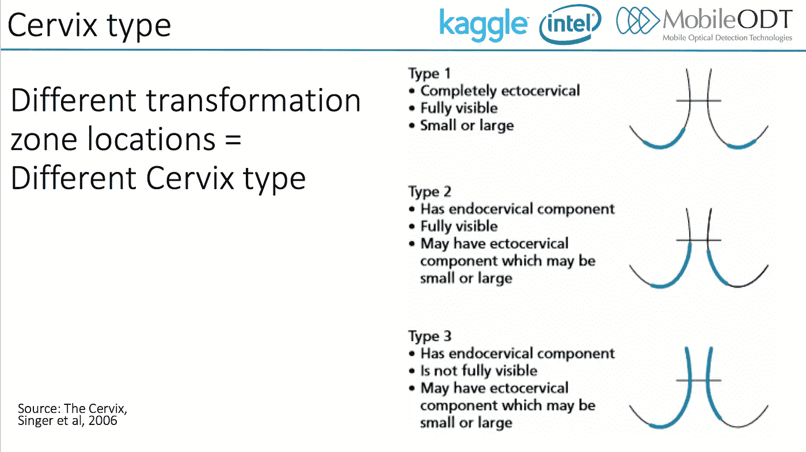
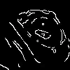
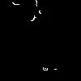
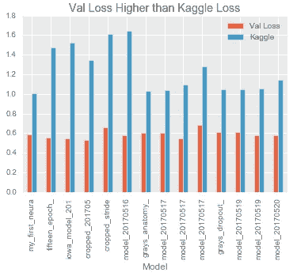
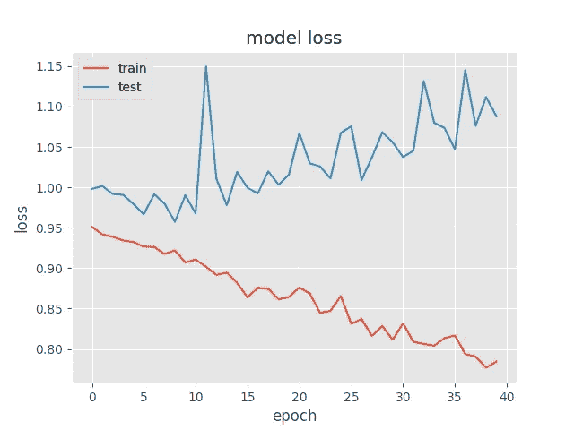
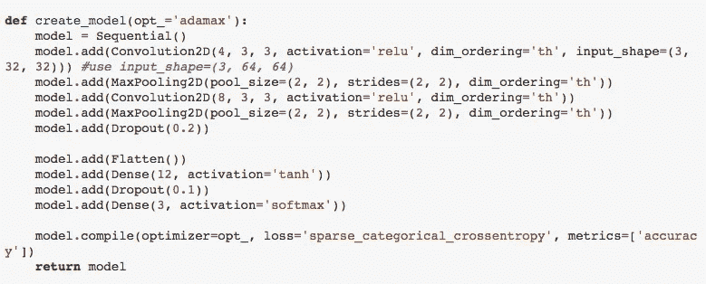
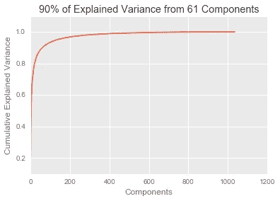

# 用神经网络帮助治疗宫颈癌

> 原文：<https://towardsdatascience.com/helping-treat-cervical-cancer-with-neural-networks-d41c964327f1?source=collection_archive---------8----------------------->

我们即将结束大会数据科学沉浸式项目的最后一周。为了毕业，我们需要完成一个我们选择的课题的期末项目。我有政治竞选背景，但有兴趣学习更多关于医疗保健分析的知识，并发现计算机视觉很有趣，这就是我参加 [Kaggle 的宫颈癌比赛](https://www.kaggle.com/c/intel-mobileodt-cervical-cancer-screening)的原因。

我们得到了 1000 多张子宫颈照片，必须训练一个模型如何根据这些照片正确识别子宫颈类型。什么类型的子宫颈取决于转化区的位置，转化区是一个可能发生癌症的区域。这是很重要的，因为在他们没有资源做巴氏涂片的地方，他们用苦味酸对转化区进行目视检查，以识别癌性病变。如果宫颈为 3 型，且部分转化区不可见，则医务人员需要在此过程中考虑这一点。让这个问题变得困难的是，用未经训练的眼睛很难区分子宫颈类型，这就是 Kaggle 举办这场比赛的原因。

Cervix Types

要参与，您需要通过您的模型运行 Kaggle 的测试照片集，并输出每张照片是 1 型、2 型或 3 型子宫颈的概率。根据测试集上的最低对数损失来判断比赛，这比不确定性对错误的惩罚更大。Kaggle 的基线提交具有 1.00575 的对数损失。

Kaggle Baseline Submission

我选择的工具是卷积神经网络(CNN)，这是一种神经网络，它扫描图像，识别与目标相关的模式。这篇博客不会成为我如何使用 CNN 的成功故事。相反，它是集中在我的错误，这样你就不会陷入同样的陷阱时，做自己的图像识别问题。

**第一课——确保你能区分班级**

我说你作为你作为一个人，你作为一个人。我这样说是因为许多图像识别挑战是我们人类可以轻松完成的。比如 [Kaggle 的狗对猫比赛](https://www.kaggle.com/c/dogs-vs-cats-redux-kernels-edition)或者[硅谷的热狗 App](https://www.youtube.com/watch?v=ACmydtFDTGs) 。有了这些更简单的问题，你就可以更容易地应用预处理技术来帮助你的算法([比如 canny 边缘检测)](https://medium.com/towards-data-science/m2m-day-185-my-attempt-to-intuitively-explain-how-this-self-driving-car-algorithm-works-7422eb2b135e)。

Canny Edge Detection on Type 1 Cervixes. The algorithm was able to outline the cervix of the top photo, but not of the bottom photo.

这与子宫颈图像挑战相比，在子宫颈图像挑战中，照片非常相似，只有细微的差别来区分阶级。我不打算张贴照片，因为我不知道媒体对医学图像的政策，但只是信任。这就是问题的核心所在——如果人类很容易区分这些子宫颈类型，那么我们就不需要计算机视觉的帮助。由于这个障碍，我认为这个挑战更适合计算机视觉专家或有机器学习经验的医生，而不是像我这样的人。

**第 2 课—使用自然损失函数**

我用 Keras 建立我的网络，当我开始时，我注意到他们没有 logloss 作为[损失函数](https://keras.io/losses/)。文件确实说 Tensorflow 损失函数是兼容的，所以我用了 [Tensorflow 的 logloss 函数](https://www.tensorflow.org/api_docs/python/tf/losses/log_loss)。在我最初的模型中，我的验证损失一直低于我的 Kaggle 损失。这很糟糕，因为我的验证失败并没有反映我的模型在现实世界中的表现，而是给出了一个更加乐观的图景。

Validation Loss versus Kaggle Loss for Several Models

在某种程度上，我决定需要看看其他内核，看看发生了什么，我看到其他 Kaggle 用户正在使用 Keras 的本地分类交叉熵作为他们的损失函数。

显然，对数损失和交叉熵是同一个概念。所以我把我的损失转换成分类交叉熵，我的验证损失更接近地反映了我在 Kaggle 上的损失。

**第 3 课——神经网络容易过度拟合**

在我用我的损失函数解决了这个问题之后，我不断地遇到我的网络超载的问题。我添加的时代越多，我的训练损失和测试损失就越偏离，这表明我的架构不能很好地概括。即使我只训练了几个时期，我也不会取得超过基线的成绩。我试着用各种方式改变我的模型:增加 dropout，减少我的卷积步幅，裁剪和灰度化我的图像。无论我如何改变我的架构或者我运行了多少个纪元(无论是高还是低)，我都不能打败基线。

Divergent Train and Test Losses

我真的需要帮助，所以我决定看看人们在 Kaggle 上做什么，并看到了 [Owl1 的内核](https://www.kaggle.com/the1owl/artificial-intelligence-for-cc-screening/notebook)。我最初使用的架构是斯坦福大学教授[安德烈·卡帕西](http://cs231n.github.io/convolutional-networks/)推荐的用于拾取更复杂特性的框架*(输入->【conv->Relu->conv->Relu->池】* 3->【FC->Relu】* 2->FC)*。Owl1 的内核就简单多了，类似 Karpathy 建议的另一个框架*(输入->【conv->Relu->池】* 2->FC->Relu->FC】)*。Owl1 也有 0.89 的 logloss，比我得到的任何分数都好。

Owl1’s Architecture

我不想完全复制 Owl1，但我想学习他的模型。我反复修改了我的模型，使它更接近他的模型，方法如下:

*   使用了更简单的架构(*输入->【conv->Relu->池】* 2->FC->Relu->FC])*
*   使用较少的过滤器
*   用 tanh 替换了最后一次 relu 激活
*   将优化器从 rmsprop 更改为 adamax
*   使用照片的 RGB 版本，而不是灰度版本
*   在 FC 后增加了辍学

不幸的是，这些改变都不能让我超越基线。在这一点上，我复制了 Owl1 的模型，看看我是否能复制他的结果。我想考虑的另一个选择是使用 Keras 的一个预建模型，看看它的性能如何。

**最后一课——神经网络很难，而且需要很多时间**

在这个项目结束时，我有:

*   花了 11 天做模型
*   制作了 30 个神经网络
*   创造了 16 个独特的建筑
*   训练超过 607 个纪元
*   花了超过 150 美元的谷歌云信用

这导致**零**个神经网络超过了 Kaggle 的基线。最接近的一个是我制作的第一个神经网络，logloss 为 1.00616，只有 2 个时期在其上训练。

许多人已经证明神经网络是一个强大的工具，我知道我还有很多要学。最终，神经网络需要花费大量的时间和精力，并且不一定总能给出你想要的结果。

**主成分分析和 SVM 组合**

我确实通过另一种方法越过了 Kaggle 的底线。我使用了图像的灰度/裁剪版本，并通过主成分分析(PCA)运行它们。PCA 是一种降维技术，它使用线性代数来组合特征([参见我的老师 Matt Brem 的帖子了解更多信息](https://medium.com/towards-data-science/a-one-stop-shop-for-principal-component-analysis-5582fb7e0a9c))。每张 100 x 100 的照片由 10，000 个变量表示，每个变量表示一个像素有多亮或多暗。在通过 PCA 运行照片后，我从 1036 个结果成分(或组合特征)中选择了 61 个，这些成分解释了像素亮度/暗度差异的 90%。

然后我用默认参数将结果输入到 [scikitlearn 的支持向量分类器](http://scikit-learn.org/stable/modules/generated/sklearn.svm.SVC.html)(grid search 导致更差的分数)。在提交我的结果后，我勉强跳过了 Kaggle 的基线提交，logloss 为 1.00574。

The Results from my PCA/SVM Combo

来源:

手机 https://www.youtube.com/watch?v=N8OGrykSgy0 ODT 视频:[&t = 543s](https://www.youtube.com/watch?v=N8OGrykSgy0&t=543s)

斯坦福 CNN 课程:[http://cs231n.github.io/](http://cs231n.github.io/)

keras Docs:[https://keras.io/](https://keras.io/)

Keras 博客:[https://Blog . keras . io/building-powerful-image-class ification-models-using-very-little-data . html](https://blog.keras.io/building-powerful-image-classification-models-using-very-little-data.html)

Owl1 的内核:[https://www . ka ggle . com/1 owl/artificial-intelligence-for-cc-screening](https://www.kaggle.com/the1owl/artificial-intelligence-for-cc-screening)