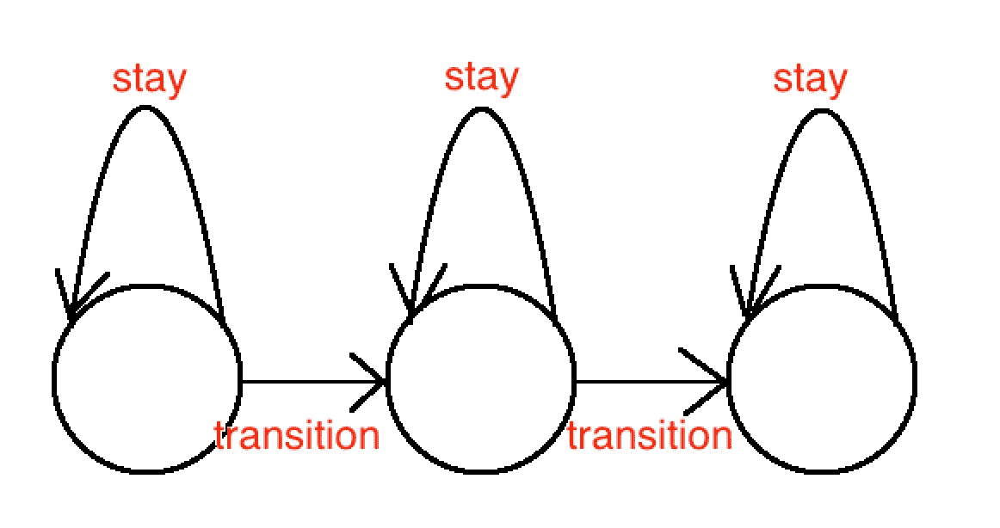
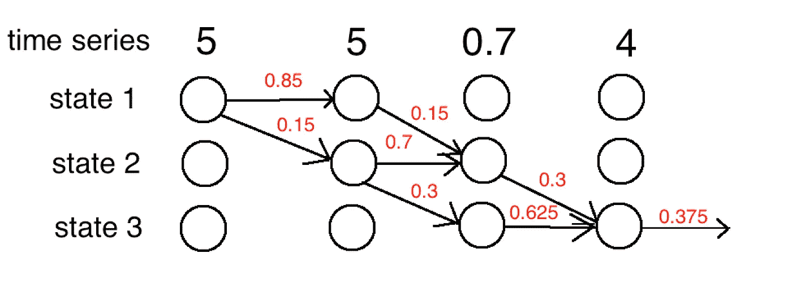
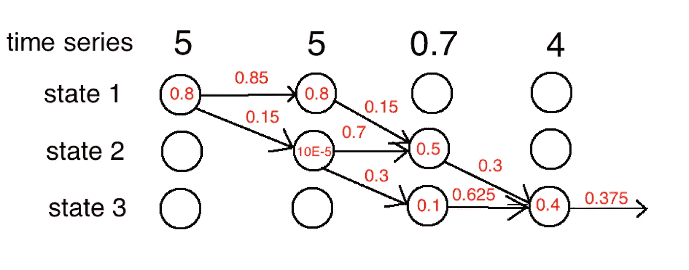

# 用于时间序列分类的隐马尔可夫模型——基本概述

> 原文：<https://towardsdatascience.com/hidden-markov-models-for-time-series-classification-basic-overview-a59b74e5e65b?source=collection_archive---------0----------------------->

注:需要 HMMs 的基础知识。

最近，我一直在努力理解 HMMs 训练和识别特别有趣的时间序列数据集(美国手语)背后的魔力。在这篇文章中，我想对这个过程中的步骤做一个高层次的概述，经过详细的研究，我终于掌握了这个过程。

首先让我们看看数据。单个数据点(ASL 中的单个单词)由分散在离散时间帧中的值组成。

假设我们想要建立一本单词书的模型。我们查看数据集，注意到有三个时间序列对应于图书。我们将 HMM 建立在这三个例子的基础上。

训练前要做的一个重要步骤是决定状态的数量。我们可以凭经验做到。如果我们观察单词书的一个数据点的图，我们可以得出结论，说话者的手通过三个序列进行转换。

因此，我们的隐马尔可夫模型应该包含三个状态。稍后，我们可以用不同数量的状态训练另一个图书模型，比较它们(例如，使用 [BIC](https://en.wikipedia.org/wiki/Bayesian_information_criterion) 惩罚复杂性并防止过度拟合)并选择最佳的一个。现在我们只关注三态 HMM。

每个状态都有两种可能性(都有一定的概率):我们要么保持当前状态，要么进行转换。下面的箭头说明了这个概念。

我们稍后将回到这一点。现在我们将分配适当的高斯分布，它最适合给定状态下的数据。让我们假设来自训练集的单词书的三个示例在离散时间帧上的以下值:

先说一个叫维特比对齐的方法。它开始于将所有的例子大致相等地划分成 3 个群(3 个状态)。

接下来，我们计算每个聚类段的正态分布参数(平均值和标准偏差)。

基于 [Z 值](https://en.wikipedia.org/wiki/Standard_score)，我们稍后查看相邻值，考虑它们对给定分布的适合度，并在必要时更改红色边界。

在反复运行这个方法后，我们得到了对值分布的良好估计。然而，我们可以使用期望最大化算法做得更好，该算法根据正确分布的概率为每个值分配一个权重(P(平均值，标准偏差|值))。我们可以使用贝叶斯定理和给定特定分布(P(value | mean，standard deviation))的值的概率公式来推导。如果我们幸运的话，以下是我们到目前为止可以实现的目标:

以下是具有适当边界的聚类值:

现在让我们再次考虑第一个完整片段。我们可以注意到，在每个序列中有一个值，在这个值之后，我们转换到下一个状态。

如果我们把第一段的所有值都扔进一个盒子里，并试着从三个值中抽取一个，导致转换到下一个状态，我们有多大的机会？概率有多大？实际上很容易计算:3/20 = 0.15 (20 是段中值的总数)。抽取任何其他值(导致停留在第一状态)的概率是互补的(1–0.15 = 0.85)。你猜怎么着？我们刚刚计算了我们的转移和停留概率！让我们将它们添加到模型中。

恭喜你！我们刚刚为单词书训练了三态 HMM。下一步是检查测试时间序列的可能性，比如说:

为此，我们将模型分解为维特比路径，这些路径表示测试时间序列中所有可能的运动(包括转换和停留)。请注意，在下图中，概率仍然保持不变，我们忽略了无法到达最后状态的路径:

在最终计算之前，我们需要添加基于我们之前为每个状态导出的正态分布的时间序列值的概率:

最后一步是计算测试时间序列符合我们的图书模型的可能性。为此，我们将路径上的所有概率相乘，并选择最有可能的一个(具有最大概率)。这些概率往往很小，所以你经常会看到这种计算的对数版本。

所选路径的概率:

0.8 * 0.85 * 0.8 * 0.15 * 0.5 *0.3 * 0.4 * 0.375 = 0.0002754

识别过程基于从不同模型中比较给定时间序列的最佳路径可能性，并选择最高的一个。