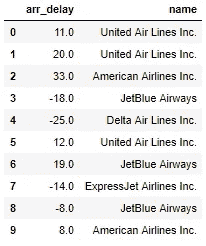
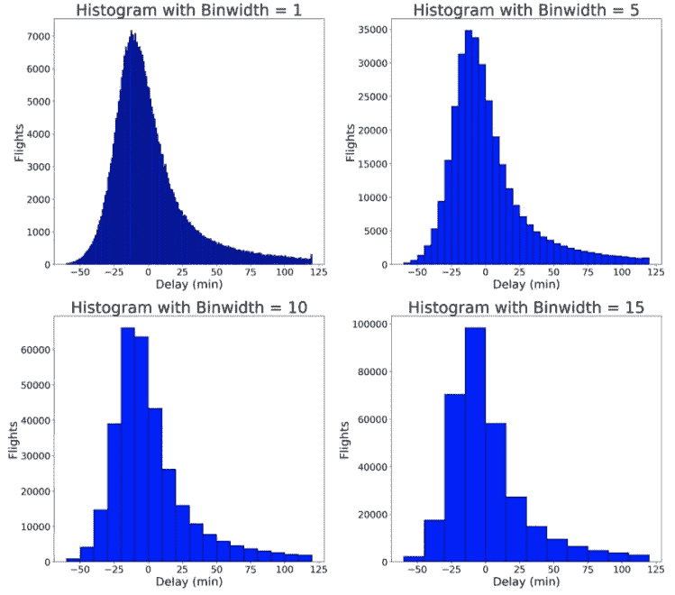
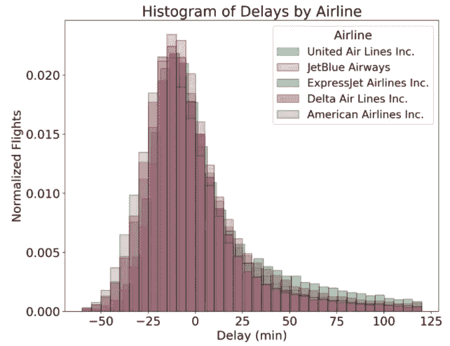
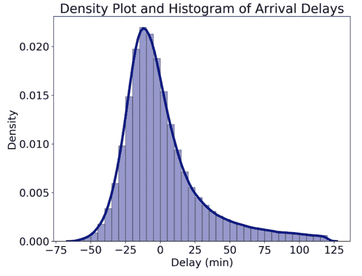
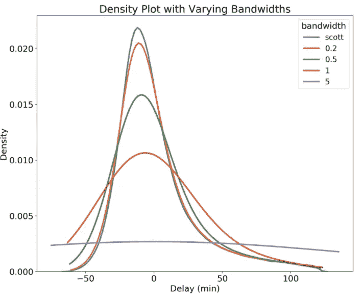
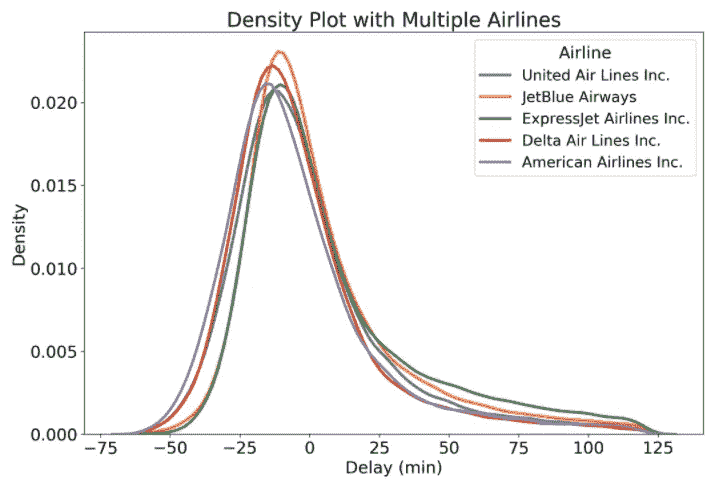
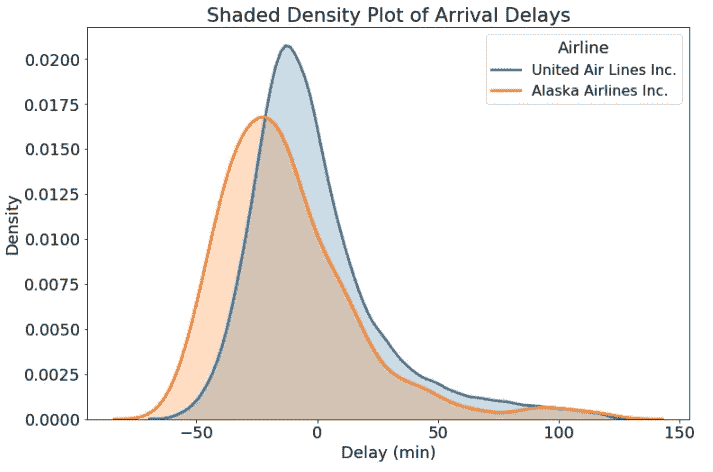
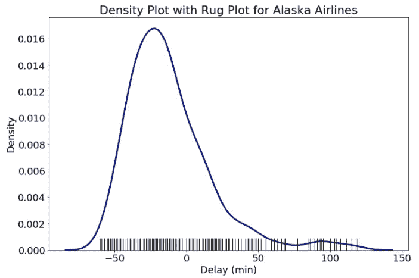

# Python 中的直方图和密度图

> 原文：<https://towardsdatascience.com/histograms-and-density-plots-in-python-f6bda88f5ac0?source=collection_archive---------0----------------------->


**用 Python 可视化一维数据**

绘制单个变量似乎应该很容易。只有一个维度，有效地显示数据有多难？很长一段时间，我通过使用简单的直方图来显示值的位置、数据的分布和数据的形状(正态、偏态、双峰等)。)然而，我最近遇到了一些直方图失败的问题，我知道是时候拓宽我的绘图知识了。我找到了一本[优秀的关于数据可视化的免费在线书籍](http://serialmentor.com/dataviz/)，并实现了其中的一些技术。我没有把我学到的一切都留给自己，而是决定写一个直方图的 Python 指南和一个已经被证明非常有用的替代方法，密度图，这对我和其他人都有帮助。

本文将通过使用 [matplotlib](https://matplotlib.org/) 和 [seaborn](https://seaborn.pydata.org) 库，全面了解如何在 Python 中使用直方图和密度图。自始至终，我们将探索真实世界的数据集，因为有了网上可用的[丰富资源](https://github.com/awesomedata/awesome-public-datasets)，没有理由不使用实际数据！我们将可视化[nyflights 13 数据](https://cran.r-project.org/web/packages/nycflights13/nycflights13.pdf)，其中包含 2013 年超过 300，000 次对纽约出发航班的观察。我们将重点显示一个变量，即航班的到达延迟时间(以分钟计)。本文的完整代码可以从 GitHub 上的 [Jupyter 笔记本中获得。](https://github.com/WillKoehrsen/Data-Analysis/blob/master/univariate_dist/Histogram%20and%20Density%20Plot.ipynb)

在开始绘图之前检查我们的数据总是一个好主意。我们可以将数据读入 pandas 数据帧，并显示前 10 行:

```
import pandas as pd# Read in data and examine first 10 rows
flights = pd.read_csv('data/formatted_flights.csv')
flights.head(10)
```



Head of Dataframe

航班到达延迟以分钟为单位，负值表示航班提前到达(事实证明，航班往往会提前到达，只是我们乘坐的航班从来不会提前到达！)航班超过 30 万次，最小延误-60 分钟，最大延误 120 分钟。数据框中的另一列是我们可以用来比较的航空公司名称。

# 直方图

开始研究单个变量的一个很好的方法是使用直方图。直方图将变量划分为多个区间，对每个区间中的数据点进行计数，并在 x 轴上显示区间，在 y 轴上显示计数。在我们的例子中，箱将是代表航班延误的时间间隔，计数将是落入该间隔的航班数量。二进制宽度是直方图最重要的参数，我们应该总是尝试一些不同的二进制宽度值，以选择最适合我们数据的一个。

要用 Python 制作一个基本的直方图，我们可以使用 matplotlib 或者 seaborn。下面的代码展示了两个库中创建等价图形的函数调用。对于绘图调用，我们通过面元的数量来指定面元宽度。对于这个图，我将使用长度为 5 分钟的仓，这意味着仓的数量将是数据范围(从-60 到 120 分钟)除以仓宽度，5 分钟(`bins = int(180/5)`)。


Histogram (equivalent figured produced by both matplotlib and seaborn)

对于大多数基本的直方图，我会使用 matplotlib 代码，因为它更简单，但是我们稍后将使用 seaborn `distplot`函数来创建不同的分布，熟悉不同的选项是有好处的。

我是怎么想出 5 分钟的宽度的？找出最佳 binwidth 的唯一方法是尝试多个值！下面是在 matplotlib 中用一系列 binwidths 制作相同图形的代码。最终，binwidth 没有正确或错误的答案，但我选择 5 分钟，因为我认为它最能代表分布。



Histograms with Different Binwidths

binwidth 的选择会显著影响结果图。较小的二进制宽度会使图变得杂乱，但较大的二进制宽度可能会模糊数据中的细微差别。Matplotlib 会自动为你选择一个合理的 binwidth，但是我喜欢在尝试了几个值之后自己指定 binwidth。没有真正正确或错误的答案，所以尝试几个选项，看看哪个最适合您的特定数据。

# 当直方图失败时

直方图是从一个类别开始探索单个变量的好方法。然而，当我们想要比较一个变量在多个类别中的分布时，直方图存在可读性问题。例如，如果我们想要比较航空公司之间的到达延迟分布，一种不太有效的方法是在同一图上为每个航空公司创建直方图:



Overlapping Histograms with Multiple Airlines

(请注意，y 轴已被归一化，以反映航空公司之间不同的航班数量。为此，将参数`norm_hist = True`传递给`sns.distplot`函数调用。)

这个情节不是很有帮助！所有重叠的条形图使得航空公司之间几乎不可能进行比较。让我们来看看这个常见问题的几种可能的解决方案。

## 解决方案#1:并排直方图

我们可以将它们并排放置，而不是重叠航线直方图。为此，我们为每个航空公司创建一个到达延迟列表，然后将它作为一个列表列表传递给`plt.hist`函数调用。我们必须为每家航空公司指定不同的颜色和标签，这样我们才能区分它们。包括为每个航空公司创建列表在内的代码如下:


默认情况下，如果我们传入一个列表的列表，matplotlib 会将条形并排放置。在这里，我已经将 binwidth 改为 15 分钟，因为否则情节会过于混乱，但即使进行了修改，这也不是一个有效的数字。有太多的信息需要一次处理，条形图与标签不一致，而且仍然很难比较航空公司之间的分布情况。当我们制作一个情节时，我们希望观众尽可能容易理解，而这个人物没有达到那个标准！让我们看看第二个可能的解决方案。

## 解决方案 2:堆积条形图

我们可以通过向直方图调用传递参数`stacked = True`来堆叠每个航空公司的柱状图，而不是并排绘制柱状图:

```
# Stacked histogram with multiple airlines
plt.hist([x1, x2, x3, x4, x5], bins = int(180/15), stacked=True,
         normed=True, color = colors, label=names)
```


嗯，那绝对不会好到哪里去！在这里，每家航空公司都代表了每个仓位整体的一部分，但几乎不可能进行比较。例如，在-15 到 0 分钟的延迟时，联合航空公司或捷蓝航空公司的酒吧尺寸更大吗？我不知道，观众也不会知道。我一般不支持堆积条形图，因为它们可能很难解释([虽然有一些用例](http://serialmentor.com/dataviz/visualizing-proportions.html)，比如可视化比例)。我们尝试使用直方图的两种解决方案都不成功，所以是时候转向密度图了。

# 密度图

首先，什么是密度图？[密度图](http://serialmentor.com/dataviz/histograms-density-plots.html)是根据数据估计的直方图的平滑、连续版本。最常见的估计形式被称为[核密度估计](https://en.wikipedia.org/wiki/Kernel_density_estimation)。在这种方法中，在每个单独的数据点绘制一条连续的曲线(内核),然后将所有这些曲线加在一起，进行一次平滑的密度估计。最常用的核是高斯核(在每个数据点产生一个高斯钟形曲线)。如果你和我一样，觉得这样的描述有点混乱，看看下面的情节:


Kernel Density Estimation ([Source](https://en.wikipedia.org/wiki/Kernel_density_estimation))

这里，x 轴上的每条黑色竖线代表一个数据点。各个内核(本例中为高斯内核)在每个点上方用红色虚线表示。蓝色实线曲线是通过将各个高斯曲线相加得到的，并形成总密度图。

x 轴是变量的值，就像直方图一样，但是[y 轴到底代表什么](https://stats.stackexchange.com/questions/48109/what-does-the-y-axis-in-a-kernel-density-plot-mean)？密度图中的 y 轴是用于核密度估计的概率密度函数。然而，我们需要小心指定这是一个概率*密度*而不是一个概率。区别是[概率密度是 x 轴上每单位的概率](https://stats.stackexchange.com/questions/4220/can-a-probability-distribution-value-exceeding-1-be-ok)。要转换成实际概率，我们需要找到 x 轴上特定区间的曲线下面积。有点令人困惑的是，因为这是一个概率密度而不是一个概率， [y 轴可以取大于 1 的值。](https://stackoverflow.com/questions/42661973/r-density-plot-y-axis-larger-than-1)密度图的唯一要求是曲线下的总面积积分为 1。我通常倾向于将密度图上的 y 轴视为仅用于不同类别之间相对比较的值。

## 锡伯恩的密度图

为了在 seaborn 中绘制密度图，我们可以使用`distplot`或`kdeplot`函数。我将继续使用`distplot`函数，因为它允许我们通过一次函数调用进行多次分发。例如，我们可以制作一个密度图，在相应的直方图顶部显示所有到达延迟:

```
# Density Plot and Histogram of all arrival delays
sns.distplot(flights['arr_delay'], hist=True, kde=True, 
             bins=int(180/5), color = 'darkblue', 
             hist_kws={'edgecolor':'black'},
             kde_kws={'linewidth': 4})
```



Density Plot and Histogram using seaborn

该曲线显示了密度图，其本质上是直方图的平滑版本。y 轴表示密度，默认情况下直方图是归一化的，因此它与密度图具有相同的 y 轴刻度。

类似于直方图的二进制宽度，密度图有一个称为 [**带宽**](https://en.wikipedia.org/wiki/Kernel_density_estimation#Bandwidth_selection) 的参数，该参数会改变单个内核并显著影响图的最终结果。绘图库将为我们选择一个合理的带宽值(默认情况下[使用‘Scott’估计值](https://stats.stackexchange.com/questions/90656/kernel-bandwidth-scotts-vs-silvermans-rules))，与直方图的 binwidth 不同，我通常使用默认带宽。但是，我们可以考虑使用不同的带宽，看看是否有更好的选择。在情节中，“斯科特”是默认的，这看起来是最好的选择。



Density Plot Showing different Bandwidths

请注意，带宽越宽，分布越平滑。我们还看到，即使我们将数据限制在-60 到 120 分钟，密度图也超出了这些限制。这是密度图的一个潜在问题:因为它计算每个数据点的分布，所以可能会生成超出原始数据范围的数据。这可能意味着我们最终在 x 轴上得到不可能的值，而这些值在原始数据中从未出现过！请注意，我们还可以更改内核，这将更改在每个数据点绘制的分布，从而更改整体分布。然而，对于大多数应用程序，默认的内核，高斯和默认的带宽估计工作得很好。

## 解决方案 3 密度图

现在我们已经了解了密度图是如何制作的，它代表了什么，让我们看看它如何解决我们可视化多个航空公司的到达延迟的问题。为了在同一个图上显示分布，我们可以遍历航空公司，每次调用`distplot`，将内核密度估计值设置为 True，将直方图设置为 False。绘制多家航空公司密度图的代码如下:



Density Plot with Multiple Airlines

最后，我们达成了一个有效的解决方案！有了密度图，我们可以很容易地在航空公司之间进行比较，因为这个图不那么杂乱。现在我们终于有了我们想要的图，我们得出结论，所有这些航空公司都有几乎相同的到达延迟分布！然而，数据集中还有其他航空公司，我们可以绘制一个稍有不同的航空公司，以说明密度图的另一个可选参数，对图表进行着色。

## 阴影密度图

填充密度图可以帮助我们区分重叠分布。尽管这并不总是一个好方法，但是它可以帮助强调发行版之间的差异。为了给密度图着色，我们将`shade = True`传递给`distplot`调用中的`kde_kws`参数。

```
sns.distplot(subset['arr_delay'], hist = False, kde = True,
                 kde_kws = {'shade': True, 'linewidth': 3}, 
                  label = airline)
```



Shaded Density Plot

是否对绘图进行着色和其他绘图选项一样，是一个取决于问题的问题！对于这个图表，我认为它是有意义的，因为阴影帮助我们区分重叠区域中的图。现在，我们终于有了一些有用的信息:阿拉斯加航空公司的航班往往比联合航空公司更早更频繁。下次你有选择的时候，你就知道该选择哪家航空公司了！

## 地毯地块

如果您想要显示分布中的每个值，而不仅仅是平滑的密度，您可以添加地毯图。这显示了 x 轴上的每一个数据点，使我们能够可视化所有的实际值。使用 seaborn 的`distplot`的好处是我们可以用一个参数调用`rug = True`来添加 rug plot(也有一些格式)。



Density Plot with Rug Plot for Alaska Airlines

如果有很多数据点，地毯图可能会变得过于拥挤，但对于某些数据集，查看每个数据点可能会有所帮助。rug 图还让我们看到了密度图是如何在不存在数据的地方“创建”数据的，因为它在每个数据点创建了一个核分布。这些分布可能会泄漏原始数据的范围，并给人以阿拉斯加航空公司的延误时间比实际记录的时间更短或更长的印象。我们需要小心这个密度图的伪像，并指出给观众看！

# 结论

这篇文章有望给你一系列的选项来可视化一个或多个类别中的单个变量。我们甚至可以制作更多的单变量(单变量)图，如[经验累积密度图和分位数-分位数图](http://serialmentor.com/dataviz/ecdf-qq.html)，但现在我们将把它留在直方图和密度图(还有地毯图！).如果选项看起来势不可挡，不要担心:通过练习，做出一个好的选择会变得更容易，如果需要，你可以随时寻求帮助。此外，通常不存在最优选择，而“正确”的决定将取决于偏好和可视化的目标。好的一面是，无论你想制作什么样的情节，在 Python 中都有一种方法可以做到！可视化是交流结果的有效手段，了解所有可用选项可以让我们为数据选择正确的数字。

我欢迎反馈和建设性的批评，可以通过 Twitter [@koehrsen_will](https://twitter.com/koehrsen_will) 联系到我。