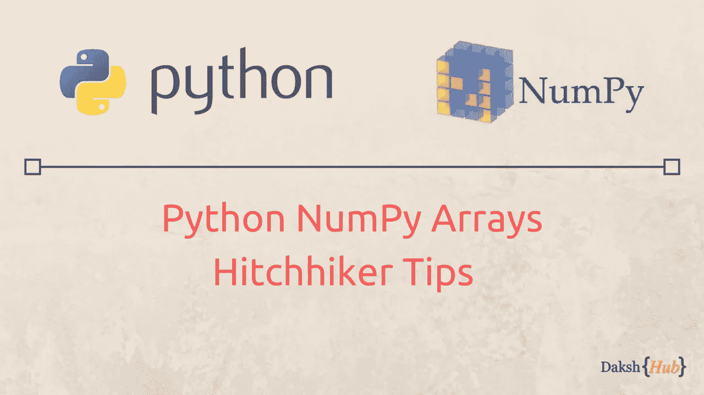

# 关于有效使用 Python NumPy 数组的搭便车技巧

> 原文：<https://towardsdatascience.com/hitchhiker-tips-on-effectively-using-python-numpy-arrays-66649b7bd5fb?source=collection_archive---------5----------------------->



Tips on Effectively using NumPy Arrays

如果您正在使用 python 进行数据科学研究，那么您要么使用过 NumPy，要么肯定听说过它。大多数需要将数据存储在内存中的统计分析都使用 NumPy。

如果你是 NumPy 的新手，我强烈推荐你阅读我之前的文章[python NumPy 数组的搭便车指南](/a-hitchhiker-guide-to-python-numpy-arrays-9358de570121)来了解 NumPy 的基本用法。

在这篇文章中，我将讨论一些具体的技巧、窍门和技术，它们将帮助你获得大多数 NumPy 数组

## 1.修改现有的 NumPy 数组

> 与 Python 列表不同，NumPy 没有`append(...)`函数，这实际上意味着我们不能追加数据或改变 NumPy 数组的大小。
> 
> 为了改变大小和/或维度，我们需要通过在旧数组上应用效用函数来创建新的 NumPy 数组。

从语法上来说，NumPy 数组类似于 python 列表，我们可以使用下标操作符来插入或更改 NumPy 数组的数据。例如，对于大小为 5 的 NumPy 数组，我们可以使用像`while`和`for`这样的循环来访问/更改/更新内容

Changing individual events of NumPy array

可以理解的是，这是一种非常过时的、非功能性的访问/操作数据的方式。幸运的是，NumPy 为 same 提供了批量访问功能，它在一行中毫不费力地做了同样的事情。一个这样的功能是`numpy.put(...)`。

为了描述`numpy.put(...)`的用法，我们将创建一个 python 列表并将该列表的内容复制到 NumPy 数组中

Using numpy.put(…) function

`numpy.put(...)`函数获取一个范围，然后使用该范围从目的地复制源。副本将被限制在`range(..)`功能中提供的数量。

在上面的例子中，如果我们将`np.put(...)`线改为

```
np.put(np_arr, range(3), py_arr)
```

它将只改变`np_arr`的前三个元素，其他的都不变

`np.put(...)`函数的适用性不仅限于复制一维数组，还可以用于复制 n 维数组，如下面的代码所示

numpy.put(…) for multi dimensional array

使用`np.put(...)`函数，我们可以提供一个数字列表，但是，在某些情况下，我们希望将相同的数字复制到 NumPy 的所有元素中。这类似于调用`np.zeros(...)`或`np.ones(...)`，区别在于除了 0 和 1 之外，还可以提供其他数字

> 这是通过调用`np.fill(...)`函数实现的。

无论我们在填充中提供什么数字(..)，它适用于 NumPy 数组的所有元素，而不管该数组是一维数组还是多维数组

Using numpy.fill(…) function

`.fill(..)`函数只接受标量值。

这里描述的是`dtype=np.int`的例子。它也适用于所有其他数据类型，如`np.float, np.str, np.object`等

## 2.切片 NumPy 数组

> 如果你有切割 python 列表的经验，在这里你会感觉像在家里一样。

切片 NumPy 数组带来了额外的功能，并且在多维数组的情况下变得有趣。然而，为了正确理解切片是如何工作的，我们需要在研究多维数组之前先研究一维数组。

> `:`被称为**分隔符**，与 ***相容—不相容*** 原理一起工作，这意味着分隔符的左侧将被包含，而分隔符的右侧将被排除。

例如，`np_arr[1:4]`这样的语句意味着它将包括索引→ 1，但排除索引→ 4。因此这将有效地显示 Index → 1，2 & 3 中的元素

下面是一些对一维数组进行切片的例子以及它们的预期输出

Slicing 1-D arrays

切片的一个独特功能出现在 **NumPy** 数组中，但不能用于 python **list** 中，这就是用一个值就地改变数组**的多个元素的能力。**

老实说，这是非常有价值的功能之一，对数学和机器学习都有帮助。下面是使用该功能的方法

Slicing 1-D array

现在让我们来看一下多维数组的切片。当我们对多维数组进行切片时，分隔符左边和右边的含义保持不变(即索引),但我们通过使用两组逗号分隔的分隔符来扩展它，这两组分隔符代表**行**和**列**,即

`[rows → Start_Index : End_Index, Column → Start_Index : End_Index ]`

下面是一些例子，说明在 2D 阵列中切片意味着什么

Slicing a 2 — D Array

类似地，对于 3D 数组，我们必须为一个维度添加一个逗号分隔的值。这里有一些相同的例子

Slicing a 3-D Array

## 3.拆分 NumPy 数组

在某些时候，有必要将 n-d NumPy 数组分成行和列。拆分 numpy 数组有多种函数和方法，但是有助于按行和按列拆分 NumPy 数组的两个特定函数是`split`和`hsplit`。

*   `split`功能用于**行*行*行**行的明智拆分
*   `hsplit`功能用于 ***列*** 的明智拆分

拆分 NumPy 数组的最简单方法可以在它们的维度上完成。一个 3 * 4 的数组可以很容易地分成 3 组行列表和 4 组列列表。下面是我们如何做同样的事情

NumPy Split Row and Column wise

如果多重因子允许分割，我们可以提供一个不同于分割可用维数的数。例如，我们可以将数组按列分为 2 组，如下所示

## 多重不均匀分裂

在上面的例子中，我们提供了一个数字来按行或列等分 NumPy 数组。

> 但是，通过提供需要拆分的精确索引，可以在不同的行和列上进行不均匀的拆分。

它的工作原理就像我们上面看到的切片一样。基于列表中提供的索引，这些拆分函数将相应地对行或列进行切片。

让我们假设我们有相同的 2D 数组如上所示，我想做自定义分裂。

情况 1:将 3 行分成[1]和[2，3]

在这里，我想将行分成两部分，我们提取第一行，然后将第二行和第三行合并为一行。我们将这样做

Splitting Rows

情况 2:将 4 列分为[1]、[2、3]和[4]

在这里，我想将列分成三部分，我们提取第一列，然后是第二+第三列，最后是第四列。我们将这样做

Splitting Columns

所以这是 NumPy 的一些小技巧，可以帮助你更好地使用它。

> 这就是这个故事的全部内容。更多关于下一组故事。

感谢阅读…！！！

达克什