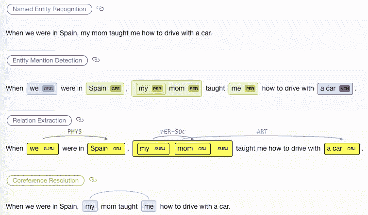
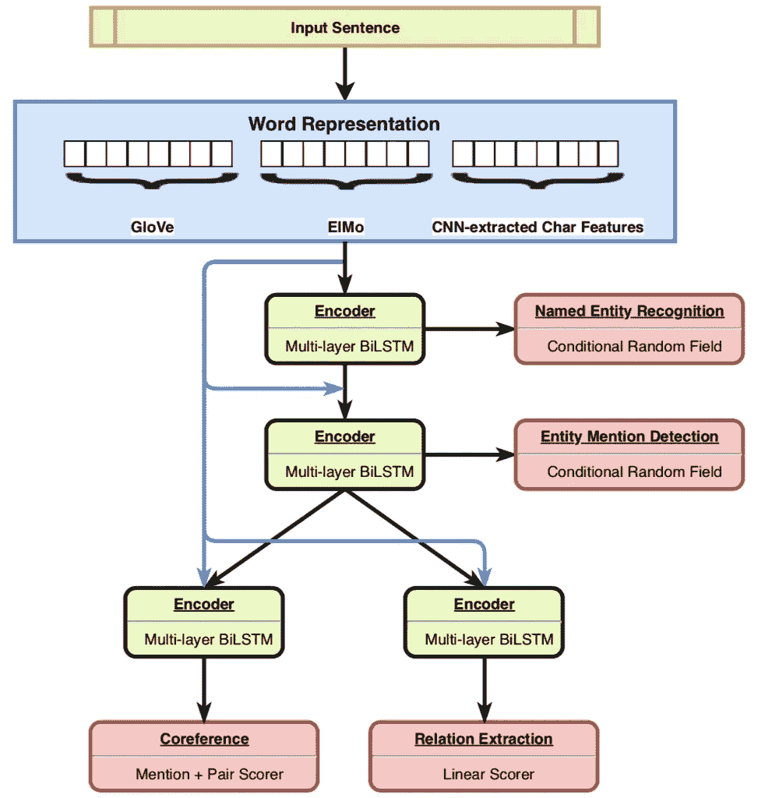
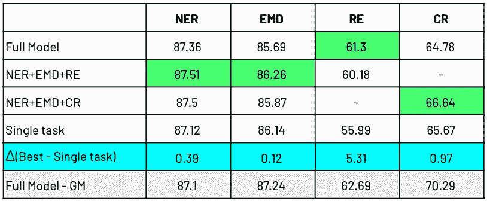

# HMTL -解决自然语言处理任务的多任务学习

> 原文：<https://towardsdatascience.com/hmtl-multi-task-learning-for-solving-nlp-tasks-cfae39b3d6e1?source=collection_archive---------11----------------------->

## 通过在任务间转移知识实现 SOTA 结果

自然语言处理领域包括许多任务，其中包括机器翻译、命名实体识别和实体检测。虽然不同的 NLP 任务通常是分别训练和评估的，但是将它们合并到一个模型中存在潜在的优势，即学习一个任务可能有助于学习另一个任务并改善其结果。

分层多任务学习模型( [HMTL](https://arxiv.org/pdf/1811.06031.pdf) )提供了一种学习不同 NLP 任务的方法，首先训练“简单”的任务，然后使用这些知识训练更复杂的任务。该模型展示了几个任务的最新表现，并对模型每个部分的重要性进行了深入分析，从单词嵌入的不同方面到任务的顺序。

# 背景

近年来的几篇论文表明，结合多个自然语言处理任务可以产生更好和更深层次的文本表示。例如，识别句子中的实体，如地名或人名，有助于在后续句子中找到对它们的提及。然而，并非所有的 NLP 任务都是相关的，选择对其他任务有益的相关任务是很重要的。

HMTL 模型关注四个不同的任务:命名实体识别，实体提及检测，共指消解，关系抽取。

1.  **命名实体识别(NER)** -识别文本中的实体类型(如个人、组织、位置等。)
2.  **实体提及检测(EMD)**——NER 的扩展版本，识别任何与现实生活中的实体相关的提及，即使它不是一个名字。
3.  **共指消解(CR)**——对同一实体的提及进行识别和分组。
4.  **关系提取(RE)** -识别实体并对它们之间的关系类型进行分类(如果存在)。关系的类型可以在[这里](https://www.ldc.upenn.edu/sites/www.ldc.upenn.edu/files/english-rdc-v4.3.2.PDF)找到。由于 RE 和 CR 在语义上的相似性，它们都在同一层级上。

下面的文字说明了任务之间的区别(一个很棒的演示可以在这里找到):
*我们在西班牙的时候，我妈妈教我如何开车。她还解释了如何给它加油*

所有四项任务都与识别文本中的实体以及它们之间的关系有关，具有不同的复杂程度——而 NER 是最简单的一项，认知无线电和认知无线电需要对文本有更深的理解。因此，学习一项任务可能有助于学习其他任务。

# HMTL 模式

HMTL 是一个层次模型，在这个模型中，最初简单的任务，如 NER，被学习，然后他们的结果被用来训练接下来的任务。每个任务由三个部分组成:单词嵌入、编码器和特定于任务的层。

该模型的基础是使用三种模型将输入句子中的每个单词嵌入向量的**单词表示法**:

1.  [手套](https://nlp.stanford.edu/projects/glove/) —预先训练的单词嵌入。这个模型中的单词没有上下文，给定的单词总是用相同的向量表示。
2.  [ELMo](https://allennlp.org/elmo) —预训练的上下文单词嵌入。单词的矢量表示不仅取决于单词本身，还取决于句子中的其他单词。ELMo 是[胶水基准](https://gluebenchmark.com/leaderboard)中表现最好的模特之一。
3.  字符级单词嵌入-一种卷积神经网络，它根据字符级特征学习表示单词。这种表示对形态特征(前缀、后缀等)更敏感，形态特征对于理解实体之间的关系很重要。

此外，每个任务都用专用的**编码器**进行训练——这是一个多层递归神经网络，可以生成为任务量身定制的单词嵌入。编码器使用双向 GRU 单元网络实现，其输出是前向和后向网络最后一层的级联。编码器的输入由基本单词表示和前一个任务编码器的输出(如果可用)组成。

在编码器之上，每个任务使用不同的神经网络，如下所述:

1.  前两个层次(NER 和 EMD)使用一个条件随机场，根据一个词的相邻词的类型来预测该词的实体类型。该算法背后的概念是，它为句子中的所有单词 a 一起找到实体的最佳组合。很好的解释这个算法可以在[这里找到](http://blog.echen.me/2012/01/03/introduction-to-conditional-random-fields/)。
2.  在共指消解(CR)中，[模型](https://arxiv.org/pdf/1707.07045.pdf)首先计算每个单词序列(“span”)成为前一个 span 的提及的可能性，例如，代词比动词更有可能成为提及。然后，它挑选前 N 个跨度，并计算每个跨度组合的得分，以形成一对。每个跨度最多可以是一个跨度的引用，通过使用 softmax 实现。在没有找到配对的情况下，添加一个伪令牌。
3.  关系提取(RE)任务使用一个图层来计算每对标记匹配每种关系类型的概率(总共为 T * R_types 个概率)。该模型使用 sigmoid 函数，而不是 softmax，以允许每个令牌有多个关系。

训练分层模型的挑战之一是灾难性遗忘，在这种情况下，训练新任务会导致模型“忘记”以前的任务，并对它们实现降级的性能。HMTL 通过在当前任务的训练过程中(每次参数更新后)随机选取一个先前的任务，并在随机任务数据集中的随机样本上训练模型，来处理灾难性遗忘。选择一项任务进行训练的概率并不一致，而是与其数据集的大小成比例，这是一种作者发现更有效的技术。

## 数据集

该模型在几个数据集上进行训练以进行比较，其中两个关键数据集是 NER 的 OntoNotes 5.0 和其余任务的 ACE05。ACE05 用于两种配置——常规和金牌提及(GM ), GM 配置由两部分组成:

1.  共指消解(CR)任务的评估基于人工提取的黄金提及，而不是自动提及。这些提及的生成成本更高，并且无法用于大多数数据集。根据这篇论文，在评估中使用黄金提及可以提高 CR 的性能。
2.  使用用于训练 RE 和 EMD 任务的相同数据集(ACE05)的不同分割来训练 CR 任务。使用不同的分割可以帮助模型学习更丰富的表示。

# 结果

该论文声称，通过使用黄金提及(GM)配置训练完整模型，在实体提及检测(EMD)和关系提取(RE)方面取得了最先进的结果。根据该论文，在训练中使用 GM 配置将 CR 任务的 F1 分数提高了 6 分，同时将 EMD 和 re 任务提高了 1-2 分。

该论文还声称在命名实体识别方面取得了最先进的结果，尽管最近的 [BERT](https://arxiv.org/pdf/1810.04805.pdf) 模型似乎取得了略好的结果。然而，很难比较这两者，因为 HMTL 模型没有针对伯特使用的数据集进行微调。伯特的总结可以在[这里](https://www.lyrn.ai/2018/11/07/explained-bert-state-of-the-art-language-model-for-nlp/)找到。

这篇论文的另一个有趣的结果是减少了达到相同性能所需的训练时间。完整模型(含 GM)比大多数单一任务(NER (-16%)、EMD (-44%)和 CR (-28%)需要的时间少，但比 RE (+78%)需要的时间多。

关于 GM 配置的一个可能的担心是“信息泄漏”——由于不同的分割，用于训练一个任务的记录可能稍后被用作另一个任务的测试。关于这些记录的知识可能存储在一个共享层中，从而允许人工改进结果。

# 消融研究

**任务组合**多任务训练的贡献似乎是不确定的，取决于任务:

1.  不同的任务通过不同的任务组合获得了最好的结果，这意味着没有一个占优势的组合。
2.  在低级任务中，等级模型的好处很小(低于 0.5 F-1 分)。
3.  最大的改进是在 RE 任务中实现的，超过 5 个 F-1 点。一种可能的解释是，EMD 任务在 re 任务之前被训练，并且学习识别与 RE 任务几乎相同的实体。

Task combinations comparison

**单词表示**
如前所述，该模型的基础是单词表示，它由三个模型组成——GloVe、ELMo 和字符级单词嵌入。这些模型的选择对模型性能也有很大的影响，如下表所示。Elmo 嵌入和字符级嵌入给大多数任务的 F-1 分数各增加 2-4 分。

Comparison of Word representation (Source: [Sanh et al.](https://arxiv.org/pdf/1811.06031.pdf))

# 结论

本文介绍了一种有趣的技术，它将看似独立的 NLP 任务和技术结合起来，以在语言分析中获得最佳结果。这些结果强调了对该领域进行进一步研究的必要性，因为目前很难理解何时特定的 NLP 任务可以有助于改善不相关的 NLP 任务的结果。

*特别感谢本文作者之一 Victor Sanh，他对 HMTL 的运作提出了宝贵的见解。*