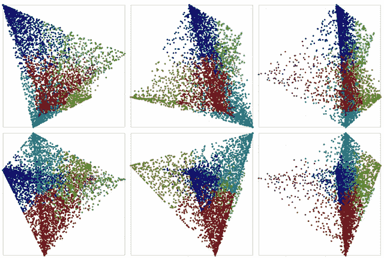

# 与产品团队召开有效的分析会议

> 原文：<https://towardsdatascience.com/holding-effective-analytics-meetings-with-product-teams-2f792add1cf9?source=collection_archive---------4----------------------->

2015 年，我在游戏分析峰会上做了一个[演讲](https://www.slideshare.net/BenWeber1/holding-effective-data-meetings)，讲述了我在黎明游戏与不同游戏团队合作的经历。从那以后，我一直与电子艺界和 Twitch 的产品团队合作，并想为这次演讲提供一个更新。大多数科技公司现在都有分析团队，但将数据见解转化为可操作的结果通常很有挑战性。

我在 Daybreak Games 面临的挑战是，我在营销组织中领导一个中央分析团队，该团队需要与位于圣地亚哥和奥斯汀的游戏工作室合作。我们在产品团队中嵌入了分析师，但需要更多的结构来使工作室领导更加了解数据。我们努力实现这一目标的一种方式是改进分析团队与产品团队安排和举行会议的方式。

在重新设计如何安排会议时，我们会提出以下问题:

1.  我们应该与产品团队共享哪些数据？
2.  我们应该何时以及如何共享数据？
3.  我们如何根据数据洞察采取行动？

为了确保分析团队能够与产品团队有效沟通，我们需要确定一组产品 KPI(关键性能指标),作为讨论的起点。如果没有首先决定如何跟踪产品性能，以及了解不同 KPI 之间的关系，您就有可能会因为关于跟踪什么是重要的问题而使会议偏离轨道。在《黎明游戏》中，我们提出了六个指标，在我们所有的游戏中进行跟踪，并利用这些 KPI 建立了工作室可以访问的自动化报告。我们确实担心的一个问题是，在整个公司范围内分享太多关于敏感话题的信息，比如公司财务状况。我们的方法是将所有报告和数据提供给工作室负责人，并为游戏团队的所有成员提供对特定游戏报告的访问。

一旦我们决定了如何与产品团队沟通，我们需要决定如何通过会议与团队合作。我们提出了三种方法，将在下一节详细讨论。这些不同会议的目标是确保我们能够向产品团队介绍我们的 KPI，定期检查性能，同步新功能的计划，并根据分析团队的发现提出建议。我们希望提供足够的结构，以便产品团队认为会议提供了关于产品性能的足够详细的信息，而不是默认向分析师提出特别的请求。

第三个挑战是让产品团队响应来自报告和分析的数据。我们最初的重点是让工作室领导可以访问自动报告，并让产品团队在分析会议中领导更多的讨论。这种成功因游戏团队而异，因为领导者有不同的背景和技术专长，但作为一家公司，我们在成为数据信息公司方面取得了一些进展。我们采取的另一种方法是直接与游戏团队合作，将分析团队提出的模型产品化。这包括对游戏内信息系统、营销工作和游戏内市场的改进。

在 Electronic Arts 和 Twitch，由于这些公司的规模，我在与产品团队合作时遇到了不同的问题。大多数产品团队已经确定了一组要跟踪的 KPI，但是不清楚跨团队的不同 KPI 是如何交互的。如果度量标准之间的关系不清楚，那么会议可能会因为讨论产品的分食或对归属的关注而偏离轨道。为了解决电子艺界的这一问题，我们必须更好地了解 EA Access 订阅服务和 Xbox One 游戏销售之间的关系，而在 Twitch，我们必须更深入地了解网络和移动观众之间的关系。一旦就这些不同的 KPI 如何交互达成一致，分析团队就能够召开更有效的会议。

# 分析会议

在修改了我们的 KPI 并在 daken Games 上报告之后，分析团队开始与产品团队召开以下类型的会议:

1.  分析 101
2.  数据 Scrum 会议
3.  数据洞察会议

我们安排的第一类会议是与产品团队的领导一起审查我们的新报告工具，并解释我们重点跟踪的一组 KPI。然后，我们向公司的每个人开放了这些会议，并倡导更多地了解数据。这些分析 101 会议的目标是确保公司的每个人都知道我们在跟踪什么以及为什么。我们还举办了分析办公时间，产品团队的成员可以在这里学习如何获得更多的数据。

我们安排的第二组会议是每周与数据团队进行的简短的检查，称为数据 scrum 会议。我们为每个游戏都开了一次会，与会者包括来自不同学科的领导，包括设计、工程和品牌。这些会议的目标是跟踪标题的表现，并讨论更新(如促销活动)如何影响 KPI。在 Twitch，我们也利用这种类型的会议来讨论即将推出的功能，并确保我们对即将推出的新功能有跟踪规格和实验计划。数据 scrums 对于回顾分析团队在过去一周调查的特别请求，以及与更广泛的团队分享结果也很有用。

我们不想让自己的会议太多，所以我们尽量缩短 data scrum 会议，并根据需要安排 data insights 会议，当有更多实质性的结果需要讨论时。这类会议的目标是讨论分析的结果，为什么它很重要，并讨论如何根据发现做出响应。例如，我们可能希望根据对季节性商品销售的分析，对某个游戏市场进行更改。在电子艺界，我们会有类似的会议，通常可交付的是会后共享的幻灯片。Twitch 使用了一种不同的方法，分析团队会写一份长格式的报告，通过电子邮件发送给团队，然后根据产品团队的反馈召开会议。当 A/B 实验有冲突的结果时，数据洞察会议是有用的，并且产品团队需要确定是否全面推出该功能。

分析团队通常也参与每月的业务回顾会议，但通常不是与产品团队合作的好论坛。这些会议往往侧重于向高管提供细节，并往往侧重于产品路线图，而不是解释过去的业绩。

为了让分析师有效地与产品团队合作，重要的是要有足够的结构，让团队能够有效地交流产品性能，有机会在必要时分享发现，并能够跟进可操作的结果。在 Daybreak Games，我们通过标准化 KPI 和设置自动报告、安排教育会议来宣传我们的新方法、召开简短的定期会议来检查团队，以及根据需要安排会议来讨论深入分析来实现这一目标。

根据我在 Twitch 和 Electronic Arts 的经验，我对这条建议的主要改变是，鼓励通过 slack 等工具进行更频繁的沟通，而不是依赖数据 scrums 会议，并通过书面报告而不是甲板来分享结果。