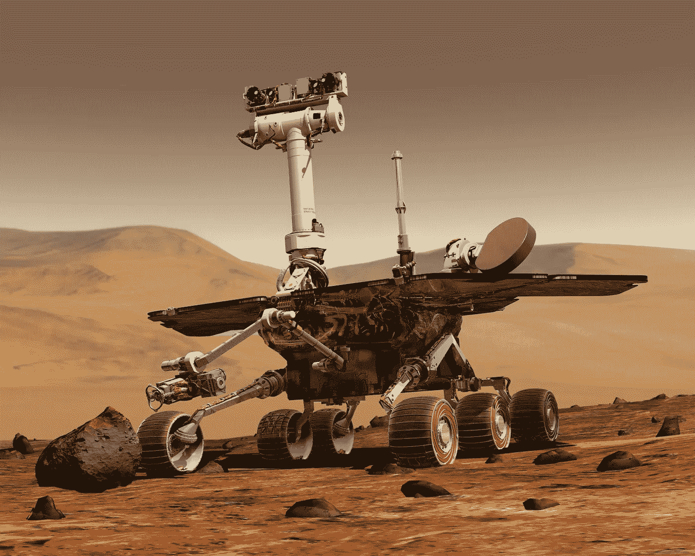

# 人工智能研究的热点

> 原文：<https://towardsdatascience.com/hot-topics-in-ai-research-4367bdd93564?source=collection_archive---------1----------------------->

如果你正在阅读这篇文章，你已经被人工智能驱动的技术包围了，超出你的想象。从你面前的网站到阅读 CT 扫描，AI [应用](https://www.techemergence.com/everyday-examples-of-ai/)是不可避免的。

一般来说，当人们听到人工智能时，他们往往会将其等同于机器学习和深度学习，但它们只是人工智能研究中的许多子主题中的两个。这两个主题可以说是当今人工智能世界中最有效的主题，但还有许多其他子主题因其应用和未来潜力而在人工智能社区中获得了巨大的吸引力。在本文中，我们将讨论人工智能研究中的一些热门子主题，其中许多主题是相互关联的，并属于人工智能的大范围:

# **大规模机器学习**

机器学习(ML)关注的是开发能够通过经验提高性能的系统。在过去的十年里，人工智能的进步可以很容易地归因于人工智能的进步。ML 太受欢迎了，已经成了 AI 的代名词。研究人员现在专注于将最先进的 ML 算法扩展到大型数据集。想了解更多关于 ML 的信息，请阅读这篇[介绍性博客](https://medium.com/@ageitgey/machine-learning-is-fun-80ea3ec3c471)。

# **深度学习**

深度学习(DL)是 ML 的一个子集，是神经网络的重新品牌化——一类受我们大脑中生物神经元启发的模型。DL 一直是人工智能中许多应用的驱动力，如对象识别、语音、语言翻译、玩计算机游戏和控制无人驾驶汽车。欲了解更多关于 DL 的信息，请阅读这篇介绍性博客[。](/introducing-deep-learning-and-neural-networks-deep-learning-for-rookies-1-bd68f9cf5883)

# **强化学习**

强化学习是人类学习方式的封闭形式。它由一个智能代理组成，智能代理与环境智能地相互作用，以获得一定数量的回报。代理的目标是学习顺序动作，以便最大化长期回报。就像一个从现实世界中学习经验的人一样，不断探索新事物，更新自己的价值观和信念，RL 代理人以类似的原则工作，以从长远角度最大化自己的回报。2017 年，谷歌的 AlphaGo 计算机程序在围棋比赛中使用 RL 击败了世界冠军。想了解更多关于 RL 的信息，请阅读这个[博客](https://medium.freecodecamp.org/an-introduction-to-reinforcement-learning-4339519de419)。

# **机器人技术**

从技术上讲，机器人技术是一个独立的分支，但它确实与人工智能有一些重叠。人工智能使机器人在动态环境中导航成为可能。你如何确保一辆自动驾驶汽车在最短的时间内从 A 点到 B 点，而不伤害自己和其他任何人？DL，RL 的进展可能有机器人学中此类问题的答案。想了解更多关于机器人技术的信息，请阅读这篇关于人工智能机器人技术的博客，并观看这些演示视频: [1](https://www.youtube.com/watch?v=wXxrmussq4E) 、 [2](https://www.youtube.com/watch?v=W1LWMk7JB80) 、 [3](https://www.youtube.com/watch?v=_luhn7TLfWU) 。

# **计算机视觉**

如果我们想让机器思考，我们需要教它们看。费-李非，斯坦福人工智能实验室主任计算机视觉(CV)关注的是计算机如何视觉感知周围的世界。具有讽刺意味的是，计算机擅长做庞大的任务，如寻找一个 100 位数的 10 次方根，但在识别和区分物体等简单的任务中却举步维艰。最近在 DL 和标记数据集的可用性以及高计算能力方面的进展使得 CV 系统有可能在一些狭窄定义的任务(如视觉对象分类)中胜过它们的人类对应物。想了解更多关于简历的信息，请阅读这个[博客](https://medium.com/readers-writers-digest/beginners-guide-to-computer-vision-23606224b720)。

# **自然语言处理**

自然语言处理(NLP)涉及能够感知和理解人类口语的系统。它由语音识别、自然语言理解、生成和翻译等子任务组成。随着全球使用多种语言，NLP 系统可能成为真正的变革者。目前的 NLP 研究包括开发可以与人类动态交互的聊天机器人。想了解更多关于 NLP 的信息，请阅读这篇[介绍性博客](/a-beginners-guide-to-natural-language-processing-e21e3e016f84)。

# **推荐系统**

从读什么，买什么，到和谁约会，推荐系统无处不在，已经完全取代了虚拟世界中烦人的推销员。像网飞和亚马逊重工这样的公司依赖 RS。智能推荐系统会考虑用户过去的偏好、同伴的偏好和趋势，从而做出有效的推荐。要了解更多关于 RS 的信息，请阅读以下文章: [1](https://medium.com/ai-society/a-concise-recommender-systems-tutorial-fa40d5a9c0fa) ， [2](https://hackernoon.com/introduction-to-recommender-system-part-1-collaborative-filtering-singular-value-decomposition-44c9659c5e75) 。

# **算法博弈论与计算机制设计**

算法博弈论从经济学和社会科学的角度考虑多主体系统。它看到这些代理人如何在基于激励的环境中做出选择。这些多智能体系统可以包括自私的人类成员以及在有限资源环境中一起竞争的智能体。关于这个话题的更多信息，你可以关注大卫·巴夏礼教授的文章。这个[环节](http://artint.info/html/ArtInt_234.html)也是很好的资源。

# **物联网**

物联网(IoT)是一个概念，日常使用的物理设备连接到互联网，并可以通过交换数据相互通信。收集到的数据可以进行智能处理，使设备更加智能。这篇文章解释了人工智能如何被用来建造更智能的建筑。

# **神经形态计算**

随着依赖于基于神经元的模型的深度学习的兴起，研究人员一直在开发可以直接实现神经网络架构的硬件芯片。这些芯片被设计成在硬件层面模仿大脑。在普通芯片中，数据需要在中央处理器和存储块之间传输，这导致了时间开销和能量消耗。在神经形态芯片中，数据以模拟方式在芯片中进行处理和存储，并可以在需要时生成突触，从而节省时间和能量。更多关于这些智能芯片开发的信息，请阅读这两篇文章: [1](http://www.wired.co.uk/article/ai-neuromorphic-chips-brains) 、 [2](https://singularityhub.com/2018/02/07/brain-like-chips-now-beat-human-brain-in-speed-and-efficiency/) 。

其他详细介绍 AI 研究动态的文章: [0](https://blog.goodaudience.com/ai-in-2018-for-researchers-8955df0caaf9) 、 [1](https://hackernoon.com/machine-learning-and-ai-trends-for-2018-what-to-expect-96d3d74596ce) 、 [2](/the-current-trends-in-artificial-intelligence-198a80e820c5) 、 [3](https://medium.com/botsupply/the-ai-playbook-part-1-main-trends-in-artificial-intelligence-264c3955c17) 。

注:该文章于 2018 年 5 月 7 日在 medium 上的出版物 [AI Tale](https://medium.com/ai-tale) 中首次发表为“AI 研究中的热点子主题”。

参考文献:
斯通、彼得等《2030 年的人工智能与生活》。*人工智能百年研究:2015–2016 研究小组报告* (2016)