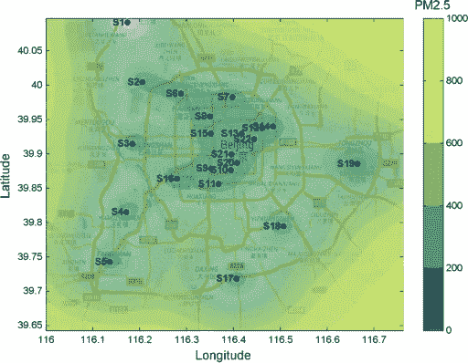
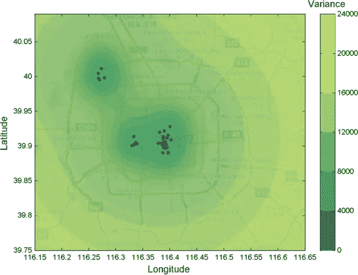
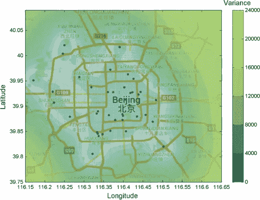

# 人工智能和人类如何优化空气污染监测

> 原文：<https://towardsdatascience.com/how-ai-and-humans-can-optimise-air-pollution-monitoring-bcc7807c7566?source=collection_archive---------8----------------------->

## 空气污染监测

## 众包空气质量监测案例

Photo by [veeterzy](https://unsplash.com/@veeterzy?utm_source=unsplash&utm_medium=referral&utm_content=creditCopyText) on [Unsplash](https://unsplash.com/s/photos/air-pollution?utm_source=unsplash&utm_medium=referral&utm_content=creditCopyText)

根据世界卫生组织(世卫组织)的数据，空气污染每年导致 420 万人死亡。难怪我们应该投入资源来了解和监测城市和社区的空气质量。这应该有助于城市规划当局，因为他们可以决定在哪里种树，建设绿地和管理交通。此外，它可以让我们所有人意识到空气污染对我们日常生活的影响，这对我们的健康至关重要。

在这篇文章中，我们从不同的角度探讨空气污染。我们想介绍和讨论众包空气质量监测的概念。对于那些不熟悉众包概念的人来说，它是关于让公众参与进来以实现一个共同的目标。我们可以通过将参与者的工作分成小任务来实现这一点；在这种情况下，收集空气质量测量值。我们的目标是以一种聪明的方式使用众包，通过使用人工智能(AI)来建立一个准确的空气污染热图。

我们认为，与目前放置在城市中的静态空气质量传感器相比，众包可能是一种更好的方法。首先，不是每个城市或城镇都有一个，当他们有一个时，他们通常被放置在一个捕捉该地区平均空气质量的方式。这意味着它们不一定反映我们在市中心行走时吸入的污染物。此外，我们需要考虑获取、维护和使用静态空气质量传感器的成本。

相反，众包提案依赖于我们参与的意愿。然而，这也需要使用低成本的移动空气质量设备来读取我们的行踪。

重要的是，我们不希望在任何时候任何地方都进行测量。这既有实际原因，也有数据隐私原因。首先，传感器必须连续工作。它还必须跟踪我们的位置，并采取时间戳空气质量测量。即使我们在室内，或者它在我们的包里或口袋里。因此，电池寿命很容易耗尽。最重要的是，这个小小的传感器比你的另一半更了解你的行动。不太好。

因此，挑战在于

> 确定何时何地应该进行空气质量测量，以便有效地监测我们的城市。

希望现在这里的优化问题开始变得更加清晰。考虑到我们实际愿意贡献的频率和设备可用的电池量，我们希望确定进行测量的最佳位置，以便这些测量对促进有效的环境探索最有用，从而提高我们对环境的了解。

要解决问题，首先需要回答一些关键问题。具体来说，我们的环境是如何表现的？每个测量对整体情况的贡献有多大？不同的测量方法如何影响我们对空气质量的理解？

本质上，我们需要一个环境模型。这将有助于我们量化每次阅读中包含的信息。它还可以帮助我们了解每个测量如何影响随时间收集的整体信息。

一个很好的候选方法是使用高斯过程。对于更专业的读者来说，高斯过程是一种回归技术，它自然地提供了估计值的预测均值和方差。在实践中，这意味着我们可以使用这种技术来插值随着时间推移的环境空气质量，只要进行一些测量。换句话说，我们可以预测未被观察到的位置(没有进行测量的位置)的空气质量，以及预测未来的环境状态。然而，重要的是，高斯过程也可用于提供我们对每个位置的空气质量有多确定(通过利用预测方差)。

Average air pollution over Beijing in terms of particulate matter (PM2.5) — Image by Author

在统计学和信息论中，*方差是不确定性的度量。*我们的目标是消除热图中的不确定性。我们想知道我们地区的空气质量。为了帮助我们直观地理解插值的含义，请看上图。在该图中，我们可以看到高斯过程作为回归技术的应用。具体来说，它插值了北京市的空气质量。

Variance/Uncertainty of air quality over Beijing — Image by Author

然而，正如我们所声称的，重要的是，高斯过程为你提供了对不确定性领域的理解。上图显示，静态传感器周围的不确定性较低，而其间的不确定性开始上升。离传感器越远，不确定性就越高。

现在，回到我们的众包方法。这种建模方法对我们有什么帮助呢？

让我们考虑一下。等效的数字看起来像什么，而不是静态传感器，我们正在模拟志愿者进行的测量。正如我们所说的，一直进行测量是很困难的。当我们在户外或者只是想测量时，我们更有可能进行测量。然而，从概率上来说，更多的人聚集在市中心，也许靠近受欢迎的景点。这部分不用想太多。下面是一个设置示例。确实有些人在市中心，有些人在颐和园附近。

Variance/Uncertainty of air quality over Beijing — Image by Author

然而，从该图中我们可以看出，静态传感器设置可能并没有那么糟糕。这是因为环境的变化或不确定性在所有区域都很高(如图中黄色部分所示)。从好的方面来看，市中心或热门景点的人们可以确信，他们知道他们所在地区的空气质量如何。但这对于城市规划来说用处不大。

我们可以做得更好。我们还没有真正解决这个问题，因为我们还没有指导或提醒人们何时何地获取读数。考虑到人们如何移动或者他们更可能愿意在哪里进行测量，这仅仅是一个可能的默认设置。

然而，我们设法发展了我们的理解。我们现在可以用我们的建模方法来描述这个问题。具体来说，我们需要进行一组测量，以使通过使用高斯过程测量的信息最大化。

这个问题的解决方案需要使用广泛的人工智能领域的算法。具体来说，我们需要一个智能系统来决定何时何地进行测量，以最大限度地获取有关空气质量的信息，同时最大限度地减少所需的读数数量。该系统可以采用与元启发式算法相结合的贪婪搜索技术，例如随机局部搜索、无监督学习(聚类)和随机模拟。这些只是一些潜在技术的例子，我不打算进一步展开，而是给出一个算法的大概情况。

主要想法是随着时间的推移模拟环境，问一些假设的问题。如果我现在进行测量，而不是晚上。哪一个会给我最好的结果？两者都有必要吗？如果我在市区测量或者在我家附近测量会怎么样？

想想我们可以问的所有可能的假设问题。这是每个人每时每刻的假设。即使对于最强大的计算机，这个问题也很难解决。这将需要运行数百万次模拟来涵盖我们每个志愿者的所有可能场景。幸运的是，如上所述，我们有更多的算法方法。例如，聚类可用于将同一地点的人分组，并从本质上将其视为一个实体。因此，智能系统不需要为每个志愿者考虑不同的模拟，而是为每个实体考虑不同的模拟。我们不仅能在空间上，而且能在时间上把人们分组。在相似的时间在相似的地点进行测量的人也可以被看作是一个单一的实体。

既然我们减少了所需的模拟，我们可以使用元启发式方法，基本上是按顺序评估每个组合，以便我们逐渐接近更好的配置，但不一定是最好的配置。一个比上述更好的可能对参与者和城市规划都有用。例如，贪婪算法将首先随时间迭代所有可能的实体，并评估如果这些实体中的任何一个进行单次测量，所收集的信息如何变化。以同样的方式，该算法可以逐步选择最佳位置，而实际上不必评估所有可能的设置。

Variance/Uncertainty of air quality over Beijing — Image by Author

最后，给定上述算法过程，智能系统给了我们一个很好的可能的解决方案。这意味着我们有一组推荐的位置来获取空气质量读数。正如我们在上图中看到的，这是一个比我们以前的设置好得多的设置。此外，它与我们之前讨论的静态传感器放置相当。想象一下有更多的志愿者。这只会变得更好，使上面的地图更绿。总体而言，随着人工智能算法和众包的使用，空气质量监测可以变得更容易和更有效。

这篇文章和数字是基于一个出版的期刊:泽诺诺斯，亚历山大，塞巴斯蒂安斯坦，和尼古拉斯詹宁斯。"在不确定的参与式传感环境中协调测量."*人工智能研究杂志*61(2018):433–474。