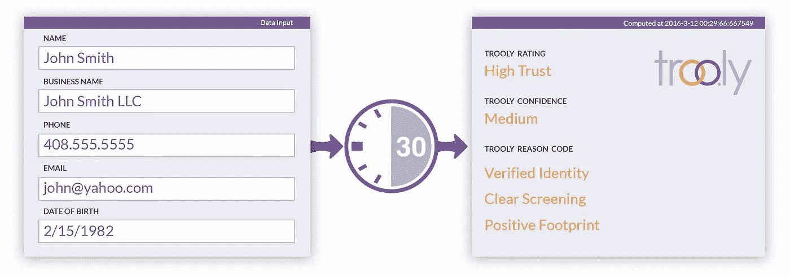

# 人工智能如何改变信任和安全

> 原文：<https://towardsdatascience.com/how-ai-is-changing-trust-and-safety-9c0dfc1e4f9e?source=collection_archive---------3----------------------->

Source: [https://medium.com/trooly-buzz/bay-area-tech-wire-los-altos-based-trooly-raises-10m-launches-instant-trust-ratings-5a600c77dd01](https://medium.com/trooly-buzz/bay-area-tech-wire-los-altos-based-trooly-raises-10m-launches-instant-trust-ratings-5a600c77dd01)

信任是人类互动的基础。这是贸易、政治和社会纽带所必需的。对于互联网来说是必不可少的。在过去的 20 年里，我们经历了三次不同的互联网活动爆炸，每一次都有自己的信任问题。

*   从 2000 年到 2005 年，我们见证了电子商务在 Ebay、亚马逊和 Paypal 等平台上的发展。这些公司饱受洗钱和欺诈问题的困扰。
*   从 2005 年到 2010 年，像脸书、Linkedin 和 Twitter 这样的社交网络发展迅速。这些公司面临着网络辱骂、仇恨言论、虚假账户以及最近的虚假内容等问题。
*   自 2010 年以来，像优步和 Airbnb 这样促进同伴互动的公司越来越多。这些公司面临着上述一些问题，以及游客破坏、卖淫、性骚扰和杀人案件中的新问题。

网上信任的主要目的是安全。随着在线互动变得越来越个人化，这种互动带来的危险也越来越大。去年最致命的枪击事件之一是密歇根州卡拉马祖市的一名优步司机所为。归咎于拼车公司的事故清单在这里[汇总](http://www.whosdrivingyou.org/rideshare-incidents)。

大多数领先公司已经采取措施解决信任和安全问题。这些步骤包括制定保护保险等政策、要求背景调查和对交易进行人工审查。但这些工具中最强的可以说是机器学习，因为不可能人工审查任何给定平台上的所有交易。

在我看来，机器学习的兴起导致了三个主要变化。**首先，企业在信任和安全方面变得更加积极主动。**在点对点经济的早期阶段，大多数公司只是在用户犯了一个不好的行为后才封禁用户。然而，当欺诈、损害和潜在诉讼造成的损失开始增加时，许多公司都出台了更严格的政策，甚至禁止用户进行可疑活动。例如，一家公司可能禁止 IP 地址来自尼日利亚的所有用户。这种新的警戒级别可能会导致大量的误报或假警报。在对个人或公司可能存在风险的情况下，人们可以调整算法以接受更多的误报。在其他情况下，风险只是很小的财务损失(促销滥用等)。)，公司可能愿意接受假阴性。机器学习允许我们根据场景做出正确的权衡。

**其次，在信任和安全领域，已经出现了建立行业模型的初创公司。**以前，公司仅依靠自己的数据来做出决策。现在，他们可以用外部数据来补充。 [Sift Science](https://siftscience.com) 和 [Onfido](https://onfido.com/) 就是这类创业公司的两个例子。这些公司与不同行业的各种客户合作过，并能够调整自己的模型来检测许多模式。

例如,[在处理电子邮件地址时,](https://siftscience.com/how-sift-works)提供信任解决方案的初创公司会查看诸如首字母大写、电子邮件中数字的存在以及一次性电子邮件域的使用等特征。根据他们的研究，存在上述特征的用户更有可能是欺诈用户的 6 倍、4 倍和 9 倍。Sift Science 在支付欺诈、账户接管和内容、推广和账户滥用方面提供解决方案；Onfido 在身份验证和背景调查方面提供解决方案。通过使用这些外部解决方案，引领 P2P 经济的公司已经能够减少良好用户的摩擦，减少欺诈造成的损失，提高转化率，同时节省欺诈团队的时间和金钱。

**最后，人工智能最积极的影响是减少了偏见。**研究人员表明[人类基于认知、社会和个人偏见做出决定](http://www.alleywatch.com/2017/05/artificial-intelligence-less-discriminatory-people/)。例如，众所周知，Airbnb 的客人会歧视名字很黑的[客人、](https://www.theverge.com/2015/12/10/9885826/airbnb-guests-discrimination-race-study)[亚裔](http://www.latimes.com/business/technology/la-fi-airbnb-discrimination-20170407-story.html)和[甚至是残疾人](https://www.theverge.com/2017/6/2/15729326/airbnb-disability-discrimination-study)。这些偏见甚至已经蔓延到了我们的机器学习模型中。

微软研究院的研究表明，当你在谷歌新闻的文章上应用一种名为 word2vec 的神经网络技术时，它会对基于性别的刻板印象进行编码，如“父亲:医生::母亲:护士”和“男人:计算机程序员::女人:家庭主妇”。这些偏见往往对少数民族和有色人种影响最大。然而，一旦识别出这种偏差，修复人工智能或消除算法偏差就容易多了。公司现在正在采取积极的措施来减少他们平台上的偏见和歧视。**最突出的例子是** [**Airbnb，该公司已采取重大措施促进包容性**](http://blog.atairbnb.com/wp-content/uploads/2016/09/REPORT_Airbnbs-Work-to-Fight-Discrimination-and-Build-Inclusion.pdf?3c10be) **。**

如今，有大量的公开数据，以网站、社交媒体、观察名单、犯罪名单等形式存在。然而，从这些数据中提取洞察力是一个巨大的挑战。我一直致力于使用公开可用的数据来增强身份验证、滥用检测、背景调查和就业筛选解决方案。这很有挑战性，因为每个平台都是不同的，每个平台都有自己的问题。我认为，随着我们在线互动的增长，我们需要投资于信任层，以减少并有望在某一天消除不良事件。机器学习将在构建这一层中发挥巨大的作用。

*Chirag Mahapatra 在 Trooly 工作，这是一家使用机器学习的初创公司，根据网站、社交媒体和犯罪记录等公共来源的数据提供信任评级。所有观点仅代表其个人观点，不代表其雇主的观点。*