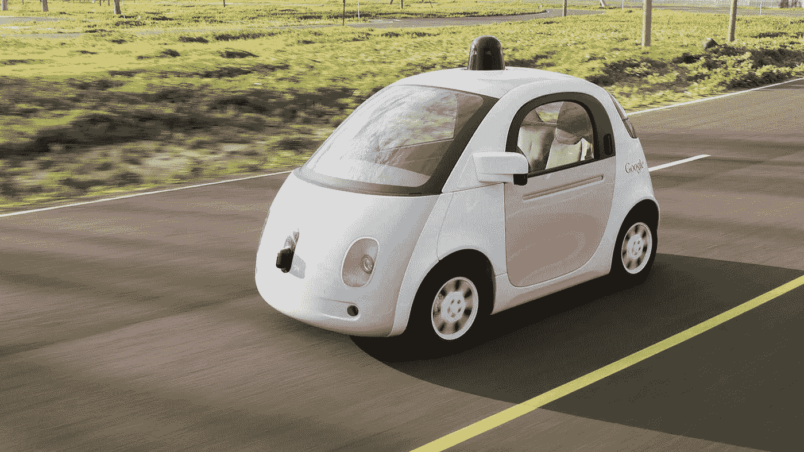
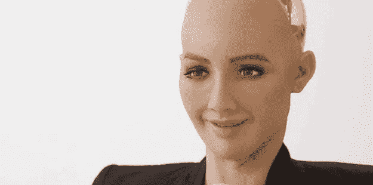
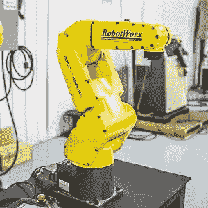
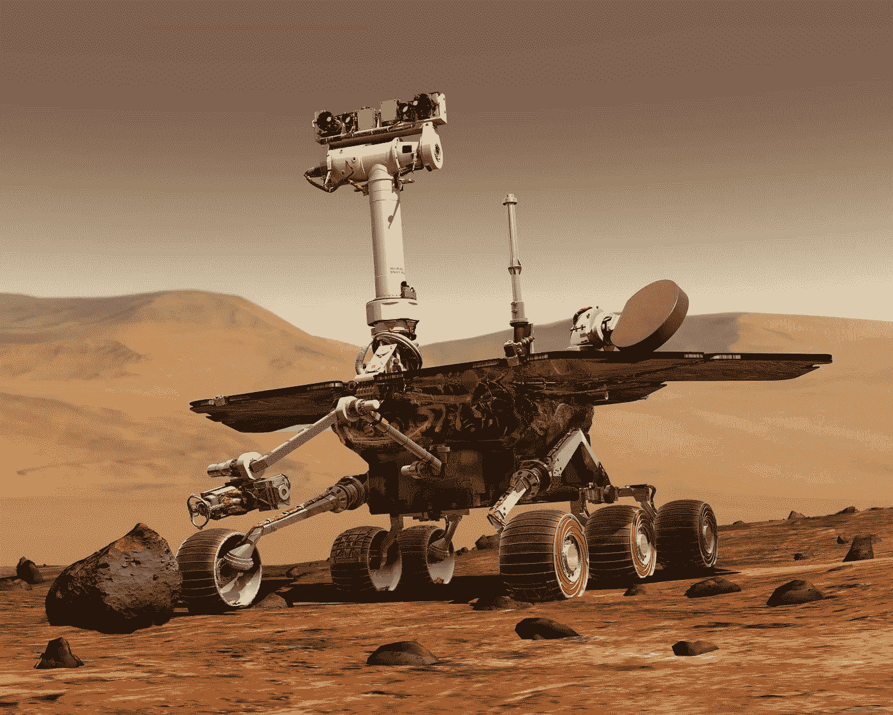

# AI 将如何影响不同的技术领域！

> 原文：<https://towardsdatascience.com/how-ai-will-affect-different-fields-of-technology-9977369f3e2b?source=collection_archive---------2----------------------->

人工智能是一个在一些人的头脑中激发奇迹，但在另一些人的心中引发恐惧的术语。事实是，人工智能正在以惊人的速度改变我们的生活。从无人驾驶汽车到专用机器人，人工智能旨在提高人类生活质量。

[Driverless car by Google](https://www.bloomberg.com/quicktake/driverless-cars)

由人工智能和机器学习驱动的技术已经开始改变工业格局，为组织提供了巨大的利益，并为其业务增加了巨大的价值。

在人工智能的影响下，交通运输、医疗保健、物流、金融和工业制造等行业将经历巨大的变革，它们将变得更具生产力、更便宜，更重要的是，提供更好的服务。

在它的所有应用中，我最兴奋的是人工智能在以下领域产生的结果:

## 卫生保健

在人工智能专家系统和自主机器人外科医生的帮助下，与所有类型手术相关的风险可以大幅降低，因为即使是小手术也可以以惊人的精度和效率完成。

由于人工智能系统可以作为一个整体不断学习和进化，与只能从自己的经验中学习的人类医生相反，它们将在利用现有的大量医疗数据诊断和治疗疾病方面变得更加优越。

[研究](https://www.ncbi.nlm.nih.gov/pmc/articles/PMC4890616/)已经表明，通过从医疗保健系统收集的数百万患者扫描档案中进行训练，可以训练深度神经网络产生高度可靠的基本放射学结果。许多巨头已经进入了医疗保健机器人领域。

例如，在 2000 年，Intuitive Surgical 推出了达芬奇系统，这是一种新颖的技术，最初上市是为了支持微创心脏搭桥手术，然后在前列腺癌治疗方面获得了巨大的市场牵引力，并在 2003 年与它唯一的主要竞争对手 Computer Motion 合并。

目前处于第四代的[达芬奇](https://ai100.stanford.edu/sites/default/files/ai_100_report_0901fnlc_single.pdf)，在一个符合人体工程学的平台上提供了 3D 可视化(与 2D 单眼腹腔镜相反)和腕式仪器。许多研究人员正在研究类似的医疗设备，这些进展有可能增加和提高人类的平均寿命。

## 个人护理

我们已经有几个聊天机器人和个人代理，如 Google home、Alexa 和 Siri，它们可以帮助我们进行简单的查询。

在不久的将来，我们可能会有能替我们做日常家务的人形机器人。国家劳工统计局预测，家庭健康助理在未来十年将增长 38%。

这说明了市场的需求。像亚马逊机器人和优步这样的公司正在研究能够提供基本家庭援助服务的类人机器人。

[Human like Robot Sophia](https://www.design-engineering.com/ai-powered-social-robots-win-even-biggest-skeptics-1004028898/)

由深度学习实现的自然语言处理和图像处理的巨大进步将增强机器人在家中与人的互动。人工智能真正有用的另一个领域是老年人护理。

尽管目前市场上已经有了一些设备，但一种帮助老年人的可持续人形机器人仍在研发中。人工智能将成为我们生活中不可或缺的一部分，因为我们的家庭将充满智能技术，带来更高的效率和更高的舒适度，为我们节省时间、金钱和能源，同时为我们提供优质服务。

最新的[例子](https://qz.com/1184978/amazon-gos-ai-powered-grocery-store-is-opening-to-the-public-in-seattle-tomorrow/)是 Amazon Go stores，它使用人工智能和计算机视觉来消除百货商店的长队账单，节省了我们的时间和精力。

## 自治系统

不管技术变得多么智能，它们永远不能被认为是人类生活的替代品。

在一段时间内，所有危及人类生命但很重要的工作都可以由 AI 赋能的机器人来完成；这包括修理电线，在最深的海沟中寻找石油，以及充当打击犯罪的警察力量。

[One of RobotWorx designs](https://www.robotics.org/company-profile-detail.cfm/Integrator/RobotWorx/company/449)

机器人保护人类免受伤害的最好例子之一是机器人焊接。手工焊接是危险的，会对相关人员造成很大伤害。 [RobotWorx](https://www.robots.com/articles/robots-are-taking-over-the-really-dangerous-jobs) ，一家机器人初创公司已经开发出机器人来完成这种任务，只需要几个人来帮助机器人焊接。

另一个这样的例子是下水道勘测；目前，遥控设备可以爬下沙井，导航下水道，调查堵塞的下水道管道，很快它们就会有足够的智能来自行操作和自主行动。

这样，每年可以从这些地区发生的不幸事故中挽救许多生命。

## 太空旅行

人工智能最伟大的应用之一是在太空旅行和探索中。人工智能可以帮助我们到达未知的行星和恒星，而不必冒生命危险。

在不久的将来，人工智能驱动的人形机器人将足够聪明，能够独立执行太空任务，为人类的繁荣发展寻找新的资源。

正如你在这里看到的，美国宇航局喷气推进实验室的钱志军和奇莉·瓦格斯塔夫预测，在未来，太空探测器的行为将由人工智能而不是来自地球的人类提示来控制。

[In future AI empowered robots will govern space programs autonomously](https://www.pinterest.com/pin/694680311245213381/)

许多组织已经努力设计专门用于探索目的的人工智能技术，他们取得的进步继续模糊了虚构和现实之间的界限。

例如，2003 年发射的勇气号和机遇号火星车都有一个名为 Autonav 的人工智能驾驶系统，允许他们探索火星表面。鉴于人工智能行业的快速发展，我们将拥有完全自主的系统，这将很快改变太空探索领域。

这些只是人工智能应用的一小部分，尽管毫无疑问，人类将从这些应用中大大受益，但不可否认的是，将会有重大的后果。

根据一份[报告](https://www.forrester.com/Forrester+Predicts+IoT+AI+AR+And+VR+Will+Change+The+Tech+World+By+2021/-/E-PRE9464)，到 2021 年**，智能代理人和相关机器人将会减少 6%的工作岗位**。

也就是到 2021 年。因此，最重要的是密切监测人工智能的发展，并采取措施确保社会最终不会受害。

*现在和人工智能驱动的未来之间的平稳过渡需要实施*。

一个良好的开端是谷歌的“人人都有人工智能”项目，该项目试图向人们展示如何利用人工智能的力量。因此，人工智能可以被认为是一种工具，如果使用得当，它可以在无数方面造福人类。