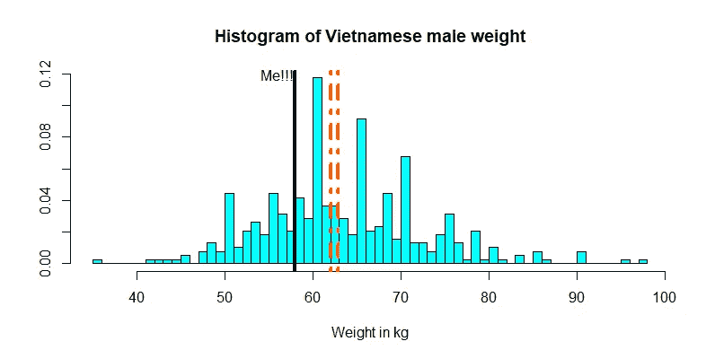
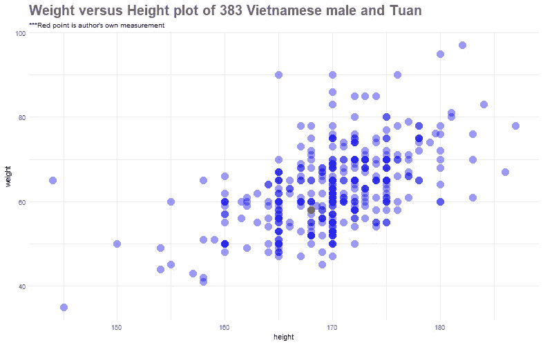
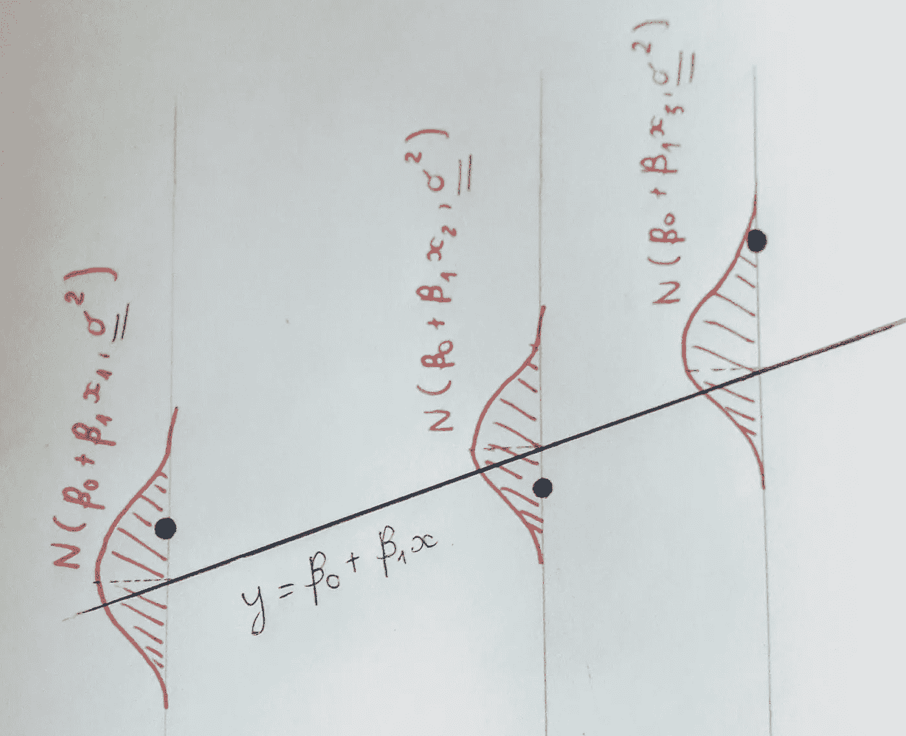
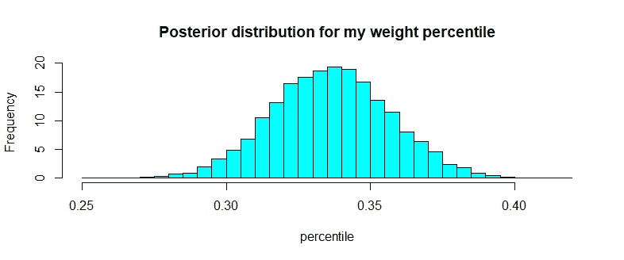

# 贝叶斯统计如何说服我去健身房

> 原文：<https://towardsdatascience.com/how-bayesian-statistics-convinced-me-to-hit-the-gym-fa737b0a7ac?source=collection_archive---------1----------------------->

Image Source: [Pixabay](https://pixabay.com/)

一次有趣的贝叶斯线性回归理论之旅(是的，我在这篇文章中使用了度量标准)

正如文章题目所暗示的，我会对我的体质做一个科学的调查。

> “得了吧，你不会是认真的吧！！!"

是的，我是。所以有一点背景信息:我来自越南，在新加坡上高中，目前在美国上大学。我经常听到人们取笑我看起来有多小，我的体重肯定有多轻，我应该如何锻炼，去健身房，增加体重，以便拥有“更好的体格”。我常常对这些评论半信半疑。对于一个身高 1 米 69 (5 英尺 6 英寸)、体重 58 公斤(127 磅)的人来说，我的身体质量指数指数接近完美(20.3)。

> *“不老兄！我们说的是体格"*

好吧，我明白了，没人在这里谈论身体质量指数。

想想看，人们可能有一个好的观点:鉴于我比普通越南男性略高，体重也完全相同(维基百科的资料显示为 1 米 62，58 公斤)，我可能“看起来”更瘦一点。 ***看*** 是这里的关键词。逻辑挺简单的不是吗？如果你稍微伸展一下自己，保持同样的体重，你会看起来更瘦更苗条。我认为这是一个需要进一步研究的严肃的科学问题:

***对于一个身高 1 米 69 的越南男性来说，我(体重)有多小？***

我们需要一种方法来研究这个话题。一个很好的前进方式就是尽可能多地找到越南男性身高体重的数据，看看我在他们中间的位置。

# 越南人口概况

在浏览网页后，我发现了一份调查研究数据，其中包含了一万多名越南人的人口统计信息。我将样本量限制在 18-29 岁年龄组的男性。这样我就有了 383 名年龄在 18-29 岁之间的越南男性的样本，这对于分析来说可能足够了。

首先，让我们画出人口的重量，看看我如何融入年轻的越南男人。

*红线显示样本的中值，而橙色线显示平均值*

这张图表明，我略低于 383 名越南年轻男性的平均体重和中值体重。令人鼓舞的消息？有点，但不完全是。看，问题并不在于我的体重与样本中的体重相比如何，而在于 ***给定 1 米 68 的身高，*** 假设这 383 个人很好地代表了越南男性人口，那么与整个越南人口**相比，我们可以推断出我的体重是多少？为此，我们需要进行回归分析。**

**首先，让我们绘制一个身高和体重的二维散点图**

****

**嗯，我只是看起来一般。事实上，如果我们只看那些身高 168 厘米的人的数据(想象一条 168 厘米的垂直线穿过红点)，我的体重比这些人稍微轻一点。**

**另一个重要的观察结果是，该图表明越南男性的身高和体重之间存在正线性关系。我们将做一个定量分析，以弄清这种关系。**

**首先，我们快速添加一条标准的“普通最小二乘法”线。**

****

**我们可以将我们的最小二乘法直线***y***= 86.32+0.889***x***解释为，对于我这个年龄的越南男性的一般轮廓来说，身高每增加 1 厘米，体重就会增加 0.88 公斤**

**然而，这仍然没有回答我们的问题；也就是说， ***对于我这种身高(1 米 68)的人来说，58 公斤是算多了，还是算少了，还是算一般？*** 用一种更定量的方式重新表述这个问题，如果我们有一个身高 1 米 68 的所有人的分布，我的体重落入 25、50 或 75 百分位的几率有多大？要做到这一点，让我们更深入地挖掘，并试图理解回归背后的理论。**

# **线性回归理论:**

**在线性回归模型中， **Y** 变量(在我们的例子中是人的体重)的期望值是 ***x*** (身高)的线性函数。我们姑且称这种线性关系的截距和斜率为**0*和***β****1*；即我们假设 E(**Y**|**X**=***X***)=***β****0*+***β****1*×***X***。我们不知道**0*和****β****1*所以我们把它们当作未知参数。*****

****在最标准的线性回归模型中，我们进一步假设给定**X**=***X***的条件分布是正态分布****

****这意味着简单的线性回归模型:****

********

****可以改写为:****

********

****(1)****

*****注意，在很多模型中，我们可以将* ***方差*** *参数* σ *替换为* ***精度*** *参数* τ *，其中* τ=1/σ *。*****

******总结:**因变量 ***Y*** 服从均值 ***μ*** *i* 和精度参数τ参数化的正态分布。 ***μ*** *i* 是由 ***β0*** 和 ***β1*** 参数化的 ***X*** 的线性函数****

****最后，我们还假设未知方差不依赖于***x***；这个假设被称为**同质性**。****

****这是很多，但你可以想象我用这个图像讨论了什么。****

********

****在实际的数据分析问题中，我们得到的只是黑点——数据。注意每个点周围的正态分布看起来完全相同。这就是 **同质化**的本质。使用这些数据，我们的目标是对我们不知道的事物做出推断，包括***【β0】、β1*** (它们决定了神秘的黑线)和***【σ】***(它们决定了从中得出***【y】***数据值的红色法线密度的宽度)*。*****

# ****估计参数****

****现在，有几种方法可以用来估算*和 ***β1*** 。如果您使用**普通最小二乘法**估计这种模型，您不必担心概率公式，因为您是通过最小化拟合值与预测值的平方误差来搜索 ***β0*** 和 ***β1*** 的最优值。另一方面，您可以使用**最大似然估计**来估计这种模型，您可以通过最大化似然函数来寻找参数的最佳值*****

********

****注意:一个有趣的结果(这里没有数学证明)是，如果我们进一步假设误差也属于正态分布，最小二乘估计也是最大似然估计。****

# ****带有贝叶斯方法的线性回归；****

****贝叶斯方法不是单独最大化似然函数，而是假设参数的先验分布并使用贝叶斯定理:****

********

****似然函数同上，但变化的是你对估计参数 ***β0，β1，τ*** 假设了一些先验分布，并把它们包含到方程中:****

********

****(2)****

> ****“等等，之前的演出是怎么回事，为什么它让我们的公式看起来复杂了 10 倍？”****

****相信我，这个优先业务感觉有点奇怪，但它是非常直观的。事实是，有一个强大的哲学推理，为什么我们可以用一些看似任意的分布来分配一个未知参数(在我们的例子中是 ***β0，β1，τ*** )。这些先验分布是为了在看到数据 之前捕捉 ***我们对情况的信念。在观察了一些数据后，我们应用贝叶斯规则来获得这些未知量的后验分布，它考虑了先验和数据。根据这个后验分布，我们可以计算出未来观测值的预测分布。*******

****跟我重复:这些先验分布是为了在看到数据之前捕捉我们对情况的信念****

****最终的估计将取决于来自 1) *你的数据*和 2) *你的前科*的信息，但是你的数据包含的信息越多，前科的影响就越小。****

> ****"所以我可以选择任何先验分布？"****

****这是一个好问题，因为有无限多的选择。(理论上)只有一个正确的先验，这个先验捕获了你的(主观的)先验信念。然而，在实践中，先验分布的选择可能是相当主观的，有时是任意的。我们可以只选择具有大标准偏差(小精度)的正态先验；例如，我们可以假设 ***β0*** 和 ***β1*** 来自均值为 0 且 SD 为 10，000 或其他值的正态分布。这被称为**无信息先验**，因为本质上这种分布将是相当平坦的(也就是说，它将几乎相等的分布分配给特定范围内的任何值)。****

****接下来的是，如果这个分布族是我们的选择，我们不需要担心哪个确切的分布可能是最好的，因为:
(a)在可能性不可忽略的区域中，它们几乎都是平坦的，以及(b)在可能性可忽略的区域中，先验分布看起来像什么对于后验分布并不重要。****

****同样，对于精度*，我们知道这些必须是非负的，因此选择限制为非负值的分布是有意义的——例如，我们可以使用低形状和比例参数的伽马分布。*****

*****另一个有用的无信息选择是均匀分布。如果你为 **σ** 或 **τ** 选择均匀分布，你可能会得到一个由[约翰·k·克鲁施克](https://jkkweb.sitehost.iu.edu/BMLR/)展示的模型*****

# *****用 R 和 JAGS 进行模拟*****

*****理论到目前为止还不错。问题是解方程(2)在数学上是有挑战性的。在绝大多数情况下，后验分布不会直接可用(看看正态分布和伽玛分布有多复杂，你必须将它们相乘)。马尔可夫链蒙特卡罗方法常用于估计模型的参数。JAGS 帮助我们做到了这一点。*****

> *****“等等！！！有一种工具可以帮助我们解决这些可怕的方程？”*****

*****JAGS 模型是一个基于马尔可夫链蒙特卡罗(MCMC)的仿真过程会产生参数空间***θ=(β0；β1;τ)*** 。为该参数空间中的每个参数生成的样本的分布将近似该参数的总体分布。*****

****为什么会这样呢？这个解释比这篇文章所能容纳的要复杂得多。一行解释是:MCMC 通过构造马尔可夫链(！idspninfopath)从后验分布生成样本。？)具有目标后验分布作为其稳定分布。****

****我告诉过你这不好玩。快速的收获是:我们可以做一些智能采样，用数学证明我们的样本分布是 ***β0，β1，τ的真实分布，而不是求解方程(2)，这在分析上通常是不可能的。*******

> ****“好了，数学挥舞够了。我如何使用这个 JAGS 魔法？”****

****我们在 R 中运行 JAGS 如下****

*   ****首先，我们以文本格式编写模型:****

****然后，我们命令 JAGs 进行模拟。这里我让 JAGs 模拟参数空间 ***θ*** 的值 10000 次。****

****经过这样的采样，我们得到的采样数据为***θ=(β0；β1;*τ)**如是****

********

> ****“很酷的东西，那又怎么样？”****

****现在我们有参数空间 ***θ*** 的 10000 次迭代，记住由[方程(1)](https://tuangauss.github.io/skinny_asian_guy/skinny_asian_guy.html#equation_1) :****

********

****这意味着，如果我们将 ***x=168cm*** 代入每次迭代，我们将找到 10，000 个权重值，因此，假设的高度为 168cm，权重**的*分布*。******

****我们感兴趣的是我体重的百分位数*，以我的身高为条件。我们能做的是找到*以我的身高*为条件的我体重的百分位数分布。*****

********

****现在，这张图告诉我们的是，我的体重(考虑到 168 厘米的身高)很可能位于模拟越南人口的 0.3%左右。****

****例如，我们可以找到我的体重在前 40 个百分点或更少的百分点****

****因此，有压倒性的证据表明，以我 168 厘米的身高为条件，我 58 公斤的体重将使我处于越南人口的较低百分位。也许是时候去健身房增肥了。毕竟，如果你不能相信一些做得很好的贝叶斯统计结果，你还能相信什么？****

****我在数据源中包含了一个数据集，其中包含了 8169 名美国男女青年的身高和体重(国家纵向调查 1997 [2](https://tuangauss.github.io/skinny_asian_guy/skinny_asian_guy.html#data_source_2) )，您能进行同样的分析并看看您的情况吗？****

****如果你喜欢这篇文章，你可能也会喜欢我的另一篇关于有趣的统计事实和经验法则的文章****

*   ****[优化生活的统计法则:呼唤效应](/a-statistical-rule-to-optimize-your-life-the-lindys-effect-96d2c75b080d)****
*   ****[规则三:计算尚未发生事件的概率](/the-rule-of-three-calculating-the-probability-of-events-that-have-not-yet-occurred-106144dc2c39)****

****对于其他深潜分析:****

*   ****[利用数据驱动的体育博彩策略赚大钱](/making-big-bucks-with-a-data-driven-sports-betting-strategy-6c21a6869171)****
*   ****[寻找上帝的贝叶斯探索](/a-bayesian-quest-to-find-god-b30934972473)****
*   ****[用 Python 构建自己的图书推荐引擎](/building-my-own-2021-book-recommendation-engine-903ea10d5021)****

****这篇文章的完整 R 脚本可以在我的 [Github 页面](https://github.com/tuangauss/Various-projects/blob/master/R/bayesian_gym.R)找到。****

****注:我想为 Joseph Chang 教授(耶鲁大学)和他的班级 S&DS238:(贝叶斯)概率与统计大声喊出来。*我几乎是偶然上了这门课，这很容易成为我上过的最有影响力的课之一(谈论一个政治科学专业的学生正在成为一名数据科学家)*****

****数据来源:Vuong Q. H..开放的科学框架。2017 年[*https://doi.org/10.17605/OSF.IO/AFZ2W*](https://doi.org/10.17605/OSF.IO/AFZ2W)****

****资料来源:1997 年全国纵向调查| https://www.nlsinfo.org/investigator/pages/search.jsp?劳动统计局 s = nlsy 97****