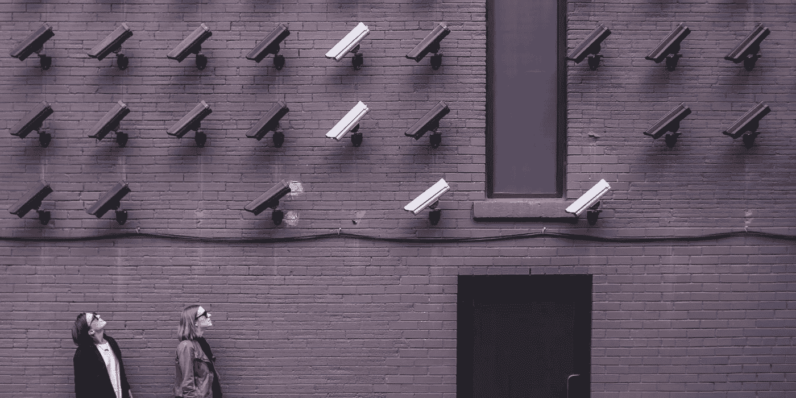
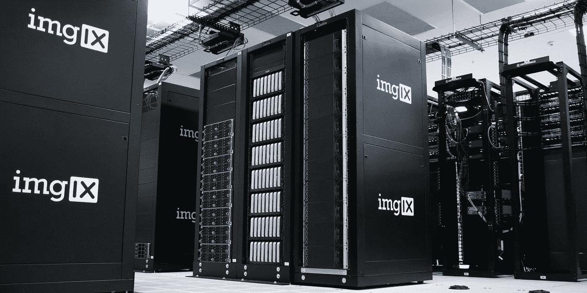

# 区块链将如何保护隐私

> 原文：<https://towardsdatascience.com/how-blockchains-will-enable-privacy-1522a846bf65?source=collection_archive---------3----------------------->

科技侵蚀了我们的隐私保护。个人或组织所做的大多数事情现在都在公共领域。第三方监控、存储和使用个人和组织数据、模式、偏好和活动。许多新兴的商业模式依赖于我们个人数据的收集、组织和转售。

技术也使得将数据与个人联系起来变得更加容易，即使个人选择退出社交网络平台。例如，面部识别技术的突破已经在商业和安全领域得到广泛应用，特别是在中国和俄罗斯。

区块链技术可能会限制这种隐私侵蚀的影响，同时仍然会在有用的时候发布个人信息。例如，用户可以在区块链上存储个人信息，并临时释放部分信息以接受服务。比特币和其他基于区块链的数字货币已经证明，使用点对点的分散网络和公共账本，可信和透明的计算是可能的。

这篇文章探讨了个人和组织产生的数据对隐私的影响。它还简要考虑了支持区块链的系统如何帮助用户重新掌控自己的数据。

# 第一部分:个人

**个人**

隐私对个人来说很重要，因为他们的个人信息对组织、营销人员和其他个人来说很有价值。互联网用户中的一个普遍说法是:如果你不为产品付费，你就是产品。这意味着，对于提供免费服务的公司，如社交网络平台，个人信息是有价值的。

**宪法保护**

在美国，隐私对于行使各种宪法权利非常重要，包括言论自由权、结社自由权、出版自由权、免受不合理搜查和扣押权以及免受自证其罪权。缺乏国家行为者的隐私会危及这些权利。知道他们的言论将在公共领域被归因于他们，一个人可能不会为正义的事业大声疾呼，特别是如果他们的观点或主题是有争议的或不受欢迎的。由于许多重要的观点不受欢迎或有争议，自我审查应该引起社会的严重关注。知道自己被监视，也可能会阻止你和志同道合的人见面。如果举报者和其他揭露组织不法行为的人不能保持匿名，他们就不太可能这样做。随着技术的进步，法院已经勾勒出了对国家行为的限制。

**健康资讯**

如果信息就是力量，保护信息可以帮助一个人与组织谈判。例如，健康保险公司可以利用负面健康信息向特定个人收取更高的保费，或者拒绝承保。因此，个人有动机阻止这些信息进入公共领域。健康信息的公开发布也会给一个人的社交或职业生活带来尴尬或尴尬。

**金融信息**

金融信息是个人信息赋予其拥有者权力的另一个领域。个人可能不希望金融机构知道几年前的不良信用记录，并且肯定不希望邪恶的行为者使用个人的个人信息来实施身份盗窃或金融欺诈。

虽然人们不得不经常披露个人财务信息，例如纳税或获得抵押贷款，但如果这种信息进入公共领域，各种行为者都会感兴趣。寻求客户的公司、寻求捐赠者的慈善机构以及寻求捐赠的政治候选人都对了解个人的个人财务信息感兴趣。尽管这些行为者大多是良性的，但人们对于他们想要与谁分享个人财务信息以及他们想要这些信息用于什么目的有着不同的偏好。

例如，人们可能不希望他们的财务信息被公司用来确定他们愿意和能够为通常以较低价格购买的东西支付的最高金额。然而，Orbitz 向 Mac 用户展示同样的酒店房间，价格却比 PC 用户高。这表明，即使是一点点个人信息，比如一个人是使用 PC 还是 Mac，也能对营销人员评估一个人的经济能力有用，这种方式会让大多数人感到不舒服。

**个人行为**

研究表明，当人们知道自己被监视时，他们的行为会有所不同。因此，在更基本的层面上，隐私使一个人能够以一种受启发的、亲密的或愚蠢的方式行动，而没有恐惧。就像人们凭直觉关上或锁上前门一样，他们在与技术的互动中也渴望隐私。如上所述，组织有许多充分的理由收集个人信息(从未来使用产品或服务的便利性，到未来互动的便利性，到研究消费者偏好以创造更好的产品或服务)。精明的组织努力不违反个人对个人隐私的期望，因为个人隐私具有内在的价值:它允许人们做自己，以不受约束的方式行事。

**匿名和假名**

互联网的核心存在一个悖论:人们期望它成为一个公开透明的论坛来交流思想、信息、商品和服务，然而他们也期望匿名上网。正如《纽约客》一幅著名漫画的标题所言:在互联网上，没有人知道你是一只狗。对互联网隐私的期望因利益集团和国家而异。例如，由于政府监管，韩国人对互联网隐私的期望比美国人低。2015 年初，中国政府通过了新的规定，要求互联网用户今后在写博客或使用社交媒体时使用真实姓名。在互联网上匿名和假名是可取的情况是有争议的。例如，虽然一个大学生期望在互联网上匿名是合理的，但对于利用互联网策划暴力犯罪的人来说就不是这样了。对于是否应该允许教授用笔名写作，人们有不同的看法。

虽然有趣，但关于何时应该尊重匿名或假名的辩论有可能变得没有实际意义，因为新技术对个人隐私构成了前所未有的新挑战。

**社交媒体和按需经济要求披露个人数据**

脸书、推特和其他社交网络平台的崛起改变了人们对互联网隐私的期望。使用这些平台的人自愿提供个人信息，并同意与有限的受众或所有人分享。然而，即使是那些不想分享个人信息的人(例如，那些没有脸书或 Twitter 账户的人)也会因为职业或营销目的而感到压力。雇主经常对候选员工进行谷歌搜索。虽然没有结果总比糟糕的结果好，但今天的求职者通常会使用互联网来推销自己，要么创建一个 LinkedIn 帐户，要么通过个人网站、博客或文章展示成就。对小企业来说也是如此:大多数要么有网上业务，要么因为没有网上业务而失去业务。

过去十年的另一个主要技术趋势是按需经济(简称为共享经济)的出现，在这种经济中，商品或服务的提供商和用户通过网络或电话应用程序或网站进行交易。这就产生了排挤现有中间参与者的效果(这一过程被称为非中介化)。正如优步和 Lyft 等拼车服务已经让传统的出租车服务和城市出租车牌照系统几乎过时一样，维基百科已经取代了微软 Encarta 等大型私人编辑的百科全书。如今，旅行者不仅会查看其他城市的酒店价格，还会查看 Airbnb 的价格，以便直接从其他人那里租赁短期房间或房屋。随着 Airbnb 和其他代表按需经济的公司的出现，他们通过要求主人和客人提供个人信息来满足客户的安全需求。此外，在 Airbnb 住宿后，主人和客人会被邀请互相评论，这些评论通常包含个人信息，任何浏览 Airbnb 网站的人都可以免费获得。

尽管几十年来，易贝等公司一直在使用身份验证和用户评论来打击欺诈，并鼓励在线市场的质量，但新一代共享经济应用认为个人信息等同于可信度:越多越好。由于按需服务的参与者之间的互动比易贝上的买家和卖家之间的互动更密切，这是有意义的。上陌生人的车，在陌生人家里睡觉，让陌生人帮你遛狗，这些都需要对应用、站点或平台的高度信任。收集更多信息的平台会产生更多信任。例如，虽然 Airbnb 的客人可以通过积极的主机评论历史来建立信任，但没有先前历史的客人可以上传政府 ID，甚至链接到他们的脸书账户，以表明可信度。因此，尽管共享经济的去中介化让人们能够相互信任，但它也经常要求人们向平台甚至公共领域披露公共信息。

个人提供给社交媒体网络和按需经济服务的个人数据可以为希望基于诸如位置、年龄、性别、消费者偏好、社交偏好和其他类似属性来描述个人的组织或个人提供基础。个人信息赋予其拥有者权力，因此个人应该仔细考虑他们在不同情况下可以接受的个人隐私级别。

# 第 2 部分:组织

**保护组织战略和专有信息**

组织需要保护敏感信息，如公司战略见解或专有信息(如知识产权)，这些信息可能会被竞争对手或不法行为者用来破坏组织。这不仅适用于制造行业尖端技术的组织(如国防、航空航天或汽车行业)，也适用于所有类型的组织。2016 年，黑客以民主党全国委员会为目标，发布了其内部电子邮件通信，破坏了几位民主党候选人的可信度。同样在 2016 年，冒充孟加拉国中央银行官员的黑客向纽约美联储发送指令，试图从孟加拉国中央银行在纽约美联储的账户中窃取 9.51 亿美元。他们成功地吸走了 1 . 01 亿美元，其中大部分国际当局仍未追回。这些引人注目的黑客事件象征着组织在保护其组织战略和专有信息免受竞争对手和不良行为者攻击时所面临的挑战。

**出于营销和研究目的收集客户信息**

组织出于营销目的收集客户信息。杂货店筛选从人们的手机上收集的位置信息，以确定他们在特定的过道里花了多长时间。常旅客和其他忠诚度计划向人们提供额外津贴，以换取他们的个人信息，这些信息可用于加强产品和服务的促销。营利性和非营利性组织都建立客户或捐赠者档案，帮助他们进行销售和筹集资金。

客户信息还可以用来帮助了解消费者的偏好，并在未来提供更好的产品和服务。此外，组织对客户信息的收集通常会使客户将来与该组织的交易更加方便。

在收集此类信息时，组织必须遵守适用的联邦和州法律。在美国，医疗保健公司、金融服务公司和其他公司在允许收集的客户信息类型方面受到不同的限制。成熟的组织熟悉管理其行业的法律框架。随着数据收集和分析越来越多地由非人类参与者执行，法律和法规合规性变得越来越困难。

**保护客户信息**

对于所有面向消费者的公司，尤其是谷歌、苹果和亚马逊等科技公司，收集消费者的个人信息有助于为每位消费者提供更个性化的服务。这也让公司有责任保护这些信息。例如，在一个人的 Mac、iPhone 和 iPad 上同步数据可以方便地访问信息，但也让人预期苹果会采取措施保护这些信息不受外人影响。

**保护客户信息**

对于为其他组织提供服务的组织(如会计或法律服务组织)，保护客户信息对于维护客户关系同样至关重要。黑客以前曾瞄准专业服务公司，以获取他们客户的数据，试图绕过客户复杂的数据保护措施。认识到这一风险后，主要的专业服务公司已经采取了大量措施来保护客户信息。

**当前保护敏感信息的组织措施**

组织已经采取了许多措施来保护敏感信息:例如，雇用内部和外部信息安全专业人员，教育员工如何保护信息，以及审查员工以防范内部威胁。一些已经成为或可能成为目标的组织也开始使用蜜罐(伪造的、由公司监控的数据室，声称保存敏感的公司信息，引诱和欺骗黑客，帮助公司了解黑客的动机)。这些措施是重要和必要的，需要发展以应对新的挑战。

# 第 3 部分:大数据

组织收集包含各种信息的数据，例如公司的产品和服务、内部流程、市场条件和竞争对手、供应链、消费者偏好趋势、个人消费者偏好以及消费者与产品、服务和在线门户之间的特定交互。组织收集的数据量显著增加。

对存储数据数量膨胀的担忧至少在上个世纪就已经存在。2014 年 4 月，研究机构 IDC 发布了一份题为“充满机遇的数字世界:丰富的数据和物联网不断增长的价值”的报告，该报告预测，“从 2013 年到 2020 年，数字世界将增长 10 倍——从 4.4 万亿千兆字节到 44 万亿字节”。当今数据的扩展是由计算和数据存储能力的增加、传感器的增加和连接性的增加推动的。

**计算能力和数据存储能力的提升**

随着时间的推移，我们发现存储更多的信息变得更加容易，因为在过去的几十年中，计算能力和存储容量都有了显著的提高。英特尔联合创始人戈登·摩尔在 1975 年观察到，芯片上的晶体管数量每两年翻一番。这一观察结果被称为摩尔定律，准确地描述了 21 世纪计算能力的指数增长。类似地，同时，在过去的几十年中，数据存储容量呈指数增长，尤其是我们在越来越小的驱动器上存储大量数据的能力。

由于这些增长，存储大量数据变得可能、便宜，甚至方便。因此，组织往往倾向于存储更多数据，因为丢失随后证明有用的数据的风险超过了通过保存更少的数据来略微降低存储成本的好处。

**云计算的兴起**

云计算仅仅意味着按需使用远程(而非本地)计算能力、数据存储、应用程序或网络。由于云计算，组织可以简单地从云提供商那里租用计算能力或存储，而不再需要在自己的服务器上存储大量数据，维护巨大的计算能力，或维护供应商的传统数据库(尽管传统数据库对大型组织仍然有用)。由于云提供商必须提供可靠的按需、可扩展的解决方案，像亚马逊、微软和谷歌这样的大公司是占主导地位的云提供商。

面向企业的云计算服务有三种形式:软件即服务(SaaS)，其中云提供商允许组织在线使用其软件(例如，在线访问 TurboTax 平台即服务(PaaS)，其中组织使用云提供商的资源开发应用程序供其成员访问(例如，Microsoft Azure)；基础设施即服务(IaaS)，其中云提供商为客户提供基本的基础设施服务以提供服务(例如，网飞使用亚马逊网络服务基础设施来支持视频流)。(个人用户可能更熟悉 iDrive、Google Docs 或 Dropbox 等云应用。)云计算的实现不仅得益于前面讨论的计算能力和数据存储能力的进步，还得益于互联网接入、速度和可靠性的显著提高。虽然云计算的采用在一定程度上是为了应对存储不断增长的数据量的困难，但它的广泛采用促进了存储数据量的增长。

**增加传感器的使用、传感器的复杂性和连接性**

传统上，互联网由人类用户相互之间以及与数据库的交互组成，互联网越来越多地用于将物理设备相互连接。机器对机器(M2M)交互的定性和定量增长预计将导致无处不在的物联网:一个智能设备网络，这些设备相互集成，在最少的人工干预下执行越来越复杂的功能。

物联网不需要全新的基础设施。相反，它是通过在现有设备和基础设施中嵌入传感器来实现的。例如，当家庭空调系统使用传感器来确定人们何时在家，并使用这些信息来决定温度以保持每个房间时，它就变得'智能'。类似地，当城市能源和水基础设施嵌入传感器时，智能系统可以监控使用情况，预测未来使用情况，并更有效地分配资源。先进的传感器可以改善几乎任何技术，从智能手机到心脏监视器，再到大型农场或工厂。

智能设备根据其用途需要不同种类的传感器。电脑有摄像头和麦克风已经有几十年了。现在，设备还可以配备传感器，测量温度、运动、其他物体的距离、压力、化学物质和各种其他东西。传感器的质量每年都在提高，价格也越来越低。

虽然传感器本身可以极大地改善设备，但设备之间的通信对于许多智能系统来说是必不可少的。例如，虽然使用嵌入在汽车中的各种传感器让你的汽车自动驾驶会很有用，但让路上的所有汽车相互通信会更有用。这将缓解交通流量，并理想地使汽车旅行更加安全。同样，当物联网适用于大规模生产或仓储时，它将需要设备之间良好的通信。各种通信技术的进步，尤其是无线通信技术的进步，释放了物联网技术的潜力。

**智能设备经常收集个人数据**

在智能设备出现之前，晨跑几乎不会产生任何数据。今天，如果你在智能手机上安装一个健康应用程序，并进行相同的跑步，关于跑步持续时间、你走的路线、你走的步数以及你在跑步过程中各个点的心率的数据都可以收集并存储在你的手机中。同样，三十年前，你家窗户里装个空调也不会产生多少数据。如今，智能家居温度系统每天都会收集大量的温度和湿度数据。一旦收集起来，这些数据不仅可以用来保持室内温度和节能，还可以推断出你通常在家的时间，或者你最有可能调整温度设置的时间。晨跑和家用空调系统的例子表明，智能设备可以创造更多的数据。它们还表明，为一个目的收集的个人数据可以用于许多其他目的。

数字世界正在以指数速度扩张:在 2013 年 4 月的一篇文章中，Ralph Jacobson 在 IBM 的消费品行业博客上发表了一篇文章，估计世界每天创造 25 亿千兆字节的数据。正如计算能力和存储能力的进步促使组织收集的数据量增加一样，改进的传感器和通信技术的出现也是如此。传感器测量事物，这些测量结果被传送到其他设备或服务器，被收集并存储为数据点。

**人工智能**

人工智能从数据中出现，正如我在 [**之前的**](/the-emergence-of-artificial-intelligence-3cde7378768e) 中所讨论的。

大多数人工智能研究都是由谷歌、亚马逊和百度资助的，因为数据是人工智能的食物，这些公司每天都产生大量数据。微软收购 LinkedIn 不是为了它的平台，而是为了它的数据。

到目前为止，公司已经利用人工智能彻底改变了金融和制造业。保护我们的财务信息有时看起来像是一个失败的事业，因为政府、房东、银行、信用卡公司和信用评级机构都在收集这些信息(正如 Equifax hack 所显示的，存储得很差)。

人们通常认为他们的医疗保健信息比他们的财务信息更敏感。人工智能已被用于医疗保健数据，但由于隐私问题，这些数据往往是分散和碎片化的，人工智能在医疗保健中的影响有限。然而，最终，公司将利用我们的私人健康信息编制越来越全面的数据库。

如果是技术导致了隐私的侵蚀，也许技术可以帮助解决这个问题。

# 第四部分:区块链

采用特殊协议的区块链允许不同程度的匿名、保密和隐私，可以保护医疗保健、金融和其他个人数据，同时仍允许这些数据用于人工智能应用。例如，用户可以拥有带有个人健康信息的区块链，并且出于特定目的，仅向产品或服务提供商(例如隐形眼镜制造商)简要发布该信息的特定元素(例如视力处方)。

虽然区块链是一个公共账本，存储在多个地方，但它可以实现匿名和信任，正如多个区块链应用程序和已经存在的高隐私加密货币所证明的那样。

目前，第三方收集的个人数据通常存储在具有单点故障的集中式数据库中。这种数据的泄露通常不被注意和报道。一旦我们的数据落入不受信任的一方手中，我们就无法控制如何使用这些数据。

**区块链解决方案**

正如比特币所显示的，密码学和深思熟虑的经济激励可以创造一种安全的方式来存储和管理信息，包括个人信息。

区块链上的私人数据受密码保护。我曾在其他地方讨论过**散列是区块链技术的核心。以下是区块链技术可用于保护个人数据的一些方式，即使这些数据的一部分可供算法处理。**

****同态加密****

**一种称为“同态加密”的新加密技术允许在加密数据上进行计算，而无需首先解密数据。这意味着在对数据进行计算时，可以保护数据的隐私和安全。只有拥有适当解密密钥的用户才能访问数据或交易的私人细节。**

**诸如零知识证明(ZKPs)和 zk-SNARKs 之类的密码技术已经使用同态加密。一种叫做 Zcash 的流行加密协议使用 ZK-SNARKs 加密其数据，并且只将解密密钥提供给授权方，以便他们查看该数据。**

****状态通道****

**区块链可以为非区块链解决方案提供模型，或者成为保护隐私的混合解决方案的一部分。**

**国家频道是区块链互动，可以发生在区块链，但不是在区块链进行。状态通道通过三个过程工作。**

**1.锁定:使用链上的智能契约锁定事务。**

**2.相互作用:相互作用发生在链外或侧链上。**

**3.发布:在交互完成并且状态通道关闭之后，智能合约被解锁，并且在区块链上发布对交易的引用。**

**国家频道可以允许服务提供商保护用户数据的隐私和安全。交易可以在区块链之外进行，交易的参考散列(不泄露关于交易的机密细节)被保存在区块链上。**

****结论****

**我们的私人信息目前集中在互联网和公司数据库中，因此被少数玩家控制。数据创建和收集的指数级增长预计会继续侵蚀我们的隐私。基于区块链或受区块链启发的解决方案可以帮助减少这种隐私侵蚀，同时让我们受益于更快的交易、更好的服务和更强大的人工智能算法。**

**[沙安雷](http://www.shaanray.com/)**

**请关注 [Lansaar Research](https://medium.com/lansaar) 关于媒体的报道，了解最新的新兴技术和新的商业模式。**

** [## 沙恩·雷

### 来自 Shaan Ray 的最新推文(@ShaanRay)。创造新价值和探索新兴技术| ENTJ | #科学…

twitter.com](https://twitter.com/shaanray)**