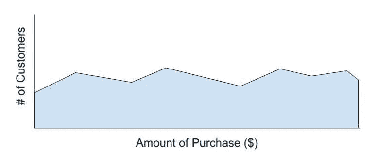
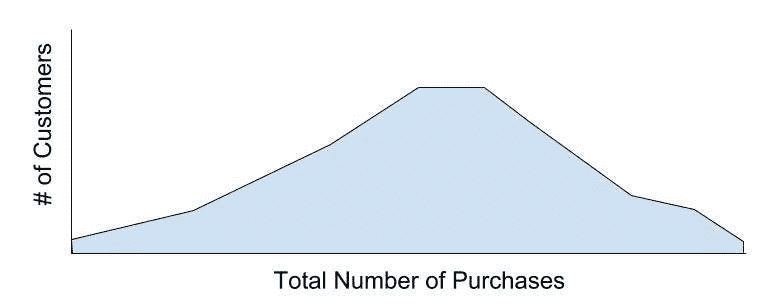
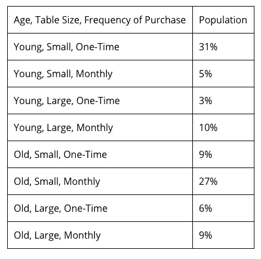

# 数据驱动型公司如何构建客户角色

> 原文：<https://towardsdatascience.com/how-data-driven-companies-build-customer-personas-c1559d82a1d4?source=collection_archive---------1----------------------->

“与人打交道可能是你面临的最大问题，尤其是在商界。”——[*卡耐基*](https://en.wikipedia.org/wiki/Dale_Carnegie)

客户角色通过识别共同的特征和行为来帮助你理解你的客户。

不是所有的客户都是一样的，这就是为什么我们首先需要数据！如果你的生意成功，你将拥有大量的客户，每个人都有不同的需求和兴趣，这使得你很难理解你的客户到底想要什么。你如何为数百个不同的客户建立营销策略和计划？

客户人物角色通过识别大群客户共有的共同特征和创建简单的档案，使得处理如此多样化的客户群变得更加容易。这些人物角色是代表大部分客户的客户档案，将使您的决策更容易，因为相对于数百个单独的客户，根据已知的人物角色测试给定的策略更容易。

例如，如果您在线销售桌子，并且有大量居住在加利福尼亚的女性客户，您可以创建一个名为 Beth 的热爱家具的加利福尼亚妇女的角色。Beth 不是一个真实的人，但是她的角色与你的许多现有客户有着共同的特征，因此 Beth 可以用来代表他们的利益。当你考虑产品变化和营销活动时，你可以通过 Beth 的视角来看待它们，并考虑她作为你客户的代理人可能会如何回应。

你如何建立你的客户角色，你如何知道他们代表你的客户？本周我们将介绍一些技巧，包括:

*   第 2 部分— [寻找特征(群体重采样)](http://outlier.ai/2017/01/31/customer-personas-finding-traits/)
*   第 3 部分— [构建人物角色(人群分类)](http://outlier.ai/2017/02/01/customer-personas-building-personas/)
*   第 4 部分— [测试人物角色](http://outlier.ai/2017/02/02/customer-personas-testing-personas/)
*   第 5 部分— [利用人物角色做决策](http://outlier.ai/2017/02/03/customer-personas-using-personas/)

首先，我们将从一个简单的方法开始，确定哪些角色已经存在于您的客户数据中。

> [**离群值**](http://outlier.ai/about-outlier/) **监控您的业务数据，并在发生意外变化时通知您。**我们帮助营销/发展&产品团队从他们的业务数据中获取更多价值。 [**今天安排试玩。**](http://outlier.ai/)
> 
> - Outlier 是 Strata+Hadoop World 2017 观众奖得主。

# 客户角色:寻找特征

创建人物角色很容易，你只需要收集描述大部分用户的一系列特征，并把它们组合成一个人物角色。识别这些大片段并提取它们的特征是真正的挑战。

如果你把你的客户想象成一大群复杂的人，这个任务可能会令人生畏。然而，你需要做的只是找到一些特征，有效地将你的客户分成几个主要群体。要做到这一点，你可以一次从一个角度看你的客户。

比如让我们考虑一下我们网上表公司的客户群。我们的客户遍布全国各地，代表了许多年龄组和人口统计数据。让我们看看它们是如何分布在几个常见维度上的:

在这种情况下，购买量分布相当均匀，因此没有明显的客户集中。因此，这对于我们的任何角色来说都不是一个好的特征。

购买总数有一个有趣的钟形曲线形状，表明购买总数向中心集中，但它未能将我们的客户划分成任何逻辑组。相反，看起来我们的客户在一系列购买中表现得像一个单一的、大的部分。

Breaking customers into groups based on effective traits

年龄让我们第一次清楚地看到有效的特质，两个明显的年龄组彼此分开。这使得年龄成为创建人物角色的理想特征，因为这里出现了两种明显的人物角色:年轻人和老年人。

正如你所看到的，通过不同的维度来观察客户的分布，可以很容易地识别出清晰的界限，这表明这是构建人物角色的一个很好的选择。您正在寻找的维度将在您的客户中创建清晰的分离，并允许您用单一维度有效地捕获大型群体。

接下来，我们将讨论如何将这些候选特征组合成人物角色！

# 客户角色:构建角色

我们刚刚讨论了如何通过维度来查看客户的分布，从而为我们的人物角色确定候选特征。现在我们只需要将它们放在一起，组成人物角色！

不幸的是，你可能有一长串的特征，因为你的客户会自然地分成几十个组。虽然我们欢迎你创建几十个人物角色，但通常只有少数几个是最有用的。为了处理这种复杂性，我们将通过使用总人数来对可能的角色进行分类。

例如，让我们假设我们为我们的在线家具公司确定了 3 个特征，每个特征都有 2 个明确的细分:年龄(年轻人和老年人)、桌子大小(小和大)和购买频率(一次性和每月)。即使这个简单的模型有三个特征(每个有两个部分),也能产生 8 个不同的角色！

这太多了，所以让我们通过查看属于每个候选人角色的客户总数来减少数量。当我们这样做时，事情就变得清楚多了:

如你所见，结合我们的特征实际上减少了我们大部分潜在的人物角色到我们人口中很小的一部分。只有“年轻的、小的、一次性的”和“老的、小的、每月的”代表了足够多的客户，值得创建人物角色。

请注意，这两个人物角色并没有涵盖我们所有的客户，只是很大一部分。你的人物角色永远不会覆盖 100%的用户，因为需要的人物角色数量是不切实际的。然而，在使用你的人物角色时，请记住这一点，因为有许多客户不在此列。

你会发现使用人口作为过滤器是从几十个潜在人物角色中筛选出几个的非常有效的方法。有了这些，明天我们将讨论如何验证你的人物角色是否真正代表了你的客户，或者你的客户只是代表了你的人物角色。

# 客户角色:测试角色

既然我们已经集合了一组人物角色，我们需要做最后的检查，确保组成我们的人物角色的特征是有用的。特征可以是两种形式之一:

*   **描述性**。这些特征抓住了客户行为方式的某些方面，并有助于预测未来的行为。
*   **衍生**。这些特征是客户行为的结果，很可能是你的产品如何运作或者客户如何看待你的公司的产物。

区别是很重要的，因为由衍生特征组成的人物角色是没有用的，因为它们不会帮助你理解变化会如何影响你的客户。你的人物角色应该只由描述性特征组成，但是你如何确定呢？

为了说明这个困难，让我们回顾一下[另一篇关于集群](http://outlier.ai/2017/02/06/clustering/)的文章中的一个特征:桌子大小。请记住，我们发现了两个客户角色:(1)一次性购买小桌子的年轻人，以及(2)每月购买小桌子的老年人。有人每个月都会买桌子，这应该会让你感到奇怪吧！为什么会发生这种情况？

1.  他们可能代表一个更大的组织或社区购买桌子，所以他们并不是真正为自己购买，幕后有一个你永远看不到的顾客。
2.  他们可能会在你的网站上购买桌子，然后在其他地方转售，因为你的价格低于他们在其他地方可以买到的价格。

选项#1 是描述性的，因为购买一张桌子的频率表明了一组特定的客户需求，这意味着向您购买时有一组特定的决策标准。选项#2 是派生的，因为它仅仅是你的桌子价格的结果，没有真正的决策标准。根据哪个原因是正确的，这种特征的分类会有所不同，所以你需要调查所有的原因来确定。

理解为什么一个特征存在对于正确分类它是至关重要的。做到这一点的唯一可靠方法是在每个角色中与客户交谈，更好地了解他们的需求。好消息是，你不必在每个人物角色中与几个人交谈，就能确定你已经捕捉到了代表他们的描述性特征。

接下来，我们将讨论如何利用我们收集的这些人物角色做出决策！

# 客户角色:使用角色

有了我们的客户角色，是时候使用它们来做一些决定了！

正如我在开始时提到的，客户角色作为大部分客户的替身是很有用的。你可以用它们来评估客户眼中的许多不同决策。例如，如果你是…

*   **…考虑增加新功能。你的角色会在意吗？对他们的效用是什么？他们将如何看待这种效用？他们是否有时间使用更多的功能，或者他们已经尽可能多的花时间和你在一起了？**
*   **…考虑新的品牌信息。**它将如何脱颖而出？他们还收到了哪些信息，这些信息与其他信息相比会有什么不同？有没有办法用一种直接吸引他们的语言来说话？
*   **……考虑新市场。你的人物角色在新市场中存在吗？你需要接触全新类型的客户，还是以新的方式接触相同的人物角色？**

大多数公司会更进一步，使用他们的人物角色来组织客户焦点小组，这些小组是符合给定人物角色的简单的客户小组。通过按人物角色收集客户，您可以从真实客户那里获得关于即将到来的变化的实时相关反馈，反馈的方式应该是有针对性的和一致的。从人物角色中建立的客户焦点小组远远优于一般的客户小组，在那里你会得到许多相互冲突的利益和观点。

无论你如何使用你的人物角色，确保你公司的每个人都知道他们是什么，并把他们作为决策的参考点。如果你这样做了，你会发现你的团队做出了更好、更一致的以客户为中心的决策。

**回顾**:顾客角色是一种简单的方法，可以确保你在做每一个决定时都考虑到顾客。通过创建几个典型客户类型的简介，你可以更容易地从客户的角度看问题。

> [**离群值**](http://outlier.ai/about-outlier/) **监控您的业务数据，并在发生意外变化时通知您。**我们帮助营销/发展&产品团队从他们的业务数据中获取更多价值。 [**今天安排试玩。**](http://outlier.ai/)
> 
> - Outlier 是 Strata+Hadoop World 2017 观众奖得主。