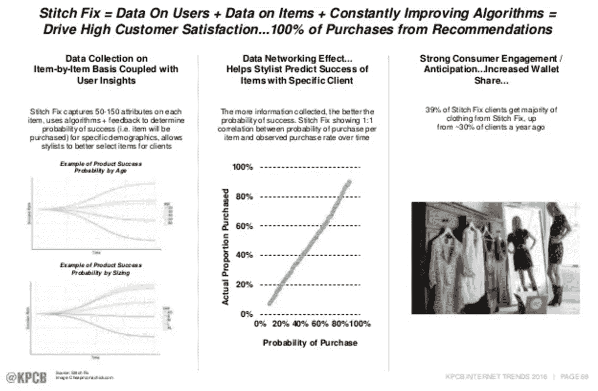

# 数据科学如何帮助营销

> 原文：<https://towardsdatascience.com/how-data-science-helps-marketing-d63980fcc8fa?source=collection_archive---------0----------------------->

This post is the updated version of a piece I wrote last year, [How Data is Fueling Marketing](https://mng.lincolnwdaniel.com/how-data-is-fueling-marketing-3c7524e57b37#.1ifk74wvw)

数据科学正在迅速改变营销。具体来说，情境营销正在兴起。情境营销不同于传统营销。顾名思义，这种营销策略完全是关于[背景](http://www.marketing-schools.org/types-of-marketing/contextual-marketing.html)。我们不再对观察和预测人们如何进行简单的有意识决策感兴趣。相反，通过这种类型的营销，我们试图观察个人在购买某种产品、预订旅行或浏览在线目录时的习惯。

I updated the content after the talk I gave at the [SXSWi 2016](http://www.sxsw.com) in Austin, Texas

[习惯模式](https://en.glosbe.com/en/en/habitual%20pattern)塑造了我们每天大约 45%的选择。通过情境营销，我们不仅可以发现和了解某人是谁，还可以了解他们的地理位置，他们在不同的地区和时间点正在做什么，以及他们接下来最有可能做什么。更准确地说，利用今天可用的数据，我们可以观察个人的年龄、性别、过去的行为、设备使用、位置、天气条件、一天中的时间和购买历史以及其他相关因素。这有助于我们在正确的时间传递正确的信息，并识别正确的趋势。*我们观察和评估深层背景特征的能力改变了一切。*

大公司已经在战略性地使用情境营销。例如，在线预订公司 Orbitz 向 Mac 用户显示价格更高的酒店！另一方面，Travelocity 为移动购物者提供 5%的折扣。众所周知，美国航空公司会在你购物时提高机票价格，以制造一种紧迫感。购物零售商 Target 已经开发了一款“[怀孕探测器](https://consumerist.com/2012/02/17/target-figures-out-teen-girl-is-pregnant-before-her-father-does-sends-helpful-coupons/)，它基本上是通过观察访问其网站的女性的购物和浏览历史/cookie 来挖掘数据，从而进入你的子宫。

**这是怎么回事？营销人员知道怀孕是一个非常有利可图的时间段。通过观察成千上万不同的产品购买，数据科学家能够确定 25 种最显著的产品，这些产品对“怀孕预测”得分有显著影响。该分析模型有助于预测个人在特定时间段和小机会窗口内的购物行为。然后，Target 会在孕妇可能搜索和购买其产品的特定怀孕阶段发送优惠券。**

计时是如何工作的？举个例子:化妆水是一种广泛使用的，每个人都广泛购买的，不仅仅是孕妇。然而，据观察，孕妇在第二个三个月开始时会购买更多的无味乳液。

数据科学不仅非常好地补充了传统营销，它还在我们眼前改变了传统营销。数据科学的一个重要方面是，它通过输入和输出来改善情境营销。诸如年龄、性别、收入、位置、搜索历史、购买历史、一天中的时间等输入。这些输入产生相关的输出，这些输出可以改变你的服务/产品的游戏规则，例如:你需要使用什么渠道来锁定你的客户，你的产品的正确价格和折扣，客户在一年中的特定时间对什么特定产品感兴趣，等等。

关于数据科学如何驱动环境，我最喜欢的一个例子是 [Stitchfix](https://www.stitchfix.com/) 。在刚刚于 6 月 1 日发布的[玛丽·米克尔互联网趋势报告](http://www.slideshare.net/kleinerperkins/2016-internet-trends-report)中，Stitchfix 在微观数据驱动的参与度、满意度、数据收集和个性化方面领先。Stitchfix 正在将类似网飞和 Spotify 的内容发现应用于时尚，为每位顾客提供差异化的体验。Stitchfix 有一个融合了艺术和科学的数据驱动的入职流程。他们收集顾客偏好、风格和活动的数据点。设计师使用 Pinterest 板和访问算法来帮助改善产品选择。下面的幻灯片描述了 Stitchfix 如何利用数据科学不仅驱动上下文，而且作为其整个产品的基础。

Get the full report at [Kleiner Perkins](https://medium.com/u/f306055a38a8?source=post_page-----d63980fcc8fa--------------------------------)

Nestle Purina 在数据科学方面也取得了成功，不仅利用它来个性化客户信息，还个性化客户宠物！雀巢普瑞纳，近年来，已经建立了一个目标，为宠物主人提供量身定制的营养计划，为他们喜爱的宠物。作为全球第二大宠物食品公司，data science 通过文章索引、文章结构聚类以及推荐算法的使用，帮助 Purina 推出了许多针对客户的广告。

所有这些例子听起来都很棒。但问题出现了，我们如何在数据科学的支持下实际实现和实施情境营销？

**确定你的战略**无论你的品牌是什么，舒适的鞋子、驾驶汽车的乐趣、快餐配送、难忘的经历都会强化这种价值。与此同时，开始思考什么样的输入对改进你的产品最有益，以及你希望产生的输出。

**为顾客旅程提供便利**想办法解决顾客购买前、购买中和购买后的旅程问题。关注客户体验和参与度。

**内容仍然是王道**在互动过程中，你提供的每一条内容都必须基于你从过去的互动中收集的数据，不仅针对客户，而且针对特定的时刻。

**与您的 IT 部门合作**引入正确的工具来执行自动化和项目。

今天，我们作为营销人员可以获得大量的数据。你必须愿意去挖掘它。搜索、移动设备使用、内容浏览和社交媒体活动揭示了客户一生的旅程。重新定义活动的目的，邀请你的客户不仅购买你的产品或服务，还要与你建立深厚的关系。

这只是冰山一角。如果您有更多问题，请在 Twitter 上联系我。

在 [Slideshare](http://www.slideshare.net/AnnaAnisin/how-data-science-is-fueling-marketing) 上查看这篇文章的演示文稿。