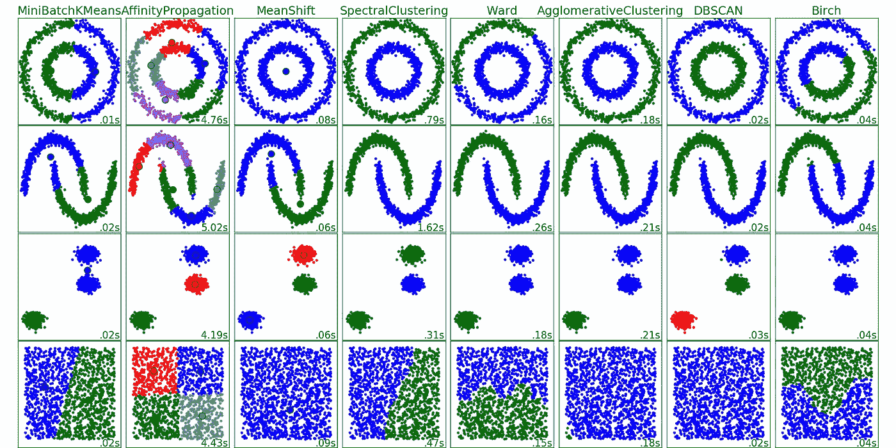

# DBSCAN 如何工作，为什么要使用它？

> 原文：<https://towardsdatascience.com/how-dbscan-works-and-why-should-i-use-it-443b4a191c80?source=collection_archive---------0----------------------->

[Scikit Learn — Plot Cluster Comparison](https://scikit-learn.org/0.15/auto_examples/cluster/plot_cluster_comparison.html)

首先，这是我在 medium 上的第一个故事，如果我做错了什么，我很抱歉。其次，我的英语不是很流利，那么我可能会犯很多错误，对此我也很抱歉。

简单解释一下我为什么用英语写这篇文章:首先，我需要提高我的英语技能。那么，什么比用英语写课文更好呢？第二，我认为英语文本会比葡萄牙语(我的母语)文本更受欢迎。

我认为当我们尝试去做，犯错误并从中吸取教训的时候，我们就学到了新的东西。

> "经验只是我们给自己的错误起的名字."(奥斯卡·王尔德)

好了，开始说 DBSCAN 吧。

**带噪声应用的基于密度的空间聚类(DBSCAN)** 是一种众所周知的数据聚类算法，常用于数据挖掘和机器学习。

基于一组点(让我们在图中举例说明的二维空间中思考)，DBSCAN 根据距离度量(通常是欧几里德距离)和最小点数将彼此靠近的点分组在一起。它还将低密度区域中的点标记为异常值。

## 参数:

DBSCAN 算法基本上需要两个参数:

> **eps** :指定点之间应该有多近才能被认为是聚类的一部分。这意味着如果两点之间的距离小于或等于该值(eps)，则这些点被视为邻居。
> 
> **minPoints** :形成密集区域的最小点数。例如，如果我们将 minPoints 参数设置为 5，那么我们至少需要 5 个点来形成密集区域。

## 参数估计:

参数估计是每个数据挖掘任务都面临的问题。为了选择好的参数，我们需要了解它们是如何使用的，并且至少对将要使用的数据集有一个基本的了解。

> **eps** :如果选择的 eps 值太小，很大一部分数据将不会被聚类。它将被视为异常值，因为不满足创建密集区域的点数。另一方面，如果选择的值太高，聚类将合并，大多数对象将在同一个聚类中。eps 应该根据数据集的距离来选择(我们可以使用 k-距离图来找到它)，但一般来说，较小的 eps 值是更可取的。
> 
> minPoints :作为一般规则，最小 minPoints 可以从数据集中的多个维度(D)中导出，因为 minPoints ≥ D + 1。对于有噪声的数据集，较大的值通常更好，并将形成更重要的聚类。minPoints 的最小值必须是 3，但是数据集越大，应该选择的 minPoints 值就越大。

你可以在这里找到更多关于参数估计的信息。

## 为什么要用 DBSCAN？

DBSCAN 算法应该用于查找数据中的关联和结构，这些关联和结构很难手动找到，但对于查找模式和预测趋势可能是相关的和有用的。

聚类方法通常用于生物学、医学、社会科学、考古学、市场营销、字符识别、管理系统等领域。

让我们考虑一下 DBSCAN 的实际应用。假设我们有一个电子商务，我们想通过向客户推荐相关产品来提高销售额。我们不知道客户到底在寻找什么，但根据数据集，我们可以预测并向特定客户推荐相关产品。我们可以将 DBSCAN 应用于我们的数据集(基于电子商务数据库)，并根据用户购买的产品找到聚类。使用此聚类，我们可以发现客户之间的相似之处，例如，客户 A 购买了 1 支笔、1 本书和 1 把剪刀，客户 B 购买了 1 本书和 1 把剪刀，然后我们可以向客户 B 推荐 1 支笔。这只是使用 DBSCAN 的一个小示例，但它可以用于多个领域的许多应用程序。

## 如何才能轻松实现？

正如我已经写的(提示:不要相信我写的所有东西)DBSCAN 是一个众所周知的算法，因此，您不需要担心自己实现它。您可以使用互联网上可以找到的一个库/包。下面是一个可以找到 DBSCAN 实现的链接列表: [Matlab、](https://www.mathworks.com/matlabcentral/fileexchange/52905-dbscan-clustering-algorithm) [R、](https://cran.r-project.org/web/packages/dbscan/index.html) [R、](https://github.com/mhahsler/dbscan) [Python、](http://scikit-learn.org/stable/modules/generated/sklearn.cluster.DBSCAN.html) [Python](https://github.com/choffstein/dbscan) 。

我还开发了一个应用程序(葡萄牙语),以教学的方式解释 DBSCAN 如何工作。该应用程序是用 C++编写的，你可以在 Github 上找到它。

## 参考资料:

> 1996 年 8 月，北京大学出版社出版。一种基于密度的发现带噪声的大型空间数据库中聚类的算法。在 *Kdd* (第 96 卷，№34，第 226–231 页)中。
> 
> https://en.wikipedia.org/wiki/DBSCAN