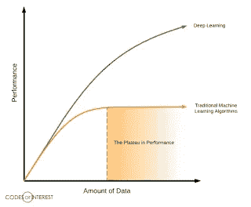

# 应该有多‘深’才称得上深度学习？

> 原文：<https://towardsdatascience.com/how-deep-should-it-be-to-be-called-deep-learning-a7b1a6ab5610?source=collection_archive---------2----------------------->

深度学习现在无处不在。它是 AI 的前沿，每个人似乎都在追求它。

当我们第一次试图理解深度学习的概念时，通常会出现一个问题，

“机器学习模型需要有多深才能被认为是深度学习模型？”

这听起来可能是一个合理的问题。毕竟，在深度学习中，我们正在使用更深更复杂的模型。

事实证明，我们问了一个错误的问题。我们需要从一个不同的角度来看待深度学习，看看为什么。

让我们来看几个深度学习的定义。

> “机器学习中的一个子领域，它基于学习多级表示的算法，以便对数据之间的复杂关系进行建模。因此，较高级别的功能和概念是根据较低级别的功能和概念定义的，这样的功能层次结构被称为深度架构”——深度学习:方法和应用。
> 
> “概念的层次结构允许计算机通过用简单的概念构建复杂的概念来学习它们。如果我们画一个图表来显示这些概念是如何建立在彼此之上的，那么这个图表是很深的，有许多层。为此，我们将这种方法称为人工智能深度学习。”—深度学习。麻省理工学院出版社，伊恩·古德菲勒，约舒阿·本吉奥，亚伦·库维尔。

这些谈到了一个叫做**分层特征学习**的概念。为了理解它，让我们后退一步，看看深度学习模型是如何工作的。

让我们以卷积神经网络为例。

卷积神经网络是深度学习的一个主要例子。他们受到了视觉皮层(大脑中处理视觉输入的区域)中神经元排列方式的启发。这里，并不是所有的神经元都与来自视野的所有输入相连。相反，视野是由相互部分重叠的神经元群(称为感受野)组成的。

卷积神经网络(CNN)以类似的方式工作。它们使用数学卷积算子(近似于感受野的工作方式)处理输入的重叠块。

A Convolutional Neural Network

典型 CNN 的第一卷积层使用一组卷积滤波器来从输入图像中识别一组低级特征。这些识别的低级特征然后被汇集(来自汇集层)并作为输入提供给下一个卷积层，该卷积层使用另一组卷积滤波器从先前识别的低级特征中识别一组高级特征。这对于几个层继续进行，其中每个卷积层使用来自前一层的输入来识别比前一层更高级别的特征。最后，最后一个卷积层的输出被传递给一组完全连接的层，用于最终分类。

本质上，CNN 的卷积滤波器试图首先识别较低级别的特征，并使用这些识别的特征通过多个步骤逐渐识别较高级别的特征。

这就是我们前面讲的分层特征学习，是深度学习的关键，也是它与传统机器学习算法的区别所在。

Hierarchical Feature Learning

深度学习模型(如卷积神经网络)不会试图一次理解整个问题。

即，它不像传统算法试图做的那样，试图一次掌握输入的所有特征。

它所做的是逐段查看输入，并从中导出较低级别的模式/特征。然后，它使用这些较低级别的特征来逐步识别更高级别的特征，**通过许多层，分等级地**。

这使得深度学习模型能够通过从简单模式逐步建立复杂模式来学习复杂模式。这也允许深度学习模型更好地理解世界，它们不仅“看到”特征，还看到这些特征是如何建立的层次结构。

当然，必须分层次地学习特征意味着模型中必须有许多层。这意味着这样的模型将是“深”的。

这让我们回到了最初的问题:这并不是说我们将深度模型称为深度学习。那就是，为了实现分层学习，模型需要是深度的。**深度是实现分层特征学习的副产品**。

分层特征学习允许深度学习模型不像传统机器学习模型那样具有“性能高原”。

The (lack of) Plateau in Performance in Deep Learning

那么，我们如何鉴别一个模型是深度学习模型还是现在？
简单来说，如果模型使用分层特征学习——首先识别较低级别的特征，然后在此基础上识别较高级别的特征(例如，通过使用卷积滤波器)——那么它就是深度学习模型。如果不是，那么无论你的模型有多少层，它都不被认为是深度学习模型。

这意味着具有 100 个全连接层(并且只有全连接层)的神经网络不会是深度学习模型，但具有少量卷积层的网络会是。

如果你想了解更多关于深度学习的知识，可以在亚马逊查阅我的书:[**Build Deeper:Deep Learning 初学者指南**](https://www.amazon.com/dp/1549681060) 。

*原载于 2017 年 9 月 5 日 www.codesofinterest.com***。**