# 费德勒是如何击败纳达尔的

> 原文：<https://towardsdatascience.com/how-did-federer-beat-nadal-aus-open-17-90b956137610?source=collection_archive---------3----------------------->

## 对费达尔游戏玩法的深入探究

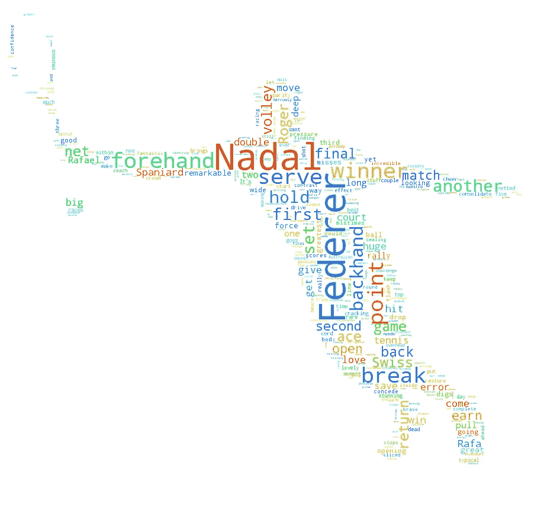

对于那些生活在岩石下的人来说，今年 1 月 29 日早些时候，费德勒和纳达尔之间的澳大利亚网球公开赛决赛在墨尔本举行。费德勒在史诗般的五盘比赛中胜出**6–4 3–6 6–1 3–6 6–3**，这是为电影编写的完美跷跷板！两位球员在整个比赛中都表现出了令人难以置信的毅力，特别是因为他们都在长期受伤后复出。对罗杰和拉法来说，这标志着一个非凡游戏赛季的开始，对我来说，有很多数据需要[分析](https://shubh24.github.io/shubh24.github.com/math/2017/04/12/Federer-Vs-Nadal-Statistically%21)！

我一直想对费德尔的竞争做一次真正的深度挖掘，澳大利亚公开赛决赛似乎是一个不错的起点。多亏了令人难以置信的图表项目，世界可以对最近的大部分比赛进行逐镜头分析。对我们这样的网球爱好者来说绝对是金牌；)

在这篇博客中，我们将会看到拉法糟糕的正手击球，罗杰漂亮的反手回击以及这之间的一切。他们在球场上的发球有多好，身体发球对罗杰有效吗，拉法是从哪里完成长途拉力赛的？罗杰的反手击球被讨论了很多，他是打得很深，还是打在底线上？谁控制了反弹，谁处理压力更好，等等！

# **拍摄制作**

让我们看看他们的投篮——意料之中的正手触地球和反手触地球领先，其次是反手削球和其他击球。

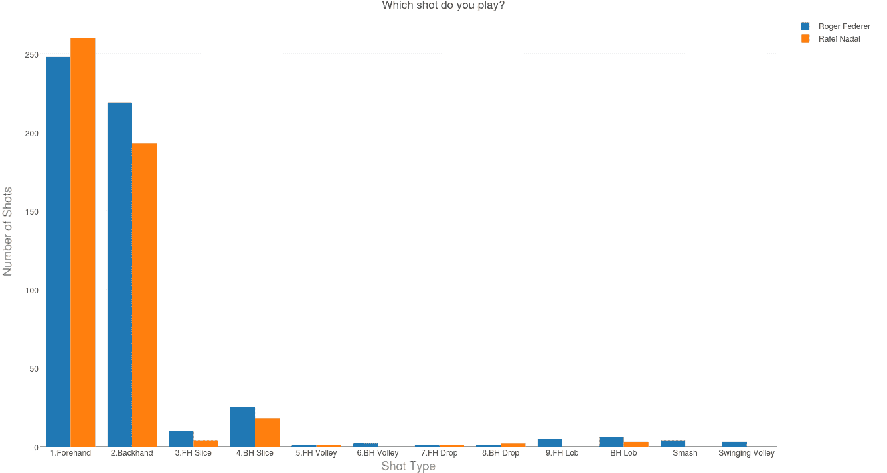

有趣的是，拉法比罗杰打更多的正手球，而罗杰比拉法打更多的反手球——很可能是纳达尔掩盖他的反手球的结果。很快会有更多的消息:)

# **按拉力赛长度计算的胜率**

纳达尔的一个著名策略是延长反弹，迫使对手失误。这对罗杰不利吗？

左边是罗杰·费德勒通过致胜和诱导强迫失误赢得的分数(来自纳达尔)，右边是拉法。纳达尔的策略看起来肯定是有效的(6 杆后明显增加)，强迫失误让他比胜利者获得更多的分数！在费德勒这边，他的获胜者是在一个不同的联盟，在 6 次出手后为他赢得了超过 30%的分数。

# **谁主宰了！**

分数显示这场比赛打得很好，两局轮流进行。然而，我想看看双方球员在比赛中的统治力，比赛分数是一个很容易衡量的变量。

优势得分:我没有深入研究拉力赛长度(一分有多难！)，只看在那个特定游戏中赢得的积分份额。假设罗杰以 40 比 15 赢得了比赛——罗杰的统治力得分是 0.8，而拉法的统治力得分是 0.2。

一个有趣的统计数据——罗杰在发球比赛中的平均统治力为 0.71，而纳达尔为 0.66。费德勒的发球稍微轻松了一点！

这是两个球员每场比赛的优势分数，由于发球的变化，会出现预期的曲折。看看第 6-8 场比赛，罗杰在第一盘击败了纳达尔，第 11-14 场比赛，纳达尔连续 4 场比赛！最后，在第五盘，罗杰最初被打破(勉强)，但他回来赢得了最后 4 场比赛的小跑！

# **发球**

作为玩家游戏性的最重要因素之一，你的发球决定了接下来的对打风格！我已经分析了他们的发球策略，他们是否在寻找更短的反弹，以及他们的第一次和第二次发球有多不同。

显然罗杰有更好的一发(22%的一发得分率！)，但是拉法在第二次发球时挡住了它(用那一脚！).

发球方向——发球方向分为三大类，“宽”、“身体”和“T”。看看他们在平分(左边)和分庭(右边)的百分比。

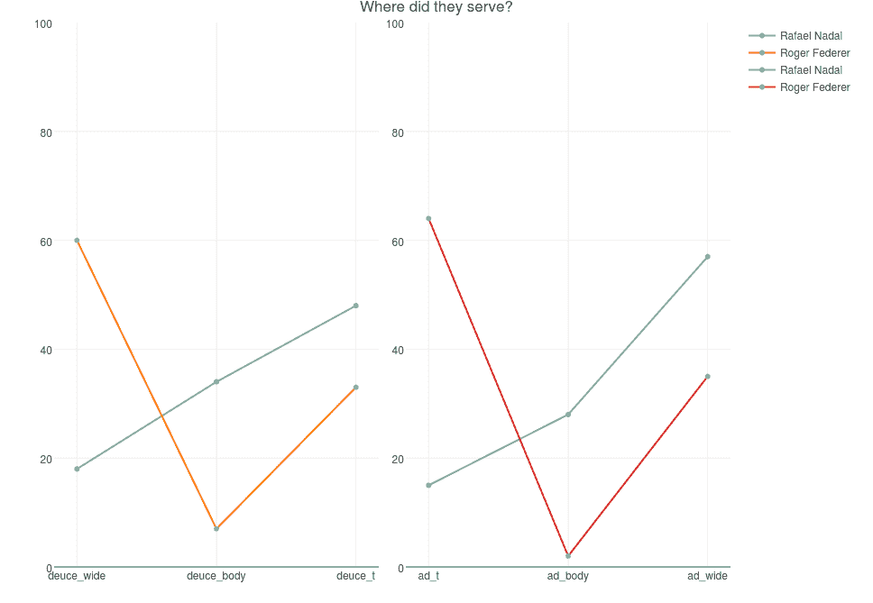

x 轴是发球的自然顺序，deuce_wide 在最左边，ad_wide 在最右边。

重要的是要记住，罗杰打右手，而拉法打左手，以了解模式。而罗杰在 Deuce T 和 Ad Wide 打反手，拉法在 Deuce T 和 Ad T 打反手，罗杰投篮 60%发球给拉法的反手，拉法投篮 50%以上给罗杰的反手。该模式几乎是对称的两个平分和广告法院！

还要注意罗杰几乎从不在身体上发球，但是拉法在 30%的时候都在这样做——有意思！它有分红吗？

服务器在 3 分或以下赢得的分数百分比

对于纳达尔来说，向身体发球并不是一个很大的优势(在短分上)——这几乎类似于在平分场上向反手发球，以及在 Ad 场上最糟糕的方向。对于费德勒来说，所有方向的短分都几乎相等！

现在让我们把注意力转移到他们发球得分的进程上——发球方需要多长时间才能结束得分？

正如我们前面看到的，罗杰的第一次发球非常有效！由于拉法的二次发球胜率更高，我本以为这些反弹会持续更短时间——两者完全相等！每秒 5.3 次拉力赛——这可能是纳达尔用他的触地击球指挥拉力赛的结果。我们再深入一点，好吗？

左边的图表示第一次发球得分与对打得分的百分比，右边的图表示第二次发球得分。一个非常有趣的之字形图案是可见的，因为当球在他的球场上时，两个球员都占上风！根据我们之前的观察，拉斐尔在第二次发球时领先，而罗杰在第一次发球时也领先。

第一次发球的稳步下降表明，得分越长，对他不利的可能性就越大——如果这是一次强有力的发球，得分应该更早结束，对打仍然存在的事实表明回球者占了上风！

# **接发球**

足够的服务，让我们得到一些好的回报！我们将会看到在回球时打了哪些球，从哪些位置以及回球的深度。

根据报道，费德勒在反手回击方面占据上风，而拉法在正手回击方面略微领先罗杰。不要看太多的切片和芯片回报，数量太少，没有任何洞察力。

我们已经看到了纳达尔令人惊讶的高身发球，让我们看看费德勒如何反应！

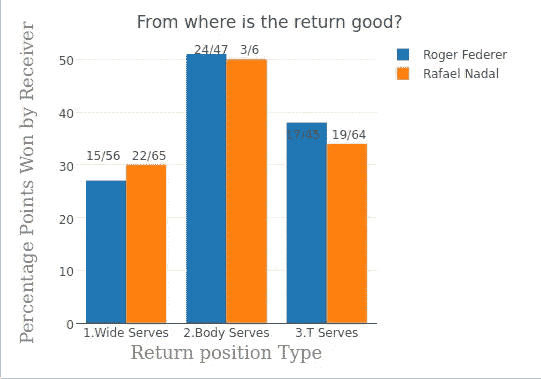

罗杰·费德勒几乎 50%的身体发球胜利——难以置信！拉法，请发球出界！纳达尔在身体上也有 50%的胜率，但他们总共只占 6 次发球(对洞察力来说微不足道)。

好的回报通常是快速深度的，这使服务器处于惊讶状态。弱小的矮个子通常很容易被派出，这就是为什么两个球员都更喜欢发球而不是对手的反手。

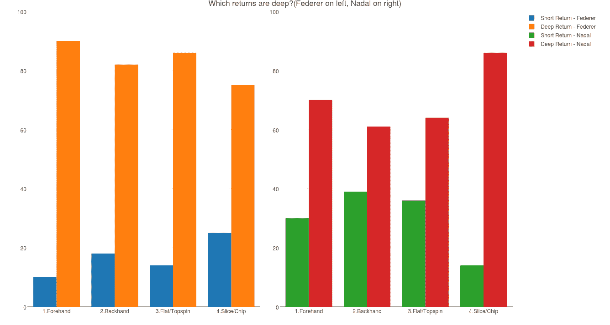

图中显示的是费德勒(左)和纳达尔(右)的短回和深回的百分比。费德勒在所有击球中都有更深的回球，尤其是正手击球！很明显，拉法应该在回报上下功夫，这将是费德勒发球 3 分高比例的一个重要因素。

# **触地击球**

发球发了，接发球发了，我们还是要得分，对吗？让我们关注一下两位选手的击球方向——费德勒更多的直拍，纳达尔更多的正手？

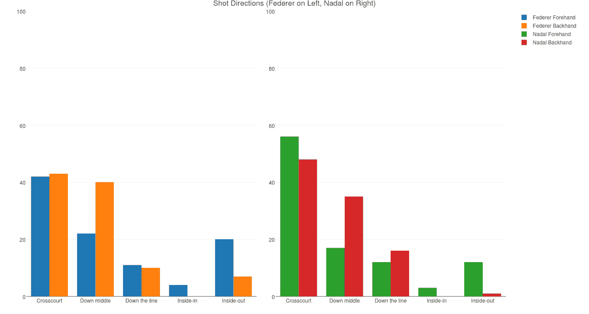

蓝条代表斜线球、中线球、底线球、内外球的正手击球百分比。费德勒在左，纳达尔在右

我对两位球员如此高的斜线球命中率感到惊讶！正如所料，当球打在中间时，反手击球的比例较高，这表明反手击球的风险较低。另一个非常令人惊讶的数据是——相比纳达尔的 27 次(12%)，罗杰打出了 42 次内翻正手(20%)。你可能永远也猜不到这一点，让我们看看这些内外颠倒是否能有效地完成这一点？

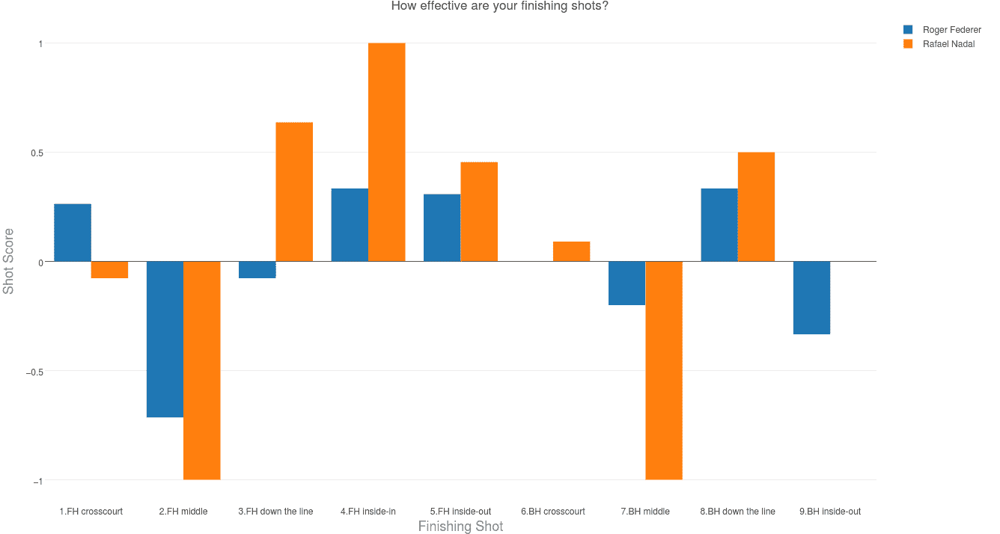

为了计算最后一击的有效性，我考虑了三个因素——如果这一击是致胜的或者导致了对手的被迫失误(在接下来的一击中),则为+1，如果这一击被证明是非被迫失误，则为-1。因此，如果拉法打了 5 次反手得分，其中 2 次是致胜球，2 次是罗杰的诱导失误，1 次是拉法的非受迫性失误，他的反手得分将是(2+2–1)/5 = 0.6

让我们剖析一下上面的情节，它给了我们很多启示！

*   罗杰的正手斜线球还可以，但是拉法的失误有点多
*   中路的正手一点也不漂亮，尤其是拉法(6 次非受迫性失误，1 次致胜)。
*   嗯，拉法的正手下网一如既往的完美(香蕉射谁了？).罗杰因为他的非受迫性失误受到了很多处罚，显示了他的表现有多不稳定！
*   从内外来看，罗杰可能命中更多，但在这方面没有人能击败纳达尔！
*   反手向下-中间也不好看。基本不要中间击球！
*   费德勒的反手直拍再次显示了他的连胜(4 次胜利，2 次受迫性失误和 3 次非受迫性失误)

在最后的镜头中有更多的视觉效果

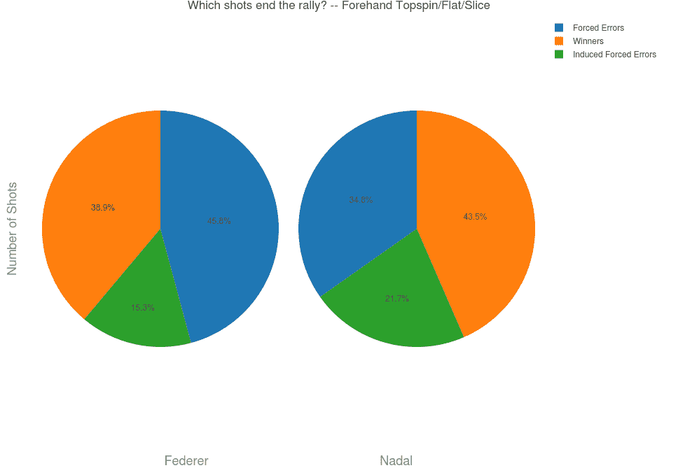

Forehand Finishing Shots

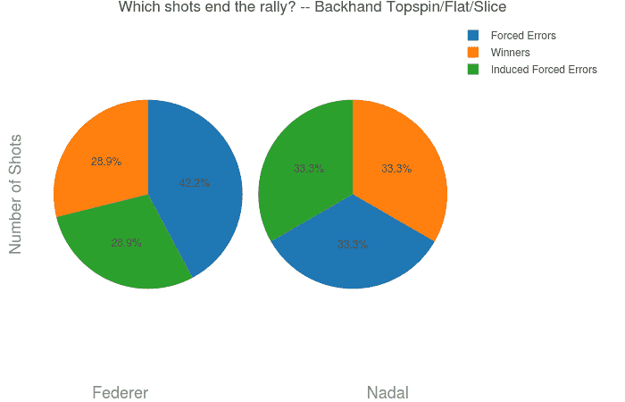

Backhand Finishing Shots

两张饼状图都显示了费德勒非受迫性失误的优势，也显示了纳达尔是如何从受迫性失误中获得异常高的分数的！

# **网玩**

随着费德勒近年来在网球比赛中大获全胜，纳达尔成为一名底线球员，这几乎是一个机会！

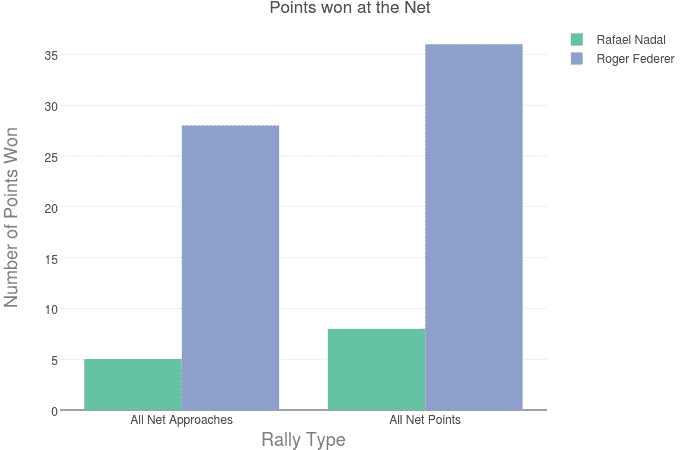

一个有趣的统计数据是，当费德勒决定上网时，反弹是多么短暂。*我完全可以想象费德勒发球，上前截击，然后纳达尔将球打入网内——4 次对打！*

我告诉过你！

# **压力点**

现在我们知道费德勒的比赛有多冒险了，他是如何在第五盘坚持住的，尤其是在休息的时候！我试图理解压力点，我的定义是当发球方在发球时落后一分以上(例如 0-30 或 15-40)，或者当他落后一个破发点(40-AD)时，就称为“压力点”。

这是压力点的图表。

Pressure points and Pressure points saved, Federer on left, Nadal on right

通过之字形曲线可以看到设定的优势，两条曲线之间的差距变成了失去的关键破发点！在第一盘，罗杰没有面对一个压力点，这与纳达尔在第四盘的情况类似。第五盘非常有趣——尽管在一个压力点上输了，但费德勒反击了，让纳达尔承受了巨大的压力(13 分！).最终，罗杰在最后 4 场比赛中连胜，夺得冠军:)

# **结论**

*   罗杰打出了更多的致胜球和更多的非受迫性失误。五花肉的游戏性！
*   罗杰的发球比拉法更有统治力(0.71 比 0.66)
*   罗杰的第一次发球更有效，他发球得分率高
*   拉法有一个更强的二次发球，在比赛中一直表现得更好。
*   两名球员都在对方的背后发球，拉法在罗杰的身体上发了相当多的球。
*   为身体服务对拉法来说没有用——失去了 50%的分数
*   两位球员都有很高的斜线球命中率，罗杰比拉法更多的内外球。令人惊讶！
*   拉法在所有射门类型上都有更好的得分——罗杰犯了太多的错误。
*   罗杰打了一场非凡的落网球，在离网 4.5 个回合内完成了比赛。
*   直到第五盘，两位选手对压力点的处理几乎是一样的。罗杰全力以赴，最后一盘拉法连得 13 分，最终他屈服了！

总而言之，这个分析是更多分析的起点——我很想看看这几年来两位球员是如何处理最后一击、发球方向和压力点的！

2008 年温布尔登网球公开赛应该讲述一个不同的故事，对吧？；)

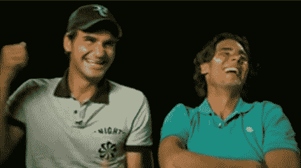