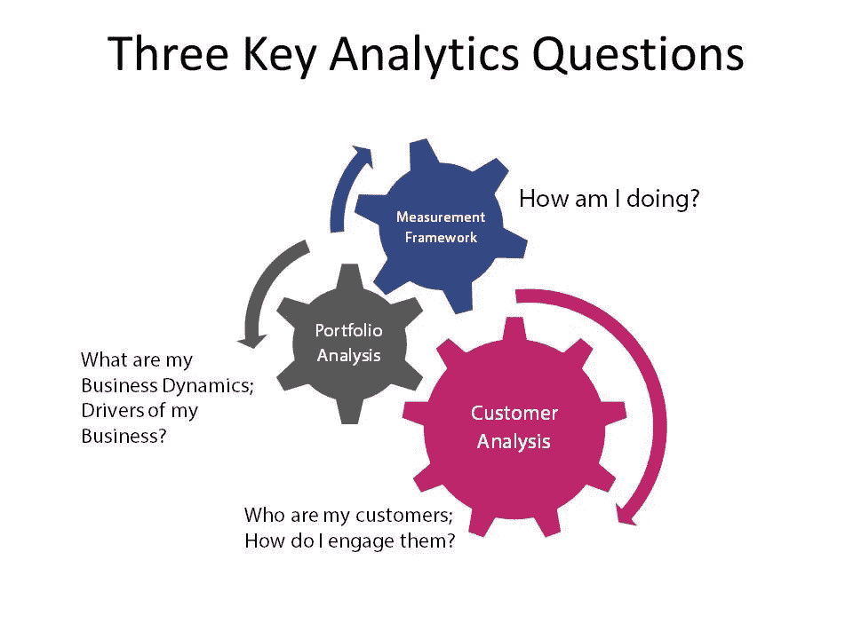
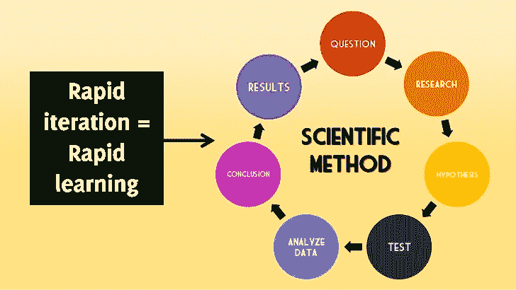

# 数据科学家如何提出正确的问题？

> 原文：<https://towardsdatascience.com/how-do-data-scientists-ask-the-right-questions-6a5d7b89cdd9?source=collection_archive---------10----------------------->

我喜欢提问。而且，多年来，这份爱让我不仅能很好地提问，还能问出*正确的*问题。

通过在大学里学习古希腊语和拉丁语，我非常熟悉一些最好的魔鬼拥护者:苏格拉底、亚里士多德和柏拉图；在获得图书馆和信息科学硕士学位的同时，我开始应用批判性思维大师的学术研究框架，如[玛西娅·贝茨](https://en.wikipedia.org/wiki/Cognitive_models_of_information_retrieval)和[布伦达·德文](https://www.scribd.com/document/166816567/Brenda-Dervin-Sense-Making-Theory-and-Practice-An-Overview-of-User-Interests-in-Knowledge-Seeking-and-Use)；现在，在熨斗学院的数据科学沉浸式课程中，我开始学习数据科学的提问方式。

> 那么，对于一个数据科学家来说，问正确的问题是什么样的呢？

如果你花几秒钟在谷歌上搜索“问正确的问题数据”，你会检索到几十个“问这几个问题，你不会出错”的想法。这些妙趣横生的文章更有可能用下图这样的图表来修饰:

Image from Piyanka Jain‘s piece “3 Key Analytics Questions to Ask Your Big Data” (2012).

这些图片通常概述的步骤大致如下:1)就衡量成功的关键绩效指标达成一致(上文 Jain 的衡量框架)，2)定义这些关键绩效指标(上文 Jain 的投资组合分析)，以及 3)确定利益相关方(上文 Jain 的客户分析)。一旦你做到这一切，瞧！你拥有一切你需要的东西来精心制作一个值得数据驱动的探索的真诚问题。

虽然回答上述问题应该是任何数据驱动的分析的一部分，但简单地回答这些问题似乎不符合数据科学家在“做”数据科学时所做的事情。那么，我们带来了什么额外的东西呢(当然，除了我们对微积分、线性代数、统计学、概率和编程的惊人理解之外)？

嗯，在这个领域呆了整整两个星期之后，我觉得有资格说，数据科学提问方式的独特力量来自于……等等……**科学！**

(不，我不是说数据科学家整天站在实验室里，在显微镜下看着比特和字节。*我的意思是，数据科学家通过使用传统上与生命科学相关的技术来质疑他们的世界。*)

对一些人来说，这似乎是显而易见的——科学实际上是专业的名称——但在写这篇文章之前，它对我来说仍然有点模糊。

为了提醒我们自己“科学”意味着什么，让我们回到五年级和科学方法。科学方法的第一步(或者第二步，如果你把观察算作第一步的话)是**提问**。

[https://www.slideshare.net/jamesbirchler/experimenting-your-way-to-success-applying-lean-startup-principles-to-product-development-at-imvu](https://www.slideshare.net/jamesbirchler/experimenting-your-way-to-success-applying-lean-startup-principles-to-product-development-at-imvu)

回到五年级，在提出一个问题后，我们被教导形成一个假设，然后检验这个假设，最后分析我们的结果。但是我们很少被鼓励在观察数据和得出结论之间徘徊(另外，我们为什么要这样做？最酷的部分是证明醋和小苏打混合会使东西爆炸。

> 但是，我们在五年级时掩盖的同一个极限空间，我们可以根据某种基于数据的反馈循环一次又一次调整我们的问题的空间，似乎就是制造数据科学特殊调味酱的地方。

如果我们深入一些数据科学教育学，我们可以看到科学方法与乔·布利茨坦和汉斯·彼得·菲斯特所说的“数据科学过程”之间的相似之处:

[https://insidebigdata.com/2014/11/12/ask-data-scientist-data-science-process/](https://insidebigdata.com/2014/11/12/ask-data-scientist-data-science-process/)

你会很快发现科学方法和数据科学过程非常非常相似。

(如果你想要一个更性感的版本，请查看[微软的数据科学生命周期](https://docs.microsoft.com/en-us/azure/machine-learning/team-data-science-process/overview)，并用“问一个问题”替换[商业理解](https://docs.microsoft.com/en-us/azure/machine-learning/team-data-science-process/lifecycle-business-understanding)。)

而且，与探索最相关的是，他们都强调迭代(Bircher 的科学方法图及其“快速迭代”调用，以及 Blitzstein & Pfister 的不断旋转的箭头)。这些过程中的“科学”似乎体现在一个我们应该反复重复的问题-测试-分析循环中。通过重复这些步骤，数据科学家能够精心设计正确的问题。

这些正确的问题被脸书数据科学家 Brandon Rohrer 称为“尖锐的”在“[如何做数据科学](https://blogs.technet.microsoft.com/machinelearning/2016/03/28/how-to-do-data-science/)”中，他写道:

> 在选择你的问题时，想象你正在接近一个神谕，它可以告诉你宇宙中的任何事情，只要答案是一个数字或一个名字。这是一个恶作剧的神谕，它的回答将尽可能含糊不清，令人困惑。你想用一个无懈可击的问题来确定它，以至于先知不得不告诉你你想知道的。糟糕问题的例子有“我的数据能告诉我关于我的业务的什么？”，“我该怎么办？”或者“我如何增加利润？”这些为无用的答案留下了回旋的空间。相比之下，对于“第三季度我会在蒙特利尔卖出多少台 Q 型小玩意？”这样的问题，答案很明确或者“我车队中的哪辆车会先出故障？”是无法避免的。

当然，因为我们是在这里做科学研究，Rohrer 的文章以命令式的**“然后重新开始”结束。**

数据科学教育家 Raj Bandyopadhyay 在“[数据科学过程:一个数据科学家每天实际做什么](https://medium.springboard.com/the-data-science-process-the-complete-laymans-guide-to-what-a-data-scientist-actually-does-ca3e166b7c67)”中同样强调了提问的迭代过程是真正的数据科学分析的第一步:

> 你一开始会问很多问题。。。一旦你对这个领域有了一个合理的理解，你应该问更多有针对性的问题，以准确理解你的客户想要你解决的问题。。。答对了！你现在可以看到问题中的数据科学。。。[和]。。。你可以把它框起来。。。请求进入数据科学问题。。。【还有一次】。。。你有一些具体的问题，你可以回到销售副总裁那里，向她展示你的问题。

…等等，直到你到达*的*问题。

总之，虽然为数据分析提供一个按数字绘制的解决方案的思考片段对于调整业务目标和让你的老板高兴是有用的，但要知道数据科学远不止这些。

**数据科学是关于科学的！科学是关于反复提问的，很少能被包装成一个可转移的“做这个，然后做那个”的包。这就是为什么数据科学家拥有我们出了名的高薪，并且是值得这些薪水和尊敬的神奇科技独角兽——我们是批判性思维、商业敏锐度和硬技能的结合体。**

爱因斯坦知道发生了什么，他说

> 如果我有一个小时来解决一个问题，而我的生命取决于它，我会利用前 55 分钟来确定要问的适当问题，因为一旦我知道了适当的问题，我就可以在不到 5 分钟的时间内解决问题。

如果我有一个小时来解决一个问题，我可能会分配至少 10 分钟来阅读栈溢出，但是嘿，爱因斯坦不得不利用他所拥有的。