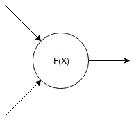
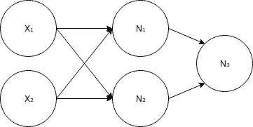
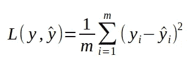
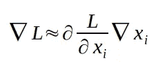
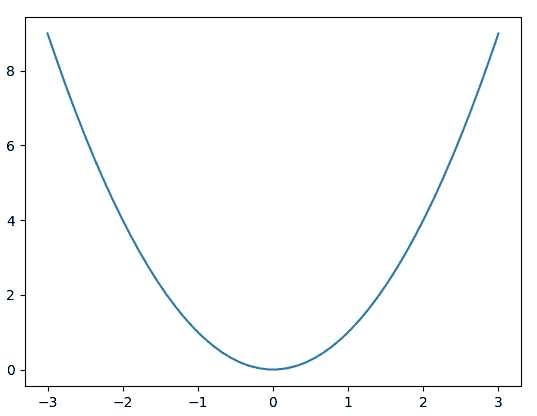

# 我们如何“训练”神经网络？

> 原文：<https://towardsdatascience.com/how-do-we-train-neural-networks-edd985562b73?source=collection_archive---------1----------------------->

# 一.导言

这是我计划的关于用于机器学习特别是神经网络“训练”的优化算法系列的第 1 部分。在这篇文章中，我将介绍梯度下降(GD)及其小变化。在未来，我计划写一些其他流行的算法，如:

1.  [带动量的 SGD](https://medium.com/@bushaev/stochastic-gradient-descent-with-momentum-a84097641a5d)。
2.  [RMSprop](/understanding-rmsprop-faster-neural-network-learning-62e116fcf29a) 。
3.  [亚当](/adam-latest-trends-in-deep-learning-optimization-6be9a291375c)。
4.  遗传算法。

我会在写完之后把链接放在上面。

今天我将从简单介绍神经网络开始，这足以理解我将要谈到的概念。我将解释什么是损失函数，以及它对“训练”神经网络或任何其他机器学习模型的意义。我并不声称我的解释是对神经网络的全面、深入的介绍，事实上，我希望你已经熟悉了这些概念。如果你想更好地理解神经网络中正在发生的事情，我在文章末尾提供了一个学习资源列表。

我会解释几年前在 [kaggle](https://www.kaggle.com/c/dogs-vs-cats) 举行的狗和猫比赛的例子。在比赛中，我们面临的任务是识别一张图片上出现的是一只狗还是一只猫。

# 二。让我们定义一个神经网络

人工神经网络(ANN)的灵感来自于你大脑中实际发生的事情。虽然这些类比相当松散，但人工神经网络与它们的生物“父母”有几个相似之处。它们由一定数量的神经元组成。让我们来看看单个神经元。

Single *Perceptron*.

我们将考虑一个由弗兰克·罗森布拉特在 1957 年提出的最简单的神经元模型的一点修改版本，称为“感知器”。我做的所有修改都是为了简单，因为我不打算对神经网络进行深入解释。我只是想让你对正在发生的事情有一个直觉。

那么什么是神经元呢？这是一个数学函数。它接受几个数字作为输入(想要多少就有多少)。我上面画的神经元接受两个数字作为输入。我们将每个输入数字表示为 *xₖ* ，其中 k 代表输入的索引。对于每个输入 *xₖ* 神经元分配另一个数字 *wₖ* 。由这些数字 *wₖ* 组成的向量称为权重向量。这些权重使得每个神经元独一无二。它们在测试期间是固定的，但在训练期间，我们将改变这些数字，以便“调整”我们的网络。稍后我会在帖子中谈到这一点。如我上面所说，神经元是一种功能。但这是什么功能呢？它是权重和输入的线性组合，上面有某种非线性函数。让我进一步解释一下。我们来看第一部分——线性部分。

Linear combination of weight and inputs.

上面的公式就是我说的线性组合。我们将获取输入，将它们乘以相应的权重，然后将所有内容相加。结果是一个数字。最后一部分——是在其上应用某种非线性函数。今天使用的最流行的非线性实际上比称为整流线性单元( *ReLU* )的线性函数更简单。公式如下:

Rectified Linear Unit formula.

如果我们的数字大于零，那么我们就照原样取那个数字，如果它小于零，那么我们就取零。这种非线性函数应用于神经元中的顶部线性函数称为激活函数。我们必须有某种非线性函数的原因将在后面变得明显。总而言之，神经元是一种功能，它接受一些固定数量的输入，并输出一个单一的数字——它的激活。我们对于上面被淹没的神经元的最终公式是:

Neuron that takes two numbers as input.

稍微超前一点，如果我们以狗和猫为例，我们将把我们的图像作为输入传递给神经元。你可能会想，当我把神经元定义为函数时，我们怎么传递图像。你应该记得，我们在计算机中存储图像的方式是把它表示成一个数字阵列，每个数字表示一个给定像素的亮度。因此，将它传递给神经元的方法是采用 2D 阵列(或彩色图像的 3D 阵列)，将其展平成一行以获得 1D 向量，并将所有这些数字传递给神经元。不幸的是，这使得我们的网络依赖于图像大小，我们只能处理网络定义的给定大小的图像。现代神经网络已经找到了解决这个问题的方法，但是现在我们将有这个限制。

是时候定义一个神经网络了。神经网络也是一个数学函数。它是由一堆相互连接的神经元定义的。当我说连接时，我的意思是一个神经元的输出被用作其他神经元的输入。让我们看看一个非常简单的神经网络，希望它能让我们更清楚。

Simple neural network.

上面定义网络有 5 个神经元。正如你所看到的，这些神经元堆叠在 3 个完全连接的层中，也就是说，一层中的每个神经元都连接到下一层中的每个神经元。一个网络有多少层，每层有多少个神经元以及它们是如何连接的——所有这些选择定义了网络的*架构*。第一层由两个神经元组成，称为输入层。这一层中神经元实际上不是我前面描述的神经元，从某种意义上说，它们不执行任何计算。它们只是用来表示网络的输入。对非线性的需求来自于我们将神经元连接在一起的事实，以及线性函数之上的线性函数本身就是线性函数的事实。所以，如果没有在每个神经元中应用非线性函数，神经网络将是线性函数，从而不会比单个神经元更强大。最后要注意的是，我们通常需要一个介于 0 和 1 之间的数字作为神经网络的输出，所以我们把它当作一个概率。例如，在狗和猫的对比中，我们可以把接近零的数字当作猫，把接近一的数字当作狗。为此，我们将对最后一个神经元应用不同的激活函数。我们将使用一个[乙状结肠](https://en.wikipedia.org/wiki/Sigmoid_function)激活。关于这个函数，你只需要知道它返回一个从 0 到 1 的数字，这正是我们想要的。说了这么多，我们准备定义一个与我上面画的网络相对应的函数:

Function, defining out neural network. Superscript of w denoted to the index of the neuron. Subscript of w denotes the index of input.

因此，我们有某种函数，它接受一些数字，输出另一个介于 0 和 1 之间的数字。实际上，这个函数有什么公式并不重要，重要的是我们有复杂的非线性函数，它由一些权重参数化，在某种意义上，我们可以通过改变权重来改变函数。

# 三。损失函数

在我开始讨论训练之前，唯一需要定义的是一个损失函数。损失函数是一个告诉我们，我们的神经网络对于某项任务有多好的函数。直观的方法是，取每个训练示例，通过网络得到数字，从我们想要得到的实际数字中减去它，然后平方它(因为负数和正数一样糟糕)。

其中，y 代表我们希望从网络中获得的数字，y 代表我们通过网络传递示例实际获得的数字，I 代表训练示例的索引。让我们再次以狗对猫为例。我们有一个关于狗和猫的图片的数据集，如果是狗就标记为 1，如果是猫就标记为 0。这个标签对应于 y——当我们把图像传递给网络时，它是我们想从网络获得的数字。为了计算损失函数，我们将检查数据集中的每个训练示例，为该示例计算 *y* ，然后计算上面定义的函数。如果损失函数很大，那么我们的网络就不能很好地运行，我们希望损失函数越小越好。我们可以重写这个公式，将 y 改为我们网络的实际函数，以更深入地了解损失函数和神经网络的联系。

# 四。培养

当我们从神经网络开始时，我们随机初始化我们的权重。显然不会给你很好的结果。在训练的过程中，我们希望从性能差的神经网络开始，以高精度的网络结束。就损失函数而言，我们希望我们的损失函数在训练结束时更低。改进网络是可能的，因为我们可以通过调整权重来改变它的功能。我们希望找到另一个比最初的函数性能更好的函数。

训练的问题等价于最小化损失函数的问题。为什么要把损失最小化而不是最大化？原来损失是更容易优化的函数。

有很多优化函数的算法。这些算法可以基于梯度，也可以不基于梯度，因为它们不仅使用函数提供的信息，还使用函数的梯度。一种最简单的基于梯度的算法——我将在本文中讨论——被称为随机梯度下降。让我们看看它是如何工作的。

首先，我们需要记住什么是对某个变量的导数。让我们取一些简单的函数 *f(x) = x* 。如果我们还记得高中时的微积分规则，它的导数是 x 的每一个值，这告诉了我们什么？导数是当我们朝正方向迈出无限小的一步时，函数变化的速度。从数学上讲，它可以写成如下形式:

这意味着:我们的函数改变了多少(左边的项)大约等于这个函数对某个变量的导数 x 乘以我们改变了那个变量多少。当我们的步长无限小时，这个近似值是精确的，这是导数的一个非常重要的概念。回到我们的简单函数 *f(x) = x，*我们说过，我们的导数是 1，这意味着，如果在正方向上采取一些步骤ε，函数输出将改变 1 乘以我们的步骤ε，也就是ε。很容易检查出这是规则。这甚至不是一个近似值，这是准确的。为什么？因为我们的导数对于每个 *x.* 的值都是一样的，这对于大多数函数来说是不成立的。让我们来看一个稍微复杂一点的函数 *f(x) = x .*

y = x²

从微积分的规则中我们知道，函数的导数是 2x。很容易检查出，如果我们从某个值 *x* 开始，进行某个步长ε，那么我们的函数改变了多少，并不完全等于上面给出的公式。

现在，梯度是偏导数的向量，其元素包含关于函数依赖的变量的导数。对于我们到目前为止考虑的简单函数，这个向量只包含一个元素，因为我们只使用了一个输入的函数。对于更复杂的函数(如我们的损失函数)，梯度将包含我们想要的每个变量的导数。

我们如何利用导数提供给我们的信息来最小化某个函数呢？让我们回到我们的函数 *f(x) = x .* 显然，那个函数的最小值在点 *x = 0* ，但是计算机怎么会知道呢？假设，我们从某个随机值 *x* 开始，这个值是 2。 *x = 2* 中函数的导数等于 4。这意味着我们正向移动一步，我们的函数将成比例地变为 4。所以会增加。相反，我们想最小化我们的功能，所以我们可以向相反的方向迈出一步，负的，以确保我们的功能会减少，至少一点点。我们能走多远？这是个坏消息。我们的导数只能保证，如果迈出无限小的一步，函数就会减小。我们不能这么做。一般来说，你需要用某种超参数来控制你的步长。这个超参数被称为*学习率*，我稍后会谈到它。现在让我们看看如果我们从点 *x = -2 开始会发生什么。*导数现在等于-4，这意味着，如果向正方向迈出一小步，我们的函数将成比例地变为-4，因此它将减小。这正是我们想要的。

注意到这里的一个模式了吗？当 *x > 0* 时，我们的导数大于零，我们需要往负方向走，当 *x < 0* 时，导数小于零，我们需要往正方向走。我们总是需要向导数的反方向前进一步。让我们把同样的想法应用于梯度。梯度是指向空间某个方向的向量。它实际上指向函数增长最快的方向。因为我们想最小化我们的函数，我们将向梯度的相反方向迈出一步。让我们应用我们的想法。在神经网络中，我们认为输入 *x、*和输出 *y* 是固定的数字。我们要对其求导的变量是权重 *w，*，因为这些是我们想要改变的值，以改善我们的网络。如果我们计算损失函数相对于我们的权重的梯度，并且在梯度的相反方向上采取小的步骤，我们的损失将逐渐减少，直到它收敛到某个局部最小值。这种算法被称为梯度下降。在梯度下降的每次迭代中更新权重的规则如下:

For each weight subtract the derivative with respect to it, multiplied by learning rate.

上面符号中的 lr 表示学习速率。它是用来控制我们在每次迭代中走多远。这是训练神经网络时需要调整的最重要的超参数。如果你选择学习太大的东西，那么你会迈出太大的步伐，并且会“跳过”最小值。这意味着你的算法会有分歧。如果你选择的学习率太小，可能会花太多时间收敛到局部极小值。人们已经开发了一些非常好的技术来寻找最佳的学习速度，但是这已经超出了这篇文章的范围。其中一些在我的另一篇文章[“提高我们工作的方式和学习率”](https://techburst.io/improving-the-way-we-work-with-learning-rate-5e99554f163b)中有所描述。

不幸的是，我们不能真正应用这种算法来训练神经网络，原因在于我们的损失函数公式。

从我们上面的定义可以看出，我们的公式是总和的平均值。从微积分我们知道，和导数就是导数的和。因此，为了计算损失的导数，我们需要检查数据集的每个例子。在梯度下降的每一次迭代中都这样做是非常低效的，因为算法的每一次迭代都只是通过一些小的步骤来改善我们的损失。为了解决这个问题，有另一种算法，称为小批量梯度下降。更新权重的规则保持不变，但我们不会计算精确的导数。相反，我们将对数据集的某个小批量进行导数近似，并使用该导数来更新权重。小批量不能保证在最佳方向采取措施。其实通常不会。对于梯度下降法，如果选择足够小的学习率，每次迭代的损失一定会减少。对于小批量来说，这不是真的。你的损失会随着时间的推移而减少，但它会波动，并且更加“嘈杂”。

用于估计导数的批量大小是你必须选择的另一个超参数。通常，您想要尽可能大的批量，因为您的内存可以处理。但是我很少看到有人使用大于 100 的批量。

批量等于 1 的小批量梯度下降的极端版本称为随机梯度下降。在现代文献中，当人们说随机梯度下降(SGD)时，他们实际上指的是小批量梯度下降。大多数深度学习框架会让你选择 SGD 的批量大小。

这就是梯度下降及其变化。最近，越来越多的人开始使用更先进的算法。大部分是基于梯度的，实际上是基于 SGD 稍加修改。我也打算写这些。

# 七。反向传播

关于基于梯度的算法，唯一要说的是我们如何计算梯度。最快速的计算方法是解析地找到每个神经网络结构的导数。我想，就神经网络而言，我不应该说这是一个疯狂的想法。我们上面为一个非常简单的神经网络定义的公式很难找到所有的导数，而且我们只有 6 个参数。现代建筑有数百万个。

第二种方法，实际上也是最容易实现的方法，是用微积分中的公式来近似求导:

虽然它非常容易实现，但这样做的计算代价太大。

计算导数的最后一种方法叫做反向传播，这种方法很好地平衡了计算难度和计算代价。讨论这个算法超出了这篇文章的范围，但是如果你想了解更多，可以去这篇文章的最后一部分，在那里我列出了学习神经网络的资源。

# 不及物动词为什么会起作用？

当我第一次了解神经网络及其工作原理时，我理解所有的方程，但我不太确定它们为什么工作。这个想法，我们可以采取一些功能，然后采取一些导数，并最终与算法，可以区分狗和猫的图像似乎有点超现实主义对我来说。为什么我不能给你一个真正好的直觉，为什么神经网络工作得这么好，有一些方面你应该注意。

1.  我们用神经网络解决的任何问题都必须用某种数学方式来表达。对于狗和猫是这样的:我们需要找到一个函数，它从一幅图像中提取所有的数字，并输出它是一只狗的概率。你可以这样定义任何分类问题。
2.  可能还不清楚，为什么有这样一个函数可以在给定的图像上区分狗和猫。这里的想法是，只要你有一些带有输入和标签的数据集，总会有一个函数在给定的数据集上工作得很好。问题是这个函数将会非常复杂。神经网络来帮忙了。有一个“通用逼近定理”，它说只有一个隐藏层的神经网络可以尽可能好地逼近任何函数。现在，还不清楚为什么，即使我们找到了这个函数的近似值，它也会在新的数据集上工作得一样好，神经网络在训练中没有看到这个数据集。这被称为泛化问题，是一个开放的研究问题。研究表明，SGD 具有“自我概括”效应。但是我们仍然没有真正理解这个问题。

# 七。从哪里了解更多信息

在学习神经网络时，我发现了一些非常有用的资源:

1.  [fast.ai](http://fast.ai) 课程提供了两门优秀的程序员实用深度学习课程，以及一门精彩的计算线性代数课程。这是尽快开始编写神经网络代码的好地方，同时随着课程的深入，学习更多的神经网络理论。
2.  neuralnetworksanddeeplearning.com 的书是一本很棒的关于基础的在线书籍。神经网络背后的理论。作者用一种非常好的方式解释了你需要知道的数学。他还提供并解释了在不使用任何深度学习框架的情况下从头实现神经网络的代码。
3.  [吴恩达关于深度学习的课程](https://www.coursera.org/specializations/deep-learning)coursera 上的课程也很棒，可以学习更多关于神经网络的知识，从非常简单的网络开始，到卷积网络等等！
4.  [3Blue1Brown](https://www.youtube.com/channel/UCYO_jab_esuFRV4b17AJtAw) youtube 频道有一些很棒的视频可以帮助你理解深度学习和线性代数。它们提供了很好的可视化和非常直观的方式来思考数学和神经网络。
5.  [关于视觉识别的卷积神经网络的 Stanford CS231n 课程](http://cs231n.stanford.edu/)是了解更多深度学习特别是 CNN 的好地方。