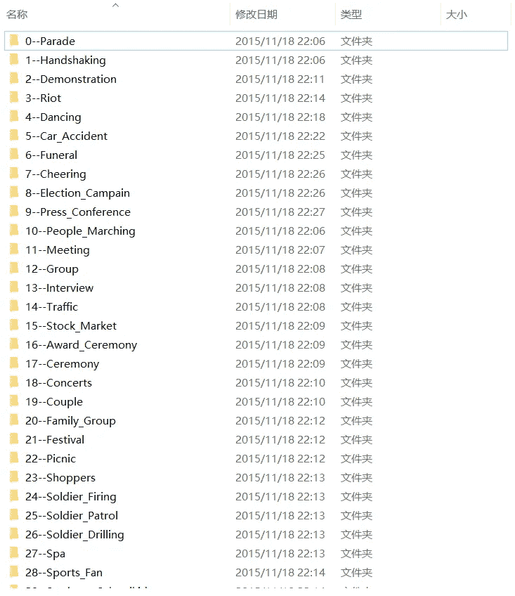
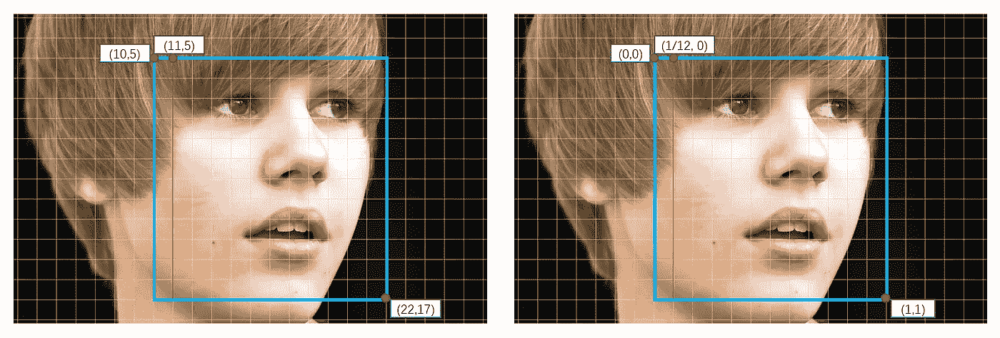
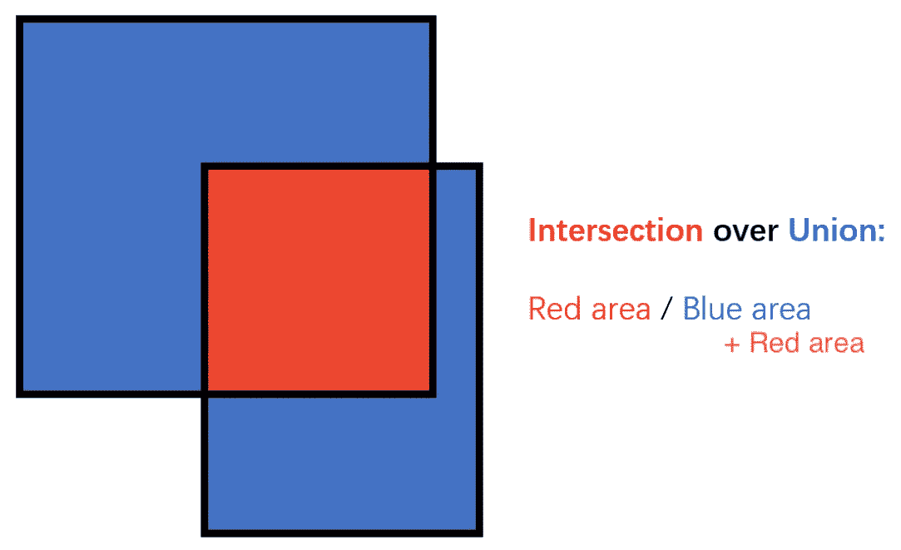

# 如何训练一个人脸检测模型？

> 原文：<https://towardsdatascience.com/how-do-you-train-a-face-detection-model-a60330f15fd5?source=collection_archive---------3----------------------->

由于我最近一直在探索 [MTCNN 模式](https://github.com/ipazc/mtcnn)(在这里[了解更多信息](/how-does-a-face-detection-program-work-using-neural-networks-17896df8e6ff))所以我决定试着训练它。即使只是从概念上考虑，训练 MTCNN 模型也是一个挑战。这是一个级联卷积网络，这意味着它由 3 个独立的神经网络组成，不能一起训练。我决定从训练第一网络 P-Net 开始。

P-Net 是传统的 12-Net:它以 12x12 像素的图像作为输入，并输出一个矩阵结果，告诉您是否存在人脸——如果存在，则显示每个人脸的边界框和面部标志的坐标。因此，我必须从创建一个仅由 12x12 像素图像组成的数据集开始。

开发这个模型的团队使用[宽脸数据集](http://mmlab.ie.cuhk.edu.hk/projects/WIDERFace/)来训练边界框坐标，使用 [CelebA 数据集](http://mmlab.ie.cuhk.edu.hk/projects/CelebA.html)来训练面部标志。为了简单起见，我从只训练边界框坐标开始。

宽脸数据集包括具有不同情况下的人的 **393，703** 张脸的 **32，203** 张图像。这些图像被分成训练集、验证集和测试集。在训练集下，图像根据场合进行了划分:

Image 1: Folders of different images

每个文件夹里都有数百张照片，有成千上万张面孔:

Image 2: Inside a folder

然而，所有这些照片都明显大于 12x12 像素。我不得不将它们裁剪成多个 12x12 的正方形，其中一些包含人脸，一些不包含。

我考虑简单地创建一个 12x12 的内核，它在每张图片上移动，并且每移动 2 个像素复制其中的图片。然而，这将给我留下数百万张照片，其中大多数不包含人脸。为了确保更好的训练过程，我希望大约 50%的训练照片包含人脸。此外，面可以具有不同的尺寸。我需要不同大小的脸的图像。

这是我决定要做的:首先，我将加载照片，去掉任何有一张以上脸的照片，因为这些照片只会使裁剪过程更加复杂。

然后，我将为每张照片创建 4 个不同比例的副本，这样我就有一个副本，照片中的人脸高 12 像素，一个高 11 像素，一个高 10 像素，一个高 9 像素。

小于 9x9 像素的人脸太小，无法识别。为了说明我的观点，这里有一张年轻的贾斯汀比伯的 9x9 像素的脸:

Image 3: 9x9 Justin Bieber // [Source](https://commons.wikimedia.org/wiki/File:Justin_Bieber_at_Easter_Egg_roll.jpg)

对于每个缩放后的副本，我会尽可能多地裁剪 12x12 像素的图像。例如，在这张 12x11 像素的贾斯汀比伯图像中，我可以裁剪两张包含他的脸的图像。

使用更小的比例，我可以裁剪更多的 12x12 的图像。对于每张裁剪后的图像，我需要将边界框坐标转换为 0 到 1 之间的值，其中图像的左上角是(0，0)，右下角是(1，1)。这使得处理计算以及将图像和边界框缩放回原始大小变得更加容易。

Image 4: Converting bounding box coordinates // [Source](https://commons.wikimedia.org/wiki/File:Justin_Bieber_at_Easter_Egg_roll.jpg)

最后，我将边界框坐标保存到一个. txt 文件中。我运行了几次，发现每张脸产生了大约 60 个裁剪过的图像。我需要做的就是再创建 60 张没有人脸的裁剪过的图片。

生成负面(无脸)图像比生成正面(有脸)图像更容易。类似地，我创建了每张图片的多个缩放副本，正面分别为 12、11、10 和 9 像素高，然后我随机绘制了 12×12 像素的方框。如果那个盒子碰巧落在边界框内，我就画另一个。如果该框没有与边界框重叠，我就裁剪了图像的这一部分。

最后，我生成了大约 5000 张正面图像和 5000 张负面图像。这足以做一个非常简单的短期训练。

训练变得简单多了。使用原始文件中的代码，我构建了 P-Net。然后，我读入正负图像，以及边界框坐标集，每个都作为一个数组。我给了每个负像的边界框坐标[0，0，0，0]。

然后，我用一个索引将这些图像混在一起:因为我首先加载的是正图像，所以所有的正图像都在数组的开头。如果我不洗牌的话，前几批训练数据都是正像。

最后，我定义了一个交叉熵损失函数:每个包围盒坐标和概率的误差平方。

我跑了一圈训练。大约 30 个时期后，我达到了大约 80%的准确率……考虑到我的数据集中只有 10000 张图片，这已经不错了。

保存我的权重后，我将它们加载回完整的 MTCNN 文件，并用我新训练的 P-Net 进行了测试。就像以前一样，它仍然可以准确地识别人脸，并在人脸周围画出边框。MTCNN 模型的一个巨大优势是，即使 P-Net 精度下降，R-Net 和 O-Net 仍然可以设法细化边界框边缘。

我没有再次经历为 RNet 和 ONet 处理数据的繁琐过程，而是在 Github 上找到了这个 MTCNN 模型,其中包括该模型的培训文件。该模型类似地仅用宽脸数据集训练边界框坐标(而不是面部标志)。

Image 5: Intersection over Union

正如我所做的那样，这个模型在训练过程之前裁剪了每个图像(P-Net 为 12×12 像素，R-Net 为 24×24 像素，O-Net 为 48×48 像素)。与我的简单算法不同，这个团队根据 **IoU** (交集超过并集，即 12x12 图像和边界框之间的相交面积除以 12x12 图像和边界框的总面积)将图像分类为正面或负面，并包括一个单独的“部分”面类别。

创建单独的“部分面部”类别允许网络学习部分覆盖的面部。这样，即使你戴着墨镜，或者把半边脸转开，网络仍然可以识别你的脸。

此外，对于 R-Net 和 O-Net 培训，他们利用了**硬样本挖掘**。即使经过训练，P-Net 也不是完美的；它仍然会将一些没有人脸的图像识别为正面(有人脸)图像。这些图像被称为**假阳性**。由于 R-Net 的工作是细化包围盒边缘，减少误报，因此在训练 P-Net 之后，我们可以将 P-Net 的误报包含在 R-Net 的训练数据中。这样可以帮助 R-Net 针对 P-Net 的弱点，提高准确率。这个过程被称为**硬样品开采**。类似地，他们也在 O-Net 训练中应用硬样本挖掘。

这个模型的另一个有趣的方面是他们的损失函数。他们没有为人脸检测和边界框坐标定义一个损失函数，而是分别定义了一个损失函数。在训练过程中，他们在每个反向传播步骤中在两个损失函数之间来回切换。我以前从未见过这样定义的损失函数——我一直认为定义一个包罗万象的损失函数会更简单。不知道这样来回切换是否提高了训练精度？

训练这个模型花了 3 天时间。大型数据集使得训练和生成硬样本成为一个缓慢的过程。另外，我第一次训练的时候 GPU 就用完了内存，迫使我重新训练 R-Net 和 O-Net(又花了一天)。

我以前没有研究过这个，但是分配 GPU 内存是训练过程的另一个重要部分。在每个培训计划结束时，他们会记录他们想要使用多少 GPU 内存，以及他们是否允许增长。如果是，如果需要的话，程序可以请求更多的内存。如果没有，程序将在程序开始时分配内存，并且在整个训练过程中不会使用超过指定的内存。这使得进程更慢，但降低了 GPU 耗尽内存的风险。

*   点击[此处](https://medium.com/@reina.wang/mtcnn-face-detection-cdcb20448ce0)阅读实现 MTCNN 模型！
*   点击[此处](https://medium.com/@reina.wang/face-detection-neural-network-structure-257b8f6f85d1)阅读 MTCNN 模型的网络结构！
*   点击[此处](/how-does-a-face-detection-program-work-using-neural-networks-17896df8e6ff)阅读 MTCNN 模式如何运作！

点击此处下载 MTCNN 论文和资源:

*   受训模特 Github 下载:【https://github.com/ipazc/mtcnn 
*   可训练模型 Github 下载:[https://github.com/wangbm/MTCNN-Tensorflow](https://github.com/wangbm/MTCNN-Tensorflow)
*   调研文章:[http://arxiv.org/abs/1604.02878](http://arxiv.org/abs/1604.02878)
*   我的 PNet 培训代码:[https://github.com/reinaw1012/pnet-training](https://github.com/reinaw1012/pnet-training)