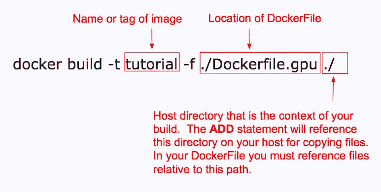
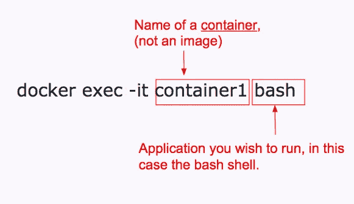

# Docker 如何帮助您成为更高效的数据科学家

> 原文：<https://towardsdatascience.com/how-docker-can-help-you-become-a-more-effective-data-scientist-7fc048ef91d5?source=collection_archive---------0----------------------->


作者:哈默尔·侯赛因

在过去的 5 年里，我听到了很多关于码头集装箱的传言。似乎我所有的软件工程朋友都在用它们开发应用程序。我想弄清楚这项技术如何能让我更有效，但我发现在线教程要么太详细:阐述我作为数据科学家永远不会使用的功能，要么太肤浅:没有给我足够的信息来帮助我了解如何快速有效地使用 Docker。

我写了这个快速入门，所以你不必解析所有的信息，而是可以学习你需要知道的东西来快速入门

*编辑 2020 年 8 月 24 日* : *本文写于 2017 年。大部分仍然是正确的，我已经注释了事情发生变化的几个地方。我仍然鼓励你阅读这篇文章。当你完成后，你可能也会喜欢我最近在 Docker* *上做的这些* [*详细笔记。*](https://notes.hamel.dev/docs/docker/Docker-In-Action.html)

# **Docker 是什么？**

您可以将 Docker 视为轻量级虚拟机，其中包含运行应用程序所需的一切。docker 容器可以捕获系统状态的快照，以便其他人可以快速重建您的计算环境。对于本教程，这就是你需要知道的全部，但是更多细节你可以点击[这里](https://medium.freecodecamp.org/a-beginner-friendly-introduction-to-containers-vms-and-docker-79a9e3e119b)。

# **为什么要用 docker？**

1.  **可再现性**:作为一名专业的数据科学家，你的工作具有可再现性真的很重要。再现性不仅有助于同行评审，还能确保您构建的模型、应用程序或分析能够顺利运行，从而使您的交付成果更加健壮，经得起时间的考验。例如，如果您在 python 中构建了一个模型，仅仅运行 pip-freeze 并将结果 requirements.txt 文件发送给您的同事通常是不够的，因为这只会封装 python 特定的依赖关系，而通常存在于 python 之外的依赖关系，如操作系统、编译器、驱动程序、配置文件或代码成功运行所需的其他数据。即使您可以只共享 python 依赖项，但是将所有内容包装在 Docker 容器中可以减轻其他人重新创建您的环境的负担，并使您的工作更容易访问。
2.  **计算环境的可移植性**:作为一名数据科学家，尤其是在机器学习领域，能够快速改变计算环境会极大地影响你的工作效率。数据科学工作通常从原型制作、探索和研究开始，这些工作不一定马上需要专门的计算资源。这项工作通常在笔记本电脑或个人电脑上进行。然而，经常会出现不同的计算资源会大大加快您的工作流程的情况，例如，一台具有更多 CPU 的机器或一个用于深度学习等事情的更强大的 GPU。我看到许多数据科学家将自己限制在本地计算环境中，因为他们认为在远程机器上重新创建本地环境会有摩擦。Docker 负责移植您的环境(所有的库、文件等)。)非常容易。快速移植您的计算环境也是 Kaggle 竞争中的一个巨大竞争优势，因为您可以以经济高效的方式利用 AWS 上的宝贵计算资源。最后，创建 docker 文件允许您移植许多您喜欢的本地环境的东西——比如 bash 别名或 vim 插件。
3.  **增强您的工程能力**:熟悉 Docker 可以让您将模型或分析部署为应用程序(例如，作为可以提供预测服务的 REST API 端点),让其他人可以访问您的工作。此外，作为数据科学工作流的一部分，您可能需要与之交互的其他应用程序可能存在于 Docker 容器中，如数据库或其他应用程序。

# **码头术语**

在我们开始之前，熟悉 Docker 术语很有帮助:

*   **图像**:是你想要构建的蓝图。例如:Ubuntu + TensorFlow，带有 Nvidia 驱动程序和运行的 Jupyter 服务器。
*   容器:是你赋予生命的图像的实例。您可以运行同一映像的多个副本。掌握图像和容器之间的区别非常重要，因为这对新来者来说是一个常见的混淆来源。如果图像和容器之间的区别不清楚，停下来再读一遍。
*   **Dockerfile** :创建图像的方法。Docker 文件包含特殊的 Docker 语法。从官方文档来看:`Dockerfile`是一个文本文档，它包含用户可以在命令行上调用的所有命令来组合一个图像。
*   **提交**:和 git 一样，Docker 容器提供版本控制。通过提交更改，您可以随时将 docker 容器的状态保存为新的图像。
*   DockerHub / Image Registry :人们可以发布公共(或私人)docker 图片以促进协作和共享的地方。
*   **层**:对已有图像的修改，由 docker 文件中的指令表示。图层按顺序应用于基础图像，以创建最终图像。

我将在这篇文章的其余部分使用这个术语，所以如果你迷路了，请参考这个列表！这些术语很容易混淆，尤其是图像和容器之间——所以在阅读时要保持警惕！

# 安装 Docker

你可以免费下载并安装 Docker 社区版。你可以在这里按照[的指示](https://www.docker.com/community-edition#/download)。

# 创建您的第一个 Docker 图像

在创建 docker 容器之前，创建一个定义图像的 docker 文件是很有用的。让我们慢慢浏览下面的文档。*你可以在本教程* *附带的 Github repo 上找到这个文件* [*。*](https://github.com/hamelsmu/Docker_Tutorial/blob/master/basic_tutorial/Dockerfile)

# 语句中的

```
FROM ubuntu:16.04
```

**来自语句的**封装了 Docker 最神奇的部分。该语句指定了要在其上构建的基础映像。在用 **FROM 指定一个基本映像后，** Docker 将在您的本地环境中查找一个名为 **ubuntu:16.04** 的映像，如果在本地找不到，它将搜索您指定的 Docker 注册表，默认为 [DockerHub](https://hub.docker.com/explore/) 。这种分层机制很方便，因为你经常想在 Ubuntu 这样的操作系统上安装你的程序。不用担心如何从头开始安装 Ubuntu，你可以简单地在官方的 Ubuntu 映像上构建！Dockerhub 上托管着各种各样的 Docker 映像，包括那些不仅仅提供操作系统的映像，例如，如果您想要一个已经安装了 Anaconda 的容器，您可以在官方的 anaconda docker 映像之上构建一个容器。最重要的是，您还可以随时发布您构建的图像，即使该图像是通过在另一个图像上分层而创建的！可能性是无限的。****

**在这个例子中，我们指定我们的基本映像是 **ubuntu:16.04** ，它将寻找一个名为 ubuntu 的 DockerHub [repo。冒号-16.04 后面的镜像名称部分是**标签**，它允许您指定想要安装的基本镜像版本。如果你导航到 Ubuntu DockerHub repo](https://hub.docker.com/_/ubuntu/) ，你会注意到不同版本的 Ubuntu 对应不同的标签:**

****

**Screenshot of the official [Ubuntu DockerHub repo](https://hub.docker.com/_/ubuntu/) as of December 2017.**

**比如在本文撰写之时， **ubuntu:16.04** 、 **ubuntu:xenial-20171201** 、 **ubuntu:xenial** 、 **ubuntu:latest** 都是指 Ubuntu 16.04 版本，都是同一个镜像的别名。此外，该存储库中提供的链接将您链接到用于构建每个版本的映像的相应 docker 文件。你不会总是在 DockerHub 库上找到 DockerHub 文件，因为维护者可以选择包含他们如何制作映像的 DockerHub 文件。我个人发现看几个这样的 Dockerfiles 对更好地理解 Dockerfiles 很有用(但是等你看完这个教程再说吧！)**

**有一个标签值得特别一提，那就是**:最新的**标签。如果您没有在您的 **FROM** 语句中指定一个标签，这个标签指定了您将默认拉取的内容。例如，如果您的 FROM 语句如下所示:**

```
FROM ubuntu
```

**那么你最终只会得到 ubuntu:16.04 的图像。为什么？—如果仔细看上面的截图，您会看到:latest 标签与 16.04 相关联**

**关于 Docker 图片的最后一点:当从 DockerHub 中提取随机的 Docker 图片时，运用明智的判断。恶意行为者创建的 Docker 图像可能包含恶意软件。**

# ****标签声明****

**该语句向图像添加元数据，并且是完全可选的。我添加这个是为了让其他人知道应该联系谁来处理这个映像，也是为了让我可以搜索我的 docker 容器，特别是当服务器上有很多容器同时运行的时候。**

```
LABEL maintainer="Hamel Husain <youremail>"
```

# ****ENV 语句****

```
ENV LANG=C.UTF-8 LC_ALL=C.UTF-8
```

**这允许您更改环境变量，而且非常简单。你可以在这里阅读更多关于这个[的内容](https://docs.docker.com/engine/reference/builder/#environment-replacement)。**

# ****运行语句****

**这通常是完成你想要建立一个 Docker 形象的主要手段。您可以运行任意 shell 命令，如 *apt-get* 和 *pip install* 来安装您想要的包和依赖项。**

```
RUN apt-get update --fix-missing && apt-get install -y wget bzip2    
    build-essential \
    ca-certificates \
    git-core \

...
```

**在本例中，我安装了一些我喜欢的实用程序，比如 curl、htop、byobu，然后安装了 anaconda，接着安装了基本 anaconda 安装中没有的其他库(向上滚动到完整的 other 文件以查看所有的 RUN 语句)。**

**在 **RUN** 语句之后的命令与 Docker 无关，而是普通的 linux 命令，如果您自己安装这些包，您将会运行这些命令，所以如果您不熟悉这些包或 linux 命令，也不用担心。另外，作为进一步的建议——当我第一次开始学习 docker 时，我查看了 Github 或 DockerHub 上的其他 docker 文件，并将我想要的相关部分复制并粘贴到我的 docker 文件中。**

**您可能会注意到 RUN 语句的格式。为了可读性，每个库或包都整齐地缩进并按字母顺序排列。这是 Dockerfiles 的一个普遍惯例，所以我建议你采用它，因为它会简化协作。**

# **EXPOSE 语句**

**如果您试图公开一个端口——例如，如果您从容器内部为一个 jupyter 笔记本或某种 web 服务提供服务，这个语句会很有帮助。Docker 的文档很好地解释了 **EXPOSE** 语句:**

> **`EXPOSE`指令实际上并不发布端口。它在构建映像的人和运行容器的人之间起到一种文档的作用，说明打算发布哪些端口。要在运行容器时实际发布端口，使用`docker run`上的`-p`标志发布并映射一个或多个端口，或者使用`-P`标志发布所有公开的端口并将它们映射到高阶端口。**

# **卷报表**

```
VOLUME /ds
```

**这个语句允许你在 docker 容器和主机之间共享数据。VOLUME 语句允许您挂载外部挂载的卷。主机目录仅在容器运行时声明(因为您可能在不同的计算机上运行该容器)，而不是在定义映像时*。现在，您只需在 docker 容器中指定想要与主机容器共享的文件夹的名称。**

**来自 docker 用户指南:**

> *** **主机目录是在容器运行时声明的**:主机目录(挂载点)本质上是依赖于主机的。这是为了保持图像的可移植性。因为不能保证给定的主机目录在所有主机上都可用。因此，您不能从 docker 文件中挂载主机目录。`*VOLUME*`指令不支持指定`*host-dir*`参数。创建或运行容器时，必须指定挂载点。**

**此外，这些卷意味着在容器的文件系统之外持久存储数据，如果您正在处理大量数据，并且不希望 docker 映像膨胀，这通常是有用的。保存 docker 映像时，此**卷**目录中的任何数据都不会保存为映像的一部分，但是容器中此目录之外的数据将被保存。**

# **WORKDIR 语句**

```
WORKDIR /ds
```

**该语句设置工作目录，以防您想要在另一个命令中引用没有绝对路径的特定文件。例如，docker 文件中的最后一条语句是**

```
CMD [“./run_jupyter.sh”]
```

**假设工作目录是/ds**

# **ADD 语句**

**编辑 2020 年 8 月 24 日:您现在应该使用 COPY 语句而不是 ADD 语句。在这里阅读更多[](https://docs.docker.com/develop/develop-images/dockerfile_best-practices/#add-or-copy)**。****

```
*ADD run_jupyter.sh /ds/run_jupyter.sh*
```

***该命令允许您在 docker 容器运行时将文件从主机复制到 docker 容器中。我用它来执行 bash 脚本并将有用的东西导入容器，比如。bashrc 文件。***

***请注意这里没有完全指定主机容器的路径，因为主机路径是相对于运行*容器*时指定的*上下文目录*的(这将在后面讨论)。***

***当我运行这个容器的时候，碰巧我会将文件 *run_jupyter.sh* 放在上下文目录的根目录下，所以这就是为什么在源文件前面没有路径。***

***从用户指南中:***

> ***`ADD <src>... <dest>`***
> 
> ***`ADD`指令从`<src>`复制新文件、目录或远程文件 URL，并将它们添加到路径`<dest>`处的镜像文件系统中。***

# *****CMD 声明*****

***Docker 容器的设计理念是，它们是短暂的，只停留足够长的时间来完成你想要运行的应用程序。然而，对于数据科学来说，我们经常希望让这些容器保持运行，即使其中没有任何活动的东西在运行。许多人通过简单地运行 bash shell(除非您杀死它，否则它不会终止)来实现这一点。***

```
*CMD [“./run_jupyter.sh”]*
```

***在上面的命令中，我运行一个 shell 脚本来实例化一个 Jupyter 笔记本服务器。但是，如果您没有任何想要运行的特定应用程序，但是您希望容器在不退出的情况下运行，那么您可以使用下面的命令来运行 bash shell:***

```
*CMD ["/bin/bash"]*
```

***这是可行的，因为 bash shell 在您退出之前不会终止，因此容器保持启动和运行。***

***从用户指南中:***

> ***一条`Dockerfile`中只能有一条`CMD`指令。如果您列出了多个`CMD`，那么只有最后一个`CMD`会生效。***
> 
> *****`**CMD**`**的主要用途是为正在执行的容器提供默认值。**这些默认值可以包括一个可执行文件，也可以省略该可执行文件，在这种情况下，您还必须指定一条`ENTRYPOINT`指令。*****

# *****建立你的码头工人形象*****

*****唷，这是关于 Dockerfiles 的大量信息。别担心，从这里开始，其他事情都相当简单。现在我们已经以 docker 文件的形式创建了我们的食谱，是时候构建一个图像了。您可以通过以下命令完成此操作:*****

**********

*****Also available on [Github](https://github.com/hamelsmu/Docker_Tutorial/blob/master/basic_tutorial/build_image.sh)*****

*****这将构建一个 docker 映像(不是容器，如果你不记得区别是什么，请阅读本文开头的术语！)，您可以在以后运行它。*****

# *******从您的 Docker 映像创建并运行一个容器*******

*****现在，您已经准备好让所有这些魔法发挥作用了。我们可以通过执行以下命令来启动此环境:*****

**********

*****Also available on [Github](https://github.com/hamelsmu/Docker_Tutorial/blob/master/basic_tutorial/run_container.sh)*****

*****在您运行这个之后，您的容器将启动并运行！jupyter 服务器将启动运行，因为*****

```
***CMD [“./run_jupyter.sh”]***
```

*****Dockerfile 文件末尾的命令。现在，您应该能够在它所服务的端口上访问您的 jupyter 笔记本了——在本例中，应该可以使用密码*教程从 [http://localhost:7745/](http://localhost:7654/) 访问它。*如果你远程运行这个 docker 容器，你必须设置本地端口转发[以便你可以从你的浏览器访问 jupyter 服务器。](https://help.ubuntu.com/community/SSH/OpenSSH/PortForwarding)*****

# *****与容器交互*****

*****一旦您的容器启动并运行，这些命令将会派上用场:*****

*   *******将新的终端会话附加到容器**。如果您需要安装一些软件或使用 shell，这很有用。*****

**********

*   *****将容器的状态保存为新图像。即使您从一个包含所有想要安装的库的 over 文件开始，随着时间的推移，您可能会通过交互地添加更多的库和包来显著地改变容器的状态。将容器的状态保存为图像是很有用的，您可以稍后共享或在其上分层。您可以通过使用 **docker commit** CLI 命令来实现这一点:*****

```
***docker commit <container_name> new_image_name:tag_name(optional)***
```

*****例如，如果我想将名为 *container1* 的容器的状态保存为名为 hamelsmu/tutorial:v2 的图像，我只需运行以下命令:*****

```
***docker commit container_1 hamelsmu/tutorial:v2***
```

*****你可能想知道为什么 *hamelsmu/* 在图像名称的前面——这只是为了让[稍后更容易将这个容器推送到 DockerHub](http://n order to push a repository to the Docker Hub, you need to name your local image using your Docker Hub username, and the repository name that you created) ,因为 hamelsmu 是我的 DockerHub 用户名(稍后将详细介绍)。如果你在工作中使用 Docker，很可能有一个内部私有的 Docker repo，你可以把你的 Docker 图片放到里面。*****

*   *******列出运行容器**。当我忘记了当前正在运行的容器的名称时，我经常使用这个方法。*****

```
***docker ps -a -f status=running***
```

*****如果您在没有 status=running 标志的情况下运行上面的命令，那么您将看到系统上所有容器的列表(即使它们不再运行)。这对于追踪旧容器很有用。*****

*   *******列出您保存在本地的所有图像**。*****

```
***docker images***
```

*   *******将您的图像推送到 DockerHub(或另一个注册表)**。如果你想和别人分享你的作品，或者方便地在云中保存图片，这是很有用的。注意，这样做时不要分享任何私人信息(DockerHub 上也有私人回购)。*****

*****首先创建一个 DockerHub 存储库，并适当地命名您的映像，如这里所描述的[。这将包括运行命令 **docker login** 首先连接到你在 DockerHub 或其他注册表上的帐户。例如，要将一个图像推送到](https://docs.docker.com/docker-hub/repos/)[这个容器](https://hub.docker.com/r/hamelsmu/tutorial/)，我首先必须将我的本地图像命名为 hamelsmu/tutorial(我可以选择任何标记名)例如，CLI 命令:*****

```
***docker push hamelsmu/tutorial:v2***
```

*****将上述 docker 图像推送到标签为 **v2** 的[该储存库](https://hub.docker.com/r/hamelsmu/tutorial/tags/)。应该注意的是，如果你公开你的图片**，其他人可以简单地在你的图片**上叠加图层，就像我们在本教程中给 **ubuntu** 图片添加图层一样。这对其他寻求复制或扩展你的研究的人来说是非常有用的。*****

# *****现在你有超能力了*****

*****现在您已经知道如何操作 Docker，您可以执行以下任务:*****

*   *****与同事和朋友分享可重复的研究。*****
*   *****通过根据需要将您的代码临时迁移到更大的计算环境中，在不破产的情况下赢得 Kaggle 竞赛。*****
*   *****在您的笔记本电脑上的 docker 容器中本地构建原型，然后毫不费力地将相同的计算无缝地转移到服务器，同时随身携带许多您喜欢的本地环境的东西(您的别名、vim 插件、bash 脚本、定制提示等)。*****
*   *****使用 [Nvidia-Docker](https://github.com/NVIDIA/nvidia-docker) 快速实例化在 GPU 计算机上运行 Tensorflow、Pytorch 或其他深度学习库所需的所有依赖关系(如果你从头开始做这件事，这可能会很痛苦)。更多信息见下面的奖金部分。*****
*   *****将您的模型作为应用程序发布，例如作为一个 rest api，它从 docker 容器中提供预测服务。当您的应用程序被 docker 化时，它可以根据需要被任意多次复制。*****

# *******延伸阅读*******

*****我们只是触及了 Docker 的皮毛，您还可以做更多的事情。我把重点放在了 Docker 的一些领域，我认为作为一名数据科学家，您会经常遇到这些领域，希望能给你足够的信心开始使用它。以下是一些对我的 Docker 之旅有帮助的资源:*****

*   ******2020 年 8 月 24 日编辑:以下是我最近在 Docker* *上做的一些更详细的笔记。******
*   *****[有用的停靠命令](https://zaiste.net/posts/removing_docker_containers/)*****
*   *****[更有用的 Docker 命令](https://www.digitalocean.com/community/tutorials/how-to-remove-docker-images-containers-and-volumes)*****
*   *****[文档参考](https://docs.docker.com/engine/reference/builder/#run)*****
*   *****[如何在 DockerHub 上创建并推送存储库](https://docs.docker.com/docker-hub/repos/#viewing-repository-tags)*****

# *****奖金:英伟达-Docker*****

*****我最初学习 Docker 的最初动机是在单个 GPU 上构建深度学习模型的原型，并在我需要更多马力时将计算转移到 AWS。我也在快速学习这门优秀的课程。人工智能由杰瑞米·霍华德开发，并希望与他人分享原型。*****

*****然而，要正确封装所有依赖项，如 Nvidia GPUs 的驱动程序，您需要使用 [Nvidia-Docker](https://github.com/NVIDIA/nvidia-docker) 而不是 Docker。这比使用普通的 Docker 需要更多的工作，但是一旦你理解了 Docker，这就很简单了。*****

*****我已经将我的 Nvidia-Docker 设置[放在这个报告](https://github.com/hamelsmu/Docker_Tutorial/tree/master/gpu_tutorial)中，并将它作为读者的练习。*****

# *****取得联系！*****

*****希望这个教程对别人有用。你可以通过以下方式联系我: [Github](https://github.com/hamelsmu) ， [Twitter](https://twitter.com/HamelHusain) ， [Linkedin](https://www.linkedin.com/in/hamelhusain/) 。*****