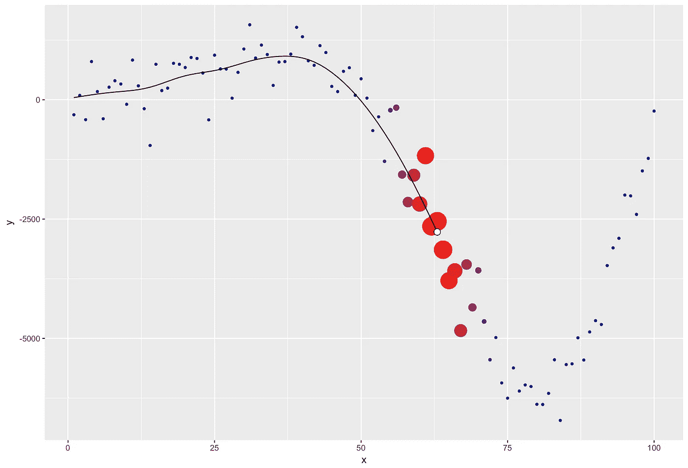
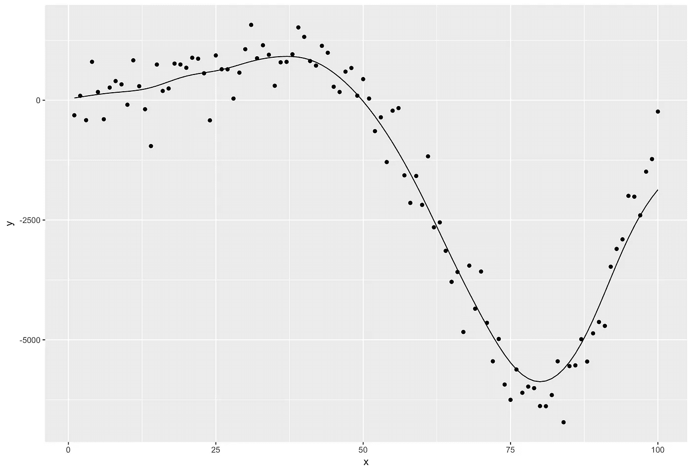
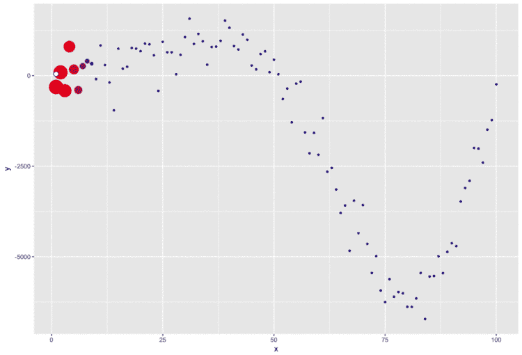

# 计算机如何画出平滑的线条？

> 原文：<https://towardsdatascience.com/how-does-a-computer-draw-a-smooth-line-a484176ac24e?source=collection_archive---------8----------------------->

## 将用于追踪数据点连线的统计技术背后的一些直觉可视化

如果我让你在一堆点之间画一条平滑的线，你可能会做得很好。这也是记者们一直在做的事情，用计算机图形来展示他们数据的趋势。但是我们如何从第一个例子转到第二个例子——计算机如何复制我们在描绘线条时的直觉？

一种这样的方法被称为核回归(或者更具体地说， [Nadaraya-Watson 核回归](http://www.maths.manchester.ac.uk/~peterf/MATH38011/NPR%20N-W%20Estimator.pdf))，它使用以下等式来估计输入 *x* 的因变量 *y* :

如果你是那种一旦一个数学方程式出现就放弃一篇文章的人，我劝你留下来，因为这实际上比看起来要简单，我们将在下一段之后完成数学。

上面的等式只是说，我们可以通过对现有点进行加权平均来估计任何新点。 *x-xi* 项测量我们的新点和旧点之一之间的距离，并且 *K* 函数(内核)在乘以伴随的 *y-* 值之前基于该距离分配一个权重。将所有这些加权点相加，您将获得一个基于所有旧点的值的新点的估计值(分母确保权重总和为 1)。

这当然是一种更明确的技术方法，我们本能地在数据中划线:考虑接近的点，而忽略其余的大部分，尤其是那些最远的点。

如果这仍然没有意义，那么…很好！这篇文章的目标是直观地理解内核是如何工作的，而不是数学上的。我们最终的成果将会是一张 GIF 图，清晰地展示了一个运行中的内核，它画出了一条平滑的线。从现在开始，我们将使用 R 来写一些代码，如果你熟悉这种语言或者忽略它，你就可以理解。

首先我们需要一些假数据。我们将为我们的 *x-* 值数到 100，并且为了创建一个体面的曲线响应，我们的 *y-* 值将是 *x* 的平方和 *x* 的正弦的乘积(缩小到一个周期)。自然地，我们会添加一些噪声来动摇这些点的基本功能。

使用 R 包 *ksmooth* ，我们可以很容易地使用我们刚刚定义的内核回归为这些数据画一条平滑的线。“正常”一词指定了我们使用的内核类型，而带宽设置了它的灵敏度——带宽越小，平滑线就越优先考虑非常接近的点。

现在，在我们看到中间步骤之前，内核包自动实现了前面的等式——这毕竟是统计软件的目的——但我们需要每个点的权重的实际值，以便我们可以直观地看到它们对曲线的影响。

因为我们使用的是高斯核，所以周围点的权重是正态分布的，峰值出现在距离 0 处(也就是说，处的*是正在讨论的新点)，我们可以使用 R 的 *dnorm* 函数来计算。冒着做一些经典数学手势的风险，我会忽略下面的“比例”线——简而言之，这是我们将由四分位数定义的 *ksmooth* 带宽[转换成适当的正态分布的方式。](https://stat.ethz.ch/R-manual/R-devel/library/stats/html/ksmooth.html)*

现在我们有了一种方法来表达进入内核估计的每个周围点的权重，**我们可以使用点的大小和颜色来可视化它**。更具体地说，对于光滑线上的任何一个新点，现有点的影响都是通过它们有多大和多红来体现的。比如这里是点 *x* = 50:

本质上，如果我们跟踪平滑线到它落在值为 50 的 *x-* 上的地方，我们会得到周围点的平均值，这些点具有由它们的大小和颜色表示的各种权重。附近的点对平滑器的影响很大，因此又大又红；更远的点几乎可以忽略不计，因此又小又蓝。

让我们想象一下。通过对 1 到 100 之间的每个 x 值进行相同的计算和可视化，我们可以生成一堆图像，然后将它们拼接成一个漂亮的小 GIF。这就像在 for 循环中执行上述代码一样简单，然后将各个图像上传到一些免费的在线软件中来创建 GIF:

> 如果 GIF 因为某种原因没有加载，也是[这里](https://thepracticaldev.s3.amazonaws.com/i/2yiftvb3e8riv1ujo54g.gif)

这在某种程度上是对内核回归的权宜之计。当然，我们可以解开更多的等式，或者使用不同的内核和不同的带宽。

但是我们最终的 GIF 仍然说明了平滑内核背后的概念。此外，这有点像我们在窥视电脑的脑电波，因为它决定在画线时要考虑哪些点。反过来，这个过程对于任何用传统的手工方式做过类似事情的人来说都是非常熟悉的。

*感谢阅读。我其他的大部分统计思想都可以在我的博客上找到，*[*conflem . city*](https://perplex.city/)*。这里的完整代码是* [*。*](https://github.com/WalkerHarrison/kernel_GIF/blob/master/kernel_gif_final.R)