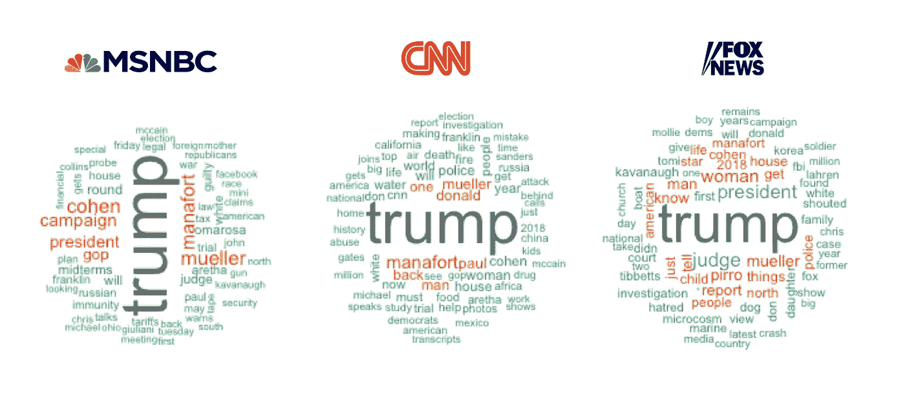
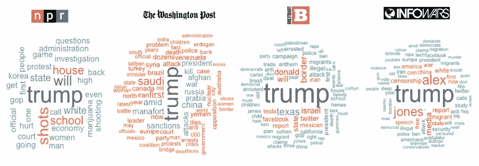
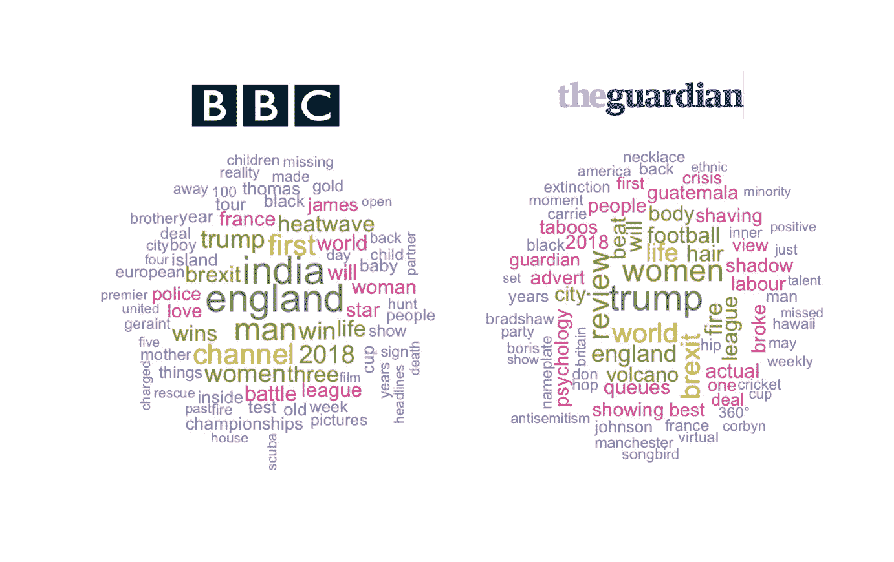
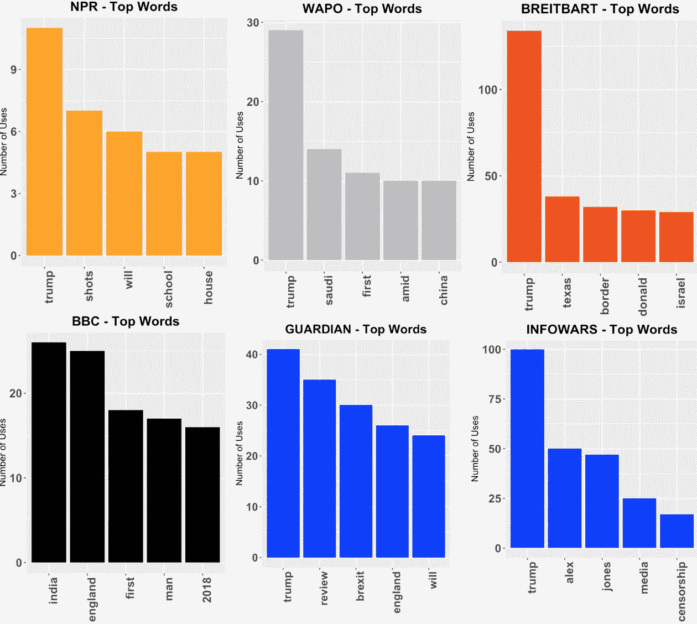
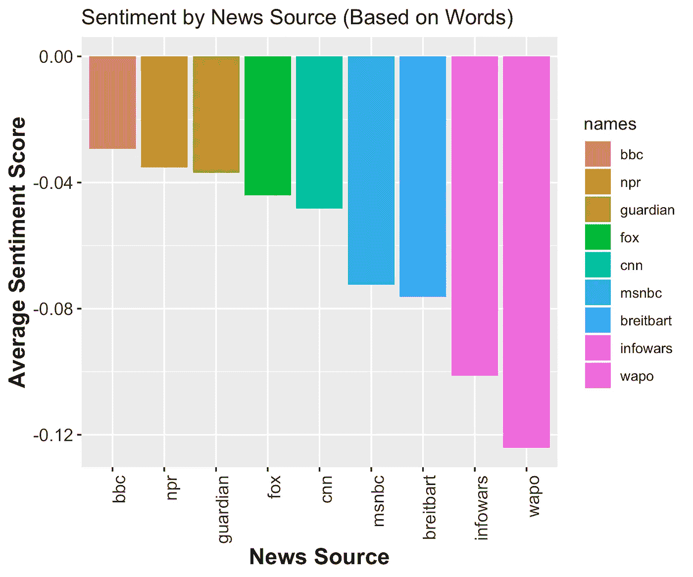
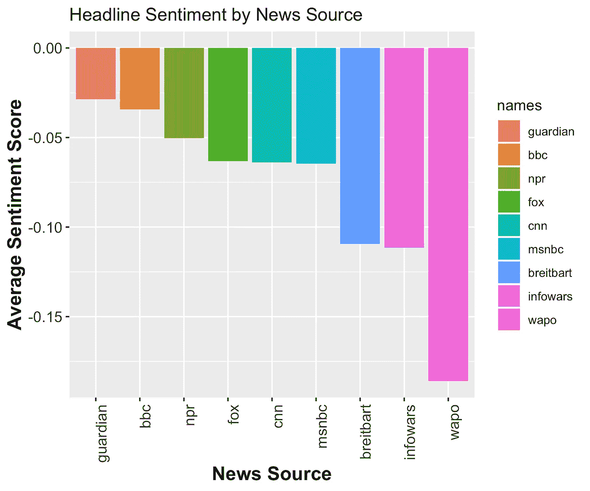

# 不同媒体的新闻报道有何不同？

> 原文：<https://towardsdatascience.com/how-does-news-coverage-differ-between-media-outlets-20aa7be1c96a?source=collection_archive---------1----------------------->

## 使用 R 和 Python 对上个月的新闻媒体进行对比分析

在过去的一年里，政治新闻似乎变得更加分裂，更加偏颇。当川普总统指责科技公司没有平等地宣传新闻来源时，我想知道，这些天的新闻有明显的不同吗？

幸运的是，有一个很棒的 python 库可以用来抓取新闻网站，所以我们可以开始回答这个问题了。使用[报纸](https://github.com/codelucas/newspaper)，我能够从多个媒体渠道抓取上个月的主要标题。通过编写一些简单的脚本来收集和分析新闻数据，我能够了解他们的报道是如何偏离的。

## 新闻的焦点

查看文本数据模式的一个有趣方法是生成单词云。r 提供了一些简单的文本挖掘库(tm、wordcloud 和 SnowballC ),使得生成 word cloud 变得轻而易举。关于这个话题的丰富资源，请看[本教程](https://datascienceplus.com/building-wordclouds-in-r/) ⁴.

在我从数据中删除了明显的英语停用词(“the”、“a”等)以及一些特定新闻的停用词(“link”、“video”等)后，我看到了明显的模式。

Mainstream news sites are all about ‘trump’

2018 年，主流新闻被‘川普’主导也就不足为奇了。

然而，我也想看看那些不太受欢迎的媒体报道了什么。为了做到这一点，我从各政治派别中挑选了一些资料。尽管这些消息来源的次要兴趣领域有所不同，但每一个都主要集中在总统身上。

最后，我从两家国际新闻网站——英国广播公司(BBC)和《卫报》(Guardian)——获取了数据，以了解全球对特朗普总统的重视程度是否一样高。

令人欣慰的是，全球新闻似乎不仅仅关注唐纳德·特朗普。

## 新闻标题中的热门词汇

另一个检测文本数据语料库中最常见术语的有用工具是 R“TermDocumentMatrix”函数。它告诉我们《text⁵.全集》中每个单词的[频率利用这些信息，很容易从每个新闻来源中找出最常见的词。下面我列出了 MSNBC、CNN 和福克斯新闻频道头条中最常见的 5 个词。](https://en.wikipedia.org/wiki/Document-term_matrix)

很明显，CNN 和 MSNBC 几乎完全专注于特朗普总统和他的丑闻，“特朗普”、“科恩”、“穆勒”和“马纳福特”是最热门的词汇。在福克斯电视台，《特朗普》仍然遥遥领先地排名第一，但其他故事更为普通(即。男人'，'女人'，'报告'，'警察)。

有趣的是，这里也有其他网站头条中的热门词汇。

## 浅析标题情感

新闻总是倾向于负面的偏见。在这个动荡的时代，有些人声称我们生活在一个新的黑暗时代，我想看看这些头条新闻到底有多负面。

测量文本的[情绪](https://en.wikipedia.org/wiki/Sentiment_analysis)的一个简单方法是使用情绪词典，或者每个单词都有一个与之相关的积极得分的词典。我选择使用流行的⁶词典，它给单词打分，范围是-5 到+5。例如，在这个语料库中，像“担心”这样的词得分为-3，像“很好”这样的词得分为+3。

通过平均每个新网站相关词汇的情感分数，我能够得到它们看起来是积极还是消极的图片。

令人惊讶的是，华盛顿邮报被证明是使用这种方法的最负面的新闻来源。我猜这家公司的新座右铭是“民主在黑暗中消亡”,它不会拐弯抹角。

## 使用 Sentimentr 库进行情感分析

单纯使用单词得分来天真地衡量情感的一个缺陷是，这种方法忽略了句子的上下文。使用这种方法，像“这个比萨饼不错”这样的句子将只记录单词“bad ”,而不记录前面的变价词“not”。幸运的是，⁷图书馆考虑到了这些变价因素，让我们能够以句子为单位测量情感。

用这个库来比较头条本身的正面/负面，我得到了下面这个情节。

《华盛顿邮报》再次以明显优势成为最负面的，击败了布莱巴特和 Infowars 等更激进的网站。其余的新闻来源都差不多，都略显负面。

## 结论

在这个“假新闻”的时代，政治客观性的理念似乎比以往任何时候都更加遥远。然而，有了数据驱动的方法，我们也许能够更中立地看待媒体呈现给我们的东西。正如我所展示的，收集新闻数据非常容易。我鼓励任何有一点点时间的人看看他们最喜欢的新闻渠道如何，并确保他们真正获得了我们共同现实的全面代表。

## 笔记

本文使用的所有代码和数据都在 https://github.com/taubergm/NewsHeadlines[的](https://github.com/taubergm/NewsHeadlines)网站上

1-一项关于媒体偏见的有趣研究—[http://www . nieman lab . org/2018/06/Democrats-see-most-news-outlets-as-unbiased-Republicans-think-they-almost-all-biased/](http://www.niemanlab.org/2018/06/democrats-see-most-news-outlets-as-unbiased-republicans-think-theyre-almost-all-biased/)

2—[https://gizmodo . com/president-trump-accounts-Google-withing-search-result-1828647850](https://gizmodo.com/president-trump-accuses-google-of-rigging-search-result-1828647850)

3—[https://github.com/codelucas/newspaper](https://github.com/codelucas/newspaper)

4 — a 如何使用 R—[https://datascienceplus.com/building-wordclouds-in-r/](https://datascienceplus.com/building-wordclouds-in-r/)

5 —关于文档矩阵的信息—[https://en.wikipedia.org/wiki/Document-term_matrix](https://en.wikipedia.org/wiki/Document-term_matrix)以及如何生成它们[https://www . rdocumentation . org/packages/TM/versions/0.7-5/topics/TermDocumentMatrix](https://www.rdocumentation.org/packages/tm/versions/0.7-5/topics/TermDocumentMatrix)

6—阿芬情感词典[http://corpustext.com/reference/sentiment_afinn.html](http://corpustext.com/reference/sentiment_afinn.html)

7—sentiment r lib—[https://cran . r-project . org/web/packages/sentiment r/readme . html](https://cran.r-project.org/web/packages/sentimentr/README.html)