# 湾区怎么通勤？

> 原文：<https://towardsdatascience.com/how-does-the-bay-area-commute-22f45e00419e?source=collection_archive---------5----------------------->

## 使用无监督机器学习定义公交服务区

对于这个项目，我想回答一个问题。我们能否仅使用通勤数据来定义旧金山湾区公交机构的服务区域？如果可以，会是什么样子？

答案是肯定的，它看起来像这样:

我是这样到达那里的。

# 背景

海湾地区在多极性质的大都市中是不寻常的。这早已反映在我们的交通系统中——我们有大约 28 个交通系统服务于九个县的海湾地区(忽略每天一次的美国国家铁路客运公司州际铁路服务)。粗略地说，这些分为三类:

*   **跨区域交通**—国会走廊、圣华金、阿尔塔蒙走廊快线、未来高铁。这些系统服务于九县湾区以外的目的地。
*   **区域公交** — BART、Caltrain、SMART、金门轮渡、三藩市湾轮渡。这些系统服务于下面列出的两个或更多的本地交通区域。
*   **当地公交** — Muni、AC Transit、VTA、SamTrans、金门公交、Marin Transit、Dumbarton Express、County Connection、Santa Rosa City Bus、Tri Delta Transit、Wheels、SolTrans、Sonoma County Transit、WestCAT、Fairfield 和 Suisun Transit (FAST)、Solano Express、Vine、City 蔻驰、Petaluma Transit、Rio Vista Delta Breeze。

Bay Area Transit Agencies (Source: SPUR, Seamless Transit, April 2015)

湾区交通的分散导致交通乘客的体验不佳，他们被迫浏览多个票价系统和信息材料，以便到达他们要去的地方。人们常常天真地认为，解决方案只是将所有机构合并在一起，但这在政治上具有挑战性，可能会产生比解决的问题更多的问题。正如交通咨询顾问 Jarrett Walker [指出的那样](https://www.thetransportpolitic.com/2009/02/20/transit-overload/#comment-482)，“一位非常左派的旧金山主管曾经问我，为什么旧金山应该把对其交通的任何控制交给郊区主导的董事会，他们根本不会理解旧金山对非常高的人均服务水平的密度驱动的需求。他说得有道理。”

由交通分散引起的许多问题在 [SPUR 的无缝交通](https://www.spur.org/publications/spur-report/2015-03-31/seamless-transit)报告中有详细描述，该报告讨论了如何通过更好的机构间合作来解决这些问题，而无需将所有的交通机构合并成一个庞大的实体。其他国家也采取了类似的方法；比如德国的莱茵-鲁尔区和湾区是类比的，人口相似，大城市距离相似，多极相似。一个叫做 Verkehrsverbund 的组织负责协调服务；尽管有 27 家不同的运营商，但他们的公交系统只有一张地图、一个票价结构和一个品牌

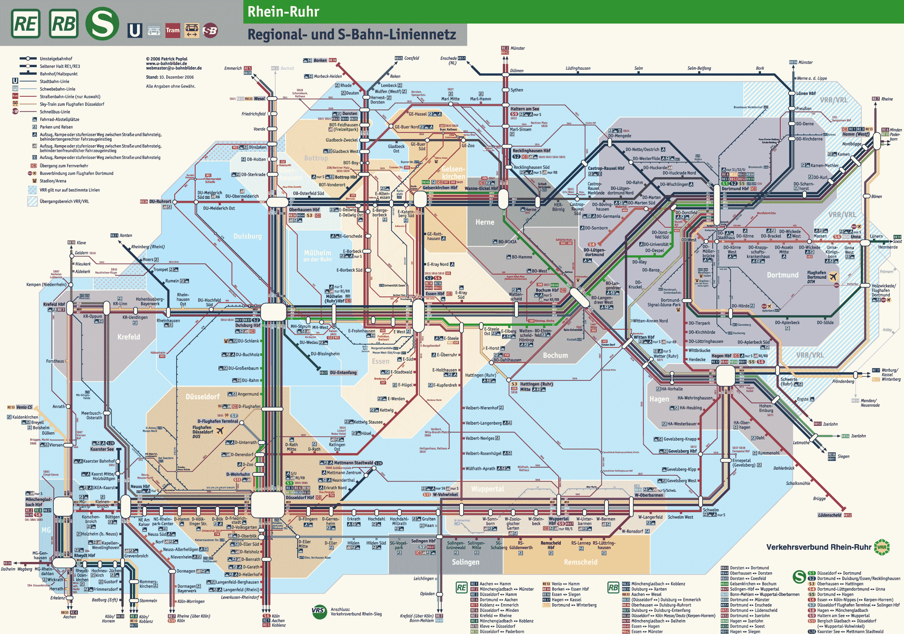

A service map for the Rhein-Ruhr Verkehrsverbund

因此，如果我们可以用一个 Verkehrsverbund 来掩盖我们交通系统中的裂缝，我们就不需要担心分裂，对吗？不完全是。Verkehrsverbund 没有解决的一个问题是为其管辖范围内的交通系统定义合理的边界。在这些边界，乘客必须换乘另一个系统来继续他们的旅程。一个例子是旧金山/圣马特奥县线，市政的 14 任务巴士在此终止，SamTrans 的 ECR 巴士继续沿着埃尔卡米诺雷亚尔的旅程；另一条是圣马特奥/圣克拉拉县线，ECR 公共汽车在此终止，VTA 的 522 公共汽车沿着埃尔卡米诺路继续开往圣何塞。

界限虽然不方便，但也是必要的；将这三条公交线路合并为一条 60 英里长的线路是不现实的，旧金山也不会对圣何塞决定其公交服务感到满意，反之亦然。如果一定要在某个地方划一条线，那么这条线应该划在一个尽可能少的乘客因为过渡而感到不便的地方。**我们能否改进本地公交服务区的定义，以更好地匹配居民的实际通勤模式？**对湾区通勤模式的了解应该让我们能够在适当的时候提出交通机构合并的建议，并在不合适的时候将这些机构分开。

# 方法学

[Kaggle 已经发布了](https://www.kaggle.com/figshare/united-states-commutes)从美国每个人口普查区到美国其他人口普查区的通勤流量，以 2010 年美国人口普查为原始来源。此数据的“流量”值，即从给定的起始人口普查区域到给定的目的人口普查区域的通勤人数，可用于计算特征空间中人口普查区域之间的距离。

我们将特征空间中人口普查区域 *i* 和 *j* 之间的距离 *d(i，j)* 定义为:

其中:

这意味着两个没有通勤者的人口普查区域之间的要素空间距离在数量上等于数据集中的最大通勤流量，即这些人口普查区域在要素空间中相距最远。这也意味着具有最大通勤流量的人口普查区域对具有~1 的特征空间距离，即那些人口普查区域在特征空间中是最近的。

创建距离矩阵时，通勤流的方向性带来了挑战。聚类算法一般取一个数据集在特征空间中的位置，计算距离矩阵，然后建立链接；然而，对于这个问题，我们直接从源数据中定义距离矩阵。这导致了不寻常的性质，即从 A 到 B 的特征空间距离可能不同于从 B 到 A 的特征空间距离，因为更多的通勤者将在一个方向上比在另一个方向上通勤。对于这个项目，我们决定只检查从起点到目的地的通勤流，因为这将导致在特征空间和真实空间中明确定义的聚类，而相反将导致在真实空间中明显重叠的聚类。

一旦我们计算出每对人口普查区域之间的距离，我们就将其输入到 [SciPy 的层次聚类算法](https://docs.scipy.org/doc/scipy/reference/cluster.hierarchy.html)中，以确定湾区人口普查区域之间的关系。(在本分析中，湾区被定义为位于纬度 37°和 38.5°之间以及经度-123°和-121.5°之间的所有普查区域。)聚类的数目不是预先确定的，但是可以通过计算样本中所有数据点的平均轮廓得分来计算聚类的有效性和一致性。下面显示了 *k* 的变化值:

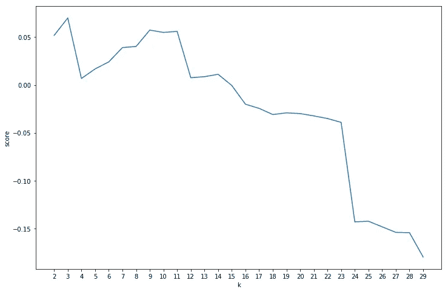

Bay Area Silhouette Scores

剪影得分图中双峰的存在表明了通勤模式中的区域和局部一致性。在 3 处找到了 *k* 的最佳值，并且再次在 9、10 和 11 处找到。

我们先来看一下 *k* =3:

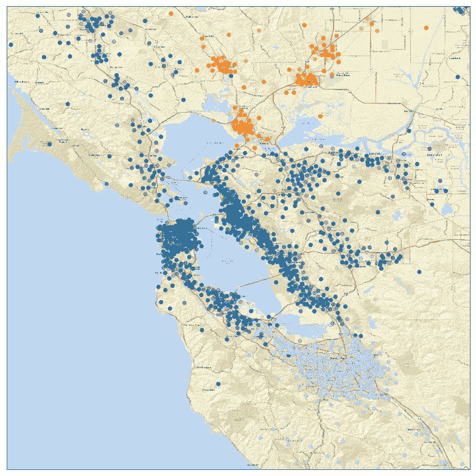

Bay Area Census Tract Clustering (*k*=3)

这种聚类代表了海湾地区的第一个内部内聚的次区域划分。首先，纳帕和索拉诺县在 *k* =2 处分裂；然后，圣何塞和硅谷在 k = 3 时分道扬镳。其余的海湾地区包括所有你可以乘坐 BART 火车到达的地方，再加上南边的红木城和北边的圣罗莎。

下一级可行聚类出现在更高的 *k 值处。*让我们从 *k* =9 开始:

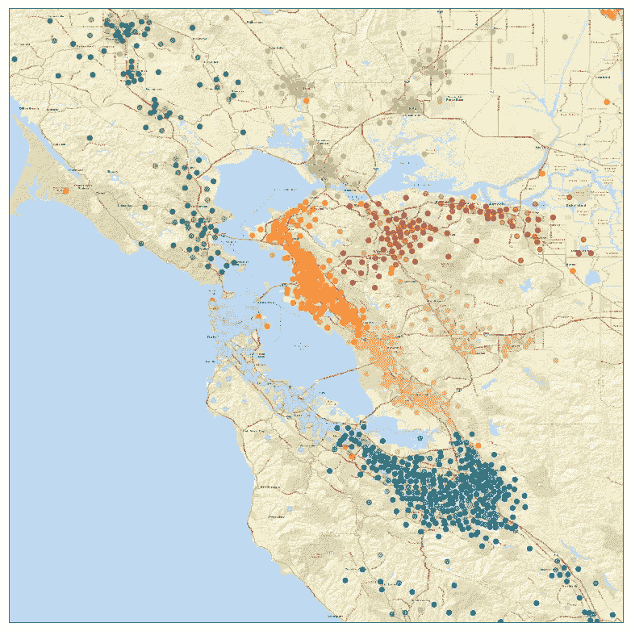

Bay Area Census Tract Clustering (*k*=9)

直觉上，这个看起来不错；我们在湾区的所有逻辑子区域之间有一个清晰的分隔。这些大致可以描述为:索诺玛/马林，索拉诺/纳帕，旧金山/圣马特奥，奥克兰/伯克利/里士满，核桃溪/康科德/安提阿，三谷地区，海沃德/弗里蒙特，圣何塞/硅谷。

让我们上升到 *k* =10:

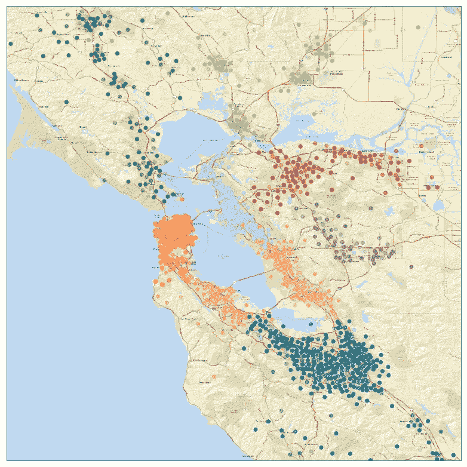

Bay Area Census Tract Clustering (*k*=10)

现在，旧金山和圣马特奥已经分裂，旧金山保留了戴利市、科尔马和帕西菲卡。

最后我们来看 *k* =11:

Bay Area Census Tract Clustering (*k*=11)

在这里，南部的东湾分成了北部的海沃德/卡斯特罗谷和南部的联合城/纽瓦克/弗里蒙特。

值得注意的是，最初脱离的两个集群(纳帕/索拉诺和圣何塞)没有进一步细分，这表明了很强的内部一致性。(在 *k* =15 时，圣何塞从圣克拉拉县的其余部分分离出来；Napa 和 Solano 保持相互连接，直到非常高的值 *k* 。)

# 结论

## 区域间运输

没有得出关于区域间交通的结论，因为区域间交通主要服务于商务和休闲旅客，因此不适合使用通勤数据进行分析。由于覆盖的距离，这些服务可能最好在州一级汇总和管理。

## 区域运输

*   圣何塞和湾区的其他地方不同。作为一个以汽车为主的大都市区，它的许多通勤模式包括从圣何塞南部和东部的卧室社区到圣何塞北部和硅谷的办公园区的汽车旅行。认为硅谷与湾区的其他地方联系在一起是错误的；谷歌巴士可能有很多恶名，但它们服务的通勤者相对较少。
*   索拉诺县和纳帕县也与湾区的其他地方脱节，尽管它们在地理上很接近；前往该地区其他地方的交通选择少得可怜，60-70 分钟的 Vallejo 渡轮是唯一直接连接旧金山的方式。这种情况可以通过在这些县增加通勤铁路来改善，从里士满向北穿过一座新桥到达瓦列霍，然后分支到索诺马、纳帕和费尔菲尔德。理想情况下，这将通过一个新的跨湾管道直接运行到旧金山，但也可以在短期内作为巴特的馈线。
*   尽管如此，没有任何理由为了区域交通的目的而划分湾区。Caltrain 服务于旧金山湾区和南湾，不久 BART 也将提供同样的服务。这两种服务都是区域交通系统的组成部分，不能一分为二。虽然 Solano/Napa 比 Sonoma/Marin 更远离旧金山湾区，但这主要是由于 I-80 拥堵和糟糕的交通选择，这些问题可以也应该得到补救。**所有地区公交提供商应合并为一个系统，为横跨九个县的海湾地区的地区出行提供服务。**

## 本地运输

虽然聚类与这些机构的服务区域惊人地匹配，但仍有一些变化可以做出，大致基于 *k* =10 地图。在多种选择都是合理的情况下，我选择了对现状改变最小的选择。

*   金门交通、马林交通、佩塔卢马交通和圣罗莎市公共汽车应该合并成一个北部湾交通机构。(注意:有一种观点认为应该将 SMART 包括在这个机构中，但我认为它应该保留为一个区域机构，以便于与金门大桥整合。)
*   Vine、FAST、SolTrans 和蔻驰市应该合并成一个索拉诺/纳帕运输机构。里约维斯塔三角洲微风也可能包括在内。
*   县连接和三角运输应该合并。
*   Wheels 应该从 County Connection 接管 San Ramon 和 Danville 的服务，因为这些城市与都柏林/普莱森顿的通勤联系比与核桃溪的更紧密。
*   AC Transit 应该将 WestCAT 吸收到北部。里士满地区两种服务之间的分界线完全是人为的。
*   目前由 AC Transit、Union City Transit 和 Dumbarton Express 提供的从 Bay Fair BART station south 到 Alameda/Santa Clara county line 的公共汽车服务应合并为一个新的机构，为东南湾提供服务。这一变化与上述变化相结合，将使 AC Transit 专注于成为服务于奥克兰/伯克利/里士满大都市的城市交通系统。
*   市政当局应该从 Daly 市和 Colma 的 SamTrans 接管服务。圣布鲁诺山的大部分和科尔马墓地的(字面上的)死亡区形成了旧金山和圣马特奥县之间的一条天然分界线，这条线在地图上划出的位置以南一点。Pacifica 也将受益于到旧金山的直航服务。
*   VTA 应该接管位于门洛帕克和东帕洛阿尔托的 SamTrans 的服务。阿泽顿镇太富裕，人口太稀少，无法支撑公交乘客，形成了圣马特奥服务区和硅谷之间的屏障。

这是最终结果。我对系统名称使用了一些创造性的许可。

当然，合理化服务领域并无帮助，除非我们也合理化票价体系和品牌。请继续关注未来关于湾区 Verkehrsverbund 可能会是什么样子的帖子。

## 有问题吗？评论？

在[推特](https://twitter.com/jonobate)或 [LinkedIn](https://www.linkedin.com/in/batejonathan/) 上找到我

*这个分析背后的代码是 GitHub* *上可用的* [*。感谢*](https://github.com/jonobate/commute)[*Alex Golden Cuevas*](https://medium.com/u/da416f875245?source=post_page-----22f45e00419e--------------------------------)*和*[*Bonnie Shen*](https://medium.com/u/a642545d703?source=post_page-----22f45e00419e--------------------------------)*帮助编写代码；另外感谢* [*亚历克斯·戈尔登·奎瓦斯*](https://medium.com/u/da416f875245?source=post_page-----22f45e00419e--------------------------------) *和* [*布兰登·阿纳尼亚斯·马丁-安德森*](https://medium.com/u/fe46adb3322c?source=post_page-----22f45e00419e--------------------------------) *在发表前审阅了这篇文章。*

# 奖励地图

虽然我对其他地区不太熟悉，无法提出交通重组建议，但对其他多极地区进行类似的聚类分析提供了一些有趣的见解。

## 南加州

剪影分数为正且平坦，直到 *k* =12，之后快速下降。有趣的是，在 *k* =3 时，洛杉矶县与圣地亚哥的联系比奥兰治县或内陆帝国更紧密。洛杉矶县在 k = 9 时一分为二，主要是高地和盆地，高地也声称贝弗利山和沿海城市。

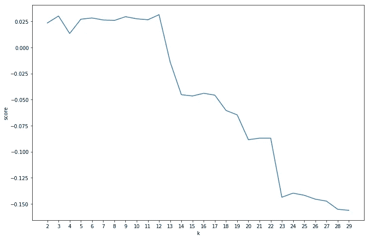

Southern California Silhouette Scores

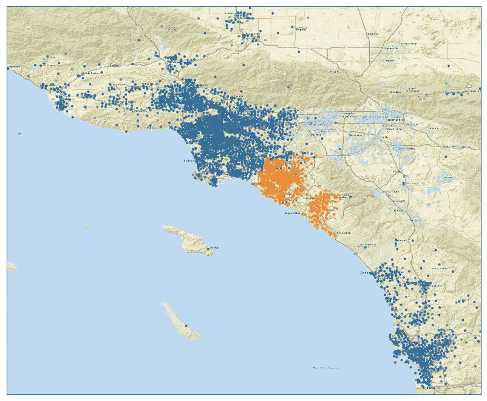

Southern California Census Tract Clustering (k=3)

Southern California Census Tract Clustering (k=6)

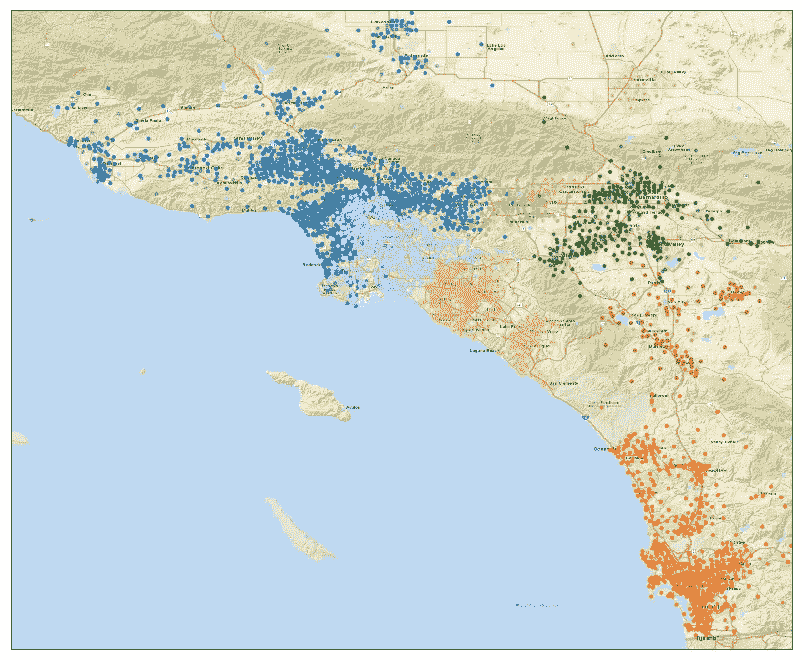

Southern California Census Tract Clustering (k=9)

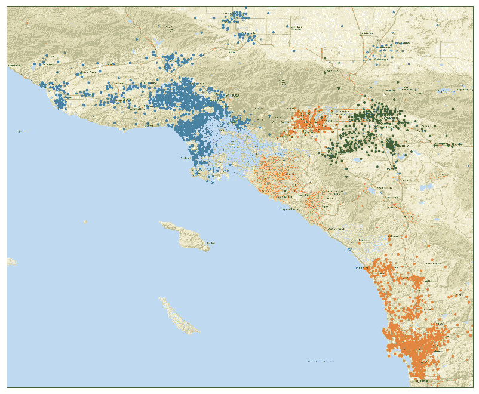

Southern California Census Tract Clustering (k=12)

## 东北走廊

这里有很多东西要打开。有趣的是，州界线对人们工作的地方有重大影响，即使这些地方不符合自然特征。新泽西州和纽约州之间，以及马里兰州和特拉华州之间的陆地边界有明显的分界线。费城/卡姆登/特伦顿根据流经城市的河流被整齐地分为四个，其中一些也是州界。波士顿/普罗维登斯逆势而行，尽管位于不同的州，但仍然聚集在一起，而巴尔的摩的分布在南部的 DC 和北部的哈里斯伯格之间。

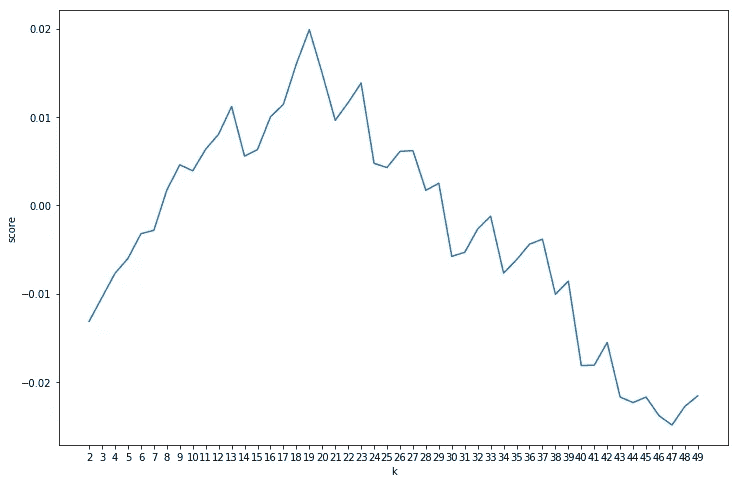

Northeast Corridor Silhouette Scores

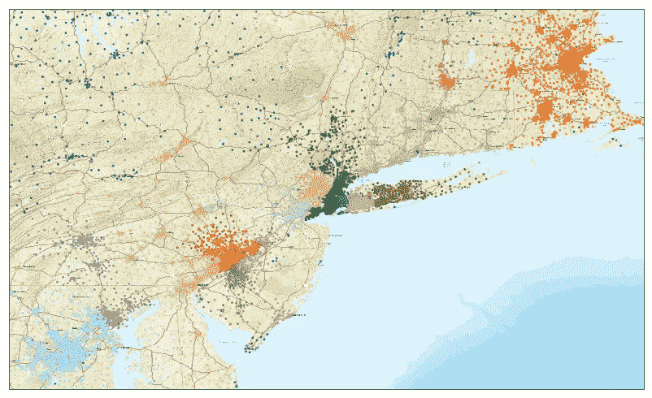

Northeast Corridor Census Tract Clustering (*k*=19)