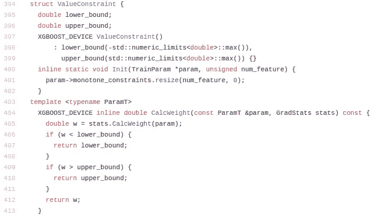
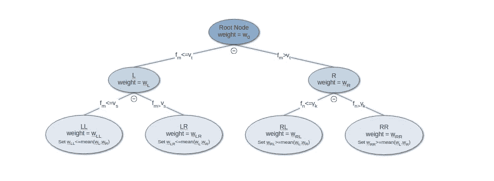

# 流行的 XGBoost 和 LightGBM 算法是如何实现单调约束的

> 原文：<https://towardsdatascience.com/how-does-the-popular-xgboost-and-lightgbm-algorithms-enforce-monotonic-constraint-cf8fce797acb?source=collection_archive---------8----------------------->

XGBoost 和 LightGBM 都有这个很好的参数来加强特性和目标之间的单调关系。当我们的“心智模型”告诉我们期待这样一种单调的关系时，这就很方便了。例如，在其他条件相同的情况下，我们预计同一街区的大房子会比小房子贵。如果让算法自由运行，它可能会捕捉到总体上积极的平方英尺与价格的关系(控制其他因素)，但一些局部区域具有相反的关系-更大的平方英尺与更低的价格相关联-这是违反直觉的。这种情况经常发生在数据稀疏或有大量噪声的区域。从我的经验来看，放置一个真正有意义的单调约束通常会在测试数据上产生更好的模型性能，这意味着受约束的模型可能会更好地泛化。因此，人们可以将单调约束视为一种正则化。

如果单调性的概念对你来说很陌生，请点击下面的链接阅读 XGBoost:[https://XGBoost . readthedocs . io/en/latest/tutorials/monotonic . html](https://xgboost.readthedocs.io/en/latest/tutorials/monotonic.html)

然而，大多数数据科学家都在使用这个参数，而不知道它实际上是如何工作的。我的过去就是其中之一。毕竟，不是每个人都想弄乱源代码。

*XGBoost 代码片段 1:*

*XGBoost 代码片段 2:*

上面两个代码片段展示了 XGBoost 如何实现单调约束。我花了一段时间才完全理解实现。还没有关于 XGBoost/LightGBM 中单调性实施的确切实现的论文。下面我将把我的解释分成几个部分，希望你会觉得有用。

**举一个例子:**在 XGBoost 或 LightGBM 估计器中生长树时，如果候选分裂导致非单调关系，算法将会放弃它。这个很简单:假设你对特征 fₘ施加一个正单调约束，在某个内部节点，fₘ被选中，在值 vₙ处的分割将产生最佳增益。因为约束是正的，所以您希望分配给右侧子对象的权重高于左侧子对象。该算法检查是否是这种情况，如果是，它将继续并以值 vₙ分割该节点，如果不是，它将放弃 vₙ，并将试图找到下一个最佳分割，直到右孩子的权重高于左孩子的权重。

这对应于 *XGBoost 代码片段 1 中的第 432 和 433 行。*如果条件不满足，则增益由负无穷大代替，因此算法将放弃分割。类似地，如果您实施负单调约束，则左孩子的权重需要高于右孩子的权重(行 434 和 435)。

当该特征仅被选择一次时，这听起来不错。但是如果沿着这条路，这个特性又被选中了呢？让我们想象一下，如果算法继续下去，对碰巧再次选择相同特征的左孩子(L)做同样的事情，由于你施加的正单调约束，你将得到分配给左孩子(LR)的右孩子的更高权重。然而，这个重量可能比你之前得到的右孩子(R)还要高。所以现在你有一个问题，因为为了保持单调的正关系，分配给右孩子的权重(R)不仅应该高于左孩子(L)，还应该高于它的后代(LL，LR，LLL，LLR，LRL，LRR…你能想到的)。那么如何确定是这样的呢？或者换句话说，如何确保约束在树级得到执行？

**取二:**在一个节点上拆分时，子节点的权重以其父节点权重和叔叔权重的平均值为界(叔叔指的是与父节点共享同一个父节点的节点)。这确保了如果在树中多次选取特征，则分配给来自最近分裂的后代节点的权重不会以违反单调约束的方式高于或低于祖先节点。让我们使用上述相同的例子:左孩子(LR)的右孩子的权重现在由左孩子(L)和右孩子(R)的权重的平均值来限定。并且因为左孩子(L)的体重低于右孩子(R)，所以右孩子(LR)的左孩子的体重永远不能超过右孩子(R)的体重。该规则贯穿于树的整个构建过程，因此，无论如何左右切割树，与左侧子树中的要素 fₘ相关联的权重始终低于与右侧子树中的要素 fₘ相关联的权重。特征 fₘ对预测的正单调约束(左节点的权重)在树级被保留。

这对应于 *XGBoost 代码片段 1* 中的第 448 到 457 行以及所有 *XGBoost 代码片段 2。*

太好了！算法层面的单调约束呢？

**拿三:**轻松！因为 XGBoost 预测是叶节点权重的相加(对于分类问题，在 sigmoid 或 softmax 变换之前)，所以在算法级保留了单调约束。

让我们更正式一点:

假设对于特征 x1 的每一对值(α，β),其中α≤β，我们想要强制执行正单调关系，即 w(α)≤w(β)。

1.  在根节点，只产生一个权重 w₀。w₀(α)=w₀(β)，用于根节点 0 中的特征 x₁中的α，β。这符合单调约束。
2.  在第一次拆分时，任何导致左孩子(l)权重大于右孩子(r)权重的拆分都被放弃，因此对于节点 l 中的特征 x₁的α和节点 r 中的特征 x₁的β，wₗ(α)≤wₗ(β
3.  类似地，在从左孩子(l)开始的下一次分裂时，导致其左孩子(LL)权重大于其右孩子(LR)权重的任何分裂都被放弃，从而对于节点 LL 中的特征 x₁的α和节点 LR 中的特征 x₁的β，wₗₗ(α)≤wₗᵣ(β。
4.  除了 3 之外，为了确保在树级别实施约束，wₗₗ和 wₗᵣ的值还受到 wₗ和 wᵣ-midₗᵣ.的平均值的限制也就是 wₗₗ≤midₗᵣ和 wₗᵣ≤midₗᵣ.
5.  类似地，3 和 4 也适用于节点 r 的子节点，只是这次是 wᵣₗ≥midₗᵣ和 wᵣᵣ≥midₗᵣ.
6.  3、4 和 5 的过程贯穿于树的构建。因此，对于要素 x₁，左侧子树的权重始终低于右侧子树。因此，正单调约束在树级被强制执行。
7.  由于 XGBoost 的最终输出是叶节点权重的相加(最终分类问题需要 sigmoid 或 softmax 变换)，因此单调约束在算法级别得以保留。

**最终想法**

边界值的使用是实现的关键。这个概念对于决策树来说并不新鲜。然而，使用“中间”值(父节点和叔节点的平均值)似乎不是基于任何文献，并且过于严格，可能潜在地损害算法的预测能力。然而，在我构建的所有约束 XGBoost 模型中，我没有看到模型性能的严重恶化。正如我在开始时提到的，在许多情况下，性能实际上概括得更好。我的直觉是，助推机制确实弥补了约束权重的损失。另一方面，单个决策树可能确实受到这种限制方法的影响。

另外，你还可以使用 R Caret 库创建一个单调约束 GBM。

请在评论中告诉我你的想法。乐于讨论。