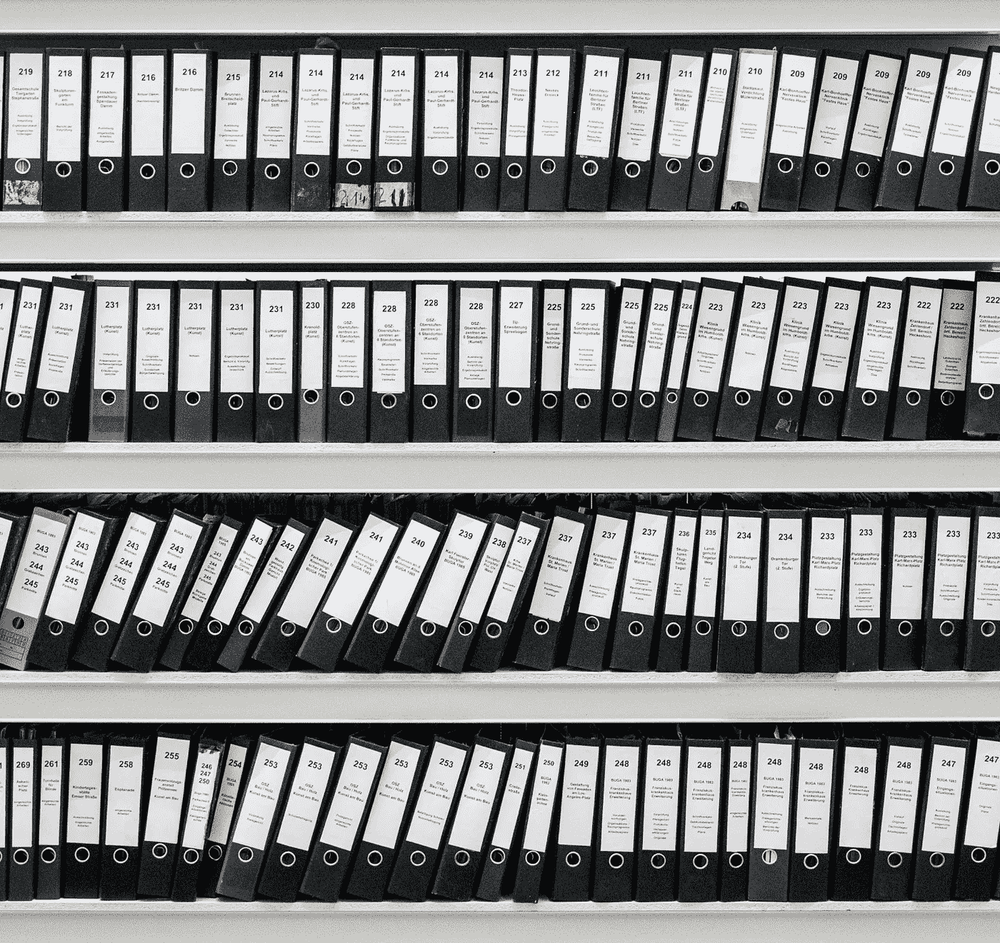
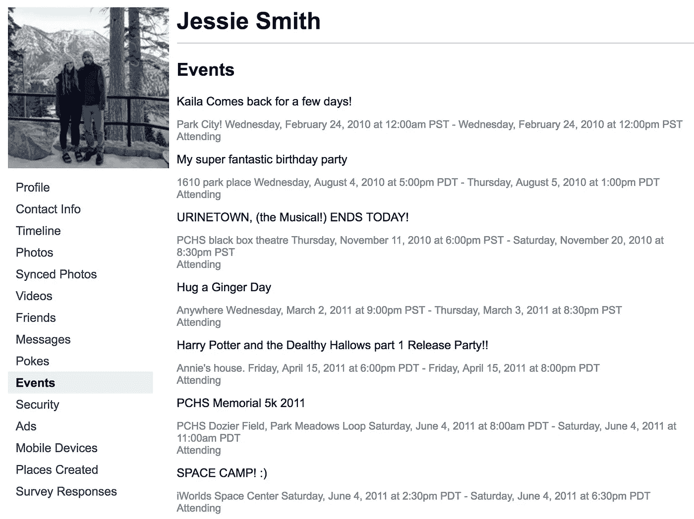

# 我如何利用我自己的社交媒体数据

> 原文：<https://towardsdatascience.com/how-i-exploited-my-own-social-media-data-84e886dcf101?source=collection_archive---------10----------------------->

## 如果他们能从中受益，为什么我不能？



大约两年前，我参加了第一次数据科学入门课程。在我注册的十周时间里，我学会了如何收集数据，修改数据，分析数据，可视化数据，并将其粘贴到机器学习算法中。我立刻就被吸引住了。在这个大数据就像吃到饱的流行词自助餐一样随处可见的时代，我感觉一个全新的世界展现在我的眼前。

在我学习数据科学入门的同时，我还参加了一个名为职业责任的课程。在我的大学，这通常被称为*计算机伦理*。我快速增长的渴求数据的欲望突然被极端的认知失调所压制。

早上，我会学到从训练数据集中推断缺失的属性是多么容易，而下午，我会学到发生在行业中的[去匿名化丑闻](https://arxiv.org/pdf/cs/0610105.pdf)。我在学习[上下文完整性](https://crypto.stanford.edu/portia/papers/RevnissenbaumDTP31.pdf)的同一天学会了如何创建一个网页抓取器。我瞥见了两种未来；一个将延续系统性的欺骗，另一个可以利用我的技术知识实现社会公正。

虽然我在打一场数据冲突战，但我对这场战斗无比感激。那十周完全改变了我对技术的看法。我一直生活在一个自满和否认的现实中。我曾想，如果我假装不知道自己对数据隐私的需求，我就不必为自己过度使用社交媒体辩护。

然后是这个季度的最后三周。我们被分配了一个数据科学课程的期末项目。我要获得一个数据集，清理它，进行某种分析，创建可视化，将其输入到机器学习模型中，并教给学生一些东西。

我知道我想用我的项目做一些重要的事情。我想发表声明。我可以很容易地找到一个关于体育统计或电影评论的数据集，但这些不会影响我以我需要的方式培养道德的能力。当我上传一张集体照片到脸书的超级数据库时，我突然想到。

我打算利用我自己的脸书数据。

# 揭幕仪式

在 GDPR 出现之前，脸书的数据收集是透明的对立面。我很难找到这家公司在收集什么数据，更不用说如何获得任何形式的访问权了。最终，在眯着眼睛阅读设置页面上的小字时，我用一句话找到了我的金券。

```
 [Download a copy](https://www.washingtonpost.com/news/the-intersect/wp/2018/03/27/heres-how-to-download-all-your-data-from-facebook-it-might-be-a-wake-up-call/?noredirect=on) of your Facebook data.
```

花了几天时间，但最终我收到了一个 html 文件的压缩文件夹，里面有我在与这家社交网络巨头共事的八年中亲自提供给他们的所有信息。我很震惊。

* *我犹豫地说，因为有一种可能性，这种信息只是脸书愿意分享他们从用户那里收集/汇总的信息。*



Facebook has since changed the design of our data representation, but this was what they offered pre-GDPR

实际上，我不知道我为什么这么惊讶。我应该知道他们一直保存着我所有的数据。近十年来的想法、信息、事件、图片和喜好加在一起。我认为这是实际看到我的在线生活在一个 zip 文件中的聚合的行为，真正把樱桃放在隐喻的数据-隐私-危机圣代的顶部。他们甚至有我的[面部识别数据](https://www.theguardian.com/technology/2014/may/04/facial-recognition-technology-identity-tesco-ethical-issues)。我第一次删除了脸书。

具有讽刺意味的是，我刚刚在计算机伦理课上学到，删除一个脸书账户实际上是不可能的，因为已经收集的数据永远不会被删除。不管怎样，我打开我的笔记本电脑，开始搜索我的在线身份。我有工作要做。

# 该项目

此时，我第一次接触数据科学大约已经八周了。我无法创建一个面部识别神经网络或我朋友的社交图谱分析。真的，我只希望我的项目证明一件事:如果社交媒体公司从使用我们的个人数据中受益，为什么我们不能做同样的事情？我决定创建两个数据集:

1.  我在 Facebook Messenger 上的私人信息。
2.  我在脸书发表的公开帖子。

使用 [nltk 库](https://www.nltk.org/)，我对这两个数据集进行了情感分析，看看我是否在我的公众形象和我的私人事务之间保持一致的积极和/或消极。我发现我不是。(可以理解的)我私下比公开场合更消极。我摆弄了一下数据。我意识到在一月份，我更有可能变得消极。不过，四月很棒。我创造了一个机器学习预测器，它可以猜测我在任何一天的积极或消极程度，精确到秒。

我用八周的数据科学知识做到了这一点。是什么阻止了脸书的专业人士做类似的事情？如果我通过基本的数据分析了解了这么多关于我个人生活的信息，我甚至无法想象一群专家会发现我什么。

我向全班展示了我的发现。我告诉他们我的动机、在线数据隐私和社交媒体数据利用。他们鼓掌，我坐了下来。项目结束了……但旅程才刚刚开始。

我利用了自己的数据，希望能更多地了解自己。相反，我对自己的身份有了更多的了解。在欧洲，我的数据被认为是我身份的一部分。在美国，情况并非如此。当我在过去十年收集的数以千计的个人信息、公共想法或习惯性页面赞中搜寻时；很难想象有人会认为数据**不是我们身份的一部分。**

一个瞬间可以改变一个人一生的看法。我的时刻是大学三年级的时候，坐在咖啡店里，利用我自己的数据。随着自满的安慰开始变得越来越虚幻，我知道漠不关心不是一个选项。

*在这个话题上，我一直在考虑把我的老项目变成一个通用的开源工具，这样每个人都可以分析自己的脸书情绪。如果您对利用自己的数据感兴趣，请联系我们，也许我们可以让这成为现实！*