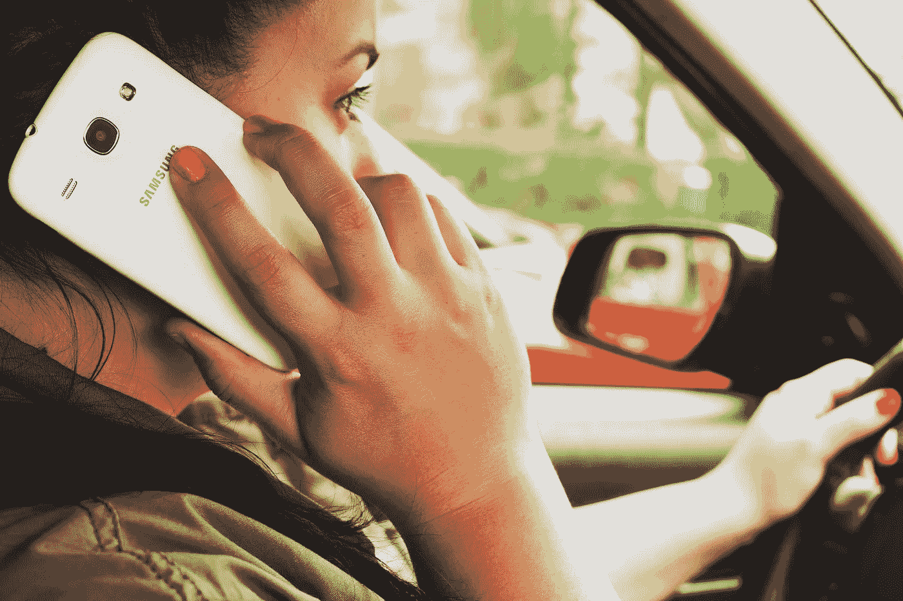

# 第 2 部分——我如何使用深度学习解决我的第一个 Kaggle 挑战

> 原文：<https://towardsdatascience.com/how-i-tackled-my-first-kaggle-challenge-using-deep-learning-part-2-1dfeb413c54d?source=collection_archive---------4----------------------->

*这是我如何在 Kaggle 上擒下* [*国营农场分心司机检测挑战赛*](https://www.kaggle.com/c/state-farm-distracted-driver-detection) *的第二部分。这里的许多工作都是基于杰瑞米·霍华德和雷切尔·托马斯教授的优秀的*[*fast . ai*](http://course.fast.ai/)*课程的课程和教程。*

*我对这个挑战特别感兴趣，因为我目前正在开发*[*KamCar*](http://gokamcar.com)*，这是一款人工智能驱动的 dash cam 移动应用程序，旨在让驾驶变得更加安全和丰富。你可以在这里* *阅读一下 Part-1* [*。*](https://medium.com/towards-data-science/how-i-tackled-my-first-kaggle-challenge-using-deep-learning-part-1-b0da29e1351b)



Driver talking on the phone while driving

在对样本训练集应用了一些扩充并在验证集上达到 50%的准确度之后(即步骤 5)，我们停止了第一部分-1。现在，我们正以更大的数据集作为盟友，开始我们深度学习冒险的剩余部分。

## 步骤 6-邀请整个数据集

在对样本集进行实验时，我也逐渐明白，如果不在更丰富的数据集上训练模型，大幅提高准确性将更具挑战性。因此，加载整个训练集和验证集并针对前者训练模型是很自然的。

## 第七步——减轻一些重量

我计划使用[第一部分](https://medium.com/towards-data-science/how-i-tackled-my-first-kaggle-challenge-using-deep-learning-part-1-b0da29e1351b)中使用的同样小的 CNN，但这次我引入了 [Dropout](https://www.cs.toronto.edu/~hinton/absps/JMLRdropout.pdf) ，它基本上使我们能够在我们的密集层中“放下”重量。我使用 Dropout，因为它迫使网络忘记它在训练集上计算的一些特征，从而减少模型对训练数据的过度拟合。如果没有退出，我们的模型将开发的特性可能不够通用，不能很好地处理新数据(即验证或测试集)。

```
def conv_model_with_dropout():
    model = Sequential([
            BatchNormalization(axis=1, input_shape=(3,img_size_1D,img_size_1D)),
            Convolution2D(64,3,3, activation='relu'),
            BatchNormalization(axis=1),
            MaxPooling2D(),
            Convolution2D(128,3,3, activation='relu'),
            BatchNormalization(axis=1),
            MaxPooling2D(),
            Convolution2D(256,3,3, activation='relu'),
            BatchNormalization(axis=1),
            MaxPooling2D(),
            Flatten(),
            Dense(200, activation='relu'),
            BatchNormalization(),
            Dropout(0.5),
            Dense(200, activation='relu'),
            BatchNormalization(),
            # Using a simple dropout of 50%
            Dropout(0.5),
            Dense(num_classes, activation='softmax')
        ])
    model.compile(Adam(lr=1e-5), loss='categorical_crossentropy', metrics=['accuracy'])
    return model
```

经过几次运行后，性能在验证集上徘徊在 60%-62%左右，没有取得太大进展:

```
Epoch 1/10
17990/17990 [==============================] - 521s - loss: 0.7413 - acc: 0.7560 - val_loss: 1.3689 - val_acc: 0.6087
Epoch 2/10
17990/17990 [==============================] - 520s - loss: 0.7123 - acc: 0.7665 - val_loss: 1.3105 - val_acc: 0.6238
Epoch 3/10
17990/17990 [==============================] - 520s - loss: 0.6663 - acc: 0.7815 - val_loss: 1.2932 - val_acc: 0.6283
Epoch 4/10
17990/17990 [==============================] - 520s - loss: 0.6253 - acc: 0.7973 - val_loss: 1.2504 - val_acc: 0.6245
```

是时候转向更强大的东西了！

## 第八步——不要逞英雄:让迁移学习拯救你

正如你所看到的，我之前创建的所有模型都很简单，不太深入。我当然可以创建一个更深层次的架构，但很可能需要在一个大规模数据集(比我目前拥有的大得多)上训练它很长时间，才能显著提高准确性。另外，我也负担不起两周的培训费用。

幸运的是，许多令人敬畏的研究人员通过在数百万张图像上训练深度学习模型，保存了他们模型的最终权重，并使他们的结果可用，从而使我们的生活变得更容易。该领域最活跃的研究人员之一 Andrej Karpathy 建议使用现有的技术，而不是在他的 [CS231N](http://cs231n.github.io/convolutional-networks/) 课程中重新发明一个昂贵的轮子:

> **“*不要逞英雄*”:**你应该看看 ImageNet 上目前最有效的架构，下载一个预训练模型，并根据你的数据对其进行微调，而不是推出自己的架构来解决问题。您很少需要从头开始训练或设计一个 ConvNet。

采用一个已经预先训练好的模型并用我们自己的训练数据对其进行微调被称为[迁移学习](https://en.wikipedia.org/wiki/Transfer_learning)。对于这个挑战，我将使用一个预先训练好的 [VGG](https://arxiv.org/pdf/1409.1556) 网络，它赢得了 [ImageNet](http://www.image-net.org/) ILSVRC-2014 竞赛。


VGG Architecture — From [Toronto University](https://www.cs.toronto.edu/~frossard/post/vgg16/)

## 第八步——保持这些卷积层紧密相连

提醒一下，以下是我决定使用预先培训过的 VGG 网络的一些原因:

*   我们只有很少的训练数据，因此无法生成一个容易通用的模型
*   VGG 已经接受了数百万张图片的训练
*   从 VGG 的卷积层中提取的特征应该足够通用，可以应用于人类的图像
*   VGG 比我上面的临时神经网络有更多的卷积层，我的假设是我们将获得更高的精度

神经网络最重要的组成部分是它的卷积层(马修·泽勒和罗布·弗格斯在论文[可视化和理解卷积网络](https://arxiv.org/abs/1311.2901)中写道)，它学习如何识别初始层中的边缘等基本特征，以及上层中更复杂的特征。


Visualisaion of early layers of a CNN — from Karpathy’s [blog](http://karpathy.github.io/)

因此，我们需要从预训练的 VGG 网络中提取卷积层，因为我们稍后将创建自己的密集层:

```
# This will import the full gcc model along with its weights
vgg = Vgg16()
model = vgg.model# identify the convolutional layers
last_conv_idx = [i for i,l in enumerate(model.layers) if type(l)  is Convolution2D][-1]
conv_layers = model.layers[:last_conv_idx + 1]# Make sure those convolutional layers' weights remain fixed. We are purely using them for prediction, not training.
for layer in conv_layers: layer.trainable = False# Create a model now out of the convolutional layers
conv_model = Sequential(conv_layers)
```

## 步骤 9-预先计算卷积特征

请记住，根据 VGG 架构图，最后一个卷积层产生的输出尺寸为 512 x 14 x 14:这正是我们上面的纯卷积模型要做的。接下来需要的是在仅卷积模型上预计算我们的训练、验证和测试特征，然后在密集模型中使用它们。换句话说，**我们使用仅卷积模型的输出作为仅稠密模型的输入。**

```
# batches shuffle must be set to False when pre-computing features
train_batches = load_in_batches(train_dir, shuffle=False, batch_size=img_batch_size)# Running predictions on the conv_model only
conv_train_feat = conv_model.predict_generator(train_batches, train_batches.N)
conv_val_feat = conv_model.predict_generator(val_batches, val_batches.N)# Predict feature probabilities on test set
test_batches = load_in_batches(test_dir, shuffle=False, batch_size=img_batch_size)
conv_test_feat = conv_model.predict_generator(test_batches, test_batches.N)
```

我们加载我们的图像，同时确保*洗牌*标志设置为假，否则我们的输入特征和标签将不再匹配。

## 步骤 10-制作你自己的致密层

回想一下，VGG 网络产生包含 1000 个类的输出。这是因为训练它的 ImageNet 竞赛要求将图像分成 1000 个不同的类别。但是在这个 Kaggle 挑战中，我们只处理 10 个类，因此原始的 VGG 密集层不足以解决我们试图解决的问题。

因此，我们需要创建一个合适的密集层架构，该架构将使用 SoftMax 作为最后一个密集层的激活函数，最终产生我们期望的类数量的预测。此外，请记住，我们使用仅卷积模型的输出作为我们定制的密集模型的输入。我们还在这一阶段引入了辍学，以防止在训练集上过度适应。

```
def get_dense_layers(dropout_rate = 0.5, dense_layer_size = 256):
    return [
        # Here input to MaxPooling is the output of the last convolution layer (without image count):  512 x 14 x 14
        MaxPooling2D(input_shape=conv_layers[-1].output_shape[1:]),
        Flatten(),
        Dropout(dropout_rate),
        Dense(dense_layer_size, activation='relu'),
        BatchNormalization(),
        Dropout(dropout_rate),
        Dense(dense_layer_size, activation='relu'),
        BatchNormalization(),
        Dropout(dropout_rate),
        # num_classes is set to 10
        Dense(num_classes, activation='softmax')
        ]
```

我们现在可以使用来自步骤 9 的仅卷积模型的预先计算的特征来训练我们的密集模型:

```
d_rate = 0.6
dense_model = Sequential(get_dense_layers(dropout_rate = d_rate))
# We will use a more aggressive learning rate right off the bat, as our model has been pre-trained 
dense_model.compile(Adam(lr=0.001), loss='categorical_crossentropy', metrics=['accuracy'])# See how we call fit and not fit_generator, as our array of features has already been pre-computed
dense_model.fit(conv_train_feat, trn_labels, batch_size=img_batch_size, nb_epoch=3, 
               validation_data=(conv_val_feat, val_labels), verbose=1)
```

这使我们能够达到大约 70%的验证准确率

```
Train on 17990 samples, validate on 4434 samples
Epoch 1/3
17990/17990 [==============================] - 9s - loss: 0.9238 - acc: 0.7178 - val_loss: 1.0323 - val_acc: 0.6340
Epoch 2/3
17990/17990 [==============================] - 9s - loss: 0.1435 - acc: 0.9565 - val_loss: 0.8463 - val_acc: 0.7352
Epoch 3/3
17990/17990 [==============================] - 9s - loss: 0.0802 - acc: 0.9748 - val_loss: 0.9537 - val_acc: 0.7082
```


Doctor House’s nod of approval

虽然与我开始时相比，这是一个显著的改进，但我们实际上可以做得更好:我还没有将数据增强引入这场战斗，也没有使用一些无人监管的技术和其他技巧，我将在第 3 部分中介绍这些技巧。这将是一个非常激动人心的部分，所以不要错过！

敬请期待，喜欢就分享，不要犹豫留下评论:)。

*我是建筑* [*KamCa*](http://gokamcar.com/) *r，AI 驱动的 dash cam 应用程序，让驾驶变得更安全、更丰富。如果你是一名移动开发者，想要开发一些激动人心的技术和产品，或者只是想提供一些建议，请在*[*Twitter*](https://twitter.com/Ed_Forson)*或这里联系我！*